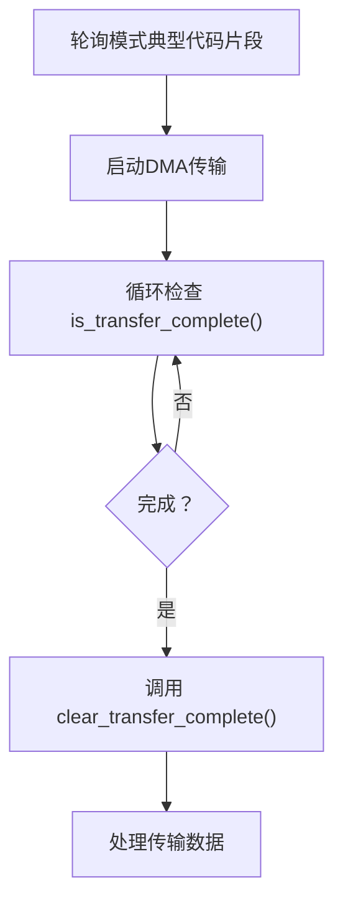

<cite>
**本文档中引用的文件**
- [lib.rs](file://src/lib.rs)
- [reg.rs](file://src/reg.rs)
- [chan.rs](file://src/chan.rs)
</cite>

## 目录
1. [DDMA控制器API](#ddma控制器api)
2. [核心组件](#核心组件)
3. [详细方法说明](#详细方法说明)
4. [状态查询与中断处理](#状态查询与中断处理)
5. [安全边界与调用者责任](#安全边界与调用者责任)

## DDMA控制器API

本文档为飞腾（Phytium）DDMA驱动中的`DDMA`控制器结构体提供详细的API参考。文档深入解析了控制器的初始化、重置、启停控制、通道管理及状态查询等核心功能，重点关注其底层寄存器操作机制和内存安全模型。

## 核心组件

`DDMA`控制器是飞腾平台直接内存访问（DMA）子系统的核心抽象，它通过一个指向物理寄存器基地址的`NonNull<u8>`指针来管理整个DMA硬件。该结构体封装了对全局控制寄存器（如`DMA_CTL`, `DMA_STAT`）和通道专用寄存器块的访问。

**Section sources**
- [lib.rs](file://src/lib.rs#L67-L289)
- [reg.rs](file://src/reg.rs#L200-L480)

## 详细方法说明

### 初始化：new()

`DDMA::new()` 是创建控制器实例的唯一入口点。它接收一个指向DMA控制器物理内存基地址的`NonNull<u8>`指针，并将其转换为指向`DdmaRegister`结构体的`NonNull<DdmaRegister>`指针。此方法不执行任何硬件操作，仅建立内存映射关系，将Rust类型系统与特定的物理地址空间绑定。

**Section sources**
- [lib.rs](file://src/lib.rs#L70-L75)

### 完整重置流程：reset()

`reset()` 方法执行一个全面的控制器复位序列，确保DMA处于已知的初始状态。其操作流程如下：
1.  **禁用控制器**：首先通过清除`DMA_CTL`寄存器中的`DMA_ENABLE`位来关闭整个DDMA控制器。
2.  **屏蔽全局中断**：禁用全局中断输出，防止在重置过程中产生意外中断。
3.  **逐个复位通道**：遍历所有8个通道（0-7），对每个通道执行以下操作：
    *   检查并解除通道与外设的绑定。
    *   屏蔽该通道的中断。
    *   清除可能存在的挂起完成状态。
    *   重置通道配置。
4.  **软件复位**：最后，通过对`DMA_CTL`寄存器中的`DMA_SRST`位进行“置位-清零”操作，触发一次全局软件复位。
5.  **屏蔽所有中断**：复位完成后，将`DMA_MASK_INT`寄存器设置为全1，确保所有中断源均被屏蔽。

此方法旨在为系统启动或错误恢复后提供一个干净的DMA环境。

**Section sources**
- [lib.rs](file://src/lib.rs#L77-L119)

### 控制器启停：enable() 与 disable()

`enable()` 和 `disable()` 方法用于控制DDMA控制器的整体运行状态。
*   **enable()**: 首先清除`DMA_MASK_INT`寄存器中的`GLOBAL_EN`位以启用全局中断，然后设置`DMA_CTL`寄存器中的`DMA_ENABLE`位来激活控制器。只有当控制器被启用时，已激活的通道才能开始数据传输。
*   **disable()**: 通过清除`DMA_CTL`寄存器中的`DMA_ENABLE`位来立即停止所有正在进行的数据传输。此操作会暂停控制器，但不会改变各个通道的配置或状态。

这两个方法直接操纵`DMA_CTL`寄存器的`DMA_ENABLE`位，是控制数据流的关键开关。

**Section sources**
- [lib.rs](file://src/lib.rs#L121-L133)

### 通道资源分配：new_channel()

`new_channel()` 方法负责创建并初始化一个新的`Channel`实例，其逻辑严谨且包含多重检查：
1.  **参数验证**：使用`assert!`宏确保通道号（0-7）和从设备ID（0-31）在有效范围内。
2.  **资源占用检查**：调用`is_channel_bind()`检查指定通道是否已被绑定。若已被占用，则返回`None`，体现了资源独占性。
3.  **控制器暂停**：在配置新通道前，先调用`disable()`暂停整个控制器，保证配置过程的原子性。
4.  **寄存器映射**：根据通道号计算出该通道专用寄存器块的物理地址偏移，并生成一个指向`DmaChannelRegisters`的`NonNull`指针。
5.  **创建通道对象**：尝试使用`Channel::new()`构造函数创建通道对象，该过程会进行缓冲区对齐等检查。
6.  **配置与绑定**：成功创建通道后，按顺序执行：
    *   调用`set_channel_config()`设置从设备ID。
    *   调用`set_channel_bind(true)`将通道标记为已绑定。
    *   根据`config.irq`标志决定是否屏蔽该通道的中断。
7.  **返回结果**：若所有步骤成功，则返回`Some(Channel)`；否则，在`Channel::new()`失败时返回`None`。

此方法的返回值`Option<Channel>`清晰地表达了资源分配可能失败的语义。

**Section sources**
- [lib.rs](file://src/lib.rs#L135-L186)
- [chan.rs](file://src/chan.rs#L15-L60)

## 状态查询与中断处理

### 传输完成状态查询

`is_transfer_complete(channel: u8)` 和 `clear_transfer_complete(channel: u8)` 方法提供了对`DMA_STAT`寄存器的直接交互。
*   **is_transfer_complete()**: 查询指定通道的传输完成状态位。如果对应位被硬件置起（表示传输完成），则返回`true`。此方法常用于轮询模式下的传输同步。
*   **clear_transfer_complete()**: 向`DMA_STAT`寄存器中对应通道的状态位写入1，以清除挂起的完成状态。这是中断服务程序或轮询循环中必须执行的操作，以防状态被重复检测。

**Diagram sources**
- [lib.rs](file://src/lib.rs#L188-L214)

## 安全边界与调用者责任

`DDMA` API中广泛使用了`unsafe`代码块，主要涉及通过`NonNull`指针进行的原始内存访问。这些`unsafe`块的正确性依赖于以下保证：
*   **内存安全**：`DDMA`结构体的设计确保了对寄存器的读写操作发生在正确的物理地址上，且遵循了硬件规范。
*   **调用者责任**：调用者有绝对责任确保传递给`DDMA::new()`的`base_addr`是一个有效的、指向正确DMA控制器物理内存区域的非空指针。提供无效地址将导致未定义行为（Undefined Behavior）。此外，调用者需理解并发访问的风险，并在多线程环境中自行实现同步机制。