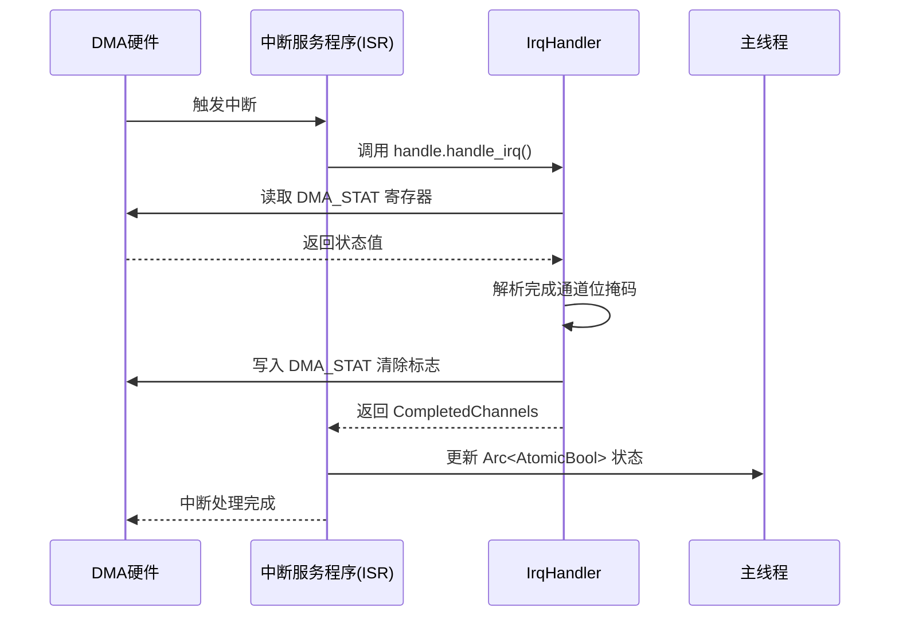

# 中断模式使用示例

<cite>
**本文档引用的文件**
- [lib.rs](file://src/lib.rs)
- [test.rs](file://tests/test.rs)
- [chan.rs](file://src/chan.rs)
- [reg.rs](file://src/reg.rs)
</cite>

## 目录
1. [中断驱动模式概述](#中断驱动模式概述)
2. [中断注册与处理流程](#中断注册与处理流程)
3. [中断使能与寄存器交互机制](#中断使能与寄存器交互机制)
4. [中断上下文处理流程](#中断上下文处理流程)
5. [同步原语与主线程通信](#同步原语与主线程通信)
6. [性能优势与编程限制](#性能优势与编程限制)

## 中断驱动模式概述

中断驱动模式是飞腾DDMA（Phytium-DDMA）控制器中一种高效的DMA传输控制方式。与轮询模式相比，该模式通过硬件中断通知CPU传输完成事件，显著降低了CPU占用率，提升了系统整体效率。在本实现中，当DMA通道完成数据块传输后，控制器会触发中断信号，由注册的中断服务程序（ISR）进行处理。

该模式的核心组件包括：
- **DDMA控制器**：管理多个DMA通道，负责中断的生成与分发
- **中断处理器**：通过`IrqHandler`结构体提供中断处理接口
- **通道配置**：通过`ChannelConfig`中的`irq`字段启用中断功能
- **同步机制**：使用原子类型与共享状态通知主线程

此模式特别适用于需要高吞吐量且对CPU资源敏感的应用场景，如串行通信、网络数据包传输等。

**Section sources**
- [lib.rs](file://src/lib.rs#L1-L289)
- [test.rs](file://tests/test.rs#L1-L168)

## 中断注册与处理流程

中断注册与处理是确保DMA传输事件能够被及时响应的关键步骤。整个流程始于获取中断处理器实例，并将其与系统的中断框架集成。

首先，通过调用`DDMA`实例的`irq_handler()`方法获取一个`IrqHandler`实例。该实例封装了对DMA控制器寄存器的访问权限，是处理中断的核心对象。随后，在测试代码中可以看到，该处理器被集成到`bare_test::IrqParam`框架中，通过`register_builder`注册中断服务程序（ISR）。

在ISR内部，必须调用`handle.handle_irq()`方法来处理中断。该方法读取DMA状态寄存器（DMA_STAT），解析出哪些通道已完成传输，并返回一个`CompletedChannels`结构体。此结构体包含一个位掩码，标识了所有完成的通道。这是清除中断标志并获取完成信息的必要步骤，若省略此调用，可能导致中断无法正确清除，进而引发重复中断或中断丢失。



**Diagram sources**
- [lib.rs](file://src/lib.rs#L200-L289)
- [test.rs](file://tests/test.rs#L50-L100)

**Section sources**
- [lib.rs](file://src/lib.rs#L200-L289)
- [test.rs](file://tests/test.rs#L50-L100)

## 中断使能与寄存器交互机制

中断功能的启用涉及`ChannelConfig`配置与底层寄存器的协同工作。在`ChannelConfig`结构体中，`irq: true`字段是用户层面的开关，指示该通道需要启用中断。

当调用`DDMA::new_channel()`创建通道时，该配置会被解析并作用于中断掩码寄存器（DMA_MASK_INT）。具体而言，如果`config.irq`为`true`，则调用`set_channel_interrupt_mask(channel, false)`，即取消对该通道中断的屏蔽，允许中断信号通过。反之，则屏蔽中断。

中断掩码寄存器（DMA_MASK_INT）是一个32位寄存器，其低8位分别对应8个DMA通道的中断屏蔽位。写入`1`表示屏蔽（禁用）该通道中断，写入`0`表示不屏蔽（启用）。此外，第31位`GLOBAL_EN`是全局中断使能位，必须在通道中断使能前通过`reset()`函数设置为`CLEAR`（即`0`）来启用全局中断。

这种分层的使能机制确保了中断信号的精确控制：只有当全局中断和特定通道中断均未被屏蔽时，中断信号才能最终触发CPU的中断响应。

```mermaid
flowchart TD
A[ChannelConfig.irq = true] --> B[new_channel()]
B --> C{判断 irq 字段}
C --> |true| D[set_channel_interrupt_mask(chan, false)]
C --> |false| E[set_channel_interrupt_mask(chan, true)]
D --> F[DMA_MASK_INT 寄存器<br>对应位清零]
E --> G[DMA_MASK_INT 寄存器<br>对应位置一]
H[全局中断使能] --> I[DMA_MASK_INT.GLOBAL_EN = 0]
F --> J[通道中断已启用]
G --> K[通道中断已屏蔽]
I --> J
I --> K
```

**Diagram sources**
- [lib.rs](file://src/lib.rs#L150-L180)
- [reg.rs](file://src/reg.rs#L100-L150)

**Section sources**
- [lib.rs](file://src/lib.rs#L150-L180)
- [reg.rs](file://src/reg.rs#L100-L150)

## 中断上下文处理流程

完整的中断上下文处理流程涵盖了从中断触发到资源释放的每一个关键步骤，确保了操作的原子性和系统的稳定性。

流程开始于中断触发。`IrqHandler::handle_irq()`方法首先从`dma_stat`寄存器读取当前状态。该寄存器的每一位对应一个DMA通道的完成状态。通过检查这些位，方法构建一个`CompletedChannels`位掩码。紧接着，为了清除中断源，防止重复触发，该方法向`dma_stat`寄存器写入全1值（`u32::MAX`），根据寄存器规范，写入1可清除对应的完成标志位。

在用户定义的ISR中，除了调用`handle_irq()`外，还应执行必要的业务逻辑，例如更新共享状态变量。在示例中，通过`Arc<AtomicBool>`将`irq_done`设置为`true`，通知主线程传输已完成。ISR应尽快完成，避免长时间运行。

最后，在主线程中，应在确认传输完成后，调用`DDMA::clear_transfer_complete()`再次确认清除状态寄存器，作为额外的安全措施，并可以安全地释放DMA通道资源，为下一次传输做准备。

```mermaid
flowchart LR
A[中断触发] --> B[进入ISR]
B --> C[调用 handle.handle_irq()]
C --> D[读取 DMA_STAT 寄存器]
D --> E[构建 CompletedChannels 位掩码]
E --> F[写入 0xFFFFFFFF 到 DMA_STAT]
F --> G[清除中断标志]
G --> H[执行用户逻辑<br>如更新 AtomicBool]
H --> I[退出ISR]
I --> J[主线程检测到完成]
J --> K[调用 clear_transfer_complete()]
K --> L[释放通道资源]
```

**Diagram sources**
- [lib.rs](file://src/lib.rs#L230-L289)
- [test.rs](file://tests/test.rs#L80-L120)

**Section sources**
- [lib.rs](file://src/lib.rs#L230-L289)
- [test.rs](file://tests/test.rs#L80-L120)

## 同步原语与主线程通信

在中断驱动模式下，中断服务程序运行在中断上下文中，而主应用程序逻辑通常运行在正常的线程上下文中。因此，需要一种安全的机制在这两个上下文之间传递状态信息。本实现采用了`Arc<AtomicBool>`作为同步原语。

`Arc`（Atomically Reference Counted）提供了跨线程的共享所有权，允许多个部分同时持有对同一数据的引用。`AtomicBool`则保证了布尔值的读写操作是原子的，不会被中断或产生数据竞争。

在示例代码中，`irq_done`被初始化为`Arc::new(AtomicBool::new(false))`，然后克隆一份传入闭包。当中断发生时，ISR在闭包中执行`done.store(true, Ordering::SeqCst)`，将状态安全地更新为`true`。主线程则通过循环调用`load(Ordering::SeqCst)`来轮询这个状态，一旦发现为`true`，即可确认传输完成并继续后续操作。

这种组合既简单又高效，避免了复杂的锁机制，非常适合用于传递简单的完成信号。

**Section sources**
- [test.rs](file://tests/test.rs#L60-L70)

## 性能优势与编程限制

中断模式的主要优势在于极大地降低了CPU占用率。在轮询模式下，CPU必须持续检查`is_transfer_complete()`状态，消耗大量计算资源。而在中断模式下，CPU可以在等待期间执行其他任务或进入低功耗状态，仅在数据真正准备好时才被唤醒处理，从而实现了更高的能效比和系统响应性。

然而，在编写中断服务程序时，必须遵守严格的编程限制：
- **不可阻塞**：ISR中不能调用任何可能阻塞的操作，如`sleep`、`wait`或尝试获取已被持有的锁。
- **不可分配内存**：禁止进行动态内存分配（如`Vec::push`、`Box::new`），因为堆操作可能涉及锁且耗时不确定。
- **代码应尽可能简短**：ISR应只做最必要的工作（如读取状态、更新原子变量），复杂处理应延迟到正常线程上下文中进行。
- **避免浮点运算**：在某些架构上，浮点运算需要额外的上下文保存，不适合在中断中执行。

遵循这些原则，可以确保中断处理快速、可靠，不会影响系统的