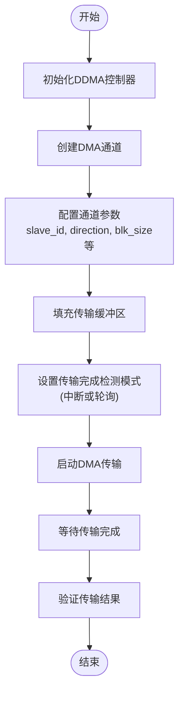
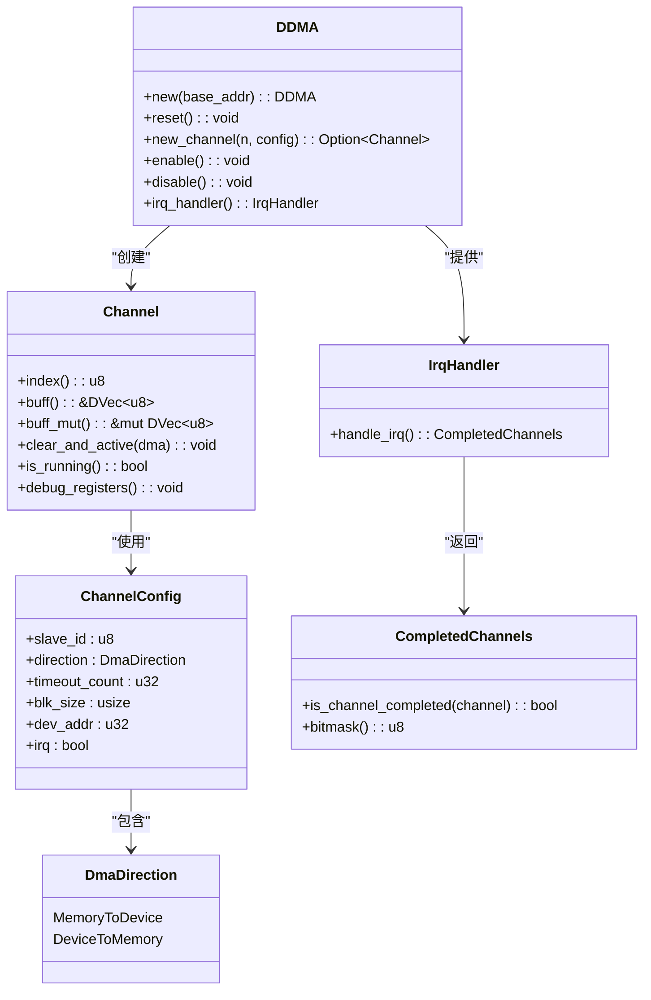
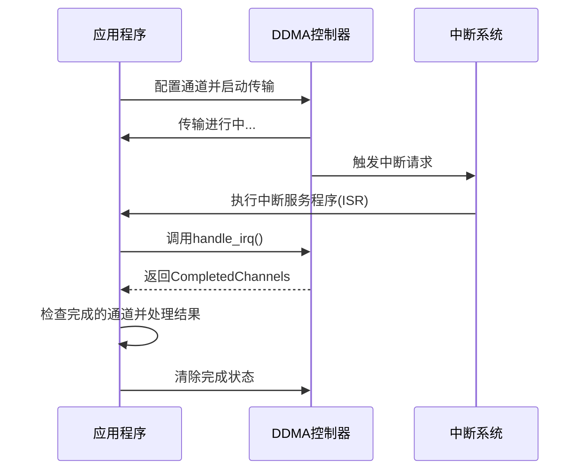
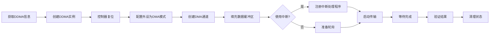

# 使用示例与实践

<cite>
**Referenced Files in This Document**   
- [test.rs](file://tests/test.rs)
- [lib.rs](file://src/lib.rs)
- [chan.rs](file://src/chan.rs)
</cite>

## 目录
1. [内存到外设传输](#内存到外设传输)
2. [外设到内存传输](#外设到内存传输)
3. [中断驱动模式](#中断驱动模式)
4. [轮询模式](#轮询模式)
5. [端到端测试流程](#端到端测试流程)

## 内存到外设传输

本节演示如何配置phytium-ddma驱动将数据从内存传输到外设，以通过DMA向UART0发送数据为例。

首先，需要初始化DDMA控制器并创建一个通道。在`ChannelConfig`中指定目标外设的slave ID（如`peripheral_ids::UART0_TX`）、传输方向为`MemoryToDevice`、超时计数、块大小和设备地址。调用`DDMA::new_channel`方法创建通道实例，并通过`buff_mut()`获取缓冲区引用以填充待发送的数据。

**Diagram sources**
- [test.rs](file://tests/test.rs#L49-L94)
- [lib.rs](file://src/lib.rs#L104-L136)

**Section sources**
- [test.rs](file://tests/test.rs#L49-L94)
- [lib.rs](file://src/lib.rs#L104-L136)

## 外设到内存传输

本节展示如何配置phytium-ddma驱动从外设接收数据到内存，例如从SPI设备读取数据。

与内存到外设传输类似，关键区别在于`ChannelConfig`中的`direction`字段应设置为`DmaDirection::DeviceToMemory`，并且`slave_id`应使用相应的RX标识符（如`peripheral_ids::SPI_RX`）。此外，设备地址`dev_addr`应指向外设的接收FIFO或数据寄存器。

尽管当前代码库中未提供完整的外设到内存传输示例，但根据`chan.rs`中的实现，当方向设置为`DeviceToMemory`时，底层会正确配置通道控制寄存器的`CHALX_MODE`位为Rx模式，确保数据流方向正确。

**Diagram sources**
- [chan.rs](file://src/chan.rs#L56-L65)
- [lib.rs](file://src/lib.rs#L17-L27)

**Section sources**
- [chan.rs](file://src/chan.rs#L56-L65)

## 中断驱动模式

中断驱动模式允许系统在DMA传输完成时得到通知，从而高效利用CPU资源。本节介绍如何注册并处理DDMA中断。

首先，通过`DDMA::irq_handler()`获取中断处理器实例。然后，使用平台特定的中断注册机制（如示例中的`IrqParam.register_builder`）注册一个回调函数。在此回调中，调用`IrqHandler::handle_irq()`来处理中断并识别已完成的通道。该方法返回一个`CompletedChannels`对象，可通过其`is_channel_completed()`方法查询具体哪个通道完成了传输。

此模式适用于需要高响应性且不希望CPU持续轮询的应用场景。

**Diagram sources**
- [test.rs](file://tests/test.rs#L75-L94)
- [lib.rs](file://src/lib.rs#L213-L244)

**Section sources**
- [test.rs](file://tests/test.rs#L75-L94)
- [lib.rs](file://src/lib.rs#L213-L244)

## 轮询模式

轮询模式通过主动查询DMA控制器的状态来判断传输是否完成，适用于对实时性要求不高或中断系统不可用的场景。

在启动传输后，应用程序可以周期性地调用`DDMA::is_transfer_complete(channel)`方法来检查指定通道的完成状态。此方法读取DMA状态寄存器并检查对应通道的完成标志位。虽然这种方式会占用CPU周期，但它避免了中断处理的复杂性，适合简单的应用场景。

两种模式的核心权衡在于：中断模式节省CPU资源但增加了软件复杂性；轮询模式简单直接但可能浪费CPU周期。

**Section sources**
- [lib.rs](file://src/lib.rs#L168-L184)
- [test.rs](file://tests/test.rs#L108-L135)

## 端到端测试流程

本节提供一个完整的端到端测试流程示例，涵盖从初始化到结果验证的全过程。

1. **获取控制器信息**：通过设备树或其他平台机制获取DDMA控制器的基地址、大小和中断信息。
2. **初始化控制器**：使用基地址创建`DDMA`实例，并调用`reset()`方法进行软复位。
3. **配置外设**：如果目标是UART等外设，需先配置外设使其进入DMA模式。
4. **创建并配置通道**：调用`new_channel()`创建通道，传入正确的`ChannelConfig`。
5. **准备数据**：使用`buff_mut()`获取缓冲区并写入待传输的数据。
6. **注册中断处理程序**（可选）：若使用中断模式，需注册中断处理回调。
7. **启动传输**：调用`clear_and_active()`清除状态并激活通道，然后调用`enable()`启动DMA控制器。
8. **等待完成**：根据模式选择中断等待或轮询检查。
9. **验证结果**：检查传输状态，确认数据已正确发送，并调用`clear_transfer_complete()`清理状态。

**Diagram sources**
- [test.rs](file://tests/test.rs#L49-L167)
- [lib.rs](file://src/lib.rs#L45-L65)

**Section sources**
- [test.rs](file://tests/test.rs#L49-L167)