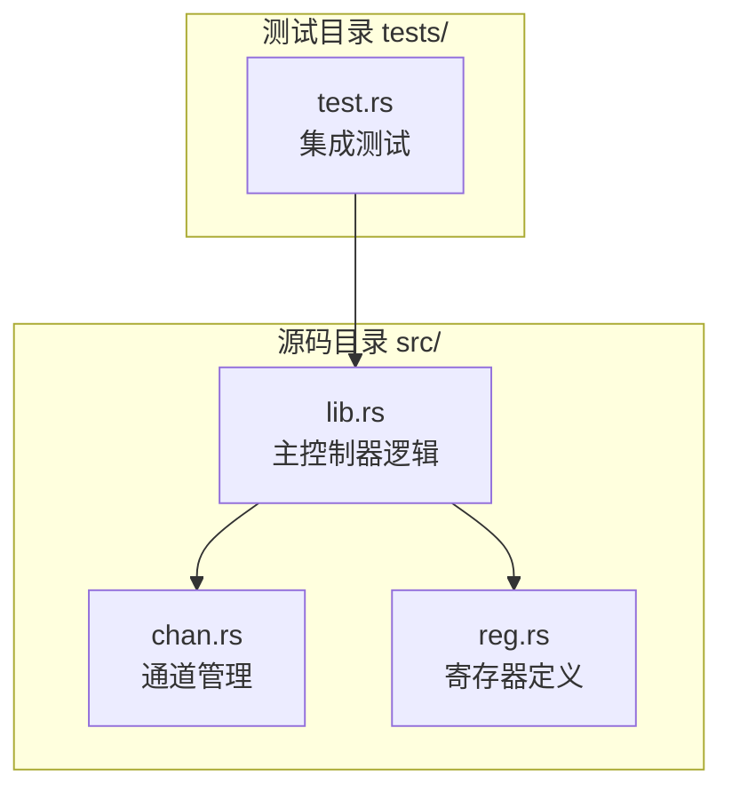
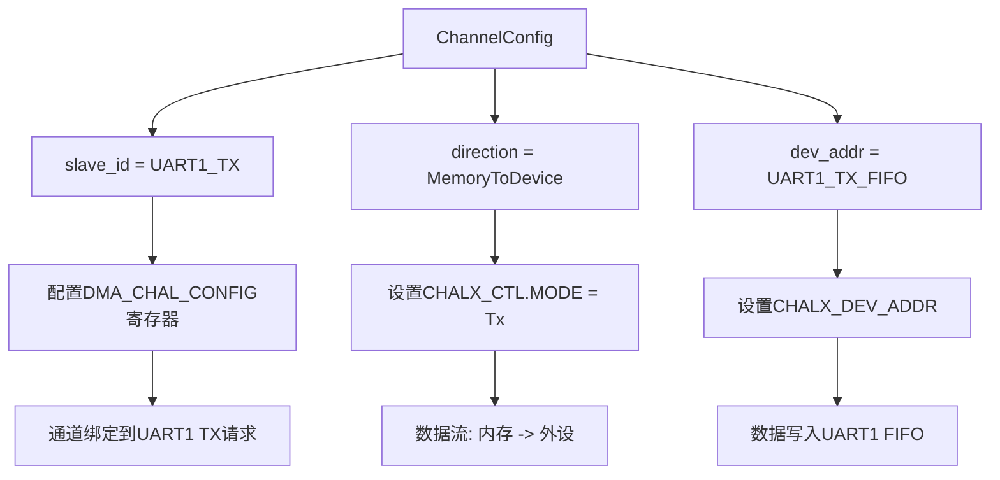
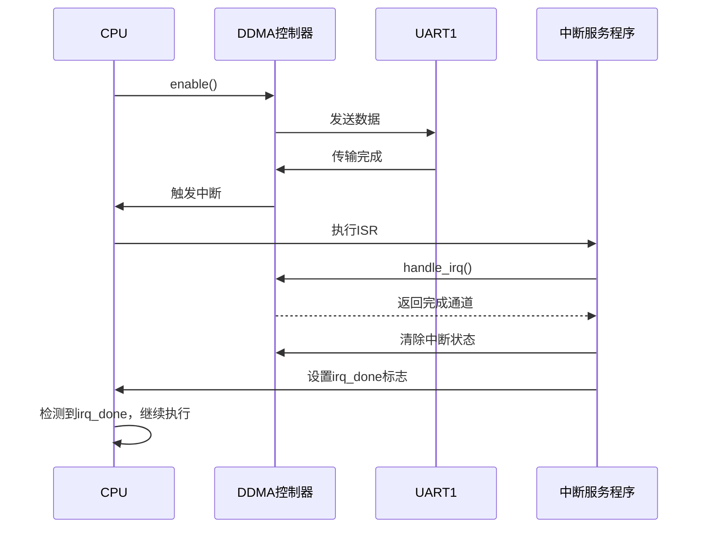

# 内存到外设传输示例

<cite>
**本文档中引用的文件**  
- [lib.rs](file://src/lib.rs)
- [chan.rs](file://src/chan.rs)
- [reg.rs](file://src/reg.rs)
- [test.rs](file://tests/test.rs)
</cite>

## 目录
1. [简介](#简介)
2. [项目结构](#项目结构)
3. [核心组件](#核心组件)
4. [内存到外设DMA传输流程](#内存到外设dma传输流程)
5. [通道配置详解](#通道配置详解)
6. [中断处理机制](#中断处理机制)
7. [调试与状态监控](#调试与状态监控)
8. [完整代码示例分析](#完整代码示例分析)
9. [常见问题与排查](#常见问题与排查)

## 简介
本文档详细说明如何使用飞腾（Phytium）DDMA驱动实现从内存到外设的DMA传输，以通过DMA将数据发送至UART1为例。文档涵盖从获取DDMA控制器基地址、映射I/O内存、初始化控制器到配置通道参数的完整流程。重点解析`ChannelConfig`中`slave_id`设置为`peripheral_ids::UART1_TX`、`direction`为`DmaDirection::MemoryToDevice`、`dev_addr`指向UART1发送FIFO地址的配置逻辑。同时演示如何准备传输缓冲区数据（如写入字符'A'），注册中断处理程序监听传输完成事件，并通过`clear_and_active`激活通道和`enable`使能控制器来启动传输。包含使用`debug_status`和`debug_registers`观察传输前后状态变化的调试技巧，并基于`test.rs`中的`test_dma_memory_to_uart1_tx`函数提供真实可复现的代码示例。

## 项目结构
本驱动项目采用模块化设计，主要分为寄存器定义、通道实现和控制器主逻辑三大部分，配合测试用例验证功能。

**图示来源**  
- [lib.rs](file://src/lib.rs#L1-L289)
- [chan.rs](file://src/chan.rs#L1-L148)
- [reg.rs](file://src/reg.rs#L1-L479)
- [test.rs](file://tests/test.rs#L1-L168)

## 核心组件
驱动的核心由`DDMA`控制器、`Channel`通道和寄存器抽象三部分构成。`DDMA`负责全局控制与初始化，`Channel`封装单个DMA通道的配置与操作，`reg.rs`通过`tock-registers`提供类型安全的寄存器访问。

**本节来源**  
- [lib.rs](file://src/lib.rs#L1-L289)
- [chan.rs](file://src/chan.rs#L1-L148)
- [reg.rs](file://src/reg.rs#L1-L479)

## 内存到外设DMA传输流程
实现内存到外设的DMA传输需遵循严格的初始化和启动顺序，确保控制器和通道状态正确。

### 1. 获取DDMA控制器信息
通过设备树（Device Tree）获取DDMA控制器的基地址、内存大小和中断信息。测试代码中`get_ddma0`函数完成此操作，利用`fdt.find_compatible`查找兼容`phytium,ddma`的节点。

### 2. 映射I/O内存
使用`iomap`函数将物理基地址映射为虚拟地址，以便CPU能够访问DDMA控制器的寄存器空间。

### 3. 初始化DDMA控制器
调用`DDMA::new`创建控制器实例，并执行`reset`方法进行软复位。`reset`会禁用控制器、关闭中断、重置所有通道并清除配置，确保控制器处于已知的初始状态。

### 4. 配置UART外设
在启动DMA前，必须先配置目标外设（UART1）以启用其DMA功能。示例中通过`some_serial::pl011`库调用`dma_tx_enable()`和`dma_rx_enable()`来配置UART1。

### 5. 创建并配置DMA通道
调用`new_channel`方法创建通道，传入`ChannelConfig`结构体进行详细配置。

### 6. 准备传输数据
通过`channel.buff_mut().set()`向DMA分配的缓冲区写入待传输的数据，如字符'A'。

### 7. 注册中断处理程序
创建`AtomicBool`标志位`irq_done`用于同步，并通过`IrqParam`注册中断处理闭包。该闭包在中断触发时调用`handle_irq`并设置标志位。

### 8. 启动DMA传输
遵循“先激活通道，再使能控制器”的顺序：
- 调用`channel.clear_and_active(&mut dma)`清除可能的挂起中断并激活通道。
- 调用`dma.enable()`使能整个DDMA控制器，启动数据传输。

### 9. 等待传输完成
通过轮询`irq_done`标志位等待传输完成，设置超时机制防止死锁。

**本节来源**  
- [test.rs](file://tests/test.rs#L20-L168)
- [lib.rs](file://src/lib.rs#L100-L150)
- [chan.rs](file://src/chan.rs#L50-L70)

## 通道配置详解
`ChannelConfig`结构体是配置DMA通道的核心，其各字段的设置直接决定了数据传输的行为。

### ChannelConfig 字段说明
- **slave_id**: 外设从设备ID，用于选择DMA请求源。对于UART1发送，必须设置为`peripheral_ids::UART1_TX`（值为3），这会配置`DMA_CHAL_CONFIG`寄存器的相应位，将通道0绑定到UART1的DMA发送请求信号。
- **direction**: 传输方向。设置为`DmaDirection::MemoryToDevice`表示数据从内存流向设备（TX），这会配置`DMA_CHALX_CTL`寄存器的`CHALX_MODE`位为`Tx`模式。
- **dev_addr**: 目标设备地址。必须指向UART1的发送FIFO寄存器地址（`0x2800d000`），这是数据传输的最终目的地。
- **blk_size**: 传输块大小。必须是4字节的整数倍且不小于4字节，以满足硬件对齐要求。
- **timeout_count**: 超时计数，用于防止传输卡死。
- **irq**: 是否启用中断。设置为`true`表示传输完成后产生中断。

**图示来源**  
- [lib.rs](file://src/lib.rs#L250-L289)
- [reg.rs](file://src/reg.rs#L50-L150)
- [chan.rs](file://src/chan.rs#L20-L40)

**本节来源**  
- [lib.rs](file://src/lib.rs#L250-L289)
- [reg.rs](file://src/reg.rs#L50-L150)
- [chan.rs](file://src/chan.rs#L20-L40)

## 中断处理机制
驱动采用中断驱动模式来异步通知传输完成事件，避免CPU轮询造成的资源浪费。

### 中断处理流程
1. **获取中断句柄**: 通过`DDMA::irq_handler()`获取`IrqHandler`实例。
2. **注册中断服务程序(ISR)**: 使用`IrqParam::register_builder`注册一个闭包作为ISR。该闭包在中断触发时被调用。
3. **处理中断**: ISR内部调用`IrqHandler::handle_irq()`。该方法读取`DMA_STAT`寄存器，检查哪个通道的传输已完成，并返回`CompletedChannels`结构体。最后，它会向`DMA_STAT`写入全1以清除所有完成状态位。
4. **同步通知**: ISR设置`Arc<AtomicBool>`标志位，通知主任务传输已完成。

**图示来源**  
- [lib.rs](file://src/lib.rs#L200-L240)
- [test.rs](file://tests/test.rs#L70-L90)

**本节来源**  
- [lib.rs](file://src/lib.rs#L200-L240)
- [test.rs](file://tests/test.rs#L70-L90)

## 调试与状态监控
驱动提供了丰富的调试接口，便于开发者在开发和故障排查时观察内部状态。

### 调试接口
- **`DDMA::debug_status()`**: 打印控制器级别的关键寄存器状态，包括`DMA_CTL`（使能状态）、`DMA_STAT`（完成状态）、`BIND_STATUS`（通道绑定状态）和`MASK_INT`（中断屏蔽状态）。该函数在传输前后调用，可清晰看到状态变化。
- **`Channel::debug_registers()`**: 打印指定通道的所有寄存器值，包括DDR地址、设备地址、传输大小、当前地址指针、控制和状态寄存器。这对于验证配置是否正确写入寄存器至关重要。

### 调试技巧
1. **传输前检查**: 在调用`clear_and_active`和`enable`之前，调用`debug_status`和`debug_registers`记录初始状态。
2. **传输后检查**: 在等待循环中定期调用调试函数，观察`Channel Enabled`和`FIFO Empty`等状态位的变化。
3. **超时处理**: 如果传输超时，打印最终的调试状态，分析是通道未激活、FIFO未清空还是中断未触发。
4. **对齐检查**: 确保DDR缓冲区地址和传输大小满足4字节对齐要求，否则`Channel::new`会返回`None`。

**本节来源**  
- [lib.rs](file://src/lib.rs#L150-L180)
- [chan.rs](file://src/chan.rs#L100-L130)

## 完整代码示例分析
`test.rs`中的`test_dma_memory_to_uart1_tx`函数是内存到外设传输的完整实现示例。

### 关键步骤解析
1. **获取资源**: `get_ddma0()`从设备树获取控制器信息。
2. **映射与初始化**: `iomap`映射地址，`DDMA::new`和`reset`初始化控制器。
3. **外设配置**: 映射UART1地址并启用其DMA功能。
4. **通道创建**: 使用正确的`slave_id`、`direction`和`dev_addr`创建通道0。
5. **数据准备**: 向DMA缓冲区写入字符'A'。
6. **中断注册**: 设置`irq_done`标志并注册ISR。
7. **状态调试**: 在关键节点调用`debug_status`和`debug_registers`。
8. **启动传输**: 按顺序调用`clear_and_active`和`enable`。
9. **等待完成**: 轮询`irq_done`标志，超时后打印最终调试信息。

此示例代码结构清晰，包含了错误处理（`expect`）、状态调试和超时保护，是开发者复现和理解该功能的最佳参考。

**本节来源**  
- [test.rs](file://tests/test.rs#L20-L168)

## 常见问题与排查
### 1. 传输未启动
- **检查点**: 确认`DDMA::enable()`已被调用。仅激活通道而不使能控制器，传输不会开始。
- **调试**: 使用`debug_status`检查`DMA_CTL`寄存器的`DMA_ENABLE`位是否为1。

### 2. 传输卡住，中断未触发
- **检查点**: 
  - 确认`ChannelConfig::irq`设置为`true`。
  - 检查中断号是否正确注册。
  - 确认`IrqHandler::handle_irq()`被调用。
- **调试**: 在ISR中添加日志，确认其是否被执行。

### 3. 数据未正确发送
- **检查点**: 
  - 确认`dev_addr`是正确的UART1 TX FIFO地址。
  - 确认UART1的DMA功能已通过`dma_tx_enable()`启用。
  - 检查`slave_id`是否为`UART1_TX`而非`UART1_RX`。
- **调试**: 使用`debug_registers`检查`DEV_ADDR`寄存器的值。

### 4. `new_channel`失败
- **检查点**: 
  - 确认通道号（0-7）未被占用。
  - 检查`blk_size`是否为4的倍数且不小于4。
  - 检查DDR缓冲区地址是否4字节对齐。
- **调试**: 查看`trace!`日志输出的具体错误原因。