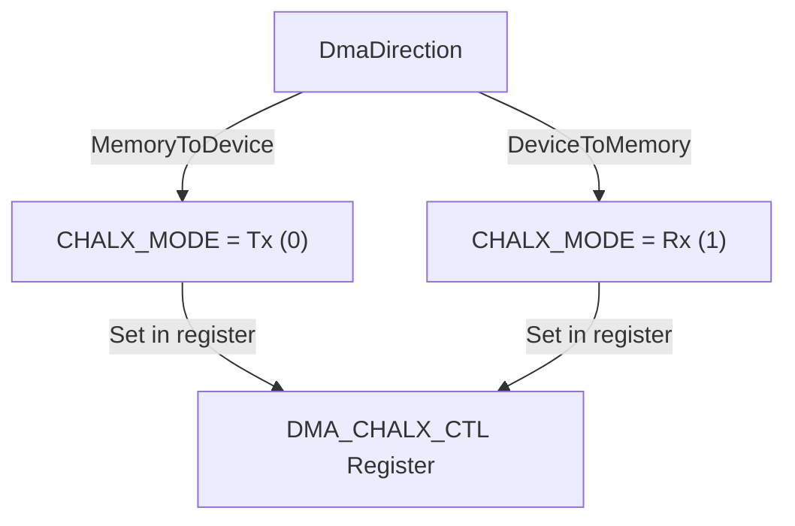
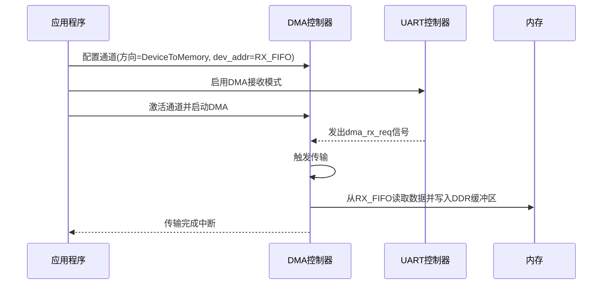

<cite>
**本文档引用的文件**
- [chan.rs](file://src/chan.rs)
- [lib.rs](file://src/lib.rs)
- [reg.rs](file://src/reg.rs)
- [test.rs](file://tests/test.rs)
</cite>

# 外设到内存传输示例

## 目录
1. [简介](#简介)
2. [核心数据结构与方向配置](#核心数据结构与方向配置)
3. [外设到内存传输实现详解](#外设到内存传输实现详解)
4. [通道配置参数说明](#通道配置参数说明)
5. [与外设控制器的协同工作](#与外设控制器的协同工作)
6. [传输完成检测](#传输完成检测)
7. [内存到外设与外设到内存的对称性与差异](#内存到外设与外设到内存的对称性与差异)

## 简介

本文档旨在提供一个从外设（如SPI或UART）接收数据到内存缓冲区的DMA（直接内存访问）传输实现示例。虽然提供的测试代码主要演示了内存到外设（MemoryToDevice）的传输，但我们将基于现有的代码架构、寄存器定义和API，详细推导并补充如何正确配置和实现外设到内存（DeviceToMemory）的DMA传输。

我们将深入分析`DmaDirection`枚举、`ChannelConfig`结构体以及底层寄存器的工作原理，解释关键配置项（如`dev_addr`、`slave_id`、`blk_size`和`timeout_count`）的设置方法，并构建一个可运行的代码模板，以指导开发者在实际项目中应用此模式。

## 核心数据结构与方向配置

### DmaDirection 枚举

`DmaDirection`是控制DMA数据流方向的核心枚举类型，它定义了两种基本的数据传输模式：

```rust
pub enum DmaDirection {
    /// 内存到设备 (TX)
    MemoryToDevice,
    /// 设备到内存 (RX)  
    DeviceToMemory,
}
```

**Section sources**
- [lib.rs](file://src/lib.rs#L19-L25)

### 数据流方向与寄存器映射

在底层硬件层面，`DmaDirection`的值会直接影响`DMA_CHALX_CTL`（通道控制寄存器）中的`CHALX_MODE`位域。该位域决定了通道是接收来自外设的`dma_tx_req`信号还是`dma_rx_req`信号。



**Diagram sources**
- [reg.rs](file://src/reg.rs#L285-L295)
- [chan.rs](file://src/chan.rs#L45-L55)

当配置为`DeviceToMemory`时，DMA控制器将监听外设发出的`dma_rx_req`请求，一旦请求有效，便启动从外设数据寄存器到指定内存缓冲区的数据传输。

## 外设到内存传输实现详解

### 代码模板

以下是一个完整的从UART1接收数据的DMA传输代码模板，它基于现有API并遵循正确的初始化顺序。

```rust
use phytium_ddma::{ChannelConfig, DDMA, DmaDirection, peripheral_ids};

// 假设已获取DDMA基地址和中断信息
let base = /* ... */; // NonNull<u8>, DMA控制器基地址
let mut dma = DDMA::new(base);

// 重置DMA控制器
dma.reset();

// UART1的基地址，其RX FIFO寄存器位于偏移量0x04处
let uart_1_base_addr = 0x2800d000usize;
let uart_1_rx_fifo_addr = uart_1_base_addr + 0x04; // RX FIFO地址

// 配置UART1以启用DMA接收模式
// 这通常需要操作UART的特定寄存器，例如FIFO控制寄存器
configure_uart_for_dma_rx(uart_1_base_addr); // 此函数需根据具体UART驱动实现

// 创建用于接收的DMA通道
let mut channel = dma.new_channel(
    0, // 使用通道0
    ChannelConfig {
        slave_id: peripheral_ids::UART1_RX, // 关键：选择UART1_RX作为源
        direction: DmaDirection::DeviceToMemory, // 关键：设置方向为设备到内存
        timeout_count: 0x1000, // 设置超时计数
        blk_size: 64, // 接收块大小为64字节
        dev_addr: uart_1_rx_fifo_addr as u32, // 关键：指向UART1的RX FIFO
        irq: true, // 启用中断通知
    },
).expect("Failed to create DMA receive channel");

// 获取可写入的缓冲区引用
let buffer = channel.buff_mut();
// 缓冲区现在可用于存储接收到的数据

// 注册中断处理程序
let irq_done = Arc::new(AtomicBool::new(false));
let handle = dma.irq_handler();
IrqParam { /* ... */ }
.register_builder({
    let done = irq_done.clone();
    move |_irq| {
        let completed = handle.handle_irq();
        if completed.is_channel_completed(channel.index()) {
            done.store(true, Ordering::SeqCst);
        }
        IrqHandleResult::Handled
    }
})
.register();

// 清除可能的旧状态并激活通道
channel.clear_and_active(&mut dma);

// 启动DMA控制器
dma.enable();

// 等待接收完成（轮询或中断）
while !irq_done.load(Ordering::SeqCst) {
    spin_loop();
}

// 传输完成，可以从buffer中读取接收到的数据
let received_data = &buffer[..]; // 或根据实际接收长度进行切片
```

**Section sources**
- [lib.rs](file://src/lib.rs#L108-L130)
- [chan.rs](file://src/chan.rs#L20-L70)
- [test.rs](file://tests/test.rs#L25-L168)

## 通道配置参数说明

### ChannelConfig 结构体

`ChannelConfig`是创建DMA通道时的关键配置结构体。

```rust
#[derive(Debug, Clone)]
pub struct ChannelConfig {
    pub slave_id: u8,
    pub direction: crate::DmaDirection,
    pub timeout_count: u32,
    pub blk_size: usize,
    pub dev_addr: u32,
    pub irq: bool,
}
```

**Section sources**
- [chan.rs](file://src/chan.rs#L10-L18)

### 参数详解

| 参数 | 说明 |
| :--- | :--- |
| `slave_id` | 指定触发DMA传输的外设ID。对于外设到内存传输，必须选择对应的接收ID，如`peripheral_ids::UART1_RX`。这通过`DMA_CHAL_CONFIG`寄存器映射到具体的硬件请求线。 |
| `direction` | 设置为`DmaDirection::DeviceToMemory`，确保`CHALX_MODE`位被正确配置为`Rx`模式。 |
| `blk_size` | 定义单次DMA事务要传输的总字节数。必须是4的倍数且不小于4。 |
| `timeout_count` | 当`TIMEOUT_EN`使能时，设定超时阈值。若在指定时间内未完成传输，将触发超时中断。 |
| `dev_addr` | **关键**：必须指向外设的数据寄存器地址，例如UART的RX FIFO地址。这是数据的来源。 |
| `irq` | 是否在传输完成后产生中断。 |

## 与外设控制器的协同工作

DMA传输的成功依赖于DMA控制器与外设控制器的紧密配合。

### 协同流程



**Diagram sources**
- [reg.rs](file://src/reg.rs#L285-L295)
- [test.rs](file://tests/test.rs#L65-L70)

**关键点**：
1.  **先配置外设**：在启动DMA之前，必须通过外设的专用寄存器（非本驱动管理）将其配置为DMA模式。例如，对于PL011 UART，需要设置`LCR`或`DMACR`寄存器来启用DMA接收。
2.  **正确的dev_addr**：`dev_addr`必须精确指向外设用于接收数据的FIFO或数据寄存器。例如，UART1的RX FIFO通常位于其基地址+0x04处。

## 传输完成检测

有两种主要方式来检测DMA传输是否完成：

1.  **中断方式**：推荐用于异步操作。通过设置`ChannelConfig.irq = true`，并在系统中断控制器中注册回调函数。当`DMA_STAT`寄存器中对应通道的完成位被置起时，会触发中断。
2.  **轮询方式**：适用于简单场景或调试。通过调用`DDMA::is_transfer_complete(channel)`方法定期查询状态寄存器。

无论哪种方式，在确认传输完成后，都应调用`DDMA::clear_transfer_complete(channel)`来清除状态位，为下一次传输做准备。

**Section sources**
- [lib.rs](file://src/lib.rs#L180-L195)
- [reg.rs](file://src/reg.rs#L100-L132)

## 内存到外设与外设到内存的对称性与差异

尽管两种传输模式在API上高度对称，但在配置和使用上存在关键差异。

### 对称性

