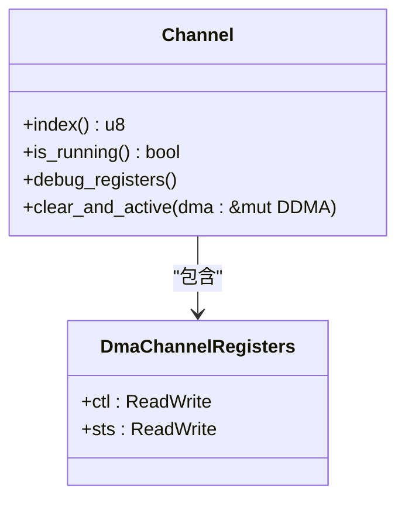
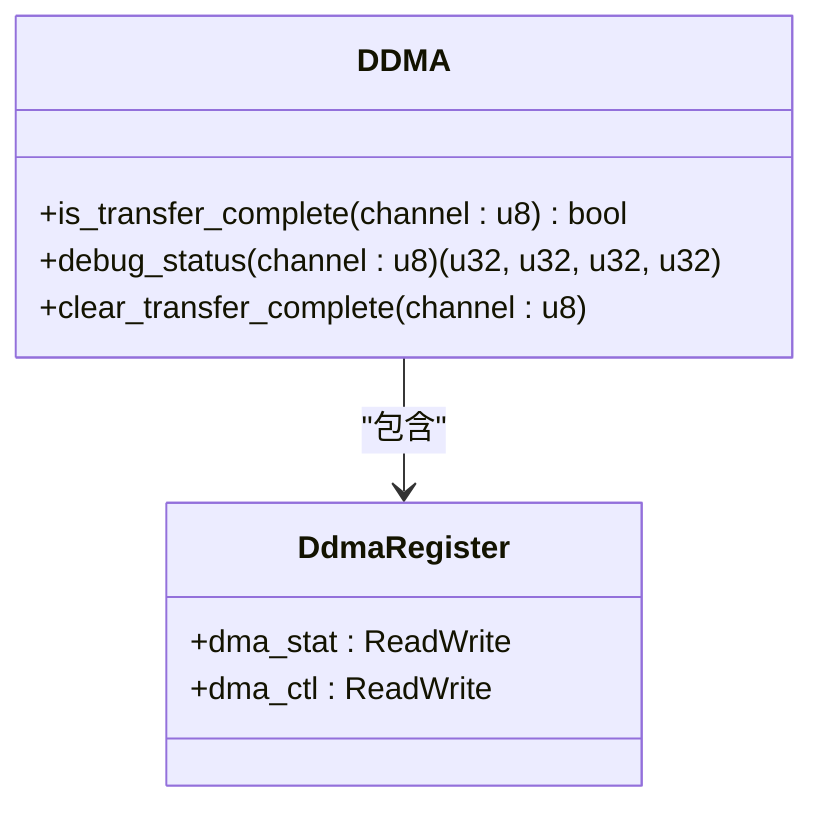
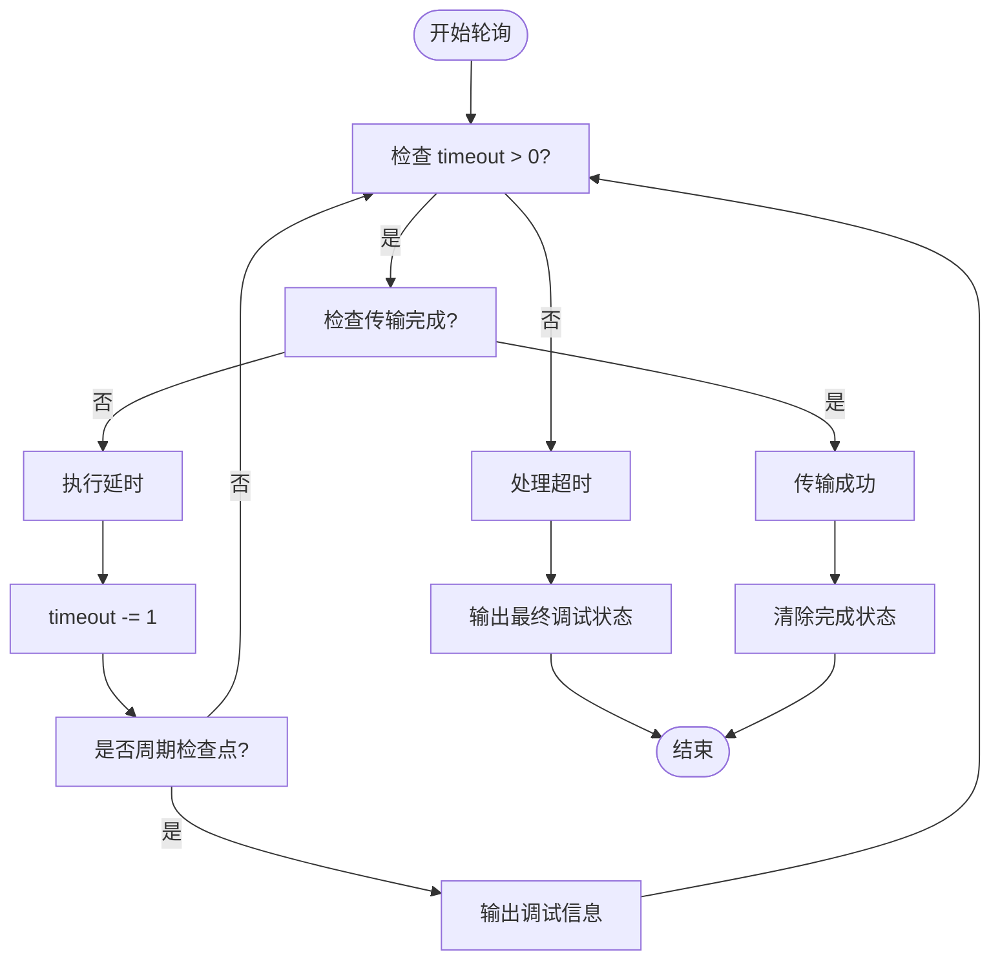

# 轮询模式使用示例

<cite>
**Referenced Files in This Document**   
- [test.rs](file://tests/test.rs)
- [lib.rs](file://src/lib.rs)
- [chan.rs](file://src/chan.rs)
- [reg.rs](file://src/reg.rs)
</cite>

## 目录
1. [轮询模式实现原理](#轮询模式实现原理)
2. [状态检查API详解](#状态检查api详解)
3. [超时机制与调试支持](#超时机制与调试支持)
4. [轮询模式代码结构分析](#轮询模式代码结构分析)
5. [轮询与中断模式对比](#轮询与中断模式对比)
6. [完整轮询模式代码框架](#完整轮询模式代码框架)

## 轮询模式实现原理

在嵌入式系统中，DMA（直接内存访问）传输的完成监控可以通过轮询方式实现。该方法通过定期调用状态检查API来主动查询DMA通道的运行状态，而非依赖硬件中断通知。这种机制避免了中断处理程序的复杂性，在某些实时性要求不高或中断资源受限的场景下具有优势。

轮询模式的核心在于持续调用`channel.is_running()`或`dma.is_transfer_complete()`等接口，直到检测到传输完成标志。此过程通常在一个循环中执行，配合适当的延时控制以减少CPU资源消耗。测试文件`test.rs`中的`test_dma_memory_to_uart1_tx`函数展示了这一典型实现模式。

**Section sources**
- [test.rs](file://tests/test.rs#L30-L168)
- [lib.rs](file://src/lib.rs#L170-L190)
- [chan.rs](file://src/chan.rs#L120-L130)

## 状态检查API详解

### 通道运行状态检查

`Channel`结构体提供了`is_running()`方法用于检查指定DMA通道是否处于活动状态。该方法通过读取通道控制寄存器（CTL）中的`CHALX_EN`位来判断通道使能情况。



**Diagram sources**
- [chan.rs](file://src/chan.rs#L120-L130)
- [reg.rs](file://src/reg.rs#L180-L185)

### 控制器传输完成检查

`DDMA`控制器提供了`is_transfer_complete(channel)`方法，用于检查特定通道的传输完成状态。该方法查询DMA状态寄存器（DMA_STAT）中对应通道的完成标志位。



**Diagram sources**
- [lib.rs](file://src/lib.rs#L170-L190)
- [reg.rs](file://src/reg.rs#L100-L115)

## 超时机制与调试支持

为防止无限等待导致系统挂起，轮询循环必须设置合理的超时机制。在`test.rs`示例中，使用计数器`timeout`实现超时控制，初始值设为100000次循环迭代。

当超时发生时，系统会输出详细的调试信息辅助问题排查：
- `channel.debug_registers()`：打印通道级寄存器状态，包括DDR地址、设备地址、传输大小和控制状态
- `dma.debug_status(channel.index())`：输出控制器级状态，涵盖DMA控制、状态、绑定和中断屏蔽寄存器

这些调试接口对于诊断DMA配置错误、硬件连接问题或时序异常至关重要。



**Diagram sources**
- [test.rs](file://tests/test.rs#L110-L140)
- [lib.rs](file://src/lib.rs#L200-L230)
- [chan.rs](file://src/chan.rs#L132-L145)

**Section sources**
- [test.rs](file://tests/test.rs#L110-L140)
- [lib.rs](file://src/lib.rs#L200-L230)
- [chan.rs](file://src/chan.rs#L132-L145)

## 轮询模式代码结构分析

典型的轮询模式实现包含以下几个关键步骤：

1. **初始化阶段**：创建DMA控制器实例，配置通道参数并激活通道
2. **状态监测循环**：进入while循环，持续检查完成条件和超时计数
3. **周期性调试**：按固定间隔输出通道和控制器状态供监控
4. **延时控制**：使用`core::hint::spin_loop()`进行轻量级延时
5. **超时处理**：达到最大尝试次数后执行故障恢复逻辑

该模式在`test_dma_memory_to_uart1_tx`函数中得到了完整体现，从DMA重置、通道配置到最终的状态轮询都遵循这一标准流程。

**Section sources**
- [test.rs](file://tests/test.rs#L30-L168)
- [lib.rs](file://src/lib.rs#L100-L160)

## 轮询与中断模式对比

| 特性 | 轮询模式 | 中断模式 |
|------|----------|----------|
| 实时性 | 较低，取决于轮询频率 | 高，即时响应 |
| CPU占用 | 持续占用CPU资源 | 仅在事件发生时占用 |
| 实现复杂度 | 简单直观 | 需要中断处理程序 |
| 适用场景 | 实时性要求不高的任务 | 高并发、低延迟应用 |
| 资源消耗 | 不占用中断线 | 占用中断资源 |
| 响应确定性 | 受轮询间隔影响 | 响应时间可预测 |

选择合适的工作模式应基于具体应用场景的需求权衡。对于简单的数据传输任务且系统中断资源紧张时，轮询模式是可靠的选择；而对于需要快速响应多个外设请求的复杂系统，则推荐使用中断驱动模式。

**Section sources**
- [test.rs](file://tests/test.rs#L30-L168)
- [lib.rs](file://src/lib.rs#L170-L190)

## 完整轮询模式代码框架

以下是一个完整的轮询模式代码框架，整合了状态检查、延时控制和错误处理逻辑：

```mermaid
sequenceDiagram
participant Application
participant DDMA
participant Channel
participant Hardware
Application->>DDMA : 创建控制器实例
Application->>DDMA : 配置并激活通道
loop 轮询循环
Application->>Channel : is_running()
Channel-->>Application : 返回运行状态
alt 传输未完成
Application->>Application : 执行spin_loop延时
Application->>Application : 递减timeout计数器
alt 到达调试检查点
Application->>Channel : debug_registers()
Application->>DDMA : debug_status()
end
else 传输完成
Application->>DDMA : clear_transfer_complete()
break 循环退出
end
alt timeout计数器归零
Application->>Channel : debug_registers()
Application->>DDMA : debug_status()
Application->>Application : 执行超时处理逻辑
break 循环退出
end
end
```

**Diagram sources**
- [test.rs](file://tests/test.rs#L110-L140)
- [lib.rs](file://src/lib.rs#L170-L190)
- [chan.rs](file://src/chan.rs#L120-L130)

该框架体现了轮询模式的核心设计思想：通过主动查询替代被动通知，结合超时保护和调试输出，构建一个健壮可靠的DMA传输监控机制。开发者可根据实际需求调整超时阈值、调试输出频率和延时策略，以适应不同的性能和可靠性要求。