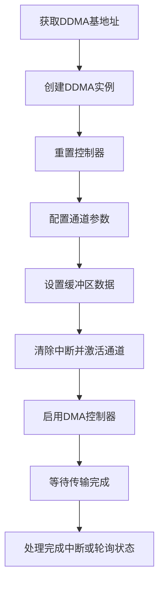

# 快速入门指南

<cite>
**本文档中引用的文件**  
- [README.md](file://README.md)
- [Cargo.toml](file://Cargo.toml)
- [rust-toolchain.toml](file://rust-toolchain.toml)
- [src/lib.rs](file://src/lib.rs)
- [src/chan.rs](file://src/chan.rs)
- [src/reg.rs](file://src/reg.rs)
- [tests/test.rs](file://tests/test.rs)
- [examples/dma_examples.rs](file://examples/dma_examples.rs)
</cite>

## 目录
1. [简介](#简介)
2. [开发环境准备](#开发环境准备)
3. [运行测试用例](#运行测试用例)
4. [使用示例：内存到UART传输](#使用示例：内存到uart传输)
5. [常见配置错误及解决方法](#常见配置错误及解决方法)
6. [总结](#总结)

## 简介
本指南旨在帮助初学者快速上手 Phytium DDMA 驱动的配置与使用。Phytium DDMA（直接内存访问）控制器提供高性能的数据传输能力，支持内存到外设和外设到内存的传输模式。该驱动以 Rust 编写，适用于嵌入式 `no_std` 环境，具备安全的 API 封装和中断/轮询两种工作模式。

通过本指南，您将学习如何准备开发环境、运行测试用例，并实现一个完整的 DMA 传输流程。

**Section sources**
- [README.md](file://README.md#L1-L10)

## 开发环境准备

### 安装 ostool 工具
`ostool` 是用于构建和测试嵌入式 Rust 项目的工具。请使用以下命令安装：

```bash
cargo install ostool
```

### 配置 Rust 交叉编译环境
该项目使用 nightly 版本的 Rust 编译器，并针对 AArch64 架构进行交叉编译。项目根目录下的 `rust-toolchain.toml` 文件已指定所需工具链：

```toml
[toolchain]
channel = "nightly"
components = ["rust-src", "rustfmt", "clippy", "llvm-tools"]
```

确保已安装 `rust-src` 组件以支持 `no_std` 开发：

```bash
rustup component add rust-src --toolchain nightly
```

此外，需配置 AArch64 目标支持：

```bash
rustup target add aarch64-unknown-none
```

**Section sources**
- [rust-toolchain.toml](file://rust-toolchain.toml#L1-L3)
- [Cargo.toml](file://Cargo.toml#L1-L22)

## 运行测试用例

### 在模拟器中运行测试
使用以下命令在 QEMU 模拟器中运行集成测试：

```bash
cargo test --test test -- tests --show-output
```

此命令会编译并运行 `tests/test.rs` 中的测试用例，输出详细日志信息。

### 在 U-Boot 开发板上运行测试
若要在真实硬件上测试，请添加 `--uboot` 参数：

```bash
cargo test --test test -- tests --show-output --uboot
```

该命令将生成适合 U-Boot 引导的镜像并在开发板上执行测试。

### 调试测试（仅编译）
如需检查编译过程而不实际运行，可使用：

```bash
cargo test --test test -- --show-output --no-run
```

这有助于排查编译错误或链接问题。

**Section sources**
- [README.md](file://README.md#L22-L34)

## 使用示例：内存到UART传输

以下是一个完整的使用流程示例，展示如何通过 DDMA 将数据从内存传输至 UART1 发送端口。

### 1. 获取 DDMA 控制器基地址
首先需要通过设备树或平台信息获取 DDMA 控制器的物理基地址。在测试代码中，这一过程由 `get_ddma0()` 函数完成，利用 `fdt` 解析设备树节点。

### 2. 创建 DDMA 实例
使用基地址创建 `DDMA` 实例：

```rust
let base = iomap(addr.into(), size);
let mut dma = DDMA::new(base);
```

### 3. 重置控制器
在使用前必须对控制器进行初始化和重置：

```rust
dma.reset();
```

该操作会禁用所有通道、清除中断掩码并执行软复位。

### 4. 配置 DMA 通道
创建通道配置结构体，指定外设 ID、方向、块大小等参数：

```rust
let mut channel = dma.new_channel(
    0,
    ChannelConfig {
        slave_id: peripheral_ids::UART1_TX,
        direction: DmaDirection::MemoryToDevice,
        timeout_count: 0x1000,
        blk_size: 4,
        dev_addr: uart_1_addr as _,
        irq: true,
    },
).expect("Failed to create DMA channel 0");
```

关键参数说明：
- `slave_id`: 外设请求信号源，如 `UART1_TX` 对应值为 3
- `direction`: 传输方向，`MemoryToDevice` 表示内存到外设
- `blk_size`: 传输块大小，必须是 4 字节对齐
- `dev_addr`: 外设寄存器地址（如 UART1 的 TX FIFO 地址）

### 5. 启动传输
填充缓冲区数据后，清除中断状态并激活通道：

```rust
channel.buff_mut().set(0, b'A');
channel.clear_and_active(&mut dma);
dma.enable();
```

随后可通过中断或轮询方式等待传输完成。



**Diagram sources**
- [src/lib.rs](file://src/lib.rs#L100-L150)
- [src/chan.rs](file://src/chan.rs#L20-L60)
- [tests/test.rs](file://tests/test.rs#L30-L80)

**Section sources**
- [src/lib.rs](file://src/lib.rs#L1-L289)
- [src/chan.rs](file://src/chan.rs#L1-L148)
- [tests/test.rs](file://tests/test.rs#L1-L168)

## 常见配置错误及解决方法

### 错误1：错误的基地址
**现象**：`iomap` 映射失败或访问寄存器时触发异常。  
**原因**：提供的物理地址不正确或未正确映射到虚拟内存。  
**解决方法**：
- 确保从设备树或平台固件获取正确的基地址
- 检查 `get_ddma0()` 中的设备树兼容字符串是否为 `"phytium,ddma"`
- 使用调试工具验证地址空间映射

### 错误2：通道号越界
**现象**：调用 `new_channel()` 时 panic 或返回 `None`。  
**原因**：通道编号超出有效范围（0-7）。  
**解决方法**：
- 确保传入的 `n` 参数在 0 到 7 之间
- 检查是否已有其他模块占用了目标通道

### 错误3：缓冲区地址未对齐
**现象**：`new_channel()` 返回 `None`，日志提示地址未对齐。  
**原因**：DDR 缓冲区地址或传输大小未按 4 字节对齐。  
**解决方法**：
- 确保 `DVec::zeros()` 分配的缓冲区地址为 4 字节对齐
- 设置 `blk_size` 为 4 的倍数且不小于 4

### 错误4：外设未启用 DMA 模式
**现象**：DMA 传输启动但无数据输出。  
**原因**：UART 等外设未配置为 DMA 工作模式。  
**解决方法**：
- 在启动 DMA 前调用外设的 DMA 使能函数，例如：
  ```rust
  uart.dma_tx_enable().unwrap();
  uart.dma_rx_enable().unwrap();
  ```

### 错误5：中断未注册或未启用
**现象**：无法收到 DMA 完成中断。  
**原因**：中断处理程序未注册或通道中断被屏蔽。  
**解决方法**：
- 确保调用 `IrqParam.register()` 注册中断处理函数
- 检查 `ChannelConfig.irq` 是否设为 `true`
- 验证全局中断和通道中断掩码是否已正确配置

**Section sources**
- [src/lib.rs](file://src/lib.rs#L150-L200)
- [src/chan.rs](file://src/chan.rs#L40-L70)
- [tests/test.rs](file://tests/test.rs#L60-L100)

## 总结
本指南介绍了 Phytium DDMA 驱动的基本使用流程，涵盖环境搭建、测试运行和实际应用示例。通过遵循上述步骤，开发者可以快速完成首次集成并实现高效的数据传输功能。建议在实际部署前充分测试各种边界条件，并结合日志调试功能排查潜在问题。

**Section sources**
- [README.md](file://README.md#L1-L75)
- [src/lib.rs](file://src/lib.rs#L1-L289)