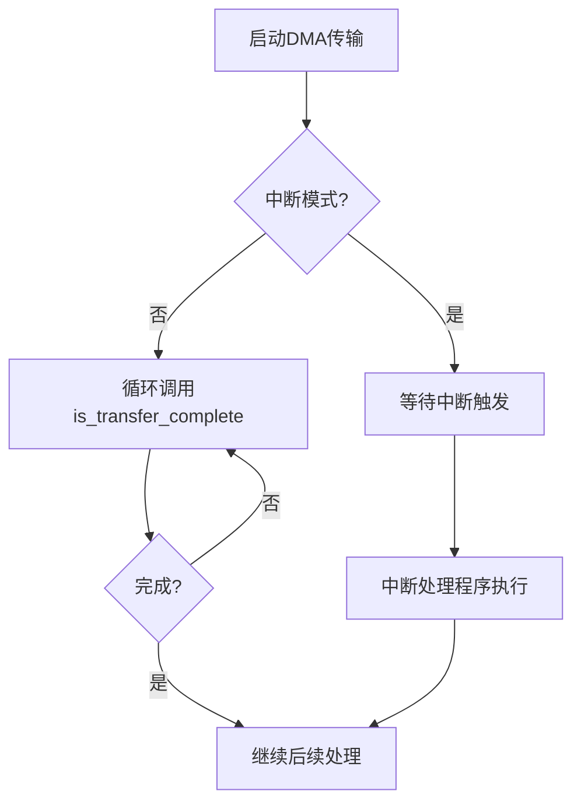
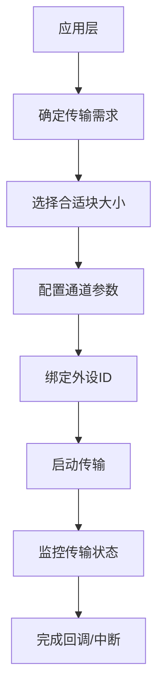

# 性能优化建议

<cite>
**Referenced Files in This Document**  
- [lib.rs](file://src/lib.rs)
- [chan.rs](file://src/chan.rs)
- [reg.rs](file://src/reg.rs)
- [Cargo.toml](file://Cargo.toml)
- [README.md](file://README.md)
</cite>

## 目录
1. [引言](#引言)
2. [通道配置对性能的影响](#通道配置对性能的影响)
3. [中断模式与轮询模式的选择](#中断模式与轮询模式的选择)
4. [多通道并发传输分析](#多通道并发传输分析)
5. [内存屏障使用指导](#内存屏障使用指导)
6. [通道预配置与复用策略](#通道预配置与复用策略)
7. [传输块大小与外设配置优化](#传输块大小与外设配置优化)

## 引言

本文档旨在为飞腾（Phytium）DDMA驱动提供全面的性能优化指导。基于对驱动代码的深入分析，我们将探讨如何通过合理的配置和使用策略来最大化DMA传输效率。文档涵盖了从通道配置、中断模式选择到多通道并发等关键性能因素，并结合硬件特性给出具体的优化建议。

**Section sources**
- [README.md](file://README.md#L1-L76)

## 通道配置对性能的影响

在飞腾DDMA驱动中，通道配置是影响性能的关键因素之一。`ChannelConfig`结构体中的多个参数直接决定了传输行为和效率。

超时参数的合理设置对于避免不必要的等待至关重要。驱动支持通过`timeout_count`字段配置超时计数，当设置为0时表示禁用超时机制。在高可靠性场景下，适当设置超时可以防止传输卡死；但在已知稳定连接的高速传输场景中，禁用超时可减少额外的检查开销。

此外，传输方向（`direction`）的正确配置确保了数据流的准确性。驱动支持内存到设备（MemoryToDevice）和设备到内存（DeviceToMemory）两种方向，错误的方向配置会导致数据传输失败或数据损坏。

**Section sources**
- [chan.rs](file://src/chan.rs#L20-L23)
- [lib.rs](file://src/lib.rs#L37-L38)

## 中断模式与轮询模式的选择

在高吞吐量场景下，优先使用中断模式而非轮询模式是减少CPU占用的有效策略。驱动通过`irq`布尔字段控制通道是否启用中断。

当`irq`设置为`true`时，DMA控制器在传输完成后会触发中断，通知CPU进行后续处理。这种方式避免了CPU持续查询状态寄存器，显著降低了CPU负载，特别适合大数据量传输或实时性要求较高的应用。

相比之下，轮询模式需要应用程序主动调用`is_transfer_complete`方法检查传输状态，这会消耗大量CPU周期，尤其是在等待时间较长的情况下。因此，在高吞吐场景中应优先采用中断模式以提高系统整体效率。

**Diagram sources**
- [lib.rs](file://src/lib.rs#L200-L242)
- [chan.rs](file://src/chan.rs#L23)

## 多通道并发传输分析

飞腾DDMA控制器支持8个独立通道，允许多个外设同时进行DMA传输。然而，多通道并发传输可能引发资源竞争问题，需要谨慎管理。

每个通道都有独立的寄存器空间和FIFO缓冲区，但共享相同的总线带宽和控制器资源。当多个通道同时活跃时，可能会出现总线争用，导致单个通道的实际传输速率下降。

推荐的通道分配策略包括：
1. 根据外设的带宽需求合理分配通道，避免将高带宽外设集中在少数通道上
2. 对于时间敏感的应用，为其分配专用通道以保证服务质量
3. 定期监控各通道的状态和性能指标，及时发现潜在的瓶颈

驱动通过`dma_channel_bind`寄存器跟踪通道绑定状态，开发者可通过`is_channel_bind`方法查询通道占用情况，避免重复分配。

**Section sources**
- [reg.rs](file://src/reg.rs#L169-L188)
- [lib.rs](file://src/lib.rs#L120-L130)

## 内存屏障使用指导

内存一致性是DMA操作中的关键问题。虽然当前代码未显式调用内存屏障函数，但在实际使用中必须注意数据同步时机。

在DMA传输前后，应根据具体情况插入适当的内存屏障（mbarrier），确保：
1. 在启动DMA写入外设前，确保所有待发送的数据已刷新到内存
2. 在DMA从外设读取数据后，确保CPU能够看到最新的数据内容
3. 当同一内存区域在不同传输间复用时，保证正确的内存可见性顺序

尽管驱动本身可能不直接调用mbarrier，但作为依赖项出现在Cargo.toml中，表明系统层面考虑到了内存一致性需求。开发者应在应用层适当地方添加内存屏障调用，特别是在涉及缓存操作或跨核通信的场景中。

**Section sources**
- [Cargo.toml](file://Cargo.toml#L14)
- [reg.rs](file://src/reg.rs#L191-L195)

## 通道预配置与复用策略

为了减少运行时开销，建议对频繁使用的通道进行预配置和复用。创建和初始化DMA通道涉及多个步骤，包括寄存器配置、内存分配和状态检查，这些操作具有一定的开销。

通过预先创建并配置好常用通道，在需要时直接激活使用，可以显著降低每次传输的延迟。`Channel`结构体中的`active`和`deactive`方法支持快速启停通道，而无需重新进行完整的初始化过程。

此外，`DVec`类型的缓冲区在通道创建时一次性分配，复用通道意味着可以避免频繁的内存分配和释放操作，进一步提升性能。

**Section sources**
- [chan.rs](file://src/chan.rs#L80-L90)
- [chan.rs](file://src/chan.rs#L35-L36)

## 传输块大小与外设配置优化

传输块大小（`blk_size`）的设置直接影响传输效率。驱动要求块大小至少为4字节且为4字节的整数倍，这是由底层硬件对齐要求决定的。

为了匹配最佳传输速率，建议：
1. 尽量使用较大的传输块以减少协议开销占比
2. 调整块大小以适应外设的自然数据块边界
3. 考虑总线宽度和突发传输能力，选择最优的块大小

外设配置方面，应确保外设的DMA请求信号与通道正确绑定。通过`set_channel_config`方法将特定外设ID（如UART0_TX=2）与通道关联，可以建立高效的传输路径。

**Diagram sources**
- [chan.rs](file://src/chan.rs#L46-L49)
- [reg.rs](file://src/reg.rs#L316-L350)