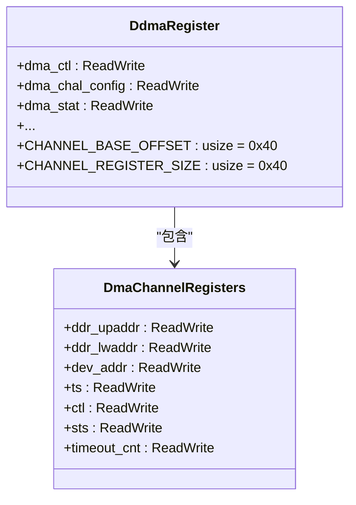
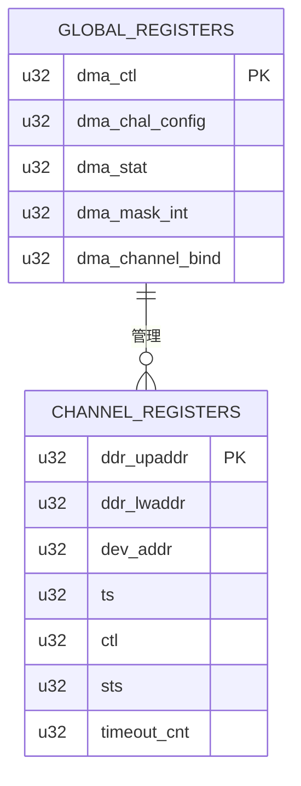
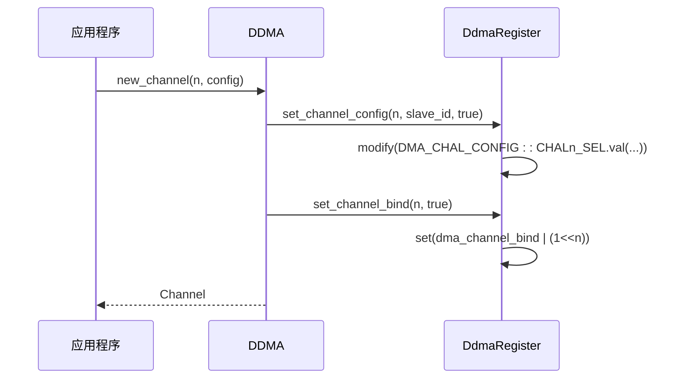

# 寄存器抽象层

<cite>
**Referenced Files in This Document**  
- [lib.rs](file://src/lib.rs)
- [reg.rs](file://src/reg.rs)
- [chan.rs](file://src/chan.rs)
</cite>

## 目录
1. [引言](#引言)
2. [寄存器抽象机制](#寄存器抽象机制)
3. [全局寄存器结构与功能](#全局寄存器结构与功能)
4. [通道级寄存器结构](#通道级寄存器结构)
5. [DdmaRegister扩展方法分析](#ddmaregister扩展方法分析)
6. [中断处理与CompletedChannels设计](#中断处理与completedchannels设计)
7. [原子性寄存器操作](#原子性寄存器操作)
8. [代码安全性与可维护性](#代码安全性与可维护性)

## 引言

本项目实现了一个基于tock-registers库的飞腾DDMA（双通道DMA）控制器硬件寄存器抽象层。该抽象层通过Rust宏系统将物理寄存器布局安全地映射为类型化的接口，为底层驱动开发提供了内存安全、类型安全且易于使用的API。核心目标是封装复杂的位操作和内存偏移计算，同时保证零成本抽象下的高性能。

**Section sources**
- [lib.rs](file://src/lib.rs#L1-L289)

## 寄存器抽象机制

### register_structs! 宏应用

`register_structs!` 宏用于定义内存映射的寄存器块结构体。在本项目中，它被用来声明两个关键结构体：`DdmaRegister` 和 `DmaChannelRegisters`。该宏接受一个DSL语法，明确指定每个寄存器字段的名称、类型以及相对于结构体基地址的字节偏移量。

对于 `DmaChannelRegisters`，其大小被定义为 `0x40` 字节（64字节），并包含从 `ddr_upaddr` (偏移 0x00) 到 `timeout_cnt` (偏移 0x20) 的多个寄存器，末尾有保留空间以确保正确的对齐和大小。

`DdmaRegister` 结构体代表整个DMA控制器的寄存器组，其起始地址包含全局控制寄存器 `dma_ctl` (偏移 0x00)，并通过 `_channel_registers` 占位符预留了从偏移 0x40 开始的通道寄存器区域。

### register_bitfields! 宏应用

`register_bitfields!` 宏用于为特定的寄存器（通常为u32类型）定义位字段。它允许开发者以类型安全的方式访问寄存器中的特定位或位域，避免了易错的手动位掩码操作。

例如，`DMA_CTL` 寄存器被定义为包含 `DMA_ENABLE` (第0位) 和 `DMA_SRST` (第1位) 等位字段。这使得代码可以使用 `reg.dma_ctl.modify(DMA_CTL::DMA_ENABLE::SET)` 这样的语句，而不是直接操作原始数值 `reg.dma_ctl.set(1)`，极大地提高了代码的可读性和正确性。

**Diagram sources**
- [reg.rs](file://src/reg.rs#L230-L258)
- [reg.rs](file://src/reg.rs#L6-L228)

**Section sources**
- [reg.rs](file://src/reg.rs#L6-L258)

## 全局寄存器结构与功能

全局寄存器位于 `DdmaRegister` 结构体的低地址区域，负责控制器的整体配置和状态监控。

### DMA_CTL (控制寄存器, 偏移 0x00)
此寄存器是控制器的主开关。
- **DMA_ENABLE**: 第0位，置1时启动整个DMA控制器。
- **DMA_SRST**: 第1位，置1后立即复位控制器，需再清零以完成复位流程。

### DMA_STAT (状态寄存器, 偏移 0x08)
反映各通道的传输完成状态。
- **CHALn_SEL**: 每隔4位对应一个通道（如CHAL0_SEL在第0位，CHAL1_SEL在第4位）。当某通道传输完成时，对应位被硬件置1。软件可通过写1来清除该位。

### DMA_MASK_INT (中断屏蔽寄存器, 偏移 0x0C)
控制各通道中断的使能。
- **CHALn_MASK**: 每个通道一位，值为1时表示屏蔽（禁用）该通道的中断输出。
- **GLOBAL_EN**: 第31位，全局中断使能位。

### DMA_CHANNEL_BIND (绑定寄存器, 偏移 0x20)
记录通道与外设的绑定关系。
- **DMA_CHANNEL_BIND**: 低8位，每位对应一个通道。1表示该通道已绑定到某个外设的DMA请求信号。

**Diagram sources**
- [reg.rs](file://src/reg.rs#L6-L228)

**Section sources**
- [reg.rs](file://src/reg.rs#L6-L228)

## 通道级寄存器结构

每个DMA通道拥有独立的寄存器块，由 `DmaChannelRegisters` 结构体描述，从 `DdmaRegister` 的 `0x40` 偏移处开始，每通道占用 `0x40` 字节。

### DMA_CHALX_CTL (通道控制寄存器, 偏移 0x18)
控制单个通道的行为。
- **CHALX_EN**: 第0位，通道使能位。
- **CHALX_SRST**: 第1位，通道软复位位。
- **CHALX_MODE**: 第2位，传输模式。0为内存到设备(TX)，1为设备到内存(RX)。

### DMA_CHALX_STS (通道状态寄存器, 偏移 0x1C)
提供通道内部FIFO的状态。
- **FIFO_FULL**: FIFO满标志。
- **FIFO_EMPTY**: FIFO空标志。

### DMA_CHALX_TIMEOUT_CNT (超时计数寄存器, 偏移 0x20)
配置通道的超时机制。
- **TIMEOUT_EN**: 第31位，超时使能。
- **TIMEOUT_CNT**: 低30位，超时阈值。

**Section sources**
- [reg.rs](file://src/reg.rs#L6-L228)

## DdmaRegister扩展方法分析

`DdmaRegister` 实现了一系列安全的封装方法，避免了直接的位操作。

### set_channel_config()
该方法根据通道号动态选择 `dma_chal_config` 或 `dma_chal_config1` 寄存器，并使用 `modify()` 方法原子地设置通道的选择源（`sel`）和使能标志（`enable`）。这隐藏了通道0-3和4-7分别位于不同寄存器的复杂性。

### is_channel_complete() 与 clear_channel_complete()
这两个方法通过匹配通道号，检查或清除 `DMA_STAT` 寄存器中对应的完成位。它们提供了比直接读取 `dma_stat` 更清晰、更不易出错的接口。

### set_channel_interrupt_mask()
类似地，此方法封装了对 `DMA_MASK_INT` 寄存器中8个通道中断屏蔽位的操作，使调用者无需关心具体的位位置。

**Diagram sources**
- [lib.rs](file://src/lib.rs#L100-L150)
- [reg.rs](file://src/reg.rs#L300-L400)

**Section sources**
- [reg.rs](file://src/reg.rs#L300-L400)

## 中断处理与CompletedChannels设计

中断处理由 `IrqHandler` 结构体负责。`handle_irq()` 方法读取 `dma_stat` 寄存器，检查所有8个通道的完成位，并构建一个 `CompletedChannels` 实例。

`CompletedChannels` 使用一个8位的 `u8` 类型作为位掩码 (`channels`) 来存储已完成的通道信息。这种设计非常高效：
- **空间效率**: 仅用1字节即可表示8个通道的状态。
- **时间效率**: 可以通过一次按位与操作快速查询任意通道是否完成。
- **类型安全**: 封装了位操作，对外提供 `is_channel_completed()` 和 `bitmask()` 等安全接口。

**Section sources**
- [lib.rs](file://src/lib.rs#L200-L250)

## 原子性寄存器操作

本抽象层大量使用了 `tock_registers` 库提供的原子操作方法，这对于多线程或中断环境至关重要。

- **modify()**: 执行“读-修改-写”操作，保证整个过程的原子性。例如，在设置通道配置时，会同时更新选择源和使能标志，防止中间状态被其他代码观察到。
- **is_set()**: 原子地检查特定位是否被置位，常用于轮询等待或状态判断。
- **set()**: 直接写入整个寄存器值，用于需要完全覆盖的情况（如清除所有中断状态）。

这些方法有效避免了竞态条件，确保了在并发访问硬件寄存器时的数据一致性。

**Section sources**
- [reg.rs](file://src/reg.rs#L300-L400)

## 代码安全性与可维护性

此寄存器抽象层在性能和安全性之间取得了极佳的平衡。

- **内存安全**: 使用 `NonNull` 指针和引用，避免了空指针解引用。`unsafe` 代码被严格限制在必要的地方（如指针转换），并在外部提供了安全的接口。
- **类型安全**: `register_bitfields!` 宏确保了只能以预定义的方式操作寄存器位，杜绝了非法的位值。
- **可维护性**: 清晰的模块划分（`reg.rs` 定义寄存器，`chan.rs` 定义通道逻辑，`lib.rs` 提供高层API）和详尽的文档注释，使得代码易于理解和修改。
- **性能**: 所有宏都在编译期展开，生成的代码与手写的汇编或C代码性能相当，实现了零成本抽象。

综上所述，该抽象层成功地将复杂的硬件交互转化为直观、安全且高效的Rust API，是嵌入式系统开发中优秀的设计范例。

**Section sources**
- [lib.rs](file://src/lib.rs#L1-L289)
- [reg.rs](file://src/reg.rs#L1-L480)
- [chan.rs](file://src/chan.rs#L1-L149)