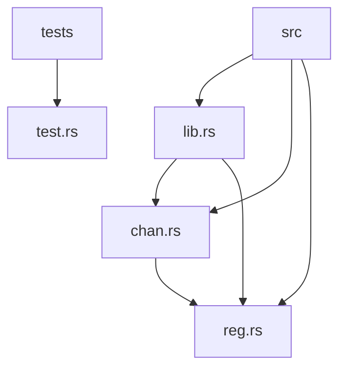
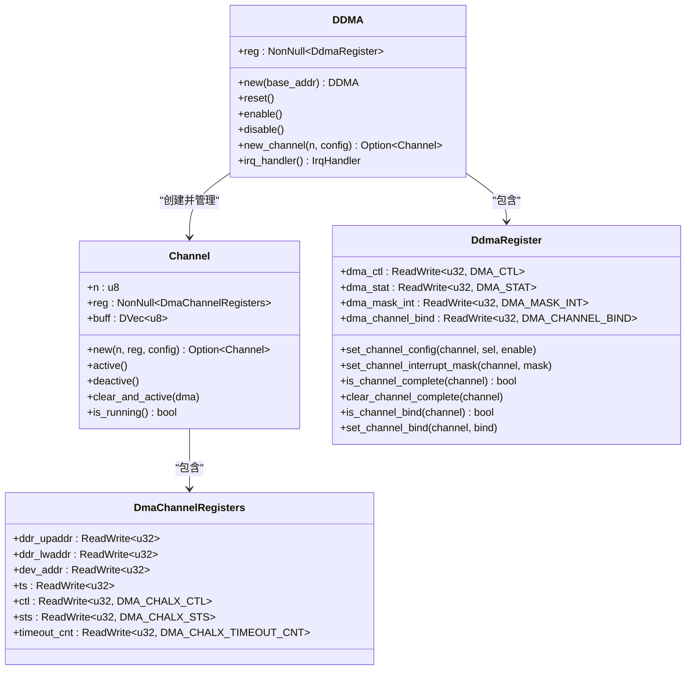
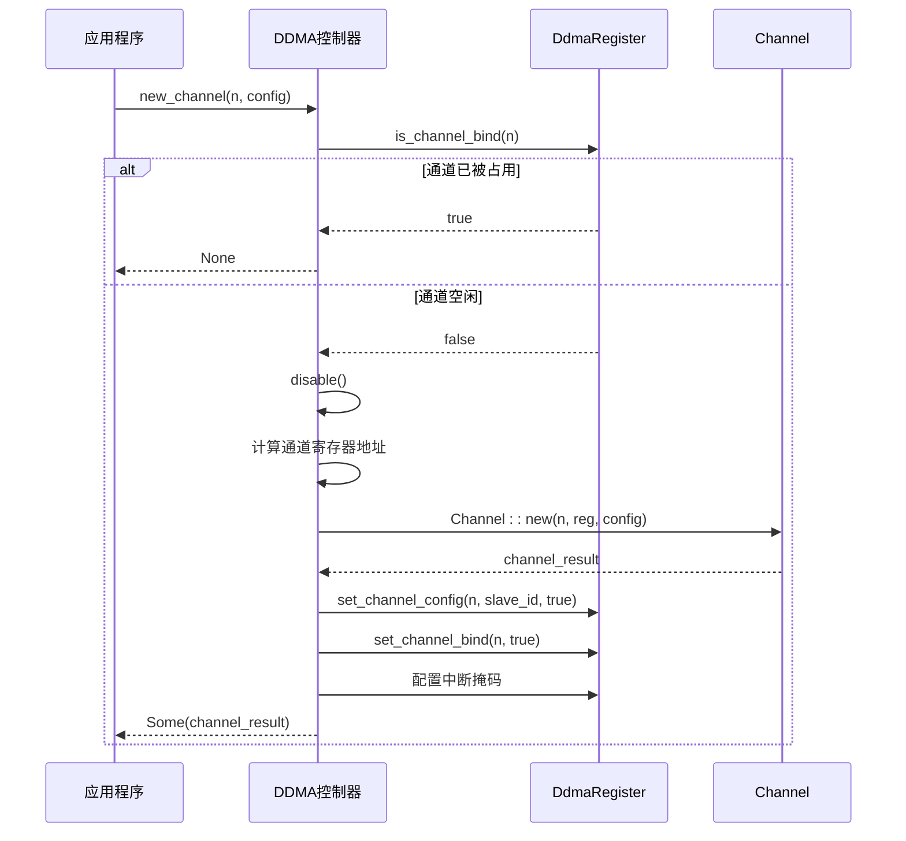
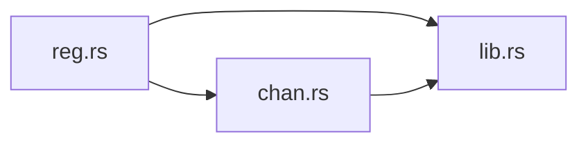

# 技术架构与设计原理

<cite>
**本文档引用的文件**  
- [lib.rs](file://src/lib.rs)
- [chan.rs](file://src/chan.rs)
- [reg.rs](file://src/reg.rs)
</cite>

## 目录
1. [引言](#引言)
2. [项目结构](#项目结构)
3. [核心组件](#核心组件)
4. [架构概述](#架构概述)
5. [详细组件分析](#详细组件分析)
6. [依赖关系分析](#依赖关系分析)
7. [性能与安全性考量](#性能与安全性考量)
8. [中断处理机制](#中断处理机制)
9. [设计决策与优势](#设计决策与优势)
10. [结论](#结论)

## 引言

飞腾DDMA（Direct Memory Access）驱动是为嵌入式系统设计的高性能DMA控制器驱动，采用Rust语言编写，遵循`no_std`环境要求，适用于资源受限的底层系统。该驱动通过分层架构实现了对硬件的高效抽象，确保了代码的安全性、可维护性和可扩展性。本技术文档将深入剖析其软件架构设计，重点阐述硬件抽象层（HAL）模式的实现方式，解析`lib.rs`、`chan.rs`和`reg.rs`三个核心模块之间的协作机制与设计哲学。

## 项目结构

飞腾DDMA驱动采用典型的Rust库结构，源码位于`src/`目录下，包含三个核心模块：`lib.rs`作为顶层控制器协调整个系统，`chan.rs`封装DMA通道的生命周期管理，`reg.rs`则利用`tock-registers`库安全地定义和操作底层硬件寄存器。测试代码位于`tests/`目录，验证驱动功能的正确性。

**图示来源**
- [lib.rs](file://src/lib.rs)
- [chan.rs](file://src/chan.rs)
- [reg.rs](file://src/reg.rs)

**本节来源**
- [lib.rs](file://src/lib.rs)
- [chan.rs](file://src/chan.rs)
- [reg.rs](file://src/reg.rs)

## 核心组件

本驱动的核心由三个Rust模块构成，形成清晰的分层架构：`reg.rs`提供最底层的寄存器抽象，`chan.rs`在通道级别进行封装，而`lib.rs`作为顶层控制器，对外提供统一的DDMA系统接口。这种分层设计有效隔离了硬件细节，提高了代码的可读性和可维护性。

**本节来源**
- [lib.rs](file://src/lib.rs#L52)
- [chan.rs](file://src/chan.rs#L8)
- [reg.rs](file://src/reg.rs#L258)

## 架构概述

飞腾DDMA驱动采用经典的硬件抽象层（HAL）设计模式，构建了一个清晰的三层架构。顶层是`DDMA`控制器，负责全局状态管理和通道分配；中间层是`Channel`实体，代表一个独立的DMA数据流；底层是`DdmaRegister`和`DmaChannelRegisters`，通过`tock-registers`库安全地映射和操作物理寄存器。

**图示来源**
- [lib.rs](file://src/lib.rs#L52)
- [chan.rs](file://src/chan.rs#L8)
- [reg.rs](file://src/reg.rs#L258)

## 详细组件分析

### lib.rs：DDMA控制器与顶层协调

`lib.rs`模块定义了`DDMA`结构体，作为整个DMA系统的顶层控制器。它通过`NonNull`指针安全地持有对内存映射寄存器块的引用，实现了对全局状态的集中管理。`DDMA`负责控制器的初始化（`reset`）、使能/禁用（`enable`/`disable`）、以及最关键的通道分配（`new_channel`）。在创建新通道时，`DDMA`会首先检查`dma_channel_bind`寄存器，利用`Option`类型防止通道被重复分配，这是确保资源安全的关键设计。

**图示来源**
- [lib.rs](file://src/lib.rs#L104-L136)
- [reg.rs](file://src/reg.rs#L419-L439)

**本节来源**
- [lib.rs](file://src/lib.rs#L52-L288)

### chan.rs：通道生命周期管理

`chan.rs`模块封装了单个DMA通道的完整生命周期。`Channel`结构体不仅包含指向其专属寄存器块的`NonNull`指针，还管理着一个用于DMA传输的缓冲区`DVec<u8>`。`Channel`的`new`方法在创建时会进行严格的参数校验，包括DDR地址和传输大小的4字节对齐检查。`active`和`deactive`方法通过修改`ctl`寄存器中的`CHALX_EN`位来控制通道的启停。`clear_and_active`方法遵循硬件参考手册的建议，在激活前清除可能的挂起中断，确保操作的原子性。

**本节来源**
- [chan.rs](file://src/chan.rs#L8-L147)

### reg.rs：安全的硬件寄存器抽象

`reg.rs`模块是整个驱动安全性的基石。它利用`tock-registers`库的`register_bitfields!`和`register_structs!`宏，将复杂的硬件寄存器定义为类型安全的Rust结构。例如，`DMA_CTL`寄存器被定义为包含`DMA_ENABLE`和`DMA_SRST`等具名字段的位域，开发者无需手动进行位操作。`DdmaRegister`结构体则通过`register_structs!`宏，将物理内存地址映射为具有明确字段的Rust结构体，如`dma_ctl`、`dma_stat`等。所有对寄存器的读写都通过`ReadWrite`和`ReadOnly`类型进行，确保了内存访问的安全性。尽管底层使用了`unsafe`代码来操作物理内存，但向上层提供的`set_channel_config`、`is_channel_complete`等方法都是安全的API。

**本节来源**
- [reg.rs](file://src/reg.rs#L0-L480)

## 依赖关系分析

驱动内部的模块依赖关系清晰且单向，形成了稳固的分层结构。`lib.rs`依赖`chan.rs`和`reg.rs`，`chan.rs`依赖`reg.rs`，而`reg.rs`不依赖其他模块。`DDMA`控制器通过`NonNull<reg::DdmaRegister>`指针访问全局寄存器，而`Channel`则通过`NonNull<DmaChannelRegisters>`访问其专属的通道寄存器。这种依赖关系确保了高层模块可以安全地调用底层模块的功能，而底层模块的变更不会直接影响高层逻辑。

**图示来源**
- [lib.rs](file://src/lib.rs)
- [chan.rs](file://src/chan.rs)
- [reg.rs](file://src/reg.rs)

**本节来源**
- [lib.rs](file://src/lib.rs)
- [chan.rs](file://src/chan.rs)
- [reg.rs](file://src/reg.rs)

## 性能与安全性考量

该驱动在性能和安全性之间取得了良好平衡。安全性方面，大量使用`Option`类型处理可能的错误（如通道已占用、缓冲区分配失败），避免了空指针解引用。`tock-registers`库确保了所有寄存器操作的类型安全。性能方面，驱动直接操作硬件寄存器，避免了不必要的中间层开销。`spin_loop`的使用确保了在复位等关键操作上的同步。`debug_registers`和`debug_status`等调试方法提供了强大的运行时诊断能力，有助于快速定位问题。

**本节来源**
- [chan.rs](file://src/chan.rs#L70-L75)
- [lib.rs](file://src/lib.rs#L170-L175)

## 中断处理机制

中断处理由`IrqHandler`结构体和`CompletedChannels`位掩码共同实现。`DDMA`的`irq_handler`方法返回一个`IrqHandler`实例，该实例持有对寄存器的引用。当发生中断时，`handle_irq`方法读取`dma_stat`寄存器，检查`CHAL0_SEL`到`CHAL7_SEL`的每一位，将所有完成的通道号记录在一个`u8`类型的`channels`字段中，并返回`CompletedChannels`对象。最后，通过向`dma_stat`写入全1来清除所有完成状态。这种位掩码设计高效地处理了多通道并发完成的场景。

**本节来源**
- [lib.rs](file://src/lib.rs#L217-L288)

## 设计决策与优势

本驱动的设计体现了多个关键决策：
1.  **分层抽象**：`reg` -> `chan` -> `lib`的三层结构清晰分离了关注点，提高了代码的可维护性。
2.  **安全优先**：通过`tock-registers`和`Option`类型，将不安全的硬件交互封装在安全的API之下。
3.  **资源管理**：利用`dma_channel_bind`寄存器和`Option`返回值，有效防止了通道的重复分配。
4.  **遵循硬件规范**：代码中的注释多次提到“following C reference”，表明其严格遵循了硬件参考手册的操作序列。

这种设计使得驱动既具备了直接操作硬件的高性能，又拥有了Rust语言带来的内存安全和类型安全优势，是嵌入式系统开发的典范。

**本节来源**
- [lib.rs](file://src/lib.rs)
- [chan.rs](file://src/chan.rs)
- [reg.rs](file://src/reg.rs)

## 结论

飞腾DDMA驱动通过精巧的分层架构和Rust语言的特性，成功实现了对复杂DMA硬件的安全、高效抽象。`reg.rs`提供了安全的寄存器访问，`chan.rs`封装了通道的生命周期，`lib.rs`则作为协调者管理全局资源。各模块间通过清晰的依赖关系和安全的API进行交互，`NonNull`指针和`tock-registers`库的结合既保证了性能又确保了安全。`Option`类型和位掩码`CompletedChannels`等设计进一步提升了代码的健壮性和效率。该驱动的设计模式为其他硬件驱动的开发提供了优秀的参考范例。