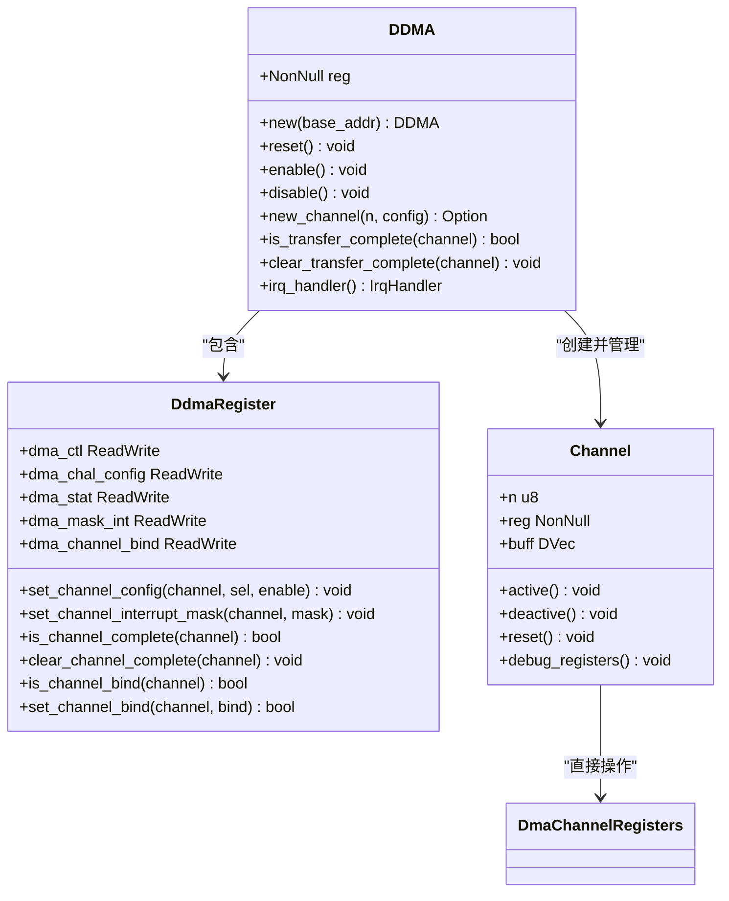
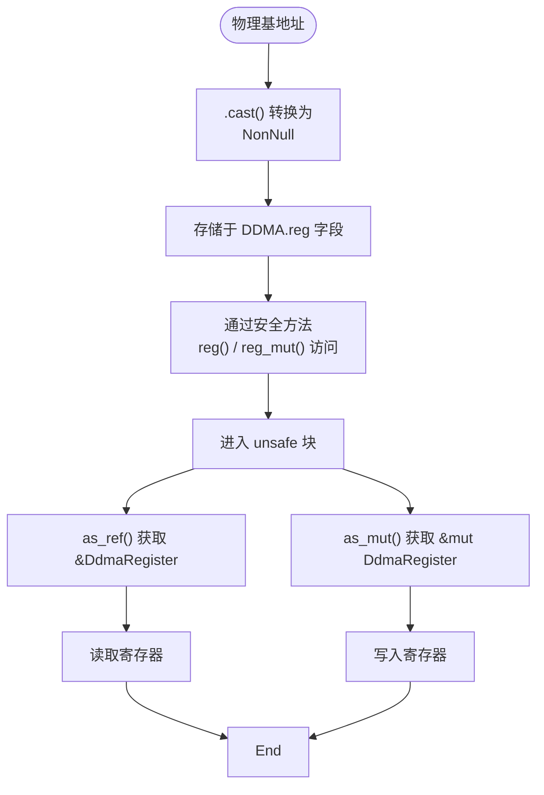
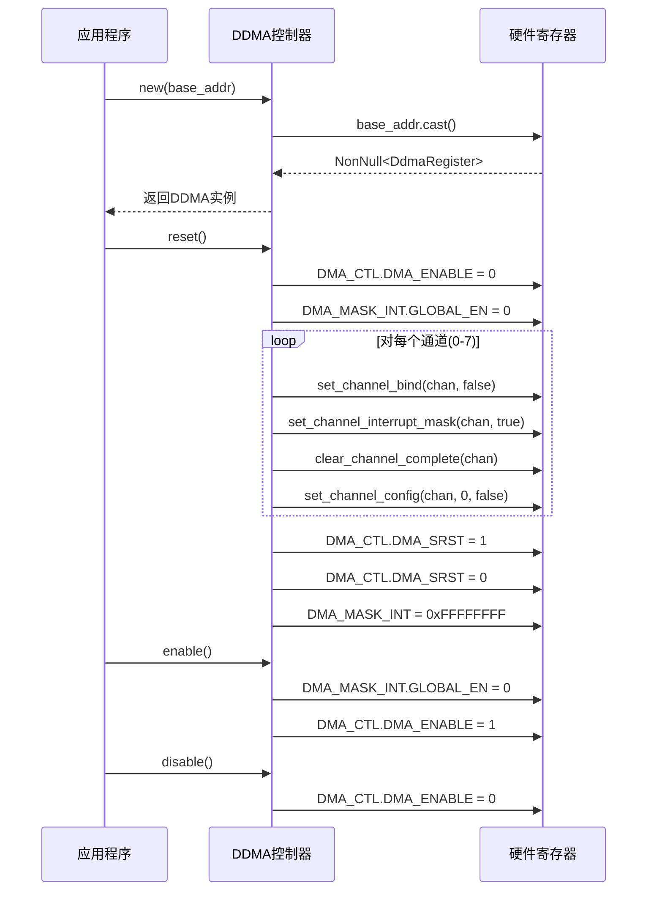
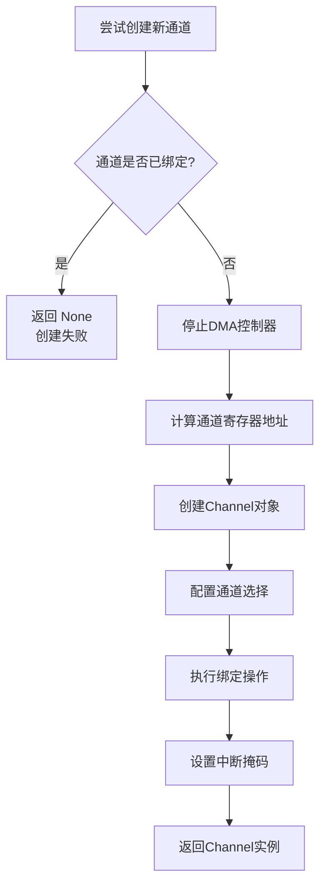

# 控制器架构

<cite>
**本文档引用的文件**
- [lib.rs](file://src/lib.rs)
- [reg.rs](file://src/reg.rs)
- [chan.rs](file://src/chan.rs)
- [test.rs](file://tests/test.rs)
</cite>

## 目录
1. [引言](#引言)
2. [DDMA控制器结构体设计](#ddma控制器结构体设计)
3. [寄存器内存映射与unsafe访问机制](#寄存器内存映射与unsafe访问机制)
4. [控制器生命周期管理](#控制器生命周期管理)
5. [通道绑定与资源管理](#通道绑定与资源管理)
6. [中断与状态集中管理](#中断与状态集中管理)
7. [初始化工作流与错误处理](#初始化工作流与错误处理)
8. [结论](#结论)

## 引言

DDMA（Dual-channel Direct Memory Access）控制器是飞腾平台DMA子系统的核心管理实体，负责协调和控制整个DMA系统的运行。该控制器通过一个顶层结构体`DDMA`实现，封装了对硬件寄存器的底层访问，并提供了安全、高效的API供上层调用。本文档深入剖析其架构设计，重点阐述其如何作为中央枢纽管理通道资源、执行软复位、控制全局使能以及处理中断等关键功能。

**Section sources**
- [lib.rs](file://src/lib.rs#L52-L288)

## DDMA控制器结构体设计

`DDMA`结构体是整个DMA系统的顶层管理实体，其核心职责是作为所有DMA操作的入口点和协调中心。该结构体的设计体现了清晰的分层架构，将复杂的硬件交互抽象为简洁的软件接口。



**Diagram sources**
- [lib.rs](file://src/lib.rs#L52-L288)
- [reg.rs](file://src/reg.rs#L0-L480)

**Section sources**
- [lib.rs](file://src/lib.rs#L52-L288)

## 寄存器内存映射与unsafe访问机制

`DDMA`结构体的核心字段`reg`是一个指向`DdmaRegister`类型的`NonNull`指针，它代表了DMA控制器在物理内存中的寄存器块映射。这种设计允许驱动程序直接读写硬件寄存器，从而实现对DMA控制器的精确控制。

### 内存映射机制
- **物理基地址转换**：`new()`方法接收一个指向u8类型的`NonNull`指针（即物理基地址），并通过`.cast()`将其转换为指向`DdmaRegister`结构体的指针。
- **偏移量计算**：每个DMA通道拥有独立的寄存器块，位于主控制器寄存器之后。通过`CHANNEL_BASE_OFFSET`和`CHANNEL_REGISTER_SIZE`常量，可以准确计算出任意通道寄存器的内存地址。

### unsafe操作的安全性保障
尽管涉及`unsafe`代码，但该设计通过以下方式确保安全性：
1. **不可空指针保证**：使用`NonNull<T>`而非裸指针，从类型层面杜绝了空指针解引用的风险。
2. **封装隔离**：所有`unsafe`操作都被严格限制在`reg()`和`reg_mut()`等私有方法内部，外部API完全安全。
3. **单次转换原则**：物理地址到寄存器结构体的转换仅在`new()`中进行一次，后续操作均基于已验证的指针。



**Diagram sources**
- [lib.rs](file://src/lib.rs#L60-L63)
- [reg.rs](file://src/reg.rs#L290-L480)

**Section sources**
- [lib.rs](file://src/lib.rs#L60-L63)
- [reg.rs](file://src/reg.rs#L290-L480)

## 控制器生命周期管理

DDMA控制器提供了一套完整的生命周期管理方法，用于初始化、启用、禁用和重置整个DMA系统。

### new() - 初始化控制器
`new()`方法是控制器的构造函数，它接受一个物理基地址作为参数，并将其转换为指向寄存器结构体的指针。这是所有DMA操作的前提。

### reset() - 执行软复位
`reset()`方法执行全面的软复位，确保控制器处于已知的初始状态：
1. **全局禁用**：首先清除`DMA_CTL`寄存器中的`DMA_ENABLE`位，停止所有DMA活动。
2. **中断屏蔽**：禁用全局中断输出，防止在重置过程中产生意外中断。
3. **通道清理**：遍历所有8个通道，解除绑定、屏蔽中断、清除完成标志并重置配置。
4. **软件复位**：设置并清除`DMA_SRST`位，触发控制器内部的软复位逻辑。
5. **中断全掩码**：最后将`DMA_MASK_INT`寄存器设为全1，确保所有通道中断被屏蔽。

### enable()/disable() - 全局使能控制
- `enable()`：先取消全局中断屏蔽（`GLOBAL_EN::CLEAR`），然后设置`DMA_ENABLE`位来启动控制器。
- `disable()`：直接清除`DMA_ENABLE`位以立即停止所有正在进行的传输。



**Diagram sources**
- [lib.rs](file://src/lib.rs#L64-L107)

**Section sources**
- [lib.rs](file://src/lib.rs#L64-L107)

## 通道绑定与资源管理

控制器通过`bind/unbind`机制实现对DMA通道的资源管理，确保通道不会被重复分配或冲突使用。

### 绑定机制 (bind/unbind)
- **绑定过程**：当通过`new_channel()`成功创建通道时，控制器会自动调用`set_channel_bind(channel, true)`，在`DMA_CHANNEL_BIND`寄存器中设置对应的位，标记该通道已被占用。
- **解绑过程**：`reset()`方法会检查每个通道的绑定状态，若已绑定则调用`set_channel_bind(channel, false)`进行解绑。

### 资源管理策略
1. **唯一性保证**：`new_channel()`在创建新通道前，会调用`is_channel_bind()`检查目标通道是否已被占用。若已占用，则返回`None`，防止重复分配。
2. **原子性操作**：绑定状态由硬件寄存器直接维护，避免了软件层面的竞争条件。
3. **集中式管理**：所有通道的绑定状态查询和修改都通过控制器统一进行，实现了资源的集中管控。



**Diagram sources**
- [lib.rs](file://src/lib.rs#L108-L150)

**Section sources**
- [lib.rs](file://src/lib.rs#L108-L150)

## 中断与状态集中管理

DDMA控制器作为中央管理实体，负责集中处理所有与中断和状态相关的操作，有效防止了资源竞争。

### 中断管理
- **中断屏蔽**：`set_channel_interrupt_mask()`方法允许单独控制每个通道的中断输出。`true`表示屏蔽（禁用），`false`表示取消屏蔽（启用）。
- **中断处理**：`irq_handler()`方法返回一个`IrqHandler`实例，该实例的`handle_irq()`方法会读取`DMA_STAT`寄存器，解析哪些通道完成了传输，并返回一个`CompletedChannels`位掩码。

### 状态查询
- **传输完成查询**：`is_transfer_complete(channel)`方法通过检查`DMA_STAT`寄存器中对应位的状态，判断指定通道的传输是否完成。
- **状态清除**：`clear_transfer_complete(channel)`方法向`DMA_STAT`寄存器的对应位写1，以清除完成状态（根据硬件规范，写1清零）。

这些集中式的管理方法确保了对共享寄存器的访问是串行化的，避免了多个线程或任务同时操作导致的状态不一致问题。

**Section sources**
- [lib.rs](file://src/lib.rs#L152-L245)

## 初始化工作流与错误处理

结合测试代码，可以梳理出典型的DDMA初始化和使用工作流，并分析其错误处理逻辑。

### 初始化工作流
1. **获取物理地址**：通过设备树或其他机制获取DMA控制器的物理基地址和内存区域大小。
2. **内存映射**：使用`iomap`将物理地址映射到虚拟地址空间。
3. **创建控制器**：调用`DDMA::new(base)`创建控制器实例。
4. **执行复位**：调用`reset()`方法初始化控制器。
5. **创建通道**：调用`new_channel()`分配并配置一个DMA通道。
6. **注册中断**：获取`IrqHandler`并注册中断服务例程（ISR）。
7. **激活传输**：调用`clear_and_active()`清除状态并激活通道。
8. **启用控制器**：最后调用`enable()`启动整个DMA系统。

### 错误处理逻辑
- **通道重复分配**：当尝试分配一个已被占用的通道时，`new_channel()`会通过`assert!`宏进行参数检查（通道号0-7，外设ID 0-31），并在`is_channel_bind()`检查到已绑定时返回`None`，明确指示分配失败。
- **缓冲区对齐检查**：在`Channel::new()`内部，会对DDR地址和传输块大小进行4字节对齐检查，不符合要求则返回`None`。
- **超时处理**：测试代码中实现了简单的轮询超时机制，若在限定时间内未收到中断，则判定为传输超时，并输出调试信息。

```mermaid
sequenceDiagram
    participant Test as 测试代码
    participant DDMA as DDMA控制器