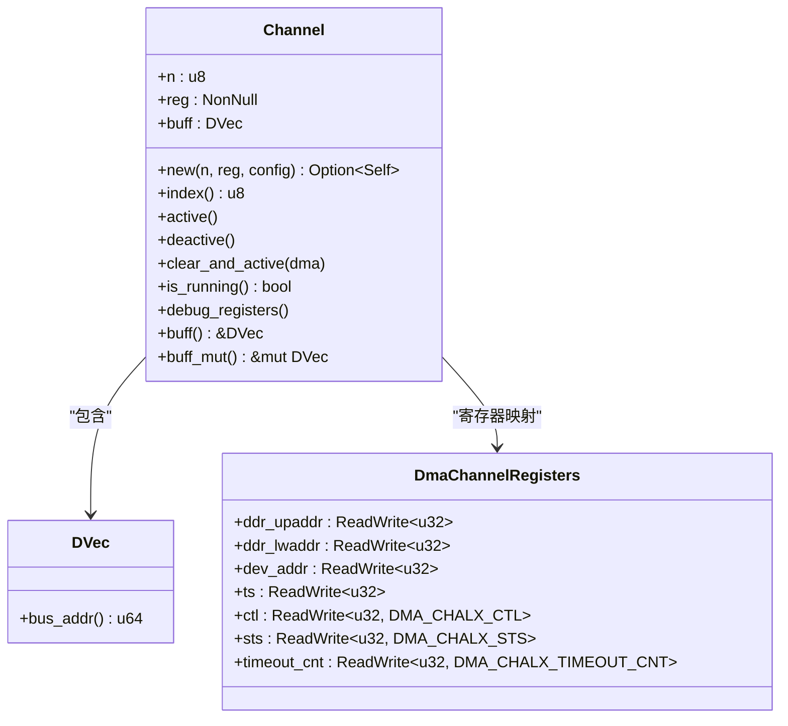
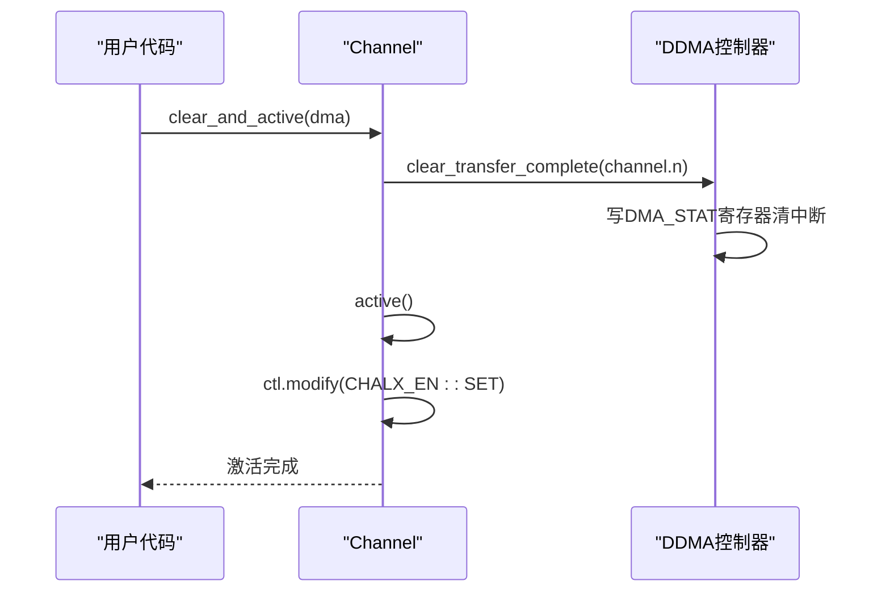

# 通道管理机制

<cite>
**本文档中引用的文件**  
- [chan.rs](file://src/chan.rs)
- [reg.rs](file://src/reg.rs)
- [lib.rs](file://src/lib.rs)
</cite>

## 目录
1. [引言](#引言)
2. [核心组件分析](#核心组件分析)
3. [Channel结构体设计](#channel结构体设计)
4. [ChannelConfig配置结构体](#channelconfig配置结构体)
5. [通道构造函数new()实现流程](#通道构造函数new实现流程)
6. [通道控制方法详解](#通道控制方法详解)
7. [状态监控与调试机制](#状态监控与调试机制)
8. [通道与控制器协作关系](#通道与控制器协作关系)
9. [内存到外设传输配置示例](#内存到外设传输配置示例)
10. [常见陷阱与注意事项](#常见陷阱与注意事项)

## 引言
本文档详细阐述了飞腾DDMA驱动中DMA通道的管理机制，聚焦于`Channel`结构体的设计与实现。通过分析其核心组件、构造函数、控制方法及配置参数，全面揭示通道的初始化、激活、状态监控等关键操作流程。同时说明通道与控制器之间的协作机制，并提供实际配置示例和常见问题规避策略。

## 核心组件分析

**通道管理机制的核心由以下三个关键组件构成：**

- **通道编号n**：标识通道的唯一ID（0-7），用于区分8个独立DMA通道
- **寄存器映射reg**：指向通道专属寄存器块的非空指针，实现对硬件寄存器的直接访问
- **DMA缓冲区buff**：基于DVec实现的DMA安全内存缓冲区，支持总线地址转换和对齐管理

这些组件共同构成了通道运行的基础，其中`reg`通过`NonNull<DmaChannelRegisters>`确保寄存器访问的安全性，`buff`通过`DVec<u8>`提供DMA兼容的内存管理。

**Section sources**
- [chan.rs](file://src/chan.rs#L10-L14)

## Channel结构体设计

`Channel`结构体是DMA通道的核心抽象，封装了通道的所有状态和操作接口：



**Diagram sources**
- [chan.rs](file://src/chan.rs#L10-L14)
- [reg.rs](file://src/reg.rs#L222-L256)

**Section sources**
- [chan.rs](file://src/chan.rs#L10-L14)

## ChannelConfig配置结构体

`ChannelConfig`结构体定义了通道初始化所需的所有配置参数，每个字段具有明确的硬件意义：

| 字段 | 类型 | 硬件意义 | 取值范围 |
|------|------|----------|---------|
| slave_id | u8 | 外设从设备ID，决定DMA请求源 | 0-31 |
| direction | DmaDirection | 传输方向：内存到设备或设备到内存 | MemoryToDevice/DeviceToMemory |
| timeout_count | u32 | 超时计数阈值，用于检测传输异常 | 任意u32值 |
| blk_size | usize | 单次传输的数据块大小（字节） | ≥4且为4的倍数 |
| dev_addr | u32 | 外设端的物理地址 | 32位地址空间 |
| irq | bool | 是否启用传输完成中断通知 | true/false |

该配置在通道创建时被应用，直接影响通道的工作模式和性能特征。

**Section sources**
- [chan.rs](file://src/chan.rs#L17-L23)

## 通道构造函数new()实现流程

`new()`构造函数执行严格的初始化检查和配置流程，确保通道处于正确状态：

```mermaid
flowchart TD
Start([new()调用]) --> ValidateConfig["验证配置参数"]
ValidateConfig --> CheckDDRAlign["检查DDR地址对齐<br/>是否为4字节倍数"]
CheckDDRAlign --> |不满足| ReturnNone["返回None"]
CheckDDRAlign --> |满足| CheckTransferSize["检查传输大小<br/>≥4且为4的倍数"]
CheckTransferSize --> |不满足| ReturnNone
CheckTransferSize --> |满足| CheckChannelStatus["检查通道是否已启用"]
CheckChannelStatus --> |已启用| ResetChannel["执行reset()软复位"]
CheckChannelStatus --> |未启用| ConfigureRegisters["配置寄存器"]
ResetChannel --> ConfigureRegisters
ConfigureRegisters --> SetDDRAddr["设置DDR上下位地址"]
SetDDRAddr --> SetDevAddr["设置外设地址"]
SetDevAddr --> SetTransferSize["设置传输大小TS"]
SetTransferSize --> SetDirection["设置传输方向CTL.MODE"]
SetDirection --> ReturnSuccess["返回Some(Channel)"]
ReturnNone --> End([函数退出])
ReturnSuccess --> End
```

**Diagram sources**
- [chan.rs](file://src/chan.rs#L26-L56)

**Section sources**
- [chan.rs](file://src/chan.rs#L26-L56)

## 通道控制方法详解

### active()方法
激活通道，通过设置控制寄存器中的`CHALX_EN`位启动DMA传输。根据参考实现，应在激活前清除可能的挂起中断。

### deactive()方法
停用通道，清除`CHALX_EN`位以停止DMA传输。此操作不会改变寄存器其他值或FIFO内容。

### clear_and_active()方法
组合操作，先由控制器清除传输完成状态，再激活通道。这种顺序确保了状态的干净启动。



**Diagram sources**
- [chan.rs](file://src/chan.rs#L97-L103)
- [lib.rs](file://src/lib.rs#L170-L216)

**Section sources**
- [chan.rs](file://src/chan.rs#L97-L103)

## 状态监控与调试机制

### is_running()方法
通过读取控制寄存器的`CHALX_EN`位来判断通道是否正在运行，提供实时状态查询能力。

### debug_registers()方法
输出通道所有寄存器的当前值，包括：
- DDR上下位地址
- 外设地址
- 传输大小
- 当前传输地址
- 控制和状态寄存器
- FIFO状态
- 缓冲区总线地址

此方法对于调试传输故障和验证配置正确性至关重要。

**Section sources**
- [chan.rs](file://src/chan.rs#L119-L147)

## 通道与控制器协作关系

通道与DDMA控制器之间存在严格的协作协议：

1. **资源分配**：控制器通过`dma_channel_bind`寄存器跟踪通道占用状态
2. **中断管理**：控制器负责全局中断使能和通道中断屏蔽
3. **状态同步**：控制器维护`DMA_STAT`寄存器反映各通道完成状态
4. **配置协调**：通道初始化需与控制器配置同步进行

特别注意：在激活通道前，必须由控制器调用`clear_transfer_complete()`清除可能的挂起中断，否则可能导致传输异常。

**Section sources**
- [lib.rs](file://src/lib.rs#L135-L168)
- [reg.rs](file://src/reg.rs#L419-L439)

## 内存到外设传输配置示例

以下为内存到外设（Memory to Device）传输的典型配置流程：

```rust
let config = ChannelConfig {
    slave_id: peripheral_ids::UART1_TX,  // UART1发送外设
    direction: DmaDirection::MemoryToDevice,
    timeout_count: 1000,
    blk_size: 64,                        // 64字节传输块
    dev_addr: 0x12345678,               // UART1发送寄存器地址
    irq: true,                          // 启用中断
};
```

关键步骤：
1. 分配DMA安全缓冲区并填充数据
2. 创建通道并应用上述配置
3. 控制器绑定通道并配置中断
4. 调用`clear_and_active()`启动传输

**Section sources**
- [lib.rs](file://src/lib.rs#L280-L288)
- [chan.rs](file://src/chan.rs#L26-L56)

## 常见陷阱与注意事项

### 地址未对齐导致初始化失败
- **问题**：DDR地址或传输大小未按4字节对齐
- **表现**：`new()`函数返回`None`
- **解决**：确保`DVec::zeros()`的对齐参数（128字节）满足要求

### 通道资源冲突
- **问题**：尝试使用已被绑定的通道
- **表现**：`new_channel()`返回`None`
- **解决**：检查`dma_channel_bind`寄存器状态

### 中断未清除导致传输异常
- **问题**：激活前未清除挂起中断
- **表现**：传输立即完成或失败
- **解决**：始终使用`clear_and_active()`而非直接`active()`

### 配置顺序错误
- **问题**：先激活控制器再配置通道
- **表现**：配置可能被忽略
- **解决**：遵循"先停控制器→配置→启动"的顺序

**Section sources**
- [chan.rs](file://src/chan.rs#L30-L38)
- [lib.rs](file://src/lib.rs#L104-L136)