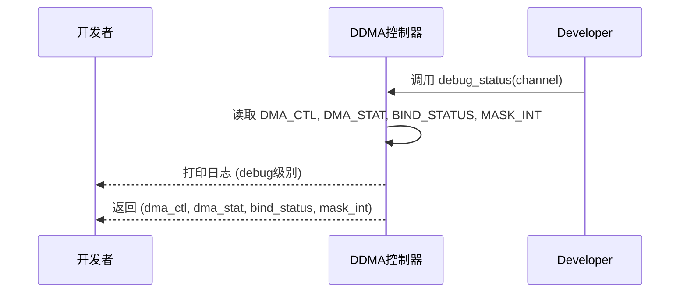

<cite>
**本文档中引用的文件**
- [lib.rs](file://src/lib.rs)
- [reg.rs](file://src/reg.rs)
- [chan.rs](file://src/chan.rs)
</cite>

## 目录
1. [简介](#简介)
2. [核心调试接口](#核心调试接口)
3. [寄存器状态分析](#寄存器状态分析)
4. [日志追踪与诊断](#日志追踪与诊断)
5. [常见问题排查](#常见问题排查)
6. [测试与验证策略](#测试与验证策略)

## 简介

本指南旨在为使用 `phytium-ddma` 驱动的开发者提供一套系统性的调试与故障排查方法。该驱动实现了对飞腾（Phytium）平台DMA控制器的控制，通过分析其内部状态、关键寄存器和日志输出，可以有效诊断传输未启动、中断未触发等常见问题。本文将详细介绍如何利用驱动提供的调试工具进行深层分析。

## 核心调试接口

`phytium-ddma` 驱动提供了多个内置的调试接口，用于在运行时检查控制器和通道的状态。

### 控制器状态检查 (`debug_status`)

`DDMA` 结构体暴露了 `debug_status` 方法，该方法是诊断控制器整体健康状况的核心工具。调用此方法会读取并打印一系列关键全局寄存器的值，包括 `DMA_CTL` 和 `DMA_STAT`，同时返回这些原始值供进一步分析。



**Diagram sources**
- [lib.rs](file://src/lib.rs#L200-L220)

### 通道级状态检查 (`debug_registers`)

除了全局状态，单个DMA通道的内部寄存器也至关重要。`Channel` 结构体提供了 `debug_registers` 方法，它会以 `trace` 级别日志输出该通道所有相关寄存器的当前值，如数据缓冲区地址、设备地址、传输大小和控制状态。

**Section sources**
- [chan.rs](file://src/chan.rs#L118-L148)

## 寄存器状态分析

理解关键寄存器的含义是解读 `debug_status` 输出的基础。

### 全局控制寄存器 (`DMA_CTL`)

位于 `DdmaRegister` 结构体偏移量 `0x00` 处。
- **位 0 (`DMA_ENABLE`)**：控制器使能标志。值为 `1` 表示DMA控制器已启用。如果传输未启动，请首先确认此位是否被正确设置。
- **位 1 (`DMA_SRST`)**：软件复位标志。正常工作状态下应为 `0`。

### 全局状态寄存器 (`DMA_STAT`)

位于 `DdmaRegister` 结构体偏移量 `0x08` 处。
- **位 0, 4, 8, ... (CHALn_SEL)**：通道n的传输完成状态标志。当对应通道的DMA传输完成后，相应的位会被硬件置为 `1`。软件需要写入 `1` 来清除该位。如果预期的中断未触发，检查此寄存器可以确认传输是否真的已完成。

### 通道绑定寄存器 (`DMA_CHANNEL_BIND`)

位于 `DdmaRegister` 结构体偏移量 `0x20` 处。
- **位 0-7**：每个位代表一个通道（0-7）的绑定状态。`1` 表示该通道已成功绑定到一个外设的DMA请求信号。如果 `new_channel` 调用失败或通道无法工作，检查此寄存器可以确认绑定操作是否成功。

```mermaid
erDiagram
DmaController ||--o{ Channel : has 8
DmaController {
u32 dma_ctl PK
u32 dma_stat
u32 dma_mask_int
u32 dma_channel_bind
}
Channel }o--|| DmaController : bound to
Channel {
u8 channel_id PK
u32 ddr_lwaddr
u32 dev_addr
u32 ts
u32 ctl
}
```

**Diagram sources**
- [reg.rs](file://src/reg.rs#L50-L150)
- [reg.rs](file://src/reg.rs#L220-L250)

## 日志追踪与诊断

驱动集成了 `log` crate，通过不同级别的日志宏来追踪执行流程。

### 使用 `trace` 宏

`trace` 宏用于记录非常详细的执行信息，例如：
- 在 `Channel::new` 中，当检测到内存地址未对齐或传输大小无效时，会输出 `trace!` 日志。
- 在 `Channel::reset` 和 `Channel::active` 中，会记录通道的重置和激活过程。

这些日志对于理解代码执行路径和定位初始化阶段的问题非常有帮助。

### 使用 `debug` 宏

`debug` 宏用于输出重要的状态信息，最典型的用法就是在 `debug_status` 方法中，它会格式化并输出控制器的关键寄存器值。开启 `debug` 级别的日志是进行常规状态监控的推荐方式。

**Section sources**
- [lib.rs](file://src/lib.rs#L200-L220)
- [chan.rs](file://src/chan.rs#L3)

## 常见问题排查

以下是针对典型问题的系统性排查步骤。

### 问题一：DMA传输未启动

1.  **检查控制器状态**：调用 `debug_status`，确认 `DMA_CTL` 寄存器的 `DMA_ENABLE` 位是否为 `1`。
2.  **检查通道状态**：调用 `Channel` 的 `is_running` 方法或 `debug_registers`，确认通道的 `CTL` 寄存器中的 `CHALX_EN` 位是否被置起。
3.  **检查基地址映射**：确保传递给 `DDMA::new` 的 `base_addr` 是正确的物理基地址，并且已在操作系统或固件中正确映射到虚拟内存空间。

### 问题二：中断未触发

1.  **检查中断使能**：确认在创建 `ChannelConfig` 时，`irq` 字段被设置为 `true`。
2.  **检查中断屏蔽**：调用 `debug_status`，检查 `MASK_INT` 寄存器中对应通道的掩码位是否为 `0`（表示未屏蔽）。
3.  **检查传输完成状态**：调用 `debug_status`，直接读取 `DMA_STAT` 寄存器，看对应的 `CHALn_SEL` 位是否为 `1`。如果为 `1` 但中断未到达，则问题可能出在中断线连接或上层中断处理程序；如果为 `0`，则传输本身可能未完成。
4.  **验证中断线连接**：确保硬件上的中断引脚已正确连接，并且中断号在系统中配置无误。

### 问题三：通道绑定失败

1.  **检查外设ID配置**：确认 `ChannelConfig` 中的 `slave_id` 是否正确。例如，若要为UART0 RX配置DMA，应使用 `peripheral_ids::UART0_RX`。
2.  **检查通道占用**：在调用 `new_channel` 前，驱动会检查 `DMA_CHANNEL_BIND` 寄存器。如果目标通道已被占用，`new_channel` 会返回 `None` 并在 `trace` 日志中提示“Channel X is already in use”。
3.  **检查控制器状态**：根据代码逻辑，在创建新通道前会先禁用整个DMA控制器。确保没有其他并发操作干扰此流程。

**Section sources**
- [lib.rs](file://src/lib.rs#L100-L150)
- [lib.rs](file://src/lib.rs#L250-L280)

## 测试与验证策略

为了高效地开发和调试，建议采用分层的测试策略。

### 使用QEMU模拟器进行初步测试

在拥有真实硬件之前，可以使用QEMU等模拟器加载包含此驱动的内核或固件。这可以验证驱动的初始化、内存分配和基本API调用逻辑是否正确，避免将问题归咎于硬件。

### 结合硬件调试工具进行深层分析

当在真实硬件上遇到复杂问题时，应结合专业的硬件调试工具：
- **逻辑分析仪**：可用于捕获DMA请求信号（`dma_req`）和中断信号（`irq`），直观地验证信号时序和电平是否符合预期。
- **JTAG调试器**：可以深入到芯片内部，检查总线访问和更底层的寄存器状态，适用于解决由总线竞争或时钟域问题引起的疑难杂症。

通过结合软件调试接口和硬件调试工具，可以构建一个完整的诊断体系，快速定位并解决 `phytium-ddma` 驱动的各种问题。