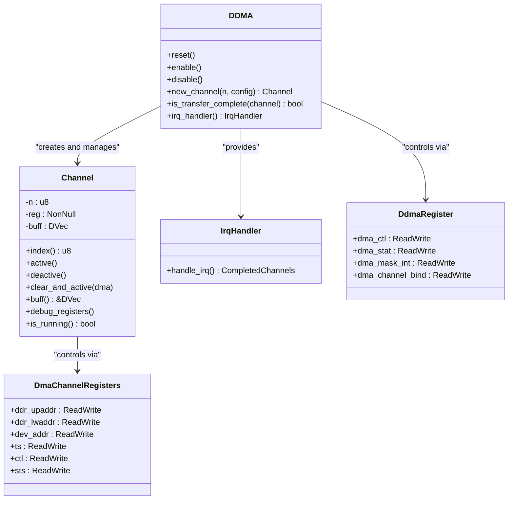

<cite>
**本文档中引用的文件**
- [README.md](file://README.md)
- [Cargo.toml](file://Cargo.toml)
- [src/lib.rs](file://src/lib.rs)
- [src/chan.rs](file://src/chan.rs)
- [src/reg.rs](file://src/reg.rs)
</cite>

## 目录
1. [项目概述](#项目概述)
2. [核心特性与功能](#核心特性与功能)
3. [架构设计与实现](#架构设计与实现)
4. [依赖库分析](#依赖库分析)
5. [目标用户与应用场景](#目标用户与应用场景)
6. [硬件与平台要求](#硬件与平台要求)

## 项目概述

`phytium-ddma` 是一个专为飞腾（Phytium）系列芯片的直接内存访问（DDMA）控制器开发的 Rust 驱动程序。该项目旨在为嵌入式系统和操作系统底层开发提供一个高性能、安全且可靠的 DMA 数据传输解决方案。其核心目标是抽象化飞腾 DDMA 硬件的复杂性，通过一个类型安全、内存安全的 Rust API，使开发者能够高效地在内存与外设之间进行大规模数据搬运，从而显著提升系统性能并降低 CPU 负载。

该驱动的设计哲学根植于现代系统编程的最佳实践，它不仅关注功能的实现，更强调代码的安全性、可维护性和对底层硬件的精确控制。作为 `arceos_drivers` 驱动集合的一部分，`phytium-ddma` 为构建基于飞腾芯片的现代化、模块化操作系统提供了关键的基础设施支持。

**Section sources**
- [README.md](file://README.md#L1-L10)
- [src/lib.rs](file://src/lib.rs#L1-L20)

## 核心特性与功能

`phytium-ddma` 驱动具备一系列强大的特性，使其成为处理高速数据流的理想选择。

### 多通道与双向传输
驱动原生支持 **8 个独立的 DMA 通道**，允许并发执行多个数据传输任务，极大地提升了系统的并行处理能力。每个通道都支持全双工操作，即可以在 **内存到外设 (Memory-to-Device)** 和 **外设到内存 (Device-to-Memory)** 两个方向上进行数据传输。这种灵活性使得驱动可以无缝集成到各种需要与 UART、SPI、网络控制器等外设通信的应用场景中。

### 灵活的传输模式
为了适应不同的应用需求，驱动提供了两种主要的传输完成通知机制：
*   **中断模式 (Interrupt Mode)**：当数据传输完成后，DMA 控制器会触发一个硬件中断。驱动中的 `IrqHandler` 结构体负责处理这些中断，允许应用程序以事件驱动的方式响应传输完成，这对于实时性要求高的系统至关重要。
*   **轮询模式 (Polling Mode)**：应用程序可以主动调用 `is_transfer_complete` 等方法来检查特定通道的传输状态。这种方式适用于简单的任务或无法使用中断的环境。

### 安全的Rust API与超时机制
驱动充分利用了 Rust 的所有权、借用和生命周期系统，提供了一个 **安全的 Rust API 封装**。这从根本上防止了常见的内存错误，如空指针解引用、缓冲区溢出和数据竞争。此外，驱动还实现了 **超时配置** 功能，可以通过 `ChannelConfig` 设置超时计数器，有效避免因外设故障导致的数据传输无限期挂起，增强了系统的健壮性。

**Section sources**
- [README.md](file://README.md#L13-L22)
- [src/lib.rs](file://src/lib.rs#L79-L100)
- [src/chan.rs](file://src/chan.rs#L20-L45)

## 架构设计与实现

`phytium-ddma` 的软件架构清晰地分为三个层次，分别对应源码目录中的三个核心文件。

### 寄存器抽象层 (`reg.rs`)
位于 `src/reg.rs` 的代码构成了整个驱动的基础。它利用 `tock-registers` 库，通过 `register_bitfields!` 和 `register_structs!` 宏，将 DDMA 控制器复杂的物理寄存器映射为类型安全的 Rust 结构体和位域。例如，`DdmaRegister` 结构体定义了全局控制寄存器（`dma_ctl`）、中断状态寄存器（`dma_stat`）等，而 `DmaChannelRegisters` 则描述了每个通道的专用寄存器块。这种方法确保了对硬件的每一次读写操作都是明确且无误的。

### 通道管理层 (`chan.rs`)
`src/chan.rs` 文件定义了 `Channel` 结构体，它是对单个 DMA 通道的高级封装。`Channel` 对象管理着一个用于数据传输的缓冲区（由 `dma-api` 提供），并提供了 `active()`、`deactive()` 和 `reset()` 等方法来控制通道的状态。它将底层的寄存器操作（如设置源地址、目标地址和传输大小）封装成易于使用的接口，同时在初始化时执行必要的校验（如地址对齐检查）。

### 控制器管理层 (`lib.rs`)
`src/lib.rs` 是驱动的入口点，其中的 `DDMA` 结构体代表了整个 DMA 控制器。它负责管理所有 8 个通道的生命周期，包括控制器的全局重置（`reset()`）、启用/禁用（`enable()`/`disable()`）以及创建新的通道实例（`new_channel()`）。`DDMA` 还处理跨通道的操作，如全局中断管理和通道绑定配置，并通过 `irq_handler()` 方法提供统一的中断处理入口。

**Diagram sources**
- [src/lib.rs](file://src/lib.rs#L103-L289)
- [src/chan.rs](file://src/chan.rs#L1-L148)
- [src/reg.rs](file://src/reg.rs#L240-L480)

**Section sources**
- [src/lib.rs](file://src/lib.rs#L103-L289)
- [src/chan.rs](file://src/chan.rs#L1-L148)
- [src/reg.rs](file://src/reg.rs#L1-L480)

## 依赖库分析

`phytium-ddma` 的功能实现依赖于几个精心挑选的外部库，它们共同构建了驱动的坚实基础。

*   **`tock-registers`**: 这是驱动的核心依赖之一。它提供了一套强大的宏和接口，用于安全、高效地访问内存映射的 I/O 寄存器。通过编译时验证的位域操作，`tock-registers` 消除了手动进行位掩码计算的错误风险，是实现硬件抽象的关键。
*   **`dma-api`**: 此库为 DMA 操作提供了通用的 API 抽象和内存管理工具。`phytium-ddma` 使用其 `DVec` 类型来分配和管理 DMA 传输所需的缓冲区，确保这些缓冲区在物理内存中是连续的，并且总线地址（bus address）对于外设是可访问的。
*   **`log`**: 用于在运行时输出调试信息和状态日志。`trace!` 和 `debug!` 宏被广泛用于记录通道初始化、寄存器状态等关键信息，极大地方便了驱动的调试和问题排查。
*   **`aarch64-cpu-ext` 和 `mbarrier`**: 这些库提供了针对 AArch64 架构的底层支持，如内存屏障（memory barrier）指令，这对于保证内存操作的顺序性、确保 DMA 传输的正确性至关重要。

**Section sources**
- [Cargo.toml](file://Cargo.toml#L7-L14)
- [src/lib.rs](file://src/lib.rs#L3)
- [src/chan.rs](file://src/chan.rs#L5)

## 目标用户与应用场景

本驱动的目标用户主要是 **嵌入式 Rust 开发者** 和 **系统程序员**，他们致力于在飞腾平台上构建高性能、高可靠性的操作系统或固件。

典型的应用场景包括：
*   **高效数据搬运**：在大容量存储设备（如 SSD）与系统内存之间快速移动数据。
*   **外设通信**：实现与串口（UART）、网卡等外设的零拷贝、低延迟数据交换，例如，在网络协议栈中直接将接收到的数据包从网卡 DMA 到应用缓冲区。
*   **音视频流处理**：实时处理来自摄像头或音频设备的连续数据流。

**Section sources**
- [README.md](file://README.md#L68-L75)

## 硬件与平台要求

`phytium-ddma` 驱动具有明确的硬件和平台限制，这是由其特定的硬件目标决定的。

*   **硬件平台**：必须搭载 **飞腾（Phytium）系列芯片**，并且该芯片需集成了兼容的 DDMA 控制器。
*   **CPU 架构**：驱动仅支持 **AArch64**（64位 ARM）架构。
*   **运行环境**：这是一个 `#![no_std]` 库，意味着它不依赖于标准库（`std`），而是运行在资源受限的嵌入式环境中。开发者需要自行