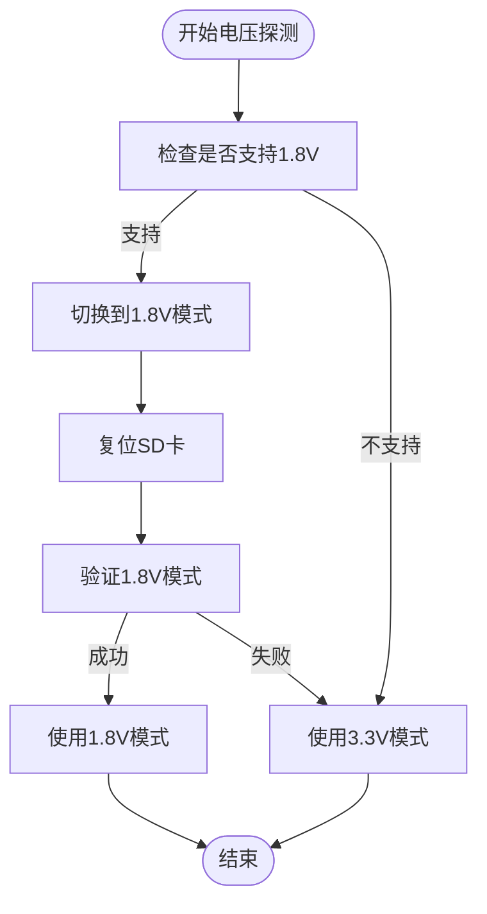

# IO引脚管理(IOPad)

<cite>
**Referenced Files in This Document**   
- [mod.rs](file://src/iopad/mod.rs)
- [regs.rs](file://src/iopad/regs.rs)
- [constants.rs](file://src/iopad/constants.rs)
- [mci_timing.rs](file://src/mci/mci_timing.rs)
- [mod.rs](file://src/mci_host/sd/mod.rs)
</cite>

## 目录
1. [引言](#引言)
2. [IO引脚管理模块概述](#io引脚管理模块概述)
3. [核心组件分析](#核心组件分析)
4. [寄存器操作与电气特性配置](#寄存器操作与电气特性配置)
5. [电压模式常量与切换机制](#电压模式常量与切换机制)
6. [与MCI控制器的协同工作机制](#与mci控制器的协同工作机制)
7. [结论](#结论)

## 引言

IO引脚管理模块（IOPad）是Phytium-MCI驱动中的关键组件，负责配置和控制连接到SD卡的物理引脚（如CLK、CMD、DATA）。该模块通过精确的寄存器操作，设置引脚的电气特性，包括驱动强度和上拉/下拉电阻，并支持不同电压模式（如3.3V、1.8V）的切换。本文档将深入分析`iopad`模块的实现细节，阐述其与MCI控制器的协同工作方式，确保在卡插入和电压切换时正确配置引脚。

## IO引脚管理模块概述

IO引脚管理模块主要由三个核心文件组成：`mod.rs`、`regs.rs`和`constants.rs`。`mod.rs`定义了`IoPad`结构体及其公共接口，`regs.rs`定义了寄存器操作的宏和trait，`constants.rs`则定义了各种枚举和常量。

该模块通过`IoPad`结构体提供统一的API来配置和查询引脚状态。`IoPad`结构体包含一个`IoPadReg`实例和一个`is_ready`标志，用于表示引脚配置是否就绪。`IoPadReg`是`Reg<FioPadError>`的类型别名，用于执行底层的寄存器读写操作。

**Section sources**
- [mod.rs](file://src/iopad/mod.rs#L1-L161)

## 核心组件分析

### IoPad结构体

`IoPad`结构体是IO引脚管理模块的核心，提供了配置和查询引脚功能、上拉/下拉电阻、驱动强度以及延迟设置的方法。这些方法通过泛型参数`T`来指定操作的寄存器类型，实现了对不同引脚的灵活配置。


**Diagram sources**
- [mod.rs](file://src/iopad/mod.rs#L10-L161)

**Section sources**
- [mod.rs](file://src/iopad/mod.rs#L10-L161)

### 寄存器操作宏

`regs.rs`文件定义了`X_REG0`和`X_REG1`两个宏，用于生成特定寄存器的bitflags结构体。这些宏通过`bitflags!`宏生成具有位操作能力的结构体，并为这些结构体实现`FlagReg`和`XReg0`或`XReg1` trait。


**Diagram sources**
- [regs.rs](file://src/iopad/regs.rs#L1-L141)

**Section sources**
- [regs.rs](file://src/iopad/regs.rs#L1-L141)

## 寄存器操作与电气特性配置

### 电气特性枚举

`constants.rs`文件定义了`FioPadFunc`、`FioPadDrive`和`FioPadPull`三个枚举，分别表示引脚功能、驱动强度和上拉/下拉电阻。这些枚举通过`From<u32>`和`Into<u32>` trait实现了与u32类型的相互转换，便于在寄存器操作中使用。


**Diagram sources**
- [constants.rs](file://src/iopad/constants.rs#L1-L120)

**Section sources**
- [constants.rs](file://src/iopad/constants.rs#L1-L120)

### 配置方法

`IoPad`结构体提供了`func_set`、`pull_set`、`drive_set`和`config_set`等方法来配置引脚的电气特性。这些方法通过泛型参数`T`指定操作的寄存器类型，并调用`IoPadReg`的`modify_reg`方法来修改寄存器值。


**Diagram sources**
- [mod.rs](file://src/iopad/mod.rs#L40-L60)

**Section sources**
- [mod.rs](file://src/iopad/mod.rs#L40-L60)

## 电压模式常量与切换机制

### 电压相关常量

`constants.rs`文件定义了多个与电压相关的常量，包括`FIOPAD_AN59_REG0_OFFSET`到`FIOPAD_J53_REG0_OFFSET`等寄存器偏移量，以及`PAD_ADDRESS`等基地址。这些常量用于计算特定引脚的寄存器地址。

```mermaid
erDiagram
REGISTERS {
string name PK
u32 offset
}
REGISTERS ||--o{ OFFSETS : "包含"
OFFSETS {
string name PK
u32 value
}
REGISTERS {
"FIOPAD_AN59_REG0_OFFSET" 0x0000
"FIOPAD_AW47_REG0_OFFSET" 0x0004
...
"FIOPAD_J53_REG0_OFFSET" 0x024C
}
OFFSETS {
"FIOPAD_REG0_BEG_OFFSET" 0x0000
"FIOPAD_REG0_END_OFFSET" 0x024C
"FIOPAD_REG1_BEG_OFFSET" 0x1024
"FIOPAD_REG1_END_OFFSET" 0x124C
"PAD_ADDRESS" 0x000_32B3_0000
}
```

**Diagram sources**
- [constants.rs](file://src/iopad/constants.rs#L121-L483)

**Section sources**
- [constants.rs](file://src/iopad/constants.rs#L121-L483)

### 电压切换流程

电压切换流程主要在`mci_host/sd/mod.rs`文件中的`bus_voltage_prob`方法中实现。该方法首先检查SD卡是否支持1.8V信号，如果支持，则通过`switch_io_voltage`方法切换到1.8V模式。



**Diagram sources**
- [mod.rs](file://src/mci_host/sd/mod.rs#L250-L350)

**Section sources**
- [mod.rs](file://src/mci_host/sd/mod.rs#L250-L350)

## 与MCI控制器的协同工作机制

### 协同工作流程

IO引脚管理模块与MCI控制器的协同工作主要体现在SD卡初始化过程中。在`SdCard::new`方法中，首先创建`IoPad`实例，然后将其传递给`SDIFDev`实例。在`card_init_proc`方法中，根据不同的时钟频率调用`set_pad_delay`或`unset_pad_delay`方法来配置引脚延迟。


**Diagram sources**
- [mod.rs](file://src/mci_host/sd/mod.rs#L100-L150)
- [mci_timing.rs](file://src/mci/mci_timing.rs#L124-L181)

**Section sources**
- [mod.rs](file://src/mci_host/sd/mod.rs#L100-L150)
- [mci_timing.rs](file://src/mci/mci_timing.rs#L124-L181)

### 时钟频率与引脚延迟

`mci_timing.rs`文件定义了不同时钟频率下的`MCITiming`常量，如`SD_25MHZ`、`SD_50MHZ`等。这些常量中的`pad_delay`字段指示是否需要设置引脚延迟。`MCITiming`结构体的`pad_delay`方法根据`pad_delay`字段的值调用`set_pad_delay`或`unset_pad_delay`方法。


**Diagram sources**
- [mci_timing.rs](file://src/mci/mci_timing.rs#L1-L50)

**Section sources**
- [mci_timing.rs](file://src/mci/mci_timing.rs#L1-L50)

## 结论

IO引脚管理模块通过`IoPad`结构体提供了统一的API来配置和控制SD卡的物理引脚。该模块利用`regs.rs`中定义的宏和trait实现了灵活的寄存器操作，并通过`constants.rs`中定义的枚举和常量支持不同电压模式的切换。与MCI控制器的协同工作确保了在卡插入和电压切换时正确配置引脚，为SD卡的稳定运行提供了保障。