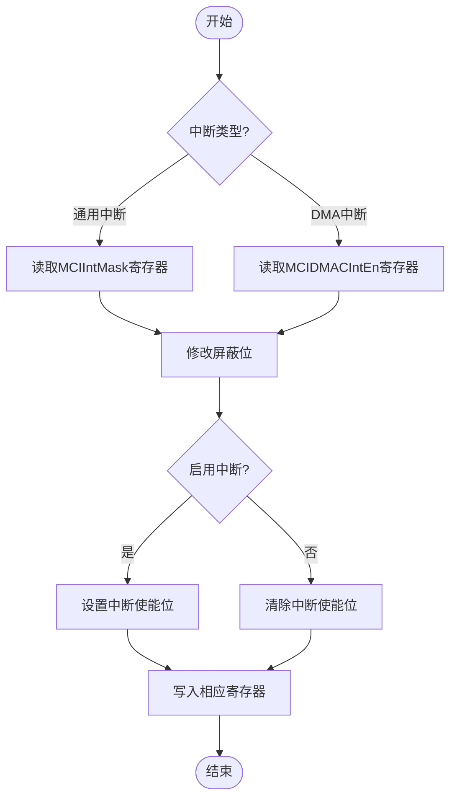
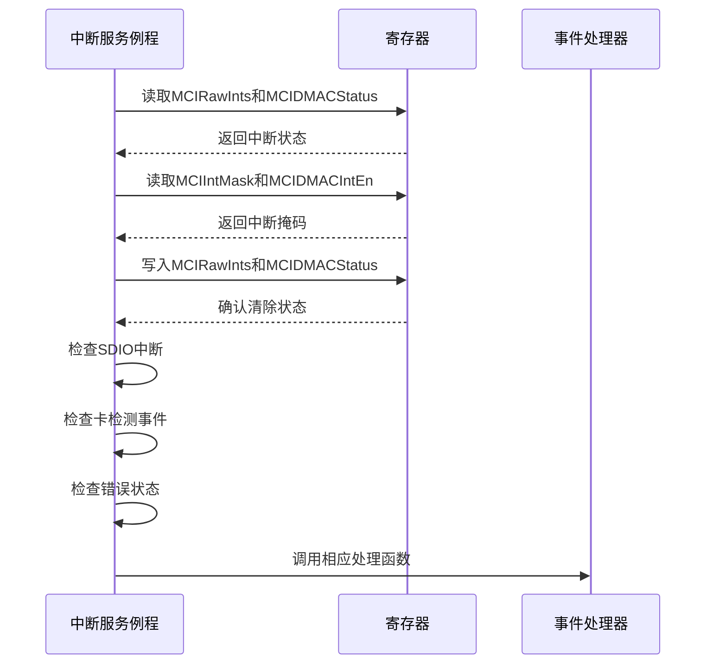
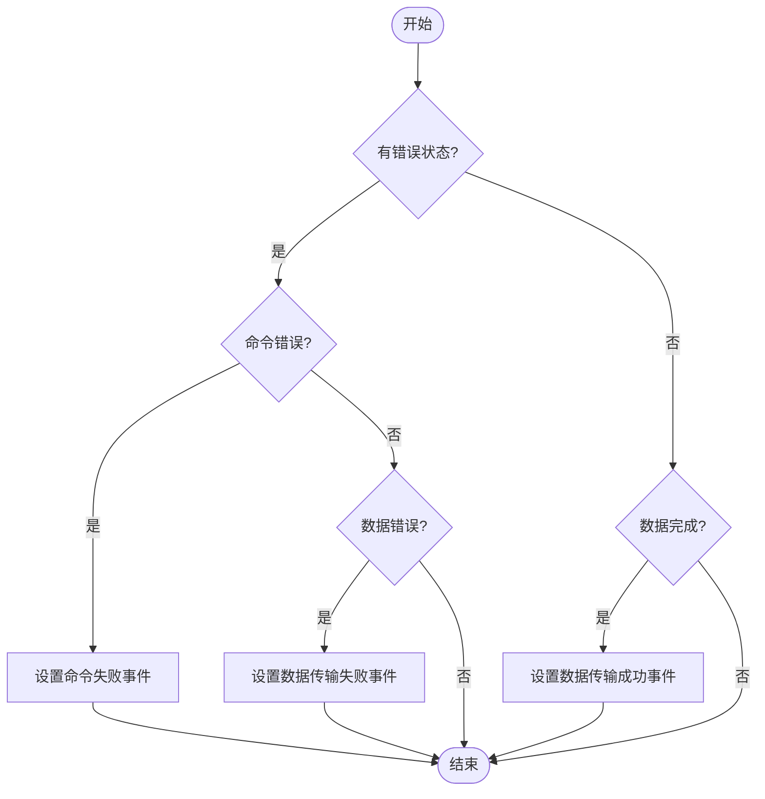
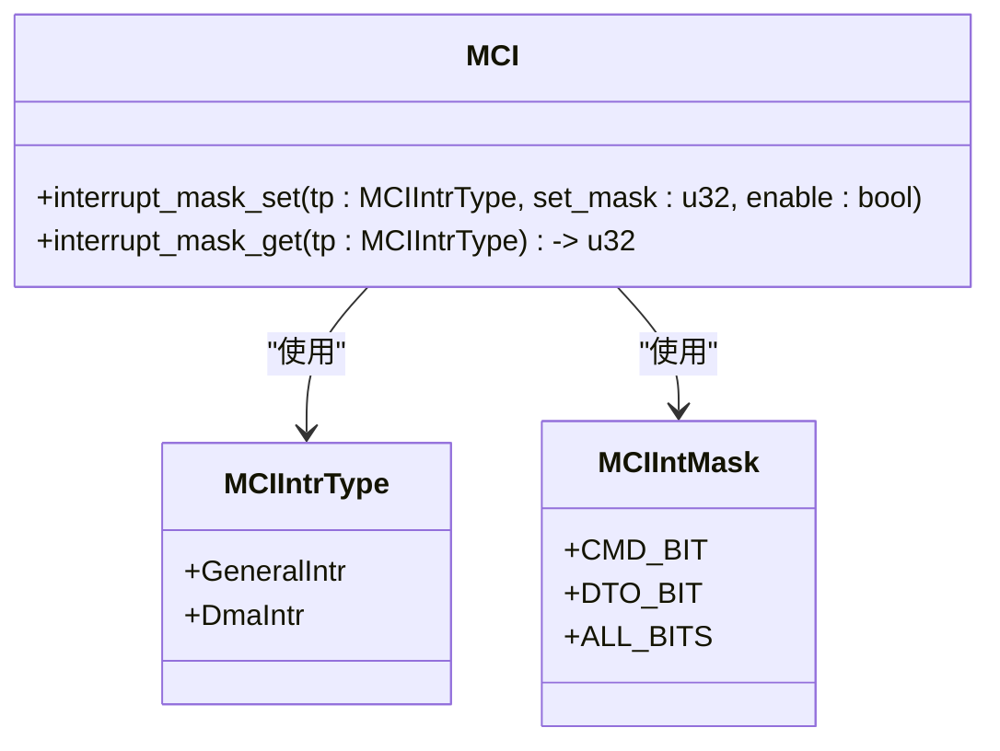

# 中断处理

<cite>
**本文档中引用的文件**
- [mci_intr.rs](file://src/mci/mci_intr.rs)
- [regs.rs](file://src/mci/regs.rs)
- [consts.rs](file://src/mci/consts.rs)
</cite>

## 目录
1. [中断处理机制概述](#中断处理机制概述)
2. [中断屏蔽管理](#中断屏蔽管理)
3. [中断服务例程工作流程](#中断服务例程工作流程)
4. [中断标志位与处理逻辑](#中断标志位与处理逻辑)
5. [中断配置代码示例](#中断配置代码示例)

## 中断处理机制概述

MCI控制器模块的中断处理机制主要通过`mci_intr.rs`文件中的`fsdif_interrupt_handler`中断服务例程实现。该机制负责处理SDIF控制器的各种中断事件，包括命令完成、数据传输完成、错误处理等。中断处理基于`regs.rs`文件中定义的寄存器结构，如`MCIIntMask`、`MCIRawInts`等，通过读取和写入这些寄存器来管理中断状态和屏蔽。

**Section sources**
- [mci_intr.rs](file://src/mci/mci_intr.rs#L1-L176)
- [regs.rs](file://src/mci/regs.rs#L0-L799)

## 中断屏蔽管理

### interrupt_mask_get方法

`interrupt_mask_get`方法用于获取SDIF控制器的中断屏蔽状态。该方法接受一个`MCIIntrType`参数，用于指定要获取的中断类型（通用中断或DMA中断）。根据中断类型，该方法读取相应的寄存器并返回当前的中断屏蔽位。

- **通用中断**：读取`MCIIntMask`寄存器的位值
- **DMA中断**：读取`MCIDMACIntEn`寄存器的位值

### interrupt_mask_set方法

`interrupt_mask_set`方法用于启用或禁用SDIF控制器的中断。该方法接受三个参数：中断类型、要设置的屏蔽位和启用/禁用标志。根据中断类型，该方法修改相应的寄存器以启用或禁用指定的中断。

- **启用中断**：使用按位或操作将指定的屏蔽位添加到当前屏蔽位中
- **禁用中断**：使用按位与操作将指定的屏蔽位从当前屏蔽位中移除

**Diagram sources**
- [mci_intr.rs](file://src/mci/mci_intr.rs#L25-L45)
- [regs.rs](file://src/mci/regs.rs#L300-L350)

**Section sources**
- [mci_intr.rs](file://src/mci/mci_intr.rs#L25-L45)
- [regs.rs](file://src/mci/regs.rs#L300-L350)

## 中断服务例程工作流程

`fsdif_interrupt_handler`是SDIF实例的中断服务例程，负责处理所有中断事件。其工作流程如下：

1. **读取中断状态**：读取`MCIRawInts`和`MCIDMACStatus`寄存器，获取原始中断状态和DMA状态
2. **检查事件掩码**：读取`MCIIntMask`和`MCIDMACIntEn`寄存器，获取中断掩码
3. **清除中断状态**：写入`MCIRawInts`和`MCIDMACStatus`寄存器，清除中断状态
4. **处理中断事件**：
   - 检查是否有SDIO中断
   - 检查是否有卡检测事件
   - 检查是否有错误状态
   - 处理命令完成和数据传输完成事件

**Diagram sources**
- [mci_intr.rs](file://src/mci/mci_intr.rs#L50-L150)
- [regs.rs](file://src/mci/regs.rs#L350-L450)

**Section sources**
- [mci_intr.rs](file://src/mci/mci_intr.rs#L50-L150)
- [regs.rs](file://src/mci/regs.rs#L350-L450)

## 中断标志位与处理逻辑

### 通用中断标志位

根据`regs.rs`文件中的`MCIRawInts`定义，通用中断包含以下标志位：

- **CD_BIT**：卡检测中断
- **RE_BIT**：响应错误中断
- **CMD_BIT**：命令完成中断
- **DTO_BIT**：数据传输完成中断
- **TXDR_BIT**：发送FIFO数据请求中断
- **RXDR_BIT**：接收FIFO数据请求中断
- **RCRC_BIT**：响应CRC错误中断
- **DCRC_BIT**：数据CRC错误中断
- **RTO_BIT**：响应超时中断
- **DRTO_BIT**：数据读取超时中断

### DMA中断标志位

根据`regs.rs`文件中的`MCIDMACStatus`定义，DMA中断包含以下标志位：

- **TI**：发送中断
- **RI**：接收中断
- **FBE**：致命总线错误中断
- **DU**：描述符不可用中断
- **CES**：卡错误汇总中断
- **NIS**：正常中断汇总中断
- **AIS**：异常中断汇总中断

### 错误处理逻辑

当检测到错误状态时，系统会调用`handle_error_occur`函数进行处理：

- **命令错误**：如果`MCIRawInts`包含`RE_BIT`或`RTO_BIT`，设置命令失败事件
- **数据错误**：如果`MCIDMACStatus`包含`DU`，或`MCIRawInts`包含`DCRC_BIT`或`RCRC_BIT`，设置数据传输失败事件

**Diagram sources**
- [mci_intr.rs](file://src/mci/mci_intr.rs#L120-L150)
- [regs.rs](file://src/mci/regs.rs#L450-L550)

**Section sources**
- [mci_intr.rs](file://src/mci/mci_intr.rs#L120-L150)
- [regs.rs](file://src/mci/regs.rs#L450-L550)

## 中断配置代码示例

以下代码示例展示了如何配置中断掩码以启用命令完成和数据传输完成中断：

**Diagram sources**
- [mci_intr.rs](file://src/mci/mci_intr.rs#L25-L45)
- [regs.rs](file://src/mci/regs.rs#L300-L350)
- [consts.rs](file://src/mci/consts.rs#L100-L120)

**Section sources**
- [mci_intr.rs](file://src/mci/mci_intr.rs#L25-L45)
- [regs.rs](file://src/mci/regs.rs#L300-L350)
- [consts.rs](file://src/mci/consts.rs#L100-L120)