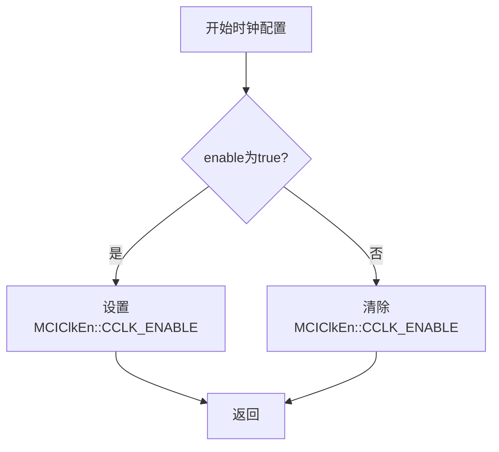
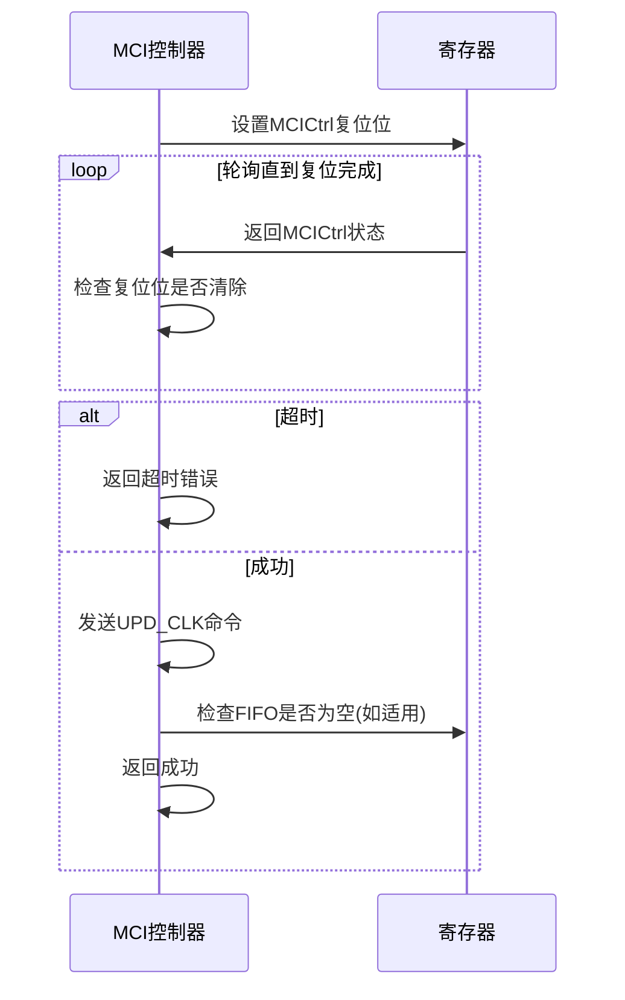

# 硬件初始化

<cite>
**Referenced Files in This Document**   
- [mci_hardware.rs](file://src/mci/mci_hardware.rs)
- [regs.rs](file://src/mci/regs.rs)
- [mod.rs](file://src/mci/mod.rs)
- [consts.rs](file://src/mci/consts.rs)
- [err.rs](file://src/mci/err.rs)
</cite>

## 目录
1. [引言](#引言)
2. [核心硬件初始化流程](#核心硬件初始化流程)
3. [时钟与电源配置](#时钟与电源配置)
4. [控制器复位机制](#控制器复位机制)
5. [寄存器安全访问](#寄存器安全访问)
6. [完整初始化示例](#完整初始化示例)

## 引言

本文档深入分析Phytium MCI控制器模块的硬件初始化过程，重点解析`mci_hardware.rs`文件中实现的底层硬件配置机制。MCI（MultiMedia Card Interface）控制器是嵌入式系统中用于管理SD卡、eMMC等存储设备的关键组件。硬件初始化是确保MCI控制器能够正确与存储卡通信的基础步骤，涉及时钟、电源、复位和寄存器配置等多个关键环节。本文将详细阐述这些配置方法的实现细节，为开发者提供深入的底层技术参考。

## 核心硬件初始化流程

MCI控制器的硬件初始化是一个多步骤的复杂过程，由`MCI`结构体的`reset`私有方法协调执行。该流程确保控制器从一个已知的稳定状态开始，并为后续的卡检测和数据传输做好准备。

**Section sources**
- [mod.rs](file://src/mci/mod.rs#L350-L470)
- [mci_hardware.rs](file://src/mci/mci_hardware.rs#L25-L220)

## 时钟与电源配置

时钟和电源是MCI控制器正常工作的两大基石。`mci_hardware.rs`文件提供了多个方法来精确控制这些硬件资源。

### 时钟配置

时钟配置通过`clock_set`和`init_external_clk`方法实现。`clock_set`方法用于启用或禁用卡时钟，通过操作`MCIClkEn`寄存器来完成。当`enable`参数为`true`时，该方法会设置`CCLK_ENABLE`位，从而向卡提供时钟信号；反之则清除该位以关闭时钟。

外部时钟的初始化由`init_external_clk`方法负责。该方法首先构建一个包含分频、驱动和采样相位参数的`MCIClkSrc`寄存器值，然后调用`update_exteral_clk`方法将此值写入硬件。`update_exteral_clk`方法在写入新时钟配置后，会使用`retry_for`机制等待`MCIClkSts::READY`位被置位，以确保时钟信号已经稳定。这种轮询等待机制是确保硬件状态同步的关键。



**Diagram sources**
- [mci_hardware.rs](file://src/mci/mci_hardware.rs#L45-L52)
- [regs.rs](file://src/mci/regs.rs#L100-L108)

### 电源配置

电源配置由`power_set`方法实现。该方法通过读写`MCIPwrEn`寄存器来控制卡的供电开关。当`enable`参数为`true`时，`ENABLE`位被置位，为卡提供电源；当`enable`为`false`时，该位被清除，切断电源。这种直接的寄存器操作确保了电源状态的精确控制。

**Section sources**
- [mci_hardware.rs](file://src/mci/mci_hardware.rs#L75-L81)
- [regs.rs](file://src/mci/regs.rs#L60-L66)

## 控制器复位机制

控制器复位是初始化流程中的关键步骤，用于将MCI控制器恢复到一个已知的初始状态。

### 复位位操作

`ctrl_reset`方法是执行复位的核心。它接收一个`MCICtrl`类型的位标志，代表需要复位的控制器部分（如`FIFO_RESET`、`DMA_RESET`或`CONTROLLER_RESET`）。该方法首先通过`modify_reg`原子性地设置复位位，然后进入一个轮询循环，等待该复位位被硬件自动清除，这表明复位操作已完成。

### 超时重试机制

为了防止硬件故障导致程序无限期挂起，`ctrl_reset`方法集成了超时重试机制。它使用`retry_for`方法，并传入`RETRIES_TIMEOUT`作为超时参数。如果在指定的重试次数内复位位仍未被清除，方法将返回一个`MCIError::Timeout`错误，从而优雅地处理异常情况。

### 复位后的时钟更新

复位操作完成后，`ctrl_reset`方法会自动调用`private_cmd_send(MCICmd::UPD_CLK, 0)`来更新时钟。这是因为复位可能会使时钟配置失效，因此需要重新发送一个“更新时钟”命令来确保时钟信号的正确性。此外，如果复位的是FIFO，该方法还会额外检查`MCIStatus::FIFO_EMPTY`状态，以确保FIFO在使用前是空的。



**Diagram sources**
- [mci_hardware.rs](file://src/mci/mci_hardware.rs#L95-L125)
- [regs.rs](file://src/mci/regs.rs#L20-L38)

## 寄存器安全访问

`regs.rs`文件定义了所有MCI控制器寄存器的安全访问接口，这是整个驱动稳定性的基础。

### 寄存器定义

该文件使用`bitflags!`宏为每个硬件寄存器（如`MCIClkEn`、`MCIPwrEn`）定义了类型安全的结构体。这些结构体将原始的32位寄存器值封装为具有语义的位标志集合。例如，`MCIClkEn`结构体明确地将`CCLK_ENABLE`位定义为第0位，避免了直接使用魔术数字（magic number）带来的错误。

### 安全读写

所有寄存器的读写操作都通过`Reg`结构体提供的`read_reg`和`write_reg`等方法进行。这些方法确保了对寄存器内存映射I/O（MMIO）的原子性访问。此外，`set_reg`和`clear_reg`方法提供了对特定位的原子性置位和清零操作，这对于避免在多线程或中断环境中因读-修改-写操作而产生的竞态条件至关重要。

**Section sources**
- [regs.rs](file://src/mci/regs.rs#L20-L800)
- [mci_hardware.rs](file://src/mci/mci_hardware.rs#L45-L52)

## 完整初始化示例

一个完整的MCI控制器初始化流程通常由`MCI`结构体的`config_init`公共方法触发。该方法首先检查控制器是否已就绪，然后调用私有的`reset`方法执行底层硬件初始化。`reset`方法内部会按顺序调用`clock_set(false)`、`init_external_clk()`、`power_set(true)`、`ctrl_reset()`等一系列硬件配置方法，最终完成整个初始化过程。

```mermaid
flowchart TD
Start([config_init]) --> CheckReady{is_ready?}
CheckReady --> |是| Warn[发出警告]
CheckReady --> |否| CallReset[调用reset()]
CallReset --> SetFifo[配置FIFO阈值]
SetFifo --> SetCardThr[设置卡阈值]
SetCardThr --> DisableClk[关闭时钟]
DisableClk --> InitExtClk[初始化外部时钟]
InitExtClk --> PowerOn[开启电源]
PowerOn --> EnableClk[开启卡时钟]
EnableClk --> ResetCtrl[复位控制器]
ResetCtrl --> UpdateClk[更新时钟]
UpdateClk --> ConfigCardReset[配置卡复位]
ConfigCardReset --> ClearInt[清除中断状态]
ClearInt --> EnableCtrl[使能控制器]
EnableCtrl --> SetTimeout[设置超时]
SetTimeout --> ResetDMA[复位DMA(如适用)]
ResetDMA --> End([初始化完成])
```

**Diagram sources**
- [mod.rs](file://src/mci/mod.rs#L350-L470)
- [mci_hardware.rs](file://src/mci/mci_hardware.rs#L25-L220)