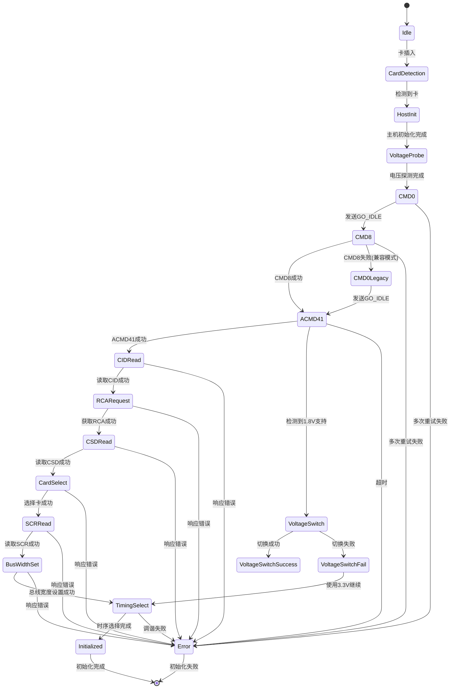

# SD卡初始化流程

<cite>
**本文档中引用的文件**  
- [mod.rs](file://src/mci_host/sd/mod.rs)
- [consts.rs](file://src/mci_host/sd/consts.rs)
- [io_voltage.rs](file://src/mci_host/sd/io_voltage.rs)
- [constants.rs](file://src/mci_host/constants.rs)
- [cid.rs](file://src/mci_host/sd/cid.rs)
- [csd.rs](file://src/mci_host/sd/csd.rs)
- [scr.rs](file://src/mci_host/sd/scr.rs)
- [status.rs](file://src/mci_host/sd/status.rs)
</cite>

## 目录
1. [简介](#简介)
2. [初始化流程概述](#初始化流程概述)
3. [电压探测与切换逻辑](#电压探测与切换逻辑)
4. [操作电压管理机制](#操作电压管理机制)
5. [SD卡类型行为差异](#sd卡类型行为差异)
6. [错误处理与重试机制](#错误处理与重试机制)
7. [初始化状态机转换图](#初始化状态机转换图)

## 简介
SD卡初始化是SD主机控制器与SD卡建立通信并配置工作参数的关键过程。该流程从`SdCard::init`入口开始，通过一系列SD命令完成卡的识别、配置和就绪状态切换。本文档详细描述了完整的初始化流程，涵盖命令执行顺序、电压切换逻辑、操作电压管理、不同类型SD卡的行为差异以及错误处理机制。

**Section sources**
- [mod.rs](file://src/mci_host/sd/mod.rs#L1-L50)

## 初始化流程概述
SD卡初始化流程由`SdCard::init`方法启动，主要分为以下几个阶段：

1. **主机初始化**：调用`host_init`完成主机控制器的初始化。
2. **卡插入检测**：通过`polling_card_insert`检测SD卡是否插入。
3. **卡初始化处理**：执行`card_init_proc`完成核心初始化流程。

`card_init_proc`方法按以下顺序执行关键命令：

### GO_IDLE_STATE (CMD0)
通过发送CMD0命令将SD卡置于空闲状态。这是初始化流程的第一步，确保卡处于已知的初始状态。

### SEND_IF_COND (CMD8)
发送CMD8命令探测SD卡的接口条件。若命令成功响应且返回值的低8位为0xAA，则表明该卡为SDHC或SDXC类型，支持高容量模式。

### ACMD41
在发送CMD8后，主机通过ACMD41（SEND_OP_COND）命令与卡进行操作条件协商。此命令包含OCR（操作条件寄存器）参数，用于指示主机支持的电压范围和功能特性。

### ALL_SEND_CID (CMD2)
读取卡的CID（Card Identification）寄存器。此命令在卡识别模式下执行，获取卡的制造商信息、产品名称、序列号等唯一标识信息。

### SEND_RCA (ACMD3)
请求卡的相对卡地址（RCA）。此命令将卡从识别模式切换到待机模式，为后续数据传输模式做准备。

### SEND_CSD (CMD9)
读取卡的CSD（Card Specific Data）寄存器。CSD包含卡的容量、块大小、读写速度等关键参数，用于计算卡的总容量和配置数据传输参数。

### SELECT_CARD (CMD7)
选择卡进入传输状态。发送CMD7后，卡进入传输状态，可以执行后续的数据读写命令。

### SEND_SCR (ACMD51)
读取SD配置寄存器（SCR），获取卡支持的总线宽度、SD规范版本等信息。

### 数据总线宽度设置
根据SCR中获取的支持信息，通过ACMD6命令将数据总线宽度设置为4位模式，提高数据传输效率。

### 总线时序选择
根据卡和主机的能力，选择合适的总线时序模式（如高速模式、SDR50、SDR104等），并通过调谐过程优化采样点。

**Section sources**
- [mod.rs](file://src/mci_host/sd/mod.rs#L200-L400)

## 电压探测与切换逻辑
电压探测与切换是UHS（Ultra High Speed）模式初始化的关键步骤，允许SD卡在3.3V和1.8V之间切换以支持高速操作。

### 电压探测流程
1. **初始化电压设置**：默认使用3.3V电压。
2. **ACMD41参数配置**：在ACMD41命令的OCR参数中设置`SWITCH_18_REQUEST_FLAG`标志位，表示主机支持1.8V信号。
3. **响应解析**：若卡在ACMD41响应中设置了`SWITCH_18_ACCEPT_FLAG`，则表明卡支持1.8V信号。

### 电压切换条件
电压切换仅在以下条件同时满足时进行：
- 卡为UHS-I兼容卡（支持ACMD41中的1.8V切换标志）
- 主机硬件支持1.8V电压（`MCIHostCapability::VOLTAGE_1V8`）
- 主机支持UHS模式（如SDR50、SDR104）

### 电压切换实现
电压切换通过以下步骤完成：
1. **发送CMD11 (VOLTAGE_SWITCH)**：请求卡切换到1.8V信号。
2. **检测卡信号**：卡应在下一个时钟周期将CMD和DAT[3:0]拉低。
3. **关闭时钟**：主机关闭时钟至少5ms（代码中为10ms）。
4. **切换IO电压**：调用`switch_io_voltage`通过GPIO或主机控制器切换IO电压。
5. **重启时钟**：重新启动时钟。
6. **验证切换**：检查DAT[3:0]是否被拉高，确认切换成功。

若切换失败，系统会回退到3.3V模式继续初始化。

**Section sources**
- [mod.rs](file://src/mci_host/sd/mod.rs#L400-L500)
- [io_voltage.rs](file://src/mci_host/sd/io_voltage.rs#L1-L35)

## 操作电压管理机制
操作电压管理通过`MCIHostOperationVoltage`枚举和`SdIoVoltage`结构体实现。

### MCIHostOperationVoltage 枚举
该枚举定义了支持的操作电压：
- `None`：无电压
- `Voltage330V`：3.3V
- `Voltage300V`：3.0V
- `Voltage180V`：1.8V

### SdIoVoltage 结构体
`SdIoVoltage`结构体管理电压控制方式：
- `typ`：控制类型，支持`NotSupport`、`ByHost`、`ByGpio`
- `func`：可选的电压切换函数，用于GPIO控制方式

### 电压切换实现
电压切换通过`switch_io_voltage`方法实现：
- 若控制类型为`ByGpio`，调用用户提供的函数切换GPIO电平
- 若控制类型为`ByHost`，调用主机控制器的`switch_to_voltage`方法
- 若不支持，则返回错误

该机制提供了灵活的电压控制方式，适应不同的硬件设计。

**Section sources**
- [constants.rs](file://src/mci_host/constants.rs#L250-L270)
- [io_voltage.rs](file://src/mci_host/sd/io_voltage.rs#L1-L35)

## SD卡类型行为差异
不同类型的SD卡在初始化流程中表现出不同的行为特征。

### SDSC (Standard Capacity)
- 不支持CMD8命令
- CSD结构版本为1.0
- 容量小于等于2GB
- 地址模式为字节地址

### SDHC (High Capacity)
- 支持CMD8命令
- CSD结构版本为2.0
- 容量大于2GB且小于等于32GB
- 地址模式为块地址（512字节/块）
- 在ACMD41响应中设置`CARD_CAPACITY_SUPPORT_FLAG`

### SDXC (eXtended Capacity)
- 支持CMD8命令
- CSD结构版本为2.0
- 容量大于32GB且小于等于2TB
- 地址模式为块地址
- 在CSD中设备大小字段为0xFFFF
- 设置`SupportSdxc`标志位

这些差异主要体现在CSD寄存器的解析和ACMD41命令的响应处理中，系统通过检查这些特征来确定卡的类型并相应地配置参数。

**Section sources**
- [mod.rs](file://src/mci_host/sd/mod.rs#L1000-L1200)
- [consts.rs](file://src/mci_host/sd/consts.rs#L100-L120)

## 错误处理与重试机制
初始化流程包含完善的错误处理和重试机制，确保在异常情况下能够恢复或正确报告错误。

### 命令重试机制
- **CMD8重试**：最多重试10次，每次间隔10ms
- **ACMD41重试**：最多重试10次，每次间隔10ms
- **CMD13重试**：最多重试10次，用于检查卡状态

### 错误处理策略
- **电压切换失败**：若1.8V切换失败，系统会继续使用3.3V模式
- **命令传输失败**：在`transfer`方法中实现重试逻辑，最多重试3次
- **调谐失败**：若SDR50或SDR104模式调谐失败，系统会降级到低速模式

### 关键错误类型
- `GoIdleFailed`：CMD0执行失败
- `HandShakeOperationConditionFailed`：ACMD41握手失败
- `AllSendCidFailed`：CMD2执行失败
- `SendRelativeAddressFailed`：ACMD3执行失败
- `SendCsdFailed`：CMD9执行失败
- `SelectCardFailed`：CMD7执行失败
- `SwitchVoltageFail`：电压切换失败

这些错误处理机制确保了初始化流程的健壮性，能够在各种异常情况下提供清晰的错误诊断信息。

**Section sources**
- [mod.rs](file://src/mci_host/sd/mod.rs#L1500-L1800)

## 初始化状态机转换图

**Diagram sources**
- [mod.rs](file://src/mci_host/sd/mod.rs#L200-L500)
- [constants.rs](file://src/mci_host/constants.rs#L200-L300)