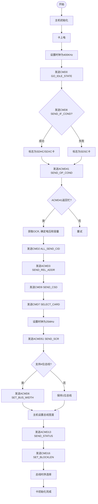

# SD卡协议实现

<cite>
**本文档引用的文件**
- [cid.rs](file://src/mci_host/sd/cid.rs)
- [csd.rs](file://src/mci_host/sd/csd.rs)
- [scr.rs](file://src/mci_host/sd/scr.rs)
- [constants.rs](file://src/mci_host/constants.rs)
- [mod.rs](file://src/mci_host/sd/mod.rs)
</cite>

## 目录
1. [简介](#简介)
2. [核心数据结构](#核心数据结构)
3. [卡初始化流程](#卡初始化流程)
4. [状态机管理](#状态机管理)
5. [初始化流程图](#初始化流程图)

## 简介
本文档详细介绍了Phytium MCI驱动中SD卡协议层的实现，重点关注`mci_host/sd/`目录下的核心模块。文档解析了SD卡关键寄存器（CID、CSD、SCR）的处理机制，阐述了卡初始化过程中命令的执行顺序与目的，并描述了状态机如何跟踪卡的生命周期。

## 核心数据结构

### CID寄存器解析
`cid.rs`模块定义了`SdCid`结构体，用于存储和解析SD卡识别号（Card Identification Number）寄存器的内容。该结构体包含制造商ID、应用ID、产品名称、产品版本、序列号和生产日期等信息。在卡初始化过程中，通过发送`ALL_SEND_CID`命令获取原始数据，并由`decode_cid()`方法解析并填充到`SdCid`实例中。

**节来源**
- [cid.rs](file://src/mci_host/sd/cid.rs#L1-L23)
- [mod.rs](file://src/mci_host/sd/mod.rs#L1890-L1918)

### CSD寄存器解析
`csd.rs`模块定义了`SdCsd`结构体，用于存储和解析卡特定数据（Card-Specific Data）寄存器。该寄存器包含了卡的容量、读写块长度、数据传输速率、命令支持类等关键信息。模块使用`bitflags`宏定义了`CsdFlags`和`SdCardCmdClass`，用于表示CSD寄存器中的标志位和命令类。`decode_csd()`方法负责解析原始数据，计算卡的总块数和块大小，并根据CSD结构版本（1.0或2.0）进行不同的处理。

**节来源**
- [csd.rs](file://src/mci_host/sd/csd.rs#L1-L79)
- [mod.rs](file://src/mci_host/sd/mod.rs#L1920-L1990)

### SCR寄存器处理
`scr.rs`模块定义了`SdScr`结构体，用于处理SD配置寄存器（SD Configuration Register）。SCR寄存器提供了SD卡的规范版本、支持的数据总线宽度、安全特性等信息。模块使用`bitflags`宏定义了`ScrFlags`来表示SCR中的标志位。`scr_send()`方法通过发送`ACMD51`命令获取SCR数据，`decode_scr()`方法则解析这些数据，确定卡支持的总线宽度（如4位模式）和是否支持CMD23等高级命令。

**节来源**
- [scr.rs](file://src/mci_host/sd/scr.rs#L1-L44)
- [mod.rs](file://src/mci_host/sd/mod.rs#L1840-L1879)

## 卡初始化流程

### 关键命令序列
卡初始化流程遵循SD协议规范，按特定顺序执行一系列命令。这些命令在`constants.rs`文件的`MCIHostCommonCmd`枚举中定义：

- **GO_IDLE_STATE (CMD0)**: 将卡重置到空闲状态，是初始化的第一步。
- **SEND_INTERFACE_CONDITION (CMD8)**: 检查卡的接口条件，用于区分SDSC和SDHC/SDXC卡。
- **SEND_OP_COND (ACMD41)**: 发送操作条件，协商工作电压（如3.3V或1.8V）并确定卡的容量类型（高容量）。
- **ALL_SEND_CID (CMD2)**: 获取卡的CID，将卡从识别模式移出。
- **SEND_RELATIVE_ADDR (ACMD3)**: 请求卡分配一个相对卡地址（RCA），使卡进入待机状态。
- **SEND_CSD (CMD9)**: 获取卡的CSD寄存器内容，以确定卡的详细规格。
- **SELECT_CARD (CMD7)**: 使用RCA选中卡，使其进入传输状态。
- **SET_BLOCKLEN (CMD16)**: 设置数据块长度，通常为512字节。
- **SEND_SCR (ACMD51)**: 获取SCR寄存器，以确定总线宽度和UHS支持。

**节来源**
- [constants.rs](file://src/mci_host/constants.rs#L39-L78)
- [mod.rs](file://src/mci_host/sd/mod.rs#L1600-L1879)

## 状态机管理
`constants.rs`文件中定义了`MCIHostCurrentState`枚举，表示SD卡的当前状态机。该状态机严格遵循SD协议，跟踪卡的生命周期。`card_init_proc()`方法中的命令序列直接驱动状态机的转换：
- **Identification (识别)**: 从`GO_IDLE_STATE`到`ALL_SEND_CID`和`SEND_RELATIVE_ADDR`命令期间。
- **Standby (待机)**: `SEND_RELATIVE_ADDR`成功后。
- **Transfer (传输)**: `SELECT_CARD`成功后，卡进入此状态，可以执行读写等数据传输命令。
状态机的当前状态通过解析`SEND_STATUS`命令的响应来确定。

**节来源**
- [constants.rs](file://src/mci_host/constants.rs#L129-L147)
- [mod.rs](file://src/mci_host/sd/mod.rs#L300-L320)

## 初始化流程图

**图来源**
- [mod.rs](file://src/mci_host/sd/mod.rs#L300-L320)
- [mod.rs](file://src/mci_host/sd/mod.rs#L400-L550)