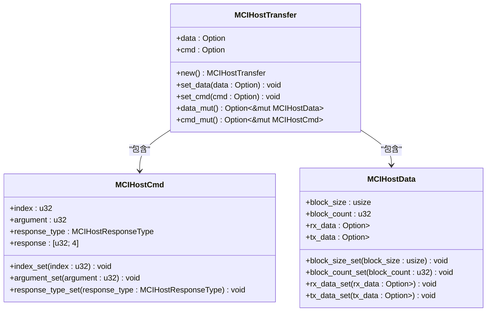
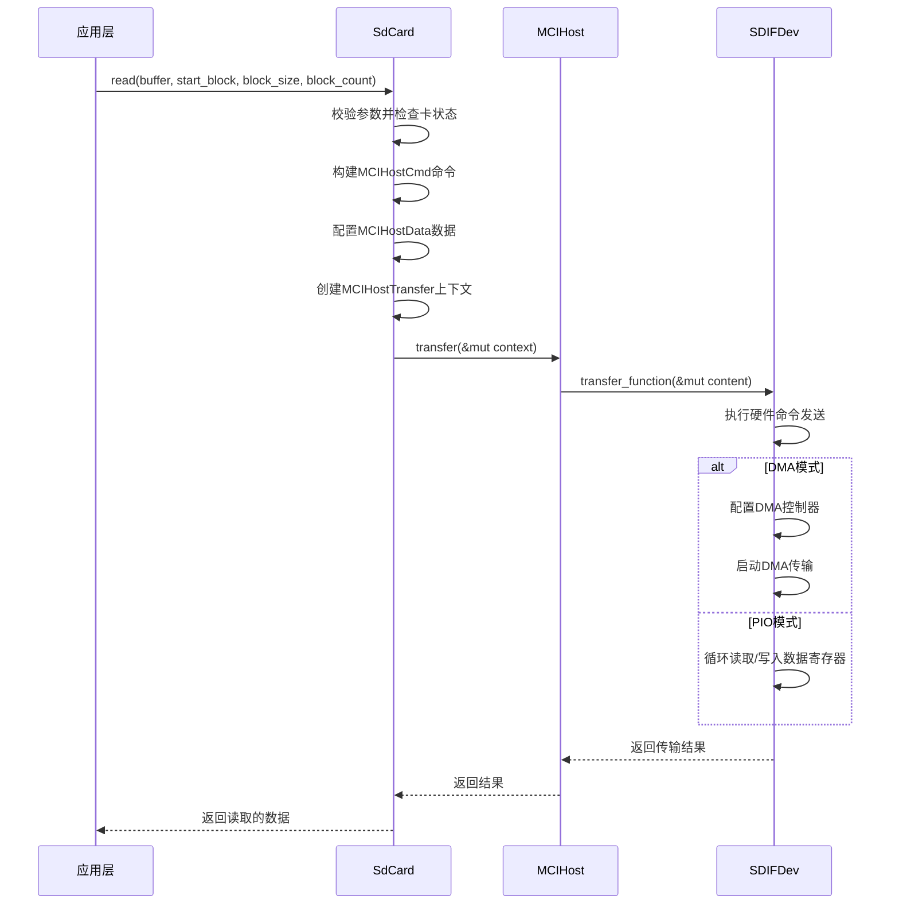

<cite>
**本文档引用文件**
- [mci_host_transfer.rs](file://src/mci_host/mci_host_transfer.rs)
- [usr_param.rs](file://src/mci_host/sd/usr_param.rs)
- [mod.rs](file://src/mci_host/sd/mod.rs)
- [consts.rs](file://src/mci_host/sd/consts.rs)
- [mci_cmd.rs](file://src/mci/mci_cmd.rs)
</cite>

# 数据传输配置与块操作

## 目录
1. [块大小与块数配置](#块大小与块数配置)
2. [MCIHostTransfer结构体作用](#mcihosttransfer结构体作用)
3. [读写操作完整流程](#读写操作完整流程)
4. [成功写入块数查询机制](#成功写入块数查询机制)
5. [传输性能调优方法](#传输性能调优方法)

## 块大小与块数配置

SD卡数据传输的块大小通过`block_size_set`方法进行配置，该方法对应SD协议中的CMD16命令。在系统初始化过程中，会调用`block_size_set`设置默认块大小为512字节，这是SD卡的标准块大小。对于高容量SD卡（SDHC/SDXC），块大小必须固定为512字节，而对于标准容量SD卡（SDSC），块大小可以配置为其他值，但必须满足是4的倍数且不超过设备支持的最大块大小。

块数配置通过`block_count_set`方法实现，用于指定一次数据传输操作中包含的数据块数量。该配置与块大小共同决定了总传输数据量。系统在执行读写操作前会进行参数校验，确保块大小和块数的组合符合SD卡规范要求。对于多块读写操作，系统支持自动发送CMD12或CMD23命令来终止传输过程。

**Section sources**
- [mod.rs](file://src/mci_host/sd/mod.rs#L1409-L1498)
- [mci_host_transfer.rs](file://src/mci_host/mci_host_transfer.rs#L115-L133)

## MCIHostTransfer结构体作用

`MCIHostTransfer`结构体在SD卡数据传输过程中扮演着核心封装角色，负责整合命令、数据和响应信息。该结构体包含两个主要成员：`cmd`用于封装MCI主机命令，`data`用于封装数据传输相关信息。

在命令封装方面，`MCIHostCmd`子结构体包含命令索引、参数、响应类型等字段，通过`set_cmd`方法将配置好的命令对象注入传输上下文中。在数据封装方面，`MCIHostData`子结构体管理块大小、块数量、传输方向（读/写）以及数据缓冲区等信息，通过`set_data`方法完成数据配置。

该结构体作为统一的数据传输载体，在主机控制器与SD卡之间传递完整的操作指令，确保命令与数据的同步性和一致性。它还支持自动命令功能，如启用自动CMD12或CMD23，简化了多块传输的控制流程。

**Diagram sources**
- [mci_host_transfer.rs](file://src/mci_host/mci_host_transfer.rs#L79-L133)

**Section sources**
- [mci_host_transfer.rs](file://src/mci_host/mci_host_transfer.rs#L0-L221)
- [mod.rs](file://src/mci_host/sd/mod.rs#L1409-L1550)

## 读写操作完整流程

SD卡的读写操作遵循严格的流程控制，确保数据传输的可靠性和完整性。完整的操作流程包括命令发送、数据传输和状态校验三个主要阶段。

读操作流程始于构建读命令（CMD17单块读或CMD18多块读），设置起始块地址和块数量。系统首先检查卡状态是否空闲，然后配置`MCIHostTransfer`上下文，包括命令参数和接收缓冲区。通过`transfer`方法触发数据传输，底层驱动会启动DMA或PIO模式进行数据搬运。传输完成后，系统会校验命令响应中的错误标志位，确保操作成功。

写操作流程类似，使用CMD24（单块写）或CMD25（多块写）命令。在发送写命令前，同样需要确认卡处于空闲状态。数据通过`tx_data_set`方法注入传输上下文，由主机控制器发送到SD卡。写操作完成后，系统会等待卡退出忙状态，确保数据已持久化存储。

在整个传输过程中，系统实现了完善的错误处理机制，包括超时重试、状态轮询和错误标志检测，有效应对各种异常情况。

**Diagram sources**
- [mod.rs](file://src/mci_host/sd/mod.rs#L1409-L1550)
- [mci_cmd.rs](file://src/mci/mci_cmd.rs#L0-L176)

**Section sources**
- [mod.rs](file://src/mci_host/sd/mod.rs#L1409-L1550)
- [mci_cmd.rs](file://src/mci/mci_cmd.rs#L0-L176)

## 成功写入块数查询机制

系统提供`write_successful_block_send`方法（对应ACMD22命令）用于查询成功写入的块数。该机制在多块写操作后特别有用，可以精确了解实际完成写入的数据块数量，对于需要确认数据完整性的应用场景至关重要。

查询流程首先通过`polling_card_status_busy`方法轮询卡状态，确保卡已退出忙状态。然后发送应用命令前缀（ACMD55），接着发送ACMD22命令。该命令的响应数据中包含一个32位计数器，表示自上一次复位或查询以来成功写入的块数。

系统在执行查询时会进行完整的错误处理，包括检查命令响应中的错误标志位。如果查询成功，响应数据中的计数器值会通过字节序转换后返回给调用者。这一机制为上层应用提供了可靠的写操作确认能力，可用于实现数据完整性校验和重传机制。

**Section sources**
- [mod.rs](file://src/mci_host/sd/mod.rs#L584-L655)
- [consts.rs](file://src/mci_host/sd/consts.rs#L46-L78)

## 传输性能调优方法

传输性能调优主要通过`SdUsrParam`结构体中的用户参数进行配置。该结构体包含多个关键性能参数，允许用户根据具体硬件环境和应用需求进行优化。

最大频率参数（`max_freq`）用于设置SD卡接口的最高工作频率。系统会根据此参数和卡的能力自动选择最佳工作模式，如默认模式、高速模式（50MHz）、SDR50（100MHz）或SDR104（208MHz）。能力位（`capability`）参数定义了主机支持的功能集，包括数据宽度（4位或8位）、电压支持（3.3V或1.8V）和高级功能（如自动CMD12、驱动强度控制等）。

通过合理配置这些参数，可以实现最佳的传输性能。例如，启用4位数据宽度可将数据吞吐量提升至原来的4倍；切换到1.8V信号和高速模式可减少功耗并提高时钟频率；配置适当的驱动强度可改善信号完整性，支持更高的传输速率。系统在初始化过程中会根据这些参数自动协商最优的传输模式。

**Section sources**
- [usr_param.rs](file://src/mci_host/sd/usr_param.rs#L0-L32)
- [consts.rs](file://src/mci_host/sd/consts.rs#L0-L123)