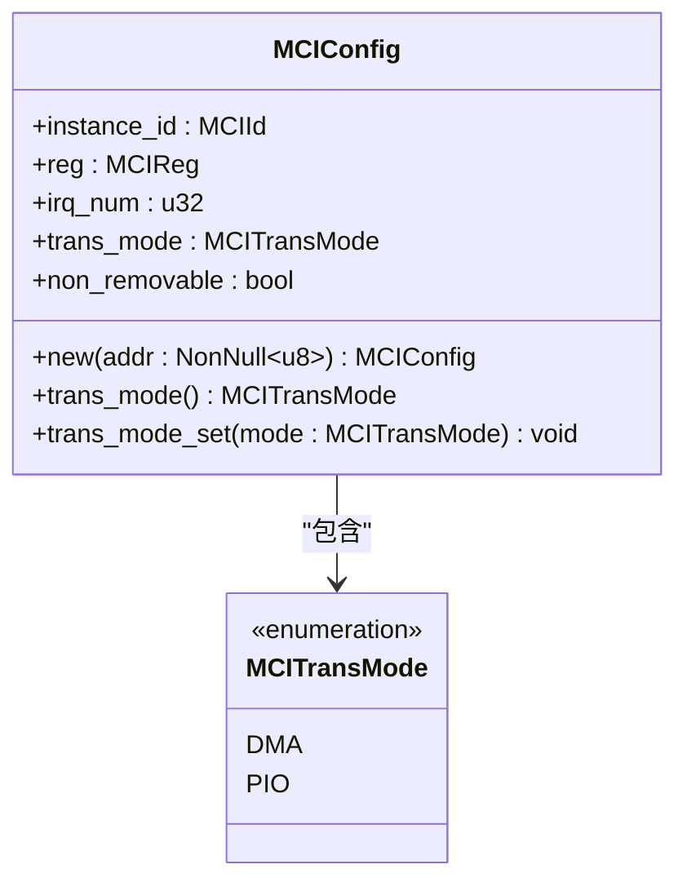
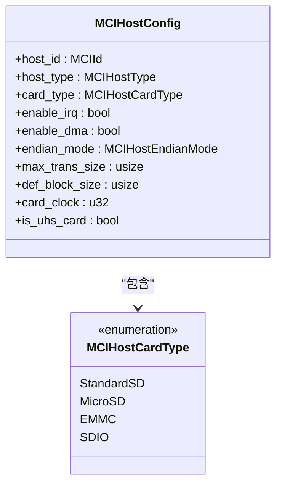
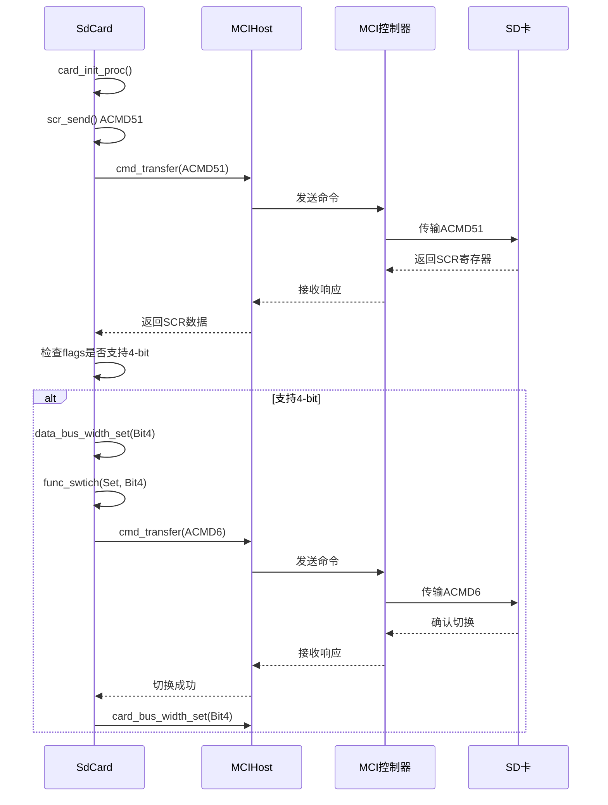
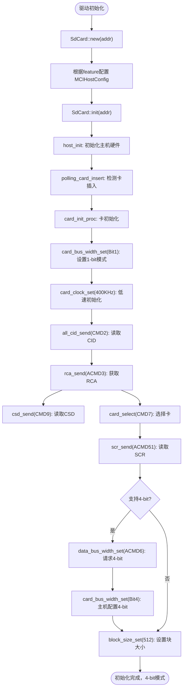
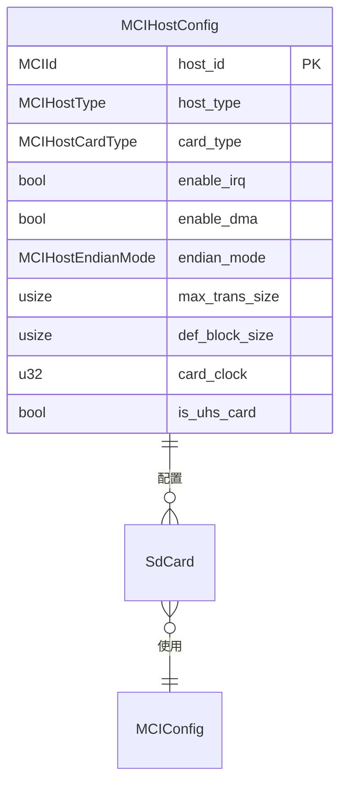

<cite>
**本文档中引用的文件**   
- [mci_config.rs](file://src/mci/mci_config.rs)
- [mci_host_config.rs](file://src/mci_host/mci_host_config.rs)
- [mci_cmd.rs](file://src/mci/mci_cmd.rs)
- [consts.rs](file://src/mci/consts.rs)
- [sd/consts.rs](file://src/mci_host/sd/consts.rs)
- [sd/mod.rs](file://src/mci_host/sd/mod.rs)
- [sd/scr.rs](file://src/mci_host/sd/scr.rs)
- [sd/csd.rs](file://src/mci_host/sd/csd.rs)
</cite>

# 总线宽度设置

## 目录
1. [引言](#引言)
2. [MCIConfig 与传输模式](#mciconfig-与传输模式)
3. [MCIHostCardType 与卡类型支持](#mcihostcardtype-与卡类型支持)
4. [总线宽度配置流程](#总线宽度配置流程)
5. [驱动初始化与模式切换](#驱动初始化与模式切换)
6. [对最大传输大小和默认块大小的影响](#对最大传输大小和默认块大小的影响)
7. [结论](#结论)

## 引言
本文档详细阐述了在 `phytium-mci` 驱动中，总线宽度（Bus Width）是如何被配置和管理的。核心机制涉及 `mci_config.rs` 中的 `MCIConfig` 结构体、`mci_host_config.rs` 中的 `MCIHostCardType` 枚举，以及在卡识别后通过发送特定命令（如 ACMD6）来完成的动态配置。文档将解释这些组件如何协同工作，以实现从默认的 1-bit 模式切换到更高效的 4-bit 模式，从而显著提升数据传输效率。

## MCIConfig 与传输模式

`MCIConfig` 结构体是 MCI（MultiMedia Card Interface）控制器的配置核心，其 `trans_mode` 字段直接决定了数据传输所采用的物理模式。

**Diagram sources**
- [mci_config.rs](file://src/mci/mci_config.rs#L1-L91)
- [consts.rs](file://src/mci/consts.rs#L60-L67)

**Section sources**
- [mci_config.rs](file://src/mci/mci_config.rs#L1-L91)
- [consts.rs](file://src/mci/consts.rs#L60-L67)

`trans_mode` 字段的类型为 `MCITransMode`，它是一个枚举，定义了两种主要的传输模式：`DMA`（直接内存访问）和 `PIO`（程序控制输入/输出）。虽然 `trans_mode` 本身不直接存储总线宽度值，但它通过编译时的 `feature` 配置间接影响了总线宽度的默认行为。

在 `MCIConfig::new` 方法中，可以通过 `cfg!(feature = "pio")` 来判断是否启用了 PIO 模式。如果启用了 PIO 模式，`trans_mode` 会被设置为 `MCITransMode::PIO`；否则，默认为 `MCITransMode::DMA`。这种模式的选择通常与硬件能力和性能需求相关。在实践中，`DMA` 模式因其高效率，通常与更宽的总线（如 4-bit 或 8-bit）配合使用，而 `PIO` 模式可能更多地用于调试或对性能要求不高的场景，其总线宽度配置则由后续的卡能力协商决定。

## MCIHostCardType 与卡类型支持

主机的配置不仅取决于控制器，还取决于所连接的卡类型。`MCIHostCardType` 枚举定义了驱动所支持的卡类型，不同类型的卡对总线宽度的支持能力存在显著差异。

**Diagram sources**
- [mci_host_config.rs](file://src/mci_host/mci_host_config.rs#L23-L41)
- [mci_host_config.rs](file://src/mci_host/mci_host_config.rs#L4-L21)

**Section sources**
- [mci_host_config.rs](file://src/mci_host/mci_host_config.rs#L4-L83)

`MCIHostCardType` 枚举包含 `StandardSD`、`MicroSD`、`EMMC` 和 `SDIO`。这些卡类型在物理规格和电气特性上有所不同，但它们在总线宽度支持方面遵循相似的 SD/MMC 协议规范。例如，`EMMC` 作为嵌入式设备，通常具有更稳定的连接，可能默认支持更宽的总线。而 `MicroSD` 和 `StandardSD` 则需要通过初始化流程来协商总线宽度。

`MCIHostConfig` 结构体中的 `card_type` 字段用于在初始化时指定预期的卡类型。这个配置是主机进行后续卡识别和能力协商的基础。主机需要根据 `card_type` 来选择合适的初始化序列和命令集。例如，eMMC 卡的初始化流程与标准 SD 卡略有不同，但它们都支持通过 `CMD6` 或 `ACMD6` 命令来切换总线宽度。

## 总线宽度配置流程

总线宽度的配置是一个在卡识别（Identification）阶段之后进行的动态过程。它不依赖于静态的 `MCIConfig` 或 `MCIHostConfig`，而是通过向已识别的卡发送特定命令来完成的。

**Diagram sources**
- [sd/mod.rs](file://src/mci_host/sd/mod.rs#L270-L300)
- [mci_cmd.rs](file://src/mci/mci_cmd.rs#L50-L176)
- [sd/scr.rs](file://src/mci_host/sd/scr.rs#L1-L43)
- [mci_host_config.rs](file://src/mci_host/mci_host_config.rs#L4-L83)

**Section sources**
- [sd/mod.rs](file://src/mci_host/sd/mod.rs#L270-L300)
- [mci_cmd.rs](file://src/mci/mci_cmd.rs#L50-L176)

该流程的核心步骤如下：

1.  **发送 SCR (SD Configuration Register)**：在卡进入数据传输模式后，主机通过发送 `ACMD51` 命令来读取卡的 SCR 寄存器。这在 `SdCard::card_init_proc` 方法中通过调用 `self.scr_send()` 实现。
2.  **解析 SCR 数据**：`scr_send` 方法会调用 `cmd_transfer` 发送 `ACMD51`，并将返回的数据解析到 `SdScr` 结构体中。`SdScr` 结构体的 `sd_bus_widths` 字段明确指示了卡所支持的总线宽度（例如，`0x04` 表示支持 4-bit 模式）。
3.  **发送总线宽度切换命令**：如果 `SdScr` 显示卡支持 4-bit 模式（即 `SdCardFlag::Support4BitWidth` 标志被设置），则调用 `SdCard::data_bus_width_set(MCIHostBusWdith::Bit4)`。
4.  **执行切换**：`data_bus_width_set` 方法内部会调用 `func_swtich`，构造一个 `ACMD6` 命令，其参数指定了将总线宽度设置为 4-bit。此命令通过 `cmd_transfer` 发送给卡。
5.  **主机侧配置**：在 `ACMD6` 命令成功返回后，主机调用 `host.dev.card_bus_width_set(MCIHostBusWdith::Bit4)` 来配置自身的硬件寄存器，将物理总线宽度从 1-bit 切换到 4-bit，从而完成双向的配置。

## 驱动初始化与模式切换

驱动的初始化流程是实现总线宽度切换的关键。`SdCard::new` 和 `SdCard::init` 方法共同完成了从上电到高效传输的全过程。

**Diagram sources**
- [sd/mod.rs](file://src/mci_host/sd/mod.rs#L100-L300)
- [mci_host_config.rs](file://src/mci_host/mci_host_config.rs#L4-L83)

**Section sources**
- [sd/mod.rs](file://src/mci_host/sd/mod.rs#L100-L300)

如流程图所示，初始化流程始于 `SdCard::new`，它会创建一个默认的 `MCIHostConfig` 实例。随后，`SdCard::init` 启动完整的初始化过程。在 `card_init_proc` 中，主机首先以 1-bit 模式和 400KHz 的低速时钟与卡通信，完成基本的识别。只有在成功读取了 SCR 寄存器并确认卡支持 4-bit 模式后，驱动才会执行 `ACMD6` 命令来请求切换。一旦切换成功，主机和卡之间的数据传输通道就从单线扩展到了四线，为后续的高速数据传输奠定了基础。

## 对最大传输大小和默认块大小的影响

总线宽度的增加直接影响了数据传输的效率，但 `MCIHostConfig` 中的 `max_trans_size` 和 `def_block_size` 两个参数是独立配置的，并不会因为总线宽度的改变而自动调整。

**Diagram sources**
- [mci_host_config.rs](file://src/mci_host/mci_host_config.rs#L4-L21)
- [mci_config.rs](file://src/mci/mci_config.rs#L1-L91)

**Section sources**
- [mci_host_config.rs](file://src/mci_host/mci_host_config.rs#L4-L83)

-   **`max_trans_size`**：此参数定义了单次传输操作的最大字节数，通常在 `MCIHostConfig::new` 中根据 `SD_MAX_RW_BLK` 和 `SD_BLOCK_SIZE` 计算得出（例如，1024 * 512 = 512KB）。它主要受主机 DMA 控制器和内存缓冲区大小的限制。将总线宽度从 1-bit 提升到 4-bit 并不会改变这个最大值，但它会将传输这个最大数据量所需的时间缩短到原来的 1/4，从而极大地提升了有效带宽。
-   **`def_block_size`**：此参数定义了数据块的默认大小，通常为 512 字节（`SD_BLOCK_SIZE`）。这个值是由 SD/MMC 协议规定的逻辑块大小，与物理总线宽度无关。无论总线是 1-bit 还是 4-bit，主机与卡之间交换的数据都是以 512 字节为单位的块。总线宽度的增加只是让这 512 字节的数据能够更快地在物理线路上并行传输。

因此，总线宽度的切换主要优化了**传输速率**，而 `max_trans_size` 和 `def_block_size` 则定义了传输的**容量**和**粒度**。三者共同作用，决定了系统的整体数据传输性能。

## 结论
综上所述，`phytium-mci` 驱动中的总线宽度配置是一个结合了静态配置和动态协商的智能过程。`MCIConfig` 的 `trans_mode` 通过编译时特性间接影响了传输模式的选择，而 `MCIHostCardType` 则明确了目标卡的类型。最终，通过在初始化流程中执行 `ACMD51` 读取 SCR 和 `ACMD6` 切换总线宽度的命令，驱动能够动态地将物理连接从低效的 1-bit 模式升级到高效的 4-bit 模式。这一操作显著提升了数据传输速率，而 `max_trans_size` 和 `def_block_size` 等参数则保持不变，确保了协议的兼容性。这种设计既保证了灵活性，又实现了性能的最优化。