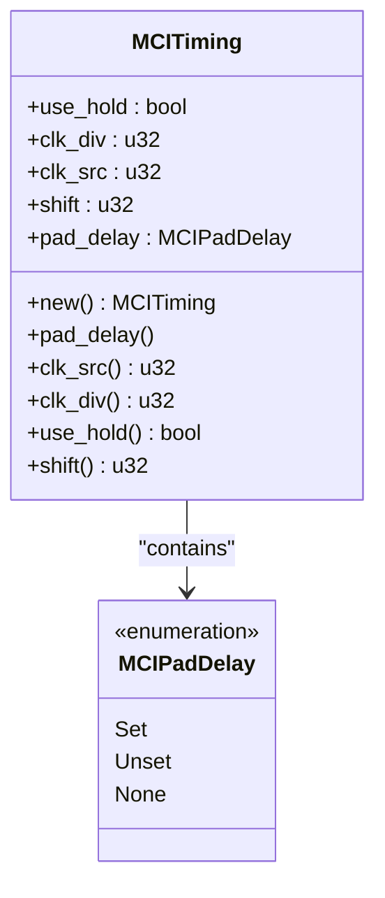
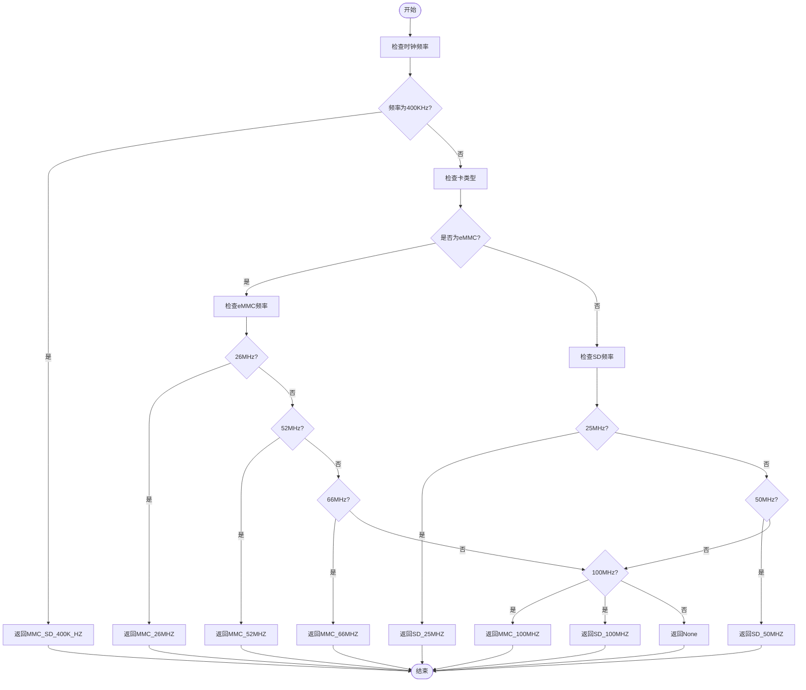
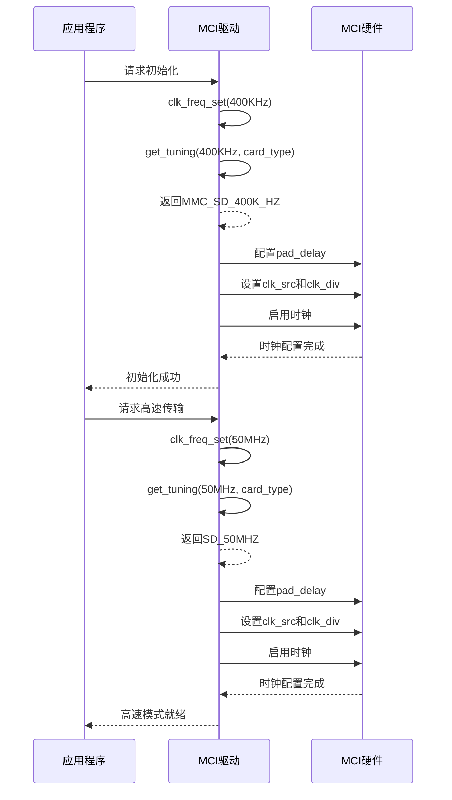
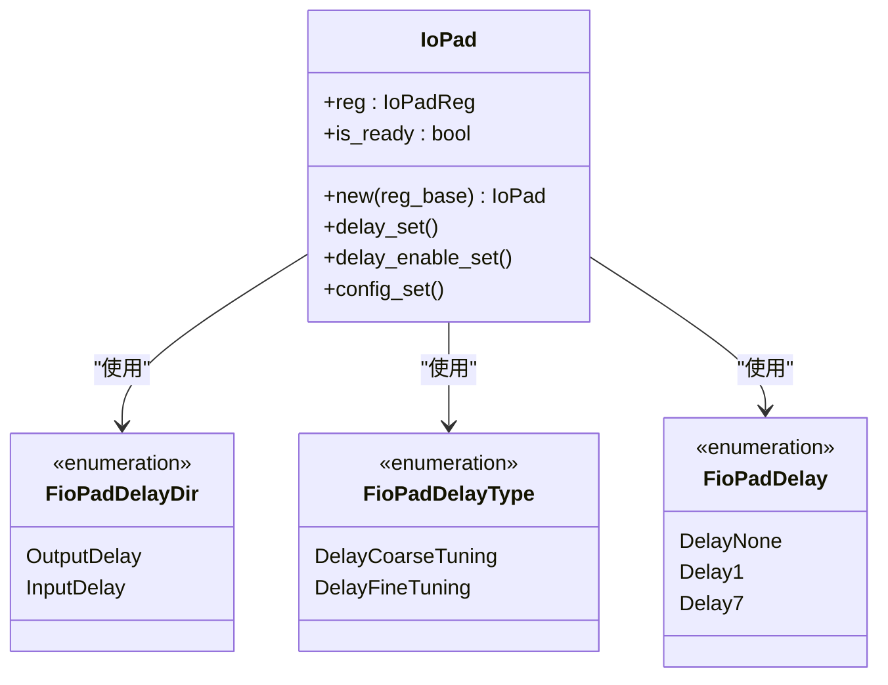

# 时钟配置

<cite>
**Referenced Files in This Document**   
- [mci_timing.rs](file://src/mci/mci_timing.rs)
- [mci_config.rs](file://src/mci/mci_config.rs)
- [consts.rs](file://src/mci/consts.rs)
- [mci_hardware.rs](file://src/mci/mci_hardware.rs)
- [mod.rs](file://src/mci/mod.rs)
- [iopad/mod.rs](file://src/iopad/mod.rs)
</cite>

## 目录
1. [时钟配置概述](#时钟配置概述)
2. [预定义时钟常量](#预定义时钟常量)
3. [MCITiming结构体详解](#mcitiming结构体详解)
4. [时钟配置选择逻辑](#时钟配置选择逻辑)
5. [时钟初始化与切换流程](#时钟初始化与切换流程)
6. [pad_delay机制与信号完整性](#pad_delay机制与信号完整性)
7. [时钟配置应用示例](#时钟配置应用示例)

## 时钟配置概述

本节详细说明Phytium MCI驱动中的时钟配置机制，重点解释`mci_timing.rs`中预定义的常量如何根据SD卡协议规范设置时钟频率和分频参数。系统通过`MCITiming`结构体管理时钟配置，并结合`mci_config.rs`中的`get_tuning`函数根据卡类型和目标频率选择合适的时钟配置。

**Section sources**
- [mci_timing.rs](file://src/mci/mci_timing.rs#L1-L182)
- [mci_config.rs](file://src/mci/mci_config.rs#L1-L91)

## 预定义时钟常量

`mci_timing.rs`文件中定义了一系列预定义的时钟配置常量，这些常量根据SD卡协议规范设置了特定的时钟频率和分频参数。每个常量对应不同的工作模式和卡类型，确保MCI控制器能够正确地与不同类型的SD卡通信。

**Diagram sources**
- [mci_timing.rs](file://src/mci/mci_timing.rs#L10-L182)

**Section sources**
- [mci_timing.rs](file://src/mci/mci_timing.rs#L50-L80)

## MCITiming结构体详解

`MCITiming`结构体是时钟配置的核心数据结构，包含多个字段来控制MCI控制器的时钟输出特性。这些字段共同决定了时钟信号的质量和稳定性。

### clk_div字段

`clk_div`字段用于设置时钟分频器的值，直接决定了输出时钟的频率。该值根据系统主时钟和目标SD卡时钟频率计算得出，确保能够生成符合协议要求的精确时钟信号。

### clk_src字段

`clk_src`字段配置时钟源寄存器，选择适当的时钟源和预分频设置。这个参数与`clk_div`协同工作，共同实现精确的时钟频率控制。

### use_hold字段

`use_hold`字段控制是否启用时钟保持功能。当设置为`true`时，系统会在数据传输期间保持时钟信号的稳定性，防止时钟抖动影响数据完整性。

### shift字段

`shift`字段用于配置时钟相位偏移，可以微调时钟信号的相位，以优化数据采样时机，提高数据传输的可靠性。

**Section sources**
- [mci_timing.rs](file://src/mci/mci_timing.rs#L10-L45)

## 时钟配置选择逻辑

系统通过`mci_config.rs`文件中的`get_tuning`函数实现智能的时钟配置选择逻辑。该函数根据卡类型（eMMC或SD）和目标频率动态选择最合适的时钟配置。

**Diagram sources**
- [mci_config.rs](file://src/mci/mci_config.rs#L70-L90)

**Section sources**
- [mci_config.rs](file://src/mci/mci_config.rs#L70-L90)
- [consts.rs](file://src/mci/consts.rs#L100-L130)

## 时钟初始化与切换流程

时钟配置的初始化和切换是SD卡通信过程中的关键步骤。系统首先使用低速时钟进行卡识别，然后切换到高速时钟进行数据传输。

**Diagram sources**
- [mci_timing.rs](file://src/mci/mci_timing.rs#L50-L80)
- [mci_config.rs](file://src/mci/mci_config.rs#L70-L90)
- [mci_hardware.rs](file://src/mci/mci_hardware.rs#L50-L100)
- [mod.rs](file://src/mci/mod.rs#L200-L300)

**Section sources**
- [mci_timing.rs](file://src/mci/mci_timing.rs#L50-L80)
- [mci_config.rs](file://src/mci/mci_config.rs#L70-L90)
- [mci_hardware.rs](file://src/mci/mci_hardware.rs#L50-L100)
- [mod.rs](file://src/mci/mod.rs#L200-L300)

## pad_delay机制与信号完整性

`pad_delay`机制通过`iopad`模块调整时钟输出延迟，确保信号完整性。该机制对于高速数据传输尤为重要，可以补偿信号传播延迟，优化时钟和数据的时序关系。

**Diagram sources**
- [iopad/mod.rs](file://src/iopad/mod.rs#L1-L161)
- [mci_timing.rs](file://src/mci/mci_timing.rs#L100-L150)

**Section sources**
- [iopad/mod.rs](file://src/iopad/mod.rs#L1-L161)
- [mci_timing.rs](file://src/mci/mci_timing.rs#L100-L150)

## 时钟配置应用示例

以下示例展示了如何在实际应用中使用时钟配置：

1. **低速识别模式配置**：在SD卡初始化阶段，使用`MMC_SD_400K_HZ`常量配置低速时钟，确保卡能够正确识别和响应命令。

2. **高速数据传输切换**：在卡初始化完成后，调用`clk_freq_set`函数并传入`SD_50MHZ`配置，切换到高速模式进行数据传输。

3. **动态配置调整**：根据实际应用场景和性能需求，系统可以动态选择不同的时钟配置，平衡性能和功耗。

**Section sources**
- [mci_timing.rs](file://src/mci/mci_timing.rs#L50-L80)
- [mci_config.rs](file://src/mci/mci_config.rs#L70-L90)
- [mod.rs](file://src/mci/mod.rs#L200-L300)