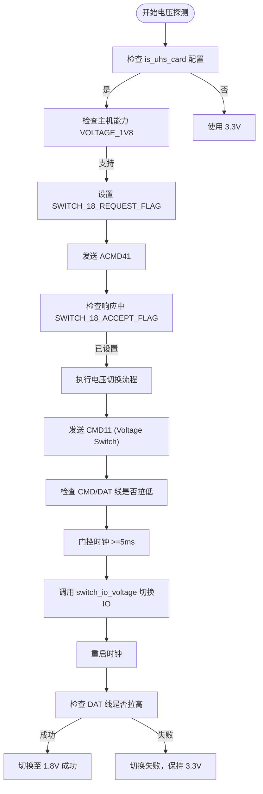

<cite>
**Referenced Files in This Document**   
- [mci_host_config.rs](file://src/mci_host/mci_host_config.rs)
- [mci_timing.rs](file://src/mci/mci_timing.rs)
- [io_voltage.rs](file://src/mci_host/sd/io_voltage.rs)
- [mod.rs](file://src/mci_host/sd/mod.rs)
- [constants.rs](file://src/mci_host/constants.rs)
</cite>

# 电压切换

## 项目结构
本驱动项目采用分层模块化设计，核心电压切换功能主要分布在`mci_host`和`mci`两个模块中。`mci_host`模块负责SD卡协议层的电压协商与切换流程，而`mci`模块则处理底层硬件时钟和IO延迟的配置。

## 核心组件

### MCIHostConfig 结构体分析
`MCIHostConfig`结构体定义了主机控制器的配置参数，其中`is_uhs_card`标志位是电压切换逻辑的关键入口。该标志位在`sdif_config`函数中被检查，用于决定是否启用UHS（Ultra High Speed）模式相关的电压能力。

**Section sources**
- [mci_host_config.rs](file://src/mci_host/mci_host_config.rs#L1-L83)

### 电压枚举与能力定义
尽管代码中未显式定义独立的电压枚举，但`MCIHostOperationVoltage`枚举（定义于`constants.rs`）明确标识了支持的电压等级：`Voltage330V`、`Voltage300V`和`Voltage180V`。主机的电压能力通过`MCIHostCapability`位标志进行声明，其中`VOLTAGE_1V8`位表示支持1.8V信号。

**Section sources**
- [constants.rs](file://src/mci_host/constants.rs#L250-L299)

## 架构概述

### 电压切换整体流程
电压切换是一个多阶段的协商过程，涉及主机配置、卡能力探测、电压切换命令和硬件时序调整。流程始于`SdCard`的初始化，通过`bus_voltage_prob`函数探测卡的电压支持能力，并根据`is_uhs_card`配置决定是否尝试切换到1.8V。



**Diagram sources**
- [mod.rs](file://src/mci_host/sd/mod.rs#L354-L459)
- [mod.rs](file://src/mci_host/sd/mod.rs#L1269-L1307)

## 详细组件分析

### 电压探测与协商
`bus_voltage_prob`函数是电压协商的起点。它首先根据`is_uhs_card`标志和主机能力，决定是否在ACMD41命令中请求1.8V切换。如果卡在响应中确认了`SWITCH_18_ACCEPT_FLAG`，则调用`voltage_switch`函数执行实际的切换操作。

**Section sources**
- [mod.rs](file://src/mci_host/sd/mod.rs#L354-L459)

### 电压切换命令执行
`voltage_switch`函数实现了SD规范中定义的电压切换程序。关键步骤包括：
1.  发送CMD11命令，要求卡将CMD和DAT线拉低。
2.  验证卡是否已将信号线拉低。
3.  门控时钟至少5ms，为电压切换提供稳定时间。
4.  调用`switch_io_voltage`切换主机侧的IO电压。
5.  重启时钟，并验证卡是否已将DAT线拉高，确认切换成功。

**Section sources**
- [mod.rs](file://src/mci_host/sd/mod.rs#L1269-L1307)

### IO电压切换实现
`switch_io_voltage`函数根据`SdIoVoltage`对象的`typ`字段决定切换方式。当`typ`为`ByHost`时，会调用底层硬件驱动的`switch_to_voltage`方法，这是未来扩展1.8V支持的核心接口。

**Section sources**
- [io_voltage.rs](file://src/mci_host/sd/io_voltage.rs#L0-L34)
- [mod.rs](file://src/mci_host/sd/mod.rs#L422-L459)

## 依赖分析

### 电压与时序配置联动
电压切换成功后，必须调整IO延迟以适应新的电气特性。`MCITiming`结构体中的`pad_delay`字段控制着IO延迟的设置。在`mci_timing.rs`中，`SD_50MHZ`和`SD_100MHZ`等高速时序配置都启用了`pad_delay`，通过`set_pad_delay`函数进行实际的延迟配置。

```mermaid
classDiagram
class MCIHostConfig {
+host_id : MCIId
+host_type : MCIHostType
+card_type : MCIHostCardType
+enable_irq : bool
+enable_dma : bool
+endian_mode : MCIHostEndianMode
+max_trans_size : usize
+def_block_size : usize
+card_clock : u32
+is_uhs_card : bool
}
class SdCard {
+base : MCICardBase
+usr_param : SdUsrParam
+operation_voltage : MCIHostOperationVoltage
+flags : SdCardFlag
}
class MCITiming {
+use_hold : bool
+clk_div : u32
+clk_src : u32
+shift : u32
+pad_delay : MCIPadDelay
}
class SdIoVoltage {
+typ : SdIoVoltageCtrlType
+func : Option<SdIoVoltageFn>
}
MCIHostConfig --> SdCard : "配置"
SdCard --> MCITiming : "根据电压/时序选择"
SdCard --> SdIoVoltage : "控制"
MCITiming --> "set_pad_delay" : "调用"
```

**Diagram sources**
- [mci_host_config.rs](file://src/mci_host/mci_host_config.rs#L1-L83)
- [mci_timing.rs](file://src/mci/mci_timing.rs#L1-L182)
- [io_voltage.rs](file://src/mci_host/sd/io_voltage.rs#L0-L34)

## 假设性切换示例

以下是一个从3.3V切换到1.8V的假设性流程：

1.  **初始化与探测**：主机在`sdif_config`中根据`is_uhs_card=true`配置，声明支持`VOLTAGE_1V8`和`SDR50`能力。
2.  **协商请求**：在`bus_voltage_prob`中，向卡发送带有`SWITCH_18_REQUEST_FLAG`的ACMD41命令。
3.  **接收确认**：卡在响应中设置了`SWITCH_18_ACCEPT_FLAG`，表明支持1.8V。
4.  **执行切换**：
    *   发送CMD11，卡将CMD/DAT线拉低。
    *   主机门控时钟5ms。
    *   主机调用`switch_io_voltage(Voltage180V)`，通过硬件驱动将IO电压切换至1.8V。
    *   主机重启时钟。
    *   卡将DAT线拉高，确认切换成功。
5.  **时序调整**：主机根据1.8V下的SDR50模式，选择`SD_100MHZ`时序配置，并调用`set_pad_delay`应用相应的IO延迟设置，确保信号完整性。

此流程确保了电压切换过程中的时钟稳定性和信号时序的正确性。