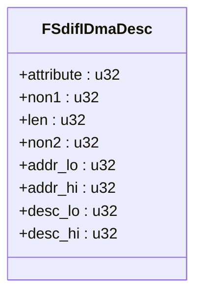
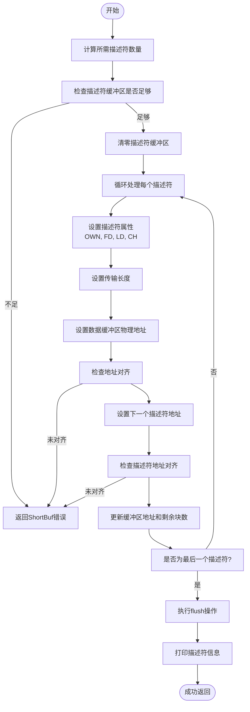
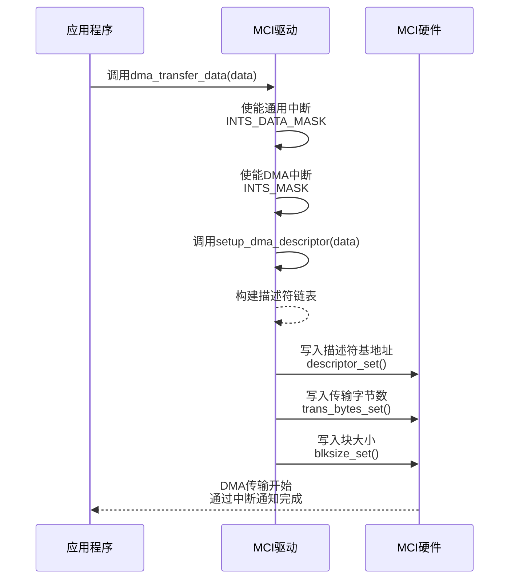

# DMA模式

<cite>
**Referenced Files in This Document**   
- [mci_dma.rs](file://src/mci/mci_dma.rs)
- [mci_data.rs](file://src/mci/mci_data.rs)
- [consts.rs](file://src/mci/consts.rs)
- [regs.rs](file://src/mci/regs.rs)
- [pool_buffer.rs](file://src/osa/pool_buffer.rs)
</cite>

## 目录
1. [引言](#引言)
2. [DMA描述符结构设计](#dma描述符结构设计)
3. [DMA描述符链表构建](#dma描述符链表构建)
4. [DMA传输启动流程](#dma传输启动流程)
5. [内存屏障与缓存一致性](#内存屏障与缓存一致性)
6. [性能分析与最佳实践](#性能分析与最佳实践)

## 引言

本文档详细阐述了Phytium MCI驱动中DMA传输模式的实现机制。文档聚焦于`mci_dma.rs`文件中的核心数据结构与功能函数，深入解析了DMA描述符的设计原理、链表构建过程、传输启动机制以及内存一致性保障。通过分析`FSdifIDmaDesc`结构体、`setup_dma_descriptor`函数和`dma_transfer_data`函数的实现，为开发者提供了对DMA传输模式的全面理解，特别是在大块数据传输场景下的性能优势和最佳实践指导。

## DMA描述符结构设计

### FSdifIDmaDesc结构体详解

`FSdifIDmaDesc`结构体是DMA传输的核心数据结构，定义了单个DMA描述符的硬件布局和属性。该结构体的设计严格遵循硬件规范，确保与DMA控制器的正确交互。

**Diagram sources**
- [mci_dma.rs](file://src/mci/mci_dma.rs#L6-L15)

**Section sources**
- [mci_dma.rs](file://src/mci/mci_dma.rs#L6-L15)
- [consts.rs](file://src/mci/consts.rs#L140-L150)

#### 字段硬件含义

- **attribute (属性字段)**: 控制描述符行为的关键位域，包含：
  - `FSDIF_IDMAC_DES0_OWN`：所有权位，置1表示DMA控制器拥有该描述符，传输完成后由硬件清零。
  - `FSDIF_IDMAC_DES0_FD`：首描述符标记，标识链表中的第一个描述符。
  - `FSDIF_IDMAC_DES0_LD`：尾描述符标记，标识链表中的最后一个描述符。
  - `FSDIF_IDMAC_DES0_CH`：链接位，表示描述符链表模式，需置1以启用链表。
  - `FSDIF_IDMAC_DES0_ER`：结束环标记，用于循环链表，此处用于标识链表末尾。

- **addr_lo/addr_hi (地址字段)**: 存储数据缓冲区的物理地址。在64位系统（aarch64）上，使用`addr_hi`和`addr_lo`组合表示完整的64位物理地址；在32位系统上，`addr_hi`被置零。

- **desc_lo/desc_hi (描述符地址字段)**: 指向链表中下一个描述符的物理地址。对于链表末尾的描述符，此字段被置零。

- **len (长度字段)**: 指定当前描述符需要传输的数据字节数。

- **non1/non2 (保留字段)**: 预留字段，初始化时被清零。

## DMA描述符链表构建

### setup_dma_descriptor函数分析

`setup_dma_descriptor`函数负责根据待传输的数据信息，动态构建DMA描述符链表。该函数是DMA传输准备阶段的核心。

**Diagram sources**
- [mci_dma.rs](file://src/mci/mci_dma.rs#L82-L178)

**Section sources**
- [mci_dma.rs](file://src/mci/mci_dma.rs#L82-L178)
- [mci_data.rs](file://src/mci/mci_data.rs#L40-L60)
- [consts.rs](file://src/mci/consts.rs#L140-L150)

#### 构建流程详解

1.  **计算描述符数量**: 函数首先根据`MCIData`中的总数据长度（`blkcnt * blksz`）和单个描述符最大传输长度（`desc_trans_sz`）计算出构建链表所需的描述符总数。如果总长度超过单个描述符容量，则需要多个描述符。

2.  **资源检查**: 检查预先分配的描述符缓冲区（`desc_list.desc_num`）是否足够容纳计算出的数量，若不足则返回`ShortBuf`错误。

3.  **初始化与清零**: 使用`core::ptr::write_bytes`将整个描述符缓冲区清零，确保所有字段处于已知的初始状态。

4.  **循环填充描述符**: 对每个描述符进行配置：
    - **属性设置**: 设置`OWN`位，表示DMA控制器可以接管。根据索引设置`FD`（首）和`LD`（尾）标记。始终设置`CH`位以启用链表模式。
    - **长度设置**: 计算当前描述符传输的数据块数（受`desc_trans_sz`限制），并乘以块大小得到`len`。
    - **地址设置**: 将`MCIData`中提供的数据缓冲区物理地址（`buf_dma`）填入`addr_lo/addr_hi`。代码会检查该地址是否按块大小对齐。
    - **链表链接**: 计算下一个描述符的物理地址并填入`desc_lo/addr_hi`。对于最后一个描述符，此地址被置零。

5.  **内存屏障**: 在所有描述符配置完成后，调用`flush`函数，确保描述符数据从CPU缓存刷新到主内存，使DMA控制器能够读取到最新的配置。

## DMA传输启动流程

### dma_transfer_data函数分析

`dma_transfer_data`函数是启动DMA数据传输的入口点，它协调中断设置、描述符配置和硬件寄存器写入。

**Diagram sources**
- [mci_dma.rs](file://src/mci/mci_dma.rs#L180-L217)
- [regs.rs](file://src/mci/regs.rs#L200-L300)

**Section sources**
- [mci_dma.rs](file://src/mci/mci_dma.rs#L180-L217)
- [regs.rs](file://src/mci/regs.rs#L200-L300)

#### 启动步骤

1.  **中断使能**: 函数首先调用`interrupt_mask_set`，分别使能通用中断寄存器中的数据相关中断（`INTS_DATA_MASK`）和DMA中断寄存器中的关键中断（`INTS_MASK`，包括传输完成、接收完成和总线错误）。

2.  **描述符配置**: 调用`setup_dma_descriptor`函数，根据传入的`MCIData`参数构建完整的DMA描述符链表。

3.  **硬件寄存器写入**: 
    - 调用`descriptor_set`，将第一个描述符的物理地址写入硬件的`FSDIF_DESC_LIST_ADDRL_OFFSET`和`FSDIF_DESC_LIST_ADDRH_OFFSET`寄存器。
    - 调用`trans_bytes_set`，将总传输字节数写入`FSDIF_BYT_CNT_OFFSET`寄存器。
    - 调用`blksize_set`，将块大小写入`FSDIF_BLK_SIZ_OFFSET`寄存器。

完成这些步骤后，DMA控制器会自动从内存中读取描述符链表并开始数据传输。

## 内存屏障与缓存一致性

### flush函数的关键作用

在DMA系统中，CPU和DMA控制器共享物理内存。由于CPU通常带有缓存，而DMA控制器直接访问主内存，这可能导致数据不一致问题。`flush`函数在此扮演了至关重要的角色。

**Section sources**
- [mci_dma.rs](file://src/mci/mci_dma.rs#L176)
- [pool_buffer.rs](file://src/osa/pool_buffer.rs#L100-L110)

#### 作用机制

当`setup_dma_descriptor`函数配置完所有描述符后，这些数据可能还停留在CPU的写缓存（Write Cache）中，并未真正写入主内存。如果此时DMA控制器开始读取描述符，它将读取到过时或无效的数据，导致传输失败。

`flush`函数（在`pool_buffer.rs`中实现）通过执行特定的内存屏障（Memory Barrier）指令，强制将CPU缓存中所有对描述符内存区域的修改刷新（Flush）到主内存。这确保了DMA控制器在读取描述符时，能够看到CPU写入的最新、最完整的配置信息，从而保证了数据的一致性和传输的可靠性。

## 性能分析与最佳实践

### DMA模式的优势与实践

DMA（直接内存访问）模式通过让专用的DMA控制器接管数据传输任务，显著减轻了CPU的负担，从而在大块数据传输场景下展现出卓越的性能优势。

**Section sources**
- [mci_dma.rs](file://src/mci/mci_dma.rs#L82-L217)
- [consts.rs](file://src/mci/consts.rs#L150)

#### 性能优势

- **CPU卸载**: CPU无需参与每个数据块的搬运，可以并行处理其他任务，极大地提高了系统整体效率。
- **高吞吐量**: DMA控制器专为高速数据传输设计，能够以接近总线带宽的速率进行数据搬运。
- **低延迟中断**: DMA传输通常只在开始和结束时产生中断，相比PIO模式下每个数据块都可能产生中断，大大减少了中断开销。

#### 最佳实践

1.  **合理配置desc_trans_sz**: 根据实际应用场景和硬件能力，合理设置单个描述符的最大传输长度（`desc_trans_sz`），以平衡描述符数量和传输效率。
2.  **确保地址对齐**: 严格遵守代码中对数据缓冲区和描述符地址的对齐要求，避免因对齐错误导致的传输失败。
3.  **预分配资源**: 在系统初始化时预分配足够数量的DMA描述符和数据缓冲区（如使用`PoolBuffer`），避免在传输过程中进行动态内存分配，保证实时性。
4.  **正确使用flush**: 在任何修改了DMA描述符或数据缓冲区的操作后，尤其是在启动传输前，必须确保调用了`flush`或类似的内存屏障函数，以维护缓存一致性。