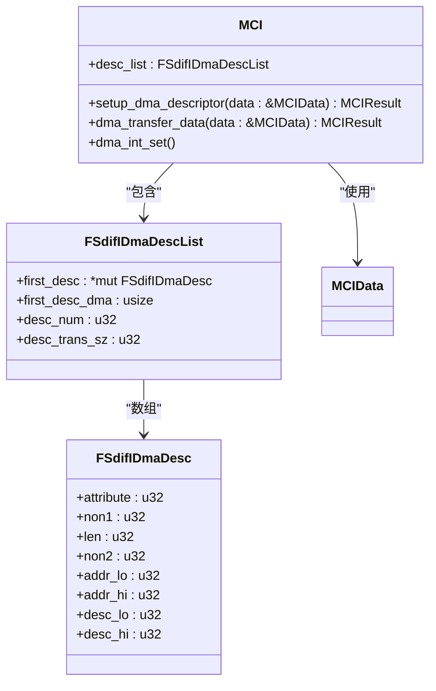
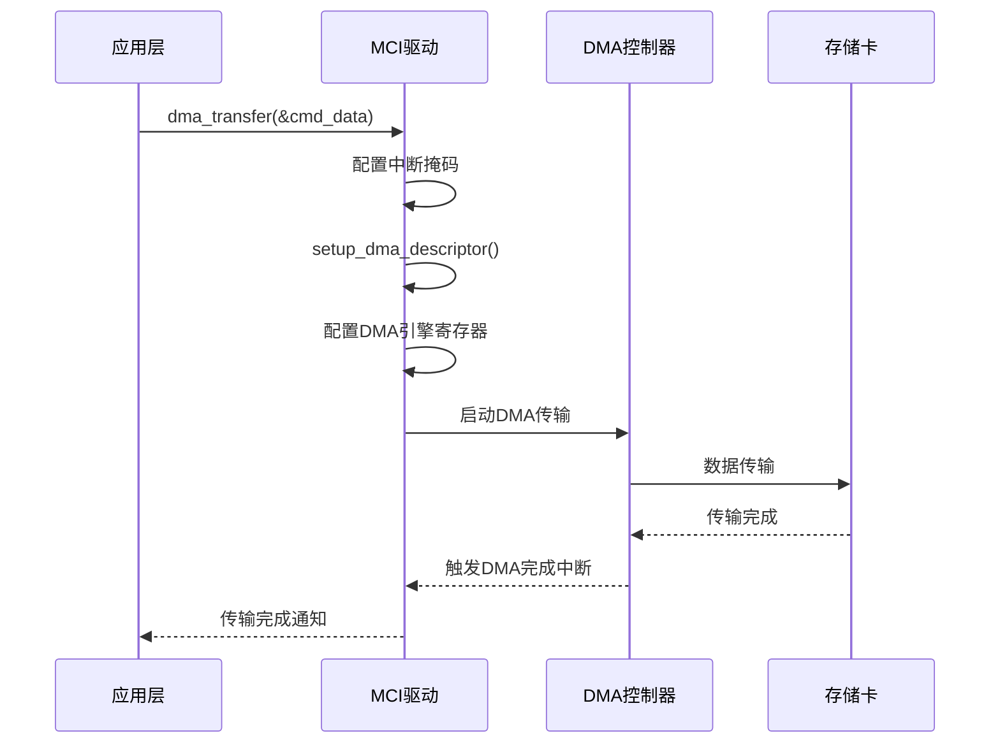
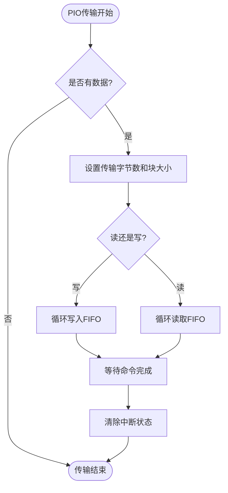
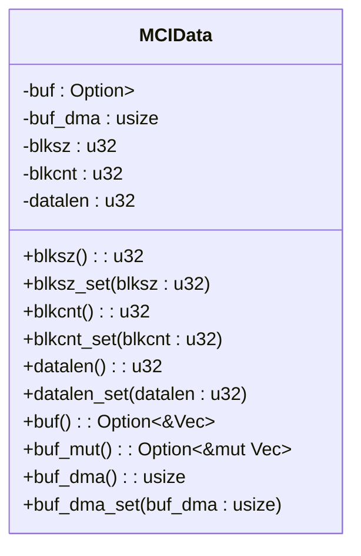

# 传输模式

<cite>
**本文档引用的文件**
- [mci_dma.rs](file://src/mci/mci_dma.rs)
- [mci_pio.rs](file://src/mci/mci_pio.rs)
- [mci_data.rs](file://src/mci/mci_data.rs)
- [mci_config.rs](file://src/mci/mci_config.rs)
- [mci_intr.rs](file://src/mci/mci_intr.rs)
- [regs.rs](file://src/mci/regs.rs)
- [consts.rs](file://src/mci/consts.rs)
- [mod.rs](file://src/mci/mod.rs)
</cite>

## 目录
1. [介绍](#介绍)
2. [DMA传输模式](#dma传输模式)
3. [PIO传输模式](#pio传输模式)
4. [数据传输参数配置](#数据传输参数配置)
5. [模式对比与适用场景](#模式对比与适用场景)

## 介绍
本文档详细说明Phytium MCI驱动支持的两种数据传输模式：DMA（直接内存访问）和PIO（编程输入/输出）。DMA模式通过配置DMA描述符链表实现高效的数据传输，而PIO模式则通过轮询FIFO缓冲区进行数据读写。两种模式在性能、资源消耗和适用场景上各有特点，驱动通过编译时特性（feature）选择其中一种模式运行。

**Section sources**
- [mci_config.rs](file://src/mci/mci_config.rs#L0-L40)

## DMA传输模式

DMA模式通过`mci_dma.rs`文件中的`FSdifIDmaDesc`结构体管理DMA描述符，并利用IDMAC（集成DMA控制器）实现高效的数据传输。该模式适用于大数据量传输，能够显著降低CPU负载。

### DMA描述符管理
`FSdifIDmaDesc`结构体定义了DMA描述符的格式，包含传输属性、数据长度、缓冲区地址和下一个描述符地址等字段。驱动在初始化时通过`set_idma_list`函数设置描述符链表的基地址和数量。



**Diagram sources**
- [mci_dma.rs](file://src/mci/mci_dma.rs#L10-L217)
- [mci_data.rs](file://src/mci/mci_data.rs#L0-L72)

### 数据传输流程
DMA数据传输流程包括以下步骤：
1. 调用`dma_transfer_data`函数启动传输
2. 配置中断掩码，启用DMA相关中断
3. 调用`setup_dma_descriptor`函数设置描述符链表
4. 配置DMA引擎的描述符基地址、传输字节数和块大小
5. IDMAC自动执行数据传输

在`setup_dma_descriptor`函数中，驱动根据传输数据大小计算所需描述符数量，并为每个描述符设置适当的属性标志：
- `FSDIF_IDMAC_DES0_OWN`：表示描述符由DMA控制器拥有
- `FSDIF_IDMAC_DES0_CH`：表示链接到下一个描述符
- `FSDIF_IDMAC_DES0_FD`：表示第一个描述符
- `FSDIF_IDMAC_DES0_LD`：表示最后一个描述符
- `FSDIF_IDMAC_DES0_ER`：表示链表结束



**Diagram sources**
- [mci_dma.rs](file://src/mci/mci_dma.rs#L100-L217)
- [mci_intr.rs](file://src/mci/mci_intr.rs#L30-L74)

### DMA完成中断处理
DMA传输完成后，硬件会触发中断。中断处理函数`fsdif_interrupt_handler`检查`MCIDMACStatus`寄存器的状态位：
- `TI`（发送中断）：表示发送链表数据传输完成
- `RI`（接收中断）：表示接收链表数据传输完成
- `FBE`（致命总线错误中断）：表示发生总线错误

驱动通过`dma_int_set`函数启用这些中断，并在中断处理程序中调用相应的完成处理函数。

**Section sources**
- [mci_dma.rs](file://src/mci/mci_dma.rs#L50-L100)
- [mci_intr.rs](file://src/mci/mci_intr.rs#L71-L97)

## PIO传输模式

PIO模式通过`mci_pio.rs`文件中的轮询方式读写FIFO缓冲区来实现数据传输。该模式不使用DMA控制器，而是由CPU直接参与数据传输过程。

### FIFO缓冲区读写
PIO模式通过两个核心函数实现数据传输：
- `pio_write_data`：将数据写入FIFO缓冲区
- `pio_read_data`：从FIFO缓冲区读取数据



**Diagram sources**
- [mci_pio.rs](file://src/mci/mci_pio.rs#L0-L50)

### 数据传输流程
PIO数据传输流程如下：
1. 调用`pio_transfer`函数启动传输
2. 重置FIFO，禁用DMA模式
3. 设置传输字节数和块大小寄存器
4. 如果是写操作，调用`pio_write_data`将数据写入FIFO
5. 发送命令
6. 如果是读操作，等待数据传输完成中断，然后调用`pio_read_data`从FIFO读取数据

在`pio_write_data`函数中，驱动将32位数据逐个写入`MCIDataReg`寄存器，直到所有数据传输完成。对于读操作，驱动从`MCIDataReg`寄存器逐个读取32位数据并存入缓冲区。

**Section sources**
- [mci_pio.rs](file://src/mci/mci_pio.rs#L0-L50)
- [mod.rs](file://src/mci/mod.rs#L500-L550)

## 数据传输参数配置

数据传输参数通过`mci_data.rs`文件中的`MCIData`结构体进行配置。该结构体封装了数据传输所需的所有参数。



**Diagram sources**
- [mci_data.rs](file://src/mci/mci_data.rs#L0-L72)

`MCIData`结构体包含以下关键字段：
- `buf`：数据缓冲区（可选）
- `buf_dma`：缓冲区的物理地址
- `blksz`：块大小（字节）
- `blkcnt`：块数量
- `datalen`：总数据长度

这些参数在DMA和PIO模式下都被使用，但在DMA模式下要求缓冲区地址必须对齐到块大小边界。

**Section sources**
- [mci_data.rs](file://src/mci/mci_data.rs#L0-L72)

## 模式对比与适用场景

| 特性 | DMA模式 | PIO模式 |
|------|---------|--------|
| **CPU占用** | 低 | 高 |
| **传输效率** | 高 | 低 |
| **实现复杂度** | 高 | 低 |
| **内存要求** | 需要DMA描述符 | 仅需FIFO缓冲区 |
| **最大传输大小** | 受描述符数量限制 | 受FIFO大小限制（0x800字节） |
| **中断频率** | 传输完成后一次中断 | 每次传输可能多次中断 |

### 适用场景
- **DMA模式**：适用于大数据量传输（如文件读写、大块数据传输），能够显著降低CPU负载，提高系统整体性能。
- **PIO模式**：适用于小数据量传输或系统资源受限的场景，实现简单，不需要复杂的DMA描述符管理。

驱动通过编译时特性选择传输模式，确保在同一时间只能启用一种模式：
```rust
#[cfg(all(feature = "dma", feature = "pio"))]
compile_error!("can't enable feature dma and pio at the same time!");
```

**Section sources**
- [mci_config.rs](file://src/mci/mci_config.rs#L0-L40)
- [consts.rs](file://src/mci/consts.rs#L156-L162)