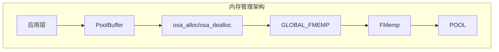
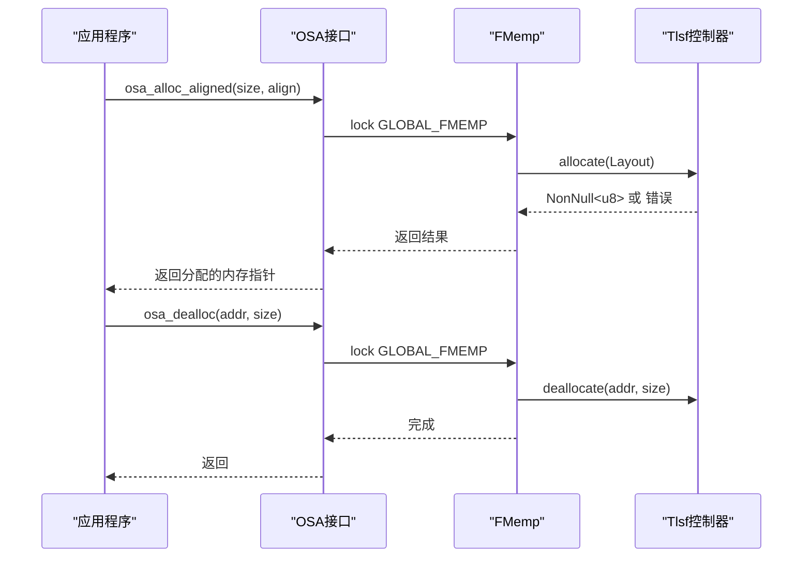
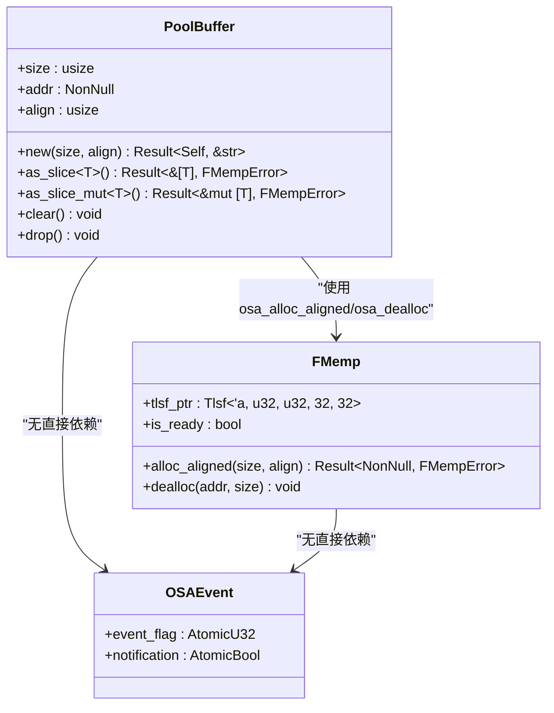
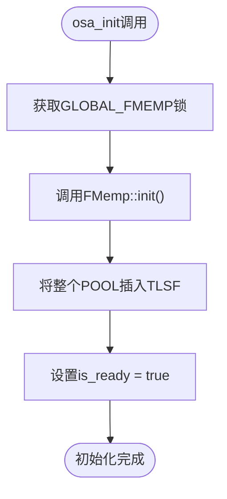
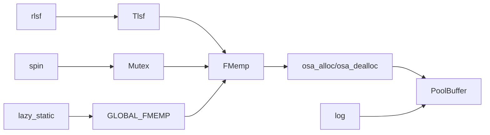

# 内存管理

<cite>
**本文档引用的文件**  
- [mod.rs](file://src/osa/mod.rs)
- [pool_buffer.rs](file://src/osa/pool_buffer.rs)
- [consts.rs](file://src/osa/consts.rs)
- [err.rs](file://src/osa/err.rs)
</cite>

## 目录
1. [简介](#简介)
2. [项目结构](#项目结构)
3. [核心组件](#核心组件)
4. [架构概述](#架构概述)
5. [详细组件分析](#详细组件分析)
6. [依赖分析](#依赖分析)
7. [性能考虑](#性能考虑)
8. [故障排除指南](#故障排除指南)
9. [结论](#结论)

## 简介
本文档详细描述了基于TLSF（Two-Level Segregated Fit）算法的操作系统抽象层内存管理机制。重点分析了`FMemp`结构体如何通过全局静态内存池`POOL`实现高效的内存分配与回收，并介绍了`PoolBuffer`如何为DMA等硬件操作提供安全、对齐的内存缓冲区封装。文档还说明了线程安全机制、错误处理策略以及最佳实践。

## 项目结构
`osa`模块是内存管理的核心，位于`src/osa/`目录下，包含以下关键文件：
- `mod.rs`：定义全局内存池管理器`GLOBAL_FMEMP`、分配/释放函数及事件系统
- `pool_buffer.rs`：提供安全的内存缓冲区封装`PoolBuffer`
- `consts.rs`：定义内存池大小、对齐常量和事件标志
- `err.rs`：定义内存操作相关的错误类型

**Section sources**
- [mod.rs](file://src/osa/mod.rs#L1-L172)
- [pool_buffer.rs](file://src/osa/pool_buffer.rs#L1-L130)
- [consts.rs](file://src/osa/consts.rs#L1-L35)
- [err.rs](file://src/osa/err.rs#L1-L12)

## 核心组件
核心组件包括基于TLSF算法的`FMemp`内存管理器、全局静态内存池`POOL`、线程安全的分配/释放接口（`osa_alloc`、`osa_dealloc`）以及安全的缓冲区封装`PoolBuffer`。这些组件共同实现了高效、安全且线程安全的内存管理。

**Section sources**
- [mod.rs](file://src/osa/mod.rs#L15-L172)
- [pool_buffer.rs](file://src/osa/pool_buffer.rs#L10-L130)

## 架构概述
系统采用两级内存管理架构：底层由`FMemp`结构体管理一个固定大小的静态内存池（`POOL`），使用TLSF算法进行高效的内存块分配与回收；上层通过`PoolBuffer`结构体提供类型安全、自动管理生命周期的内存缓冲区，特别适用于DMA传输等需要物理连续且对齐内存的场景。

**Diagram sources**
- [mod.rs](file://src/osa/mod.rs#L15-L172)
- [pool_buffer.rs](file://src/osa/pool_buffer.rs#L10-L130)

## 详细组件分析

### FMemp内存管理器分析
`FMemp`结构体是TLSF内存管理算法的封装，负责管理`POOL`静态内存池。它通过`tlsf_ptr`字段持有TLSF控制器实例，并在初始化时将整个`POOL`区域插入为一个大的空闲块。`is_ready`标志确保内存池在使用前已完成初始化。

#### 内存分配与释放流程

**Diagram sources**
- [mod.rs](file://src/osa/mod.rs#L55-L105)

**Section sources**
- [mod.rs](file://src/osa/mod.rs#L45-L105)

### PoolBuffer安全缓冲区分析
`PoolBuffer`是一个安全的内存缓冲区封装，它在构造时通过`osa_alloc_aligned`分配对齐内存，并在析构时自动调用`osa_dealloc`释放内存，实现了RAII（资源获取即初始化）模式。

#### 对象生命周期与安全转换

**Diagram sources**
- [pool_buffer.rs](file://src/osa/pool_buffer.rs#L10-L130)
- [mod.rs](file://src/osa/mod.rs#L45-L105)

**Section sources**
- [pool_buffer.rs](file://src/osa/pool_buffer.rs#L10-L130)

### 全局内存池初始化分析
内存池的初始化通过`osa_init`函数完成，该函数在系统启动时调用，确保`GLOBAL_FMEMP`中的`FMemp`实例已准备好使用。

**Diagram sources**
- [mod.rs](file://src/osa/mod.rs#L95-L98)

**Section sources**
- [mod.rs](file://src/osa/mod.rs#L95-L98)

## 依赖分析
`osa`模块依赖于`rlsf`库实现TLSF算法，依赖`spin::Mutex`和`lazy_static`实现线程安全的全局状态管理。`PoolBuffer`依赖`osa`模块的分配接口，并使用`log`库进行错误日志记录。

**Diagram sources**
- [mod.rs](file://src/osa/mod.rs#L1-L172)

**Section sources**
- [mod.rs](file://src/osa/mod.rs#L1-L172)

## 性能考虑
- **分配效率**：TLSF算法提供O(1)的平均分配/释放时间复杂度，适合实时系统。
- **内存碎片**：两级分离适配策略有效减少外部碎片。
- **线程安全开销**：`Mutex`保护全局池，可能成为多线程高并发场景的瓶颈。
- **对齐开销**：`osa_alloc_aligned`确保内存对齐，避免DMA传输性能下降。

## 故障排除指南
常见问题及解决方案：

| 问题现象 | 可能原因 | 解决方案 |
|--------|--------|--------|
| `osa_alloc`返回`BadMalloc` | 内存池不足或未初始化 | 检查`MAX_POOL_SIZE`是否足够，确保调用`osa_init` |
| `as_slice`返回`SizeNotAligned` | 缓冲区大小不能被元素大小整除 | 确保缓冲区大小是目标类型大小的整数倍 |
| `copy_from_slice`返回`Too small` | 源数据超出缓冲区容量 | 检查缓冲区大小是否足够容纳数据 |
| DMA传输失败 | 内存未正确对齐 | 使用`osa_alloc_aligned`分配，并确保对齐要求（如64字节） |

**Section sources**
- [err.rs](file://src/osa/err.rs#L1-L12)
- [pool_buffer.rs](file://src/osa/pool_buffer.rs#L20-L45)
- [pool_buffer.rs](file://src/osa/pool_buffer.rs#L55-L65)

## 结论
该内存管理系统通过TLSF算法和`PoolBuffer`封装，为嵌入式环境提供了高效、安全的内存管理方案。`lazy_static`和`Mutex`确保了全局内存池的线程安全访问，而`Drop` trait的实现保证了内存的自动回收。系统特别适合需要DMA传输等硬件交互的场景，但需注意在高并发场景下`Mutex`可能成为性能瓶颈。