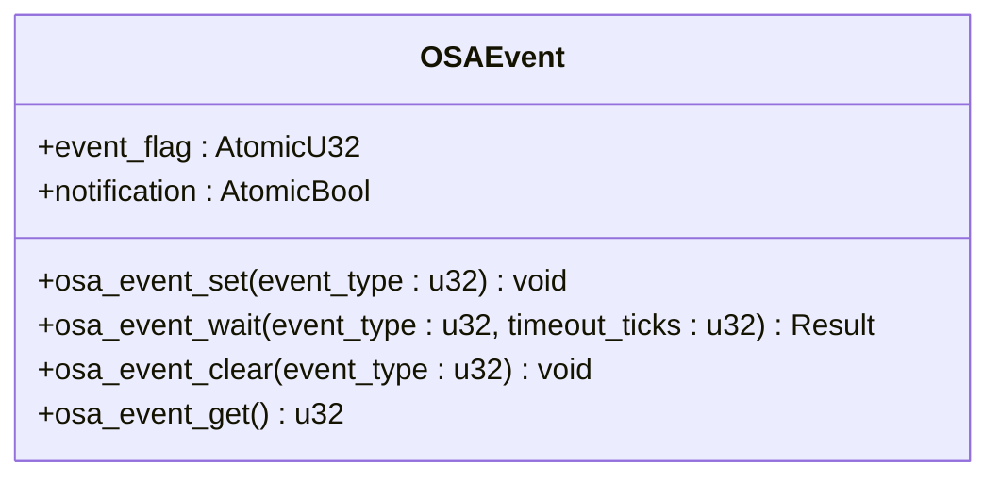
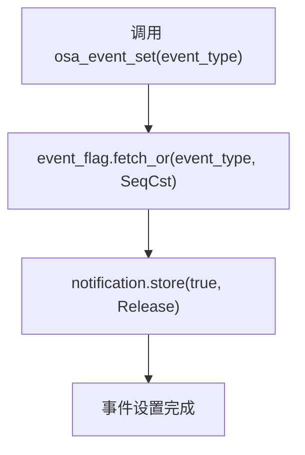
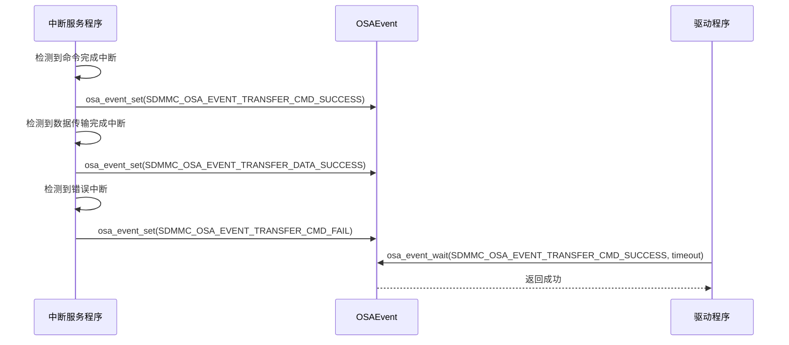
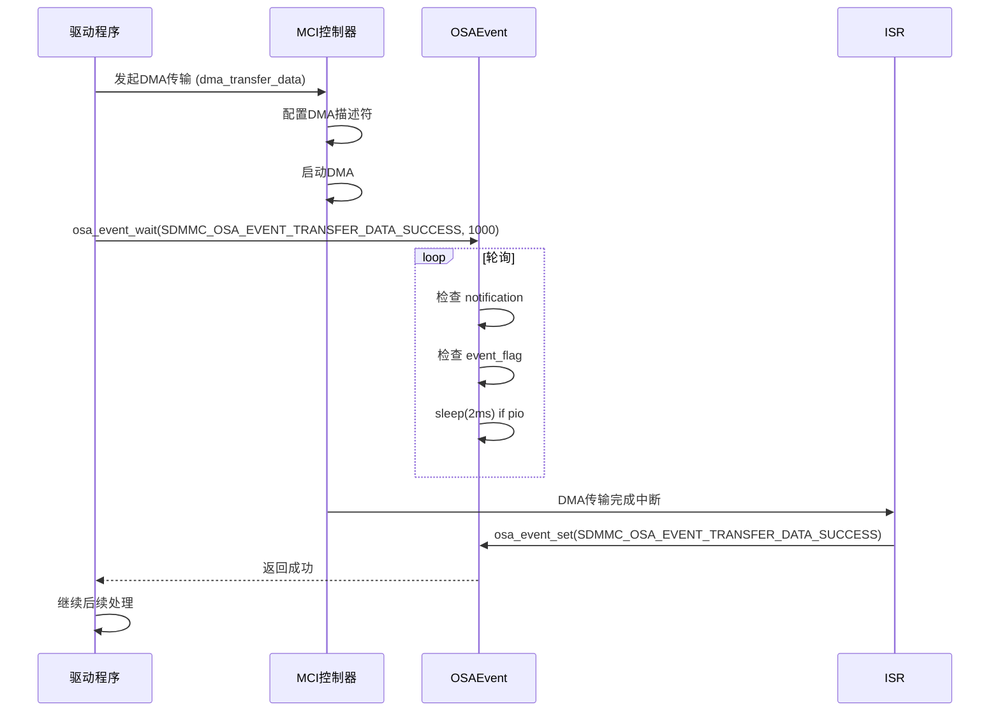

<cite>
**本文档中引用的文件**
- [mod.rs](file://src/osa/mod.rs)
- [consts.rs](file://src/osa/consts.rs)
- [mci_dma.rs](file://src/mci/mci_dma.rs)
- [mci_intr.rs](file://src/mci/mci_intr.rs)
- [lib.rs](file://src/lib.rs)
</cite>

## 目录
1. [同步原语](#同步原语)
2. [OSAEvent 结构体与无锁机制](#osaevent-结构体与无锁机制)
3. [全局事件操作函数](#全局事件操作函数)
4. [事件标志常量](#事件标志常量)
5. [驱动中的事件使用示例](#驱动中的事件使用示例)
6. [内存顺序的重要性](#内存顺序的重要性)

## 同步原语

本文档详细描述了在 `arceos_drivers/phytium-mci` 项目中实现的同步原语，特别是 `OSAEvent` 事件机制。该机制为 `no_std` 环境下的驱动程序提供了一种轻量级、无锁的同步方式，用于处理中断驱动的异步操作，如等待 DMA 传输完成或命令响应。

**Section sources**
- [mod.rs](file://src/osa/mod.rs#L1-L172)

## OSAEvent 结构体与无锁机制

`OSAEvent` 结构体是事件机制的核心，它通过两个原子类型字段实现无锁的事件标志和通知。



**Diagram sources**
- [mod.rs](file://src/osa/mod.rs#L100-L137)

### 结构体字段

- **`event_flag: AtomicU32`**：一个 32 位的原子整数，用作事件标志位。每一位代表一个特定的事件（例如，命令完成、数据传输完成、卡插入等）。多个事件可以同时被设置。
- **`notification: AtomicBool`**：一个布尔原子变量，用作通知标志。当任何事件被设置时，此标志会被置为 `true`，向等待者发出有事件发生的信号。

这种设计将“事件数据”（`event_flag`）和“通知信号”（`notification`）分离。`notification` 作为一个轻量级的“脏位”，允许等待线程首先通过一个快速的 `AtomicBool` 读取来判断是否有事件发生，只有在 `notification` 为 `true` 时，才去读取更复杂的 `AtomicU32` 来获取具体的事件类型。这优化了轮询性能。

**Section sources**
- [mod.rs](file://src/osa/mod.rs#L100-L107)

## 全局事件操作函数

系统提供了一组全局函数来操作一个静态的 `OSAEvent` 实例（`OSA_EVENT`），这些函数是驱动程序与事件机制交互的主要接口。

### `osa_event_set`

此函数用于在中断服务程序（ISR）或驱动逻辑中设置一个或多个事件标志。



**Diagram sources**
- [mod.rs](file://src/osa/mod.rs#L110-L114)

该函数首先使用 `fetch_or` 原子操作将指定的 `event_type` 位或到 `event_flag` 中，确保事件标志的更新是原子的。随后，它将 `notification` 标志设置为 `true`，使用 `Ordering::Release` 内存顺序。这保证了在 `notification` 被其他线程看到之前，`event_flag` 的更新对所有线程都是可见的。

### `osa_event_wait`

此函数是等待事件发生的核心。它实现了带有超时和可选休眠的轮询逻辑。

```mermaid
sequenceDiagram
participant Driver as 驱动程序
participant OSAEvent as OSAEvent
participant ISR as 中断服务程序
Driver->>OSAEvent : osa_event_wait(event_type, timeout)
loop 轮询循环
OSAEvent->>OSAEvent : notification.load(Acquire)
alt notification 为 true
OSAEvent->>OSAEvent : event_flag.load(SeqCst)
OSAEvent->>OSAEvent : 检查 event_type 是否匹配
alt 匹配
OSAEvent->>OSAEvent : notification.store(false, Release)
OSAEvent-->>Driver : 返回 Ok(events)
break 等待成功
end
else notification 为 false 或事件不匹配
OSAEvent->>OSAEvent : ticks += 1
alt ticks >= timeout
OSAEvent-->>Driver : 返回 Err("timeout")
break 等待超时
else
OSAEvent->>OSAEvent : #[cfg(feature = "pio")] sleep(2ms)
OSAEvent->>OSAEvent : core : : hint : : spin_loop()
end
end
end
ISR->>OSAEvent : osa_event_set(event_type)
OSAEvent->>OSAEvent : 设置 event_flag 和 notification
```

**Diagram sources**
- [mod.rs](file://src/osa/mod.rs#L116-L135)
- [lib.rs](file://src/lib.rs#L10-L17)

该函数在一个循环中执行以下步骤：
1.  **检查通知**：首先使用 `Ordering::Acquire` 读取 `notification`。如果为 `false`，则跳到第3步。
2.  **检查事件**：如果 `notification` 为 `true`，则读取 `event_flag`。如果 `event_flag` 中包含了所等待的 `event_type`，则清除 `notification` 标志并返回成功。
3.  **处理超时和休眠**：如果未等到事件，检查超时计数器。如果未超时，则递增计数器。**关键点**：如果编译时启用了 `pio` 特性，函数会调用 `sleep(Duration::from_millis(2))` 进行短暂休眠，以避免在等待期间过度消耗 CPU 资源。无论是否休眠，最后都会调用 `core::hint::spin_loop()`，提示 CPU 当前处于忙等待状态，可能有助于优化性能。
4.  **循环**：重复上述过程，直到事件发生或超时。

**Section sources**
- [mod.rs](file://src/osa/mod.rs#L116-L135)

### `osa_event_clear` 和 `osa_event_get`

- **`osa_event_clear`**：用于清除指定的事件标志位。它使用 `fetch_and` 原子操作将 `event_type` 的反码与 `event_flag` 进行与操作。如果清除后 `event_flag` 变为 0，则同时将 `notification` 标志重置为 `false`。
- **`osa_event_get`**：简单地返回当前 `event_flag` 的值，用于查询当前所有已设置的事件。

**Section sources**
- [mod.rs](file://src/osa/mod.rs#L137-L144)

## 事件标志常量

`consts.rs` 文件定义了一系列常量，用于表示不同类型的事件和操作模式。

```mermaid
erDiagram
EVENT_TYPE ||--o{ OSAEvent : "has"
EVENT_TYPE {
string name
u32 value
}
EVENT_TYPE {
"SDMMC_OSA_EVENT_TRANSFER_CMD_SUCCESS" 1<<0
"SDMMC_OSA_EVENT_TRANSFER_CMD_FAIL" 1<<1
"SDMMC_OSA_EVENT_TRANSFER_DATA_SUCCESS" 1<<2
"SDMMC_OSA_EVENT_TRANSFER_DATA_FAIL" 1<<3
"SDMMC_OSA_EVENT_TRANSFER_DMA_COMPLETE" 1<<4
"SDMMC_OSA_EVENT_CARD_INSERTED" 1<<8
"SDMMC_OSA_EVENT_CARD_REMOVED" 1<<9
}
FLAG_MODE ||--o{ OSAEvent : "uses"
FLAG_MODE {
string name
u32 value
}
FLAG_MODE {
"SDMMC_OSA_EVENT_FLAG_AND" 1<<0
"SDMMC_OSA_EVENT_FLAG_OR" 1<<1
}
```

**Diagram sources**
- [consts.rs](file://src/osa/consts.rs#L1-L35)

### 传输事件
这些常量代表了 SD/MMC 操作中的关键状态：
- `SDMMC_OSA_EVENT_TRANSFER_CMD_SUCCESS` / `_FAIL`：命令发送成功或失败。
- `SDMMC_OSA_EVENT_TRANSFER_DATA_SUCCESS` / `_FAIL`：数据传输成功或失败。
- `SDMMC_OSA_EVENT_TRANSFER_DMA_COMPLETE`：DMA 传输完成。

### 卡状态事件
- `SDMMC_OSA_EVENT_CARD_INSERTED` / `_REMOVED`：检测到卡插入或拔出。

### 操作模式标志
- `SDMMC_OSA_EVENT_FLAG_AND` 和 `SDMMC_OSA_EVENT_FLAG_OR`：这些常量定义了在等待多个事件时的逻辑操作。虽然在当前的 `osa_event_wait` 实现中直接使用了按位与（`&`）来检查事件，但这些常量的存在表明了未来可能支持更复杂的等待逻辑（例如，等待所有指定事件发生（AND）或任一事件发生（OR））。

**Section sources**
- [consts.rs](file://src/osa/consts.rs#L1-L35)

## 驱动中的事件使用示例

`OSAEvent` 机制在驱动中被广泛用于异步操作的同步。

### 中断服务程序中的事件设置

在 `mci_intr.rs` 文件中，中断处理函数在检测到特定事件后，会调用 `osa_event_set` 来通知等待的线程。



**Diagram sources**
- [mci_intr.rs](file://src/mci/mci_intr.rs#L100-L120)
- [mod.rs](file://src/osa/mod.rs#L160-L164)

例如，`handle_cmd_done` 函数在命令完成中断发生时被调用，它会设置 `SDMMC_OSA_EVENT_TRANSFER_CMD_SUCCESS` 事件。类似地，`handle_data_done` 和 `handle_error_occur` 函数会根据数据传输的结果设置相应的成功或失败事件。

### 驱动逻辑中的事件等待

驱动程序在发起一个异步操作（如 DMA 传输）后，会调用 `osa_event_wait` 来阻塞等待结果。



**Diagram sources**
- [mci_dma.rs](file://src/mci/mci_dma.rs#L150-L170)
- [mod.rs](file://src/osa/mod.rs#L160-L164)

例如，在 `mci_dma.rs` 中，`dma_transfer_data` 函数启动 DMA 传输后，调用者（驱动程序）会进入一个等待循环，直到 `osa_event_wait` 返回成功，表明数据传输已经完成。

**Section sources**
- [mci_intr.rs](file://src/mci/mci_intr.rs#L100-L120)
- [mci_dma.rs](file://src/mci/mci_dma.rs#L150-L170)

## 内存顺序的重要性

内存顺序（`Ordering`）是 `OSAEvent` 机制正确工作的基石，它确保了在多线程（或中断上下文与主程序上下文）环境下数据的一致性和可见性。

- **`Ordering::SeqCst` (Sequentially Consistent)**：用于 `event_flag` 的 `load` 和 `fetch_or`/`fetch_and` 操作。这是最强的内存顺序，保证了所有线程看到的原子操作顺序是一致的。这对于正确读取和修改复杂的事件标志位至关重要。
- **`Ordering::Release`**：用于在 `osa_event_set` 中设置 `notification` 标志。它确保了在 `notification` 被存储之前，所有之前的内存写入（包括 `event_flag` 的更新）都已完成，并对其他线程可见。
- **`Ordering::Acquire`**：用于在 `osa_event_wait` 中读取 `notification` 标志。它确保了在 `notification` 被读取之后，所有后续的内存读取（包括 `event_flag` 的读取）都不会被重排序到该读取之前。这保证了当 `notification` 为 `true` 时，`event_flag` 的值是最新且一致的。

`Release` 和 `Acquire` 的配对使用，建立了一个同步点：`Release` 操作之前的写入，对执行 `Acquire` 操作的线程是可见的。这确保了事件标志的更新不会被编译器或 CPU 乱序执行所破坏，从而保证了整个无锁同步机制的正确性。

**Section sources**
- [mod.rs](file://src/osa/mod.rs#L110-L135)