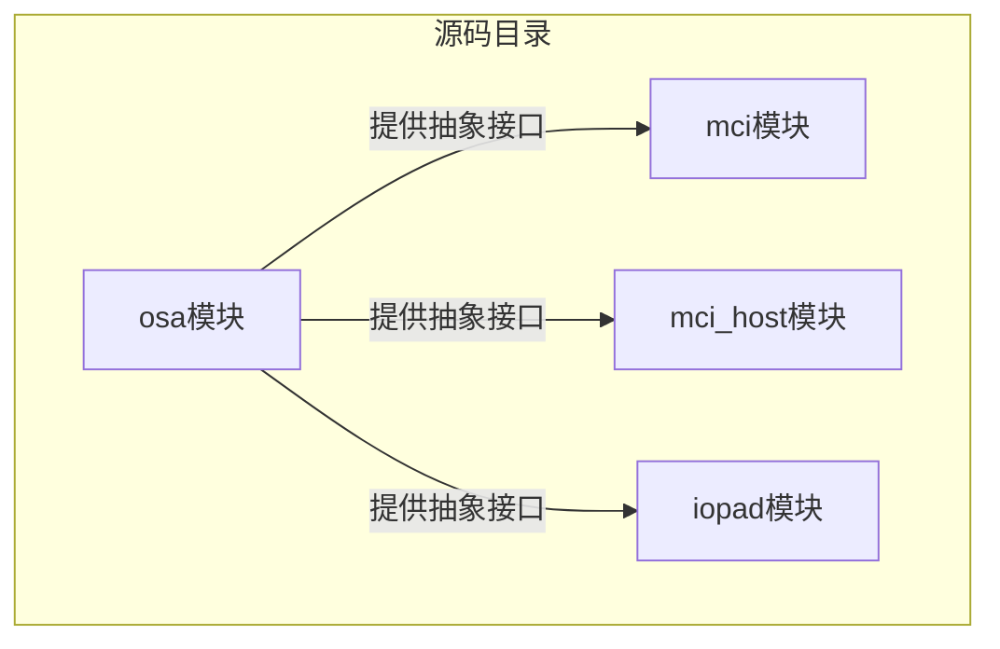
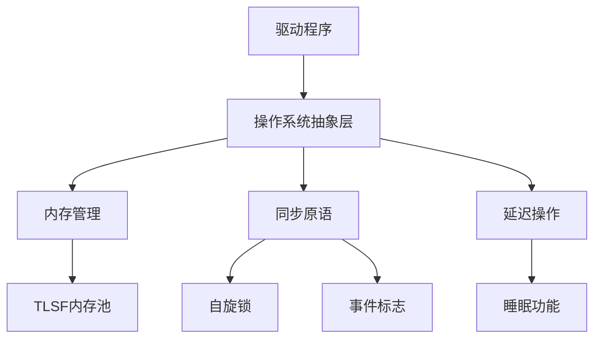
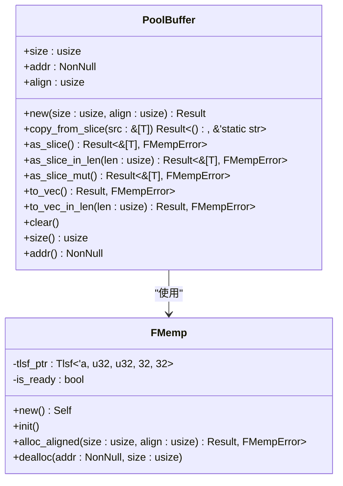
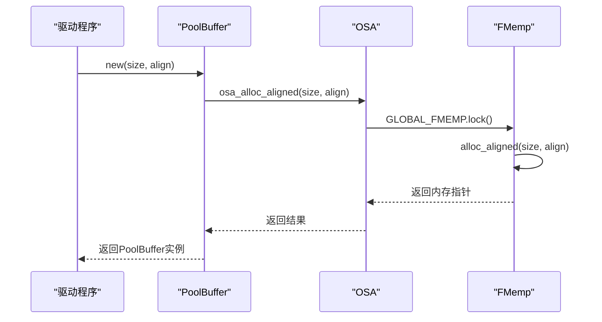
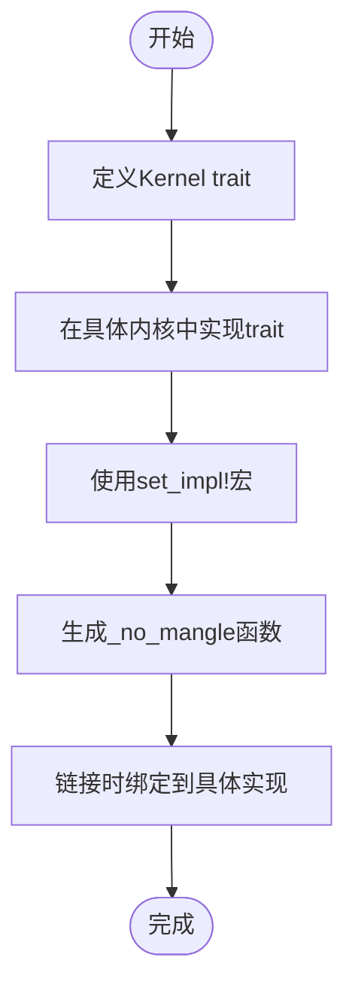
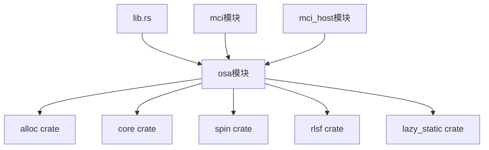

# 操作系统抽象层(OSA)

<cite>
**本文档引用的文件**  
- [pool_buffer.rs](file://src/osa/pool_buffer.rs)
- [lib.rs](file://src/lib.rs)
- [mod.rs](file://src/osa/mod.rs)
- [consts.rs](file://src/osa/consts.rs)
- [err.rs](file://src/osa/err.rs)
</cite>

## 目录
1. [引言](#引言)
2. [项目结构](#项目结构)
3. [核心组件](#核心组件)
4. [架构概述](#架构概述)
5. [详细组件分析](#详细组件分析)
6. [依赖分析](#依赖分析)
7. [性能考虑](#性能考虑)
8. [故障排除指南](#故障排除指南)
9. [结论](#结论)

## 引言

操作系统抽象层（OSA）是驱动程序与底层操作系统或运行时环境之间的关键隔离层。它通过封装内存管理、同步原语和延迟操作等系统级功能，为驱动程序提供了一致的接口，从而实现了跨不同内核环境的可移植性。本文档重点分析`pool_buffer.rs`中`PoolBuffer`的实现机制，以及`lib.rs`中如何通过特性（features）和条件编译来集成不同的OSA实现。

## 项目结构

项目结构清晰地划分了功能模块，其中`src/osa`目录专门负责操作系统抽象功能的实现。

**Diagram sources**
- [src/osa/mod.rs](file://src/osa/mod.rs#L1-L173)
- [src/mci/mod.rs](file://src/mci/mod.rs#L1-L10)
- [src/mci_host/mod.rs](file://src/mci_host/mod.rs#L1-L10)

**Section sources**
- [src/osa/mod.rs](file://src/osa/mod.rs#L1-L173)
- [src/lib.rs](file://src/lib.rs#L1-L85)

## 核心组件

OSA的核心组件包括内存池管理、事件同步机制和条件编译集成。`PoolBuffer`结构体为DMA传输提供了预分配的、物理连续的内存缓冲区，而`Kernel` trait则定义了驱动与底层系统交互的通用接口。

**Section sources**
- [src/osa/pool_buffer.rs](file://src/osa/pool_buffer.rs#L1-L131)
- [src/lib.rs](file://src/lib.rs#L1-L85)
- [src/osa/mod.rs](file://src/osa/mod.rs#L1-L173)

## 架构概述

OSA的架构设计旨在解耦驱动逻辑与底层操作系统细节。它通过全局内存池和同步原语，为上层驱动提供统一的资源管理接口。

**Diagram sources**
- [src/osa/mod.rs](file://src/osa/mod.rs#L1-L173)
- [src/osa/pool_buffer.rs](file://src/osa/pool_buffer.rs#L1-L131)

## 详细组件分析

### PoolBuffer 分析

`PoolBuffer`是为DMA传输设计的安全内存缓冲区封装，它利用OSA提供的内存分配接口来获取物理连续的内存块。

#### 类图

**Diagram sources**
- [src/osa/pool_buffer.rs](file://src/osa/pool_buffer.rs#L1-L131)
- [src/osa/mod.rs](file://src/osa/mod.rs#L1-L173)

**Section sources**
- [src/osa/pool_buffer.rs](file://src/osa/pool_buffer.rs#L1-L131)

### 内存管理分析

OSA通过`FMemp`结构体管理全局内存池，使用TLSF（Two-Level Segregated Fit）算法实现高效的内存分配。

#### 序列图

**Diagram sources**
- [src/osa/pool_buffer.rs](file://src/osa/pool_buffer.rs#L1-L131)
- [src/osa/mod.rs](file://src/osa/mod.rs#L1-L173)

### 条件编译集成分析

`lib.rs`文件通过`Kernel` trait和`set_impl`宏机制，实现了不同内核环境的集成。

#### 流程图

**Diagram sources**
- [src/lib.rs](file://src/lib.rs#L1-L85)

**Section sources**
- [src/lib.rs](file://src/lib.rs#L1-L85)

## 依赖分析

OSA模块与其他组件存在明确的依赖关系，确保了驱动程序的可移植性和模块化设计。

**Diagram sources**
- [src/lib.rs](file://src/lib.rs#L1-L85)
- [src/osa/mod.rs](file://src/osa/mod.rs#L1-L173)
- [Cargo.toml](file://Cargo.toml#L1-L20)

**Section sources**
- [src/lib.rs](file://src/lib.rs#L1-L85)
- [src/osa/mod.rs](file://src/osa/mod.rs#L1-L173)

## 性能考虑

OSA的设计充分考虑了嵌入式环境下的性能需求。内存池的预分配机制避免了运行时的动态分配开销，而自旋锁的使用确保了在中断上下文中的快速响应。条件编译特性允许在不同场景下启用或禁用特定功能，如PIO模式下的轮询机制。

## 故障排除指南

当遇到内存分配失败时，应检查`FMempError`枚举中的错误类型。`BadMalloc`表示内存池分配失败，可能需要调整`MAX_POOL_SIZE`的大小。对于事件同步超时问题，应验证事件标志的设置和清除逻辑是否正确，并检查`timeout_ticks`参数是否合理。

**Section sources**
- [src/osa/err.rs](file://src/osa/err.rs#L1-L13)
- [src/osa/mod.rs](file://src/osa/mod.rs#L1-L173)

## 结论

操作系统抽象层成功地为驱动程序提供了一个稳定、可移植的运行环境。通过`PoolBuffer`的实现，确保了DMA传输所需的物理连续内存分配；通过`Kernel` trait和条件编译机制，实现了与不同内核环境的无缝集成。这种设计模式不仅提高了代码的可维护性，也为未来的功能扩展奠定了坚实的基础。