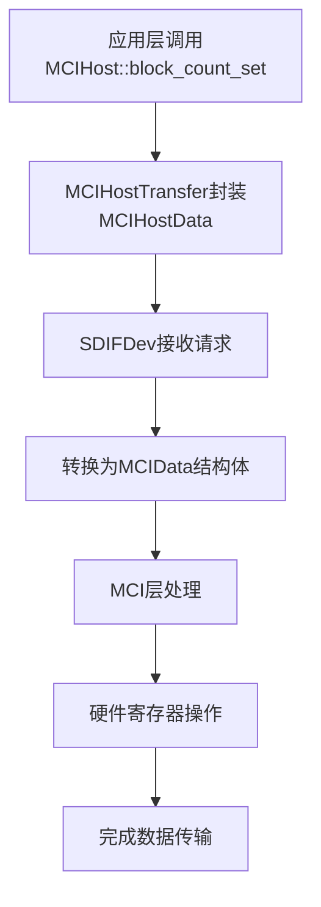

# 数据流

<cite>
**Referenced Files in This Document**   
- [mci_host_transfer.rs](file://src/mci_host/mci_host_transfer.rs)
- [sdif_device.rs](file://src/mci_host/mci_sdif/sdif_device.rs)
- [mci_data.rs](file://src/mci/mci_data.rs)
- [mci_dma.rs](file://src/mci/mci_dma.rs)
- [mci_pio.rs](file://src/mci/mci_pio.rs)
- [mci_hardware.rs](file://src/mci/mci_hardware.rs)
- [regs.rs](file://src/mci/regs.rs)
</cite>

## 目录
1. [数据流概述](#数据流概述)
2. [块读写操作数据流](#块读写操作数据流)
3. [DMA与PIO传输模式对比](#dma与pio传输模式对比)
4. [关键数据结构传递过程](#关键数据结构传递过程)
5. [dsb内存屏障作用](#dsb内存屏障作用)

## 数据流概述

飞腾MCI驱动的数据流从应用层调用开始，经过多层封装和传递，最终通过硬件寄存器完成数据传输。整个数据流涉及MCIHost、MCIHostTransfer、SDIFDev和MCI等多个组件的协同工作，实现了从高层抽象到底层硬件的完整映射。

**Section sources**
- [mci_host_transfer.rs](file://src/mci_host/mci_host_transfer.rs)
- [sdif_device.rs](file://src/mci_host/mci_sdif/sdif_device.rs)

## 块读写操作数据流

块读写操作的数据流始于应用层对`MCIHost::block_count_set`方法的调用。该方法通过`MCIHostTransfer`结构体进行数据封装，将块数量信息存储在`MCIHostData`中。随后，`SDIFDev`接收封装后的传输请求，并将其转换为MCI层可处理的格式。

在MCI层，数据流被进一步处理为`MCIData`结构体，该结构体包含了块大小、块数量、数据长度和DMA地址等关键信息。最终，这些信息通过硬件寄存器操作完成实际的数据传输。整个过程中，数据从应用层到硬件层的传递保持了完整性和一致性。

**Diagram sources**
- [mci_host_transfer.rs](file://src/mci_host/mci_host_transfer.rs#L1-L222)
- [sdif_device.rs](file://src/mci_host/mci_sdif/sdif_device.rs#L1-L539)
- [mci_data.rs](file://src/mci/mci_data.rs#L1-L73)

**Section sources**
- [mci_host_transfer.rs](file://src/mci_host/mci_host_transfer.rs#L1-L222)
- [sdif_device.rs](file://src/mci_host/mci_sdif/sdif_device.rs#L1-L539)

## DMA与PIO传输模式对比

DMA和PIO是飞腾MCI驱动支持的两种主要传输模式，它们在数据路径上存在显著差异。

在DMA模式下，数据流经`FSdifIDmaDesc`描述符，通过内存总线直接与外设交互。这种模式利用了IDMA控制器，实现了高效的数据传输。描述符链表包含了传输属性、数据长度、缓冲区地址和下一个描述符地址等信息，使得DMA控制器能够自主完成数据传输。

相比之下，PIO模式通过`MCITranFifoCnt`寄存器进行FIFO轮询读写。在这种模式下，CPU需要主动参与数据传输过程，通过不断读取FIFO状态寄存器来判断是否可以进行数据读写操作。虽然