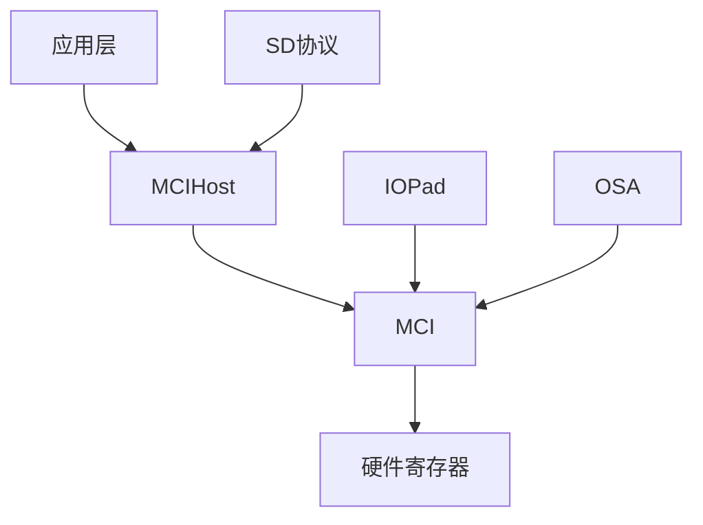
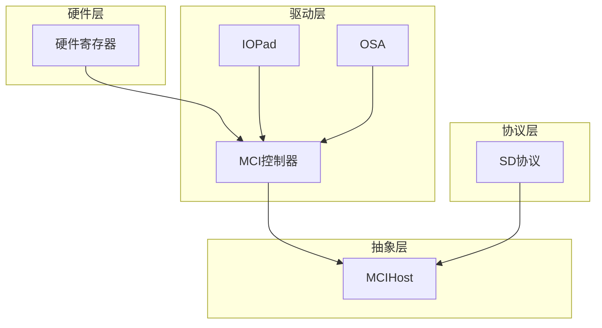
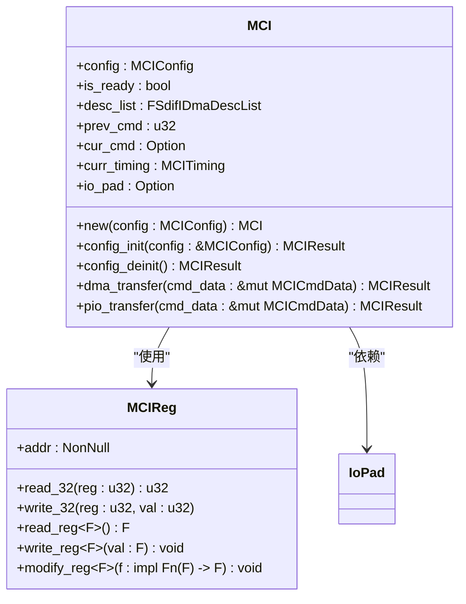
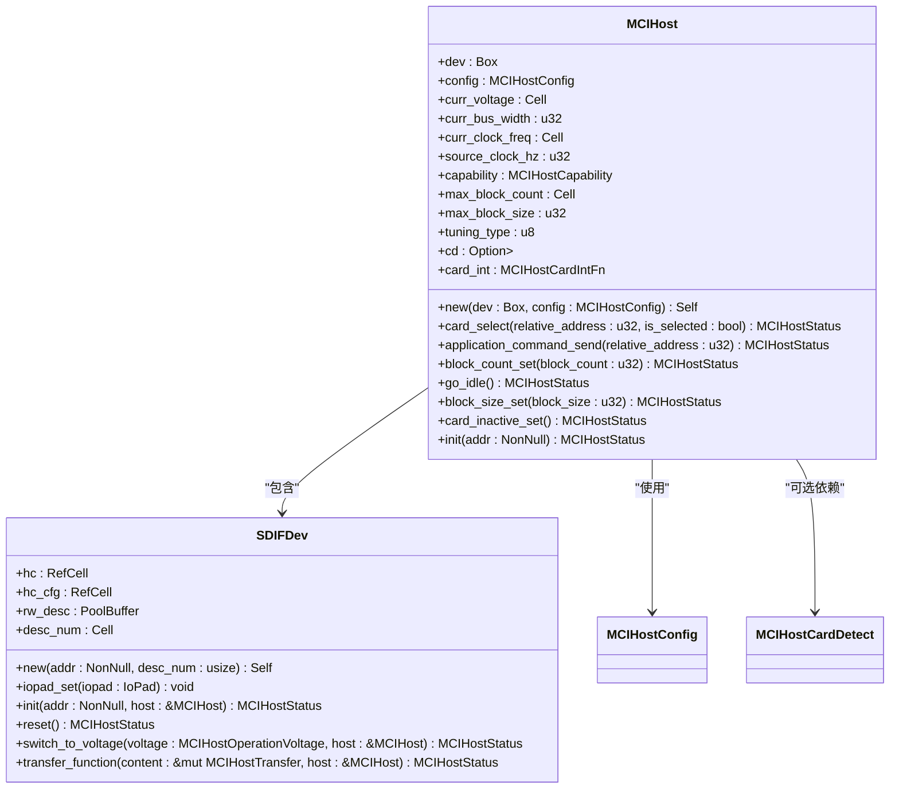
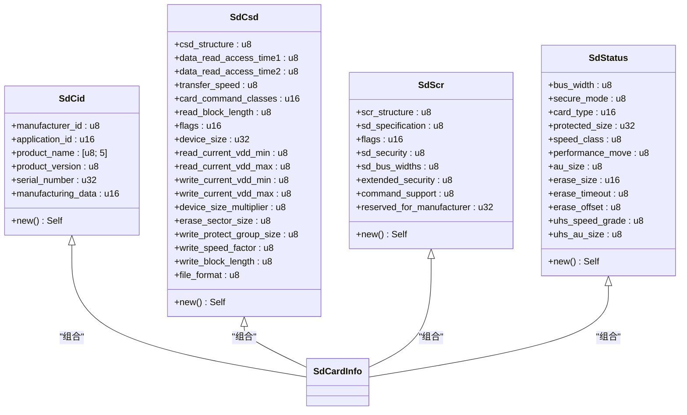
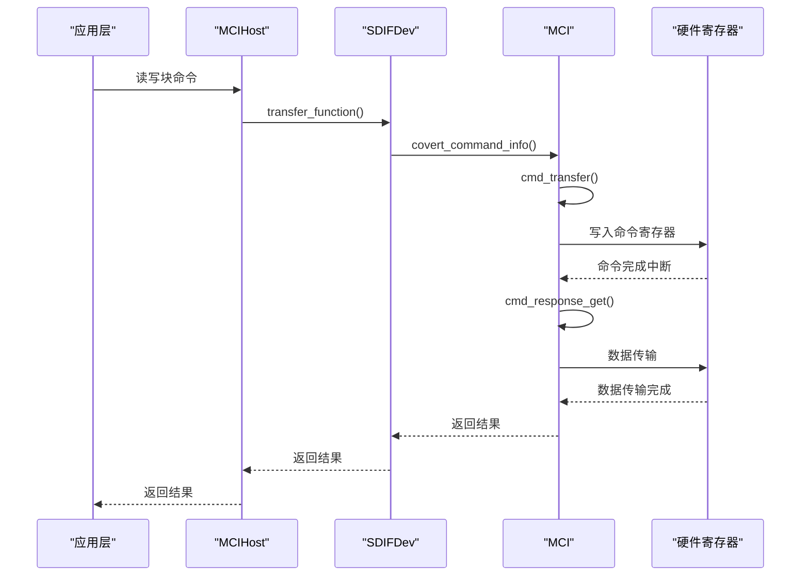
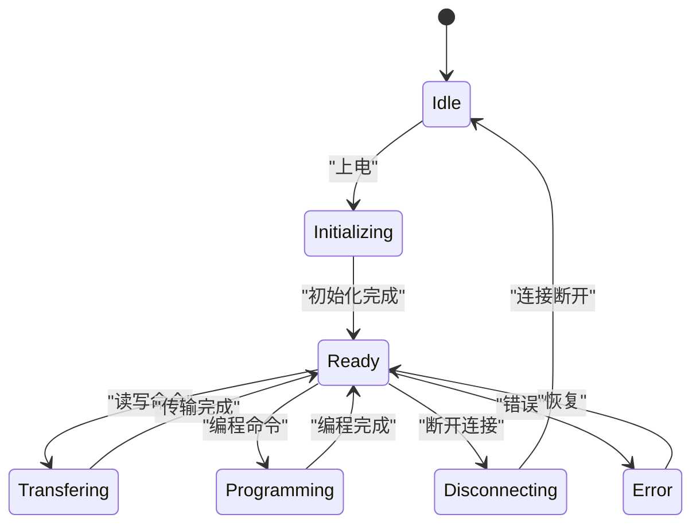
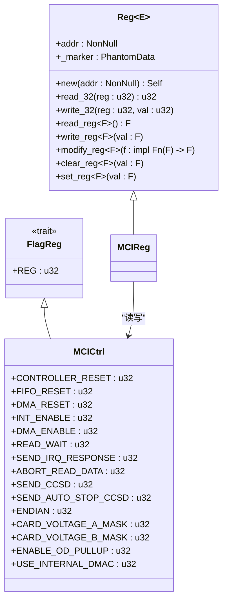

# 架构设计

<cite>
**本文档引用的文件**
- [mci_host/mod.rs](file://src/mci_host/mod.rs)
- [mci/mod.rs](file://src/mci/mod.rs)
- [mci/regs.rs](file://src/mci/regs.rs)
- [regs.rs](file://src/regs.rs)
- [mci_host/mci_sdif/sdif_device.rs](file://src/mci_host/mci_sdif/sdif_device.rs)
- [mci_host/mci_host_transfer.rs](file://src/mci_host/mci_host_transfer.rs)
- [mci/mci_cmd.rs](file://src/mci/mci_cmd.rs)
- [mci/mci_dma.rs](file://src/mci/mci_dma.rs)
- [mci/mci_hardware.rs](file://src/mci/mci_hardware.rs)
- [iopad/regs.rs](file://src/iopad/regs.rs)
- [osa/mod.rs](file://src/osa/mod.rs)
</cite>

## 目录
1. [项目结构](#项目结构)
2. [核心组件](#核心组件)
3. [分层架构概述](#分层架构概述)
4. [详细组件分析](#详细组件分析)
5. [数据流分析](#数据流分析)
6. [状态机与硬件抽象](#状态机与硬件抽象)
7. [模块依赖分析](#模块依赖分析)

## 项目结构

飞腾MCI驱动采用分层架构设计，主要分为四个核心模块：`iopad`、`mci`、`mci_host`和`osa`。每个模块都有明确的职责，共同构成了完整的SD卡驱动系统。

**图表来源**
- [mci_host/mod.rs](file://src/mci_host/mod.rs)
- [mci/mod.rs](file://src/mci/mod.rs)
- [iopad/regs.rs](file://src/iopad/regs.rs)
- [osa/mod.rs](file://src/osa/mod.rs)

**章节来源**
- [mci_host/mod.rs](file://src/mci_host/mod.rs)
- [mci/mod.rs](file://src/mci/mod.rs)

## 核心组件

驱动的核心组件包括MCI控制器、MCI主机抽象层和SD协议层。MCI控制器直接与硬件寄存器交互，MCI主机抽象层作为高层API入口点，SD协议层处理SD卡协议相关的命令和数据。

**章节来源**
- [mci_host/mod.rs](file://src/mci_host/mod.rs)
- [mci/mod.rs](file://src/mci/mod.rs)

## 分层架构概述

飞腾MCI驱动采用清晰的分层架构，从底层到高层依次为：硬件寄存器抽象层（regs）、MCI控制器层、MCI主机抽象层（MCIHost）和SD卡协议层。这种分层设计实现了关注点分离，提高了代码的可维护性和可扩展性。

**图表来源**
- [mci/regs.rs](file://src/mci/regs.rs)
- [mci/mod.rs](file://src/mci/mod.rs)
- [mci_host/mod.rs](file://src/mci_host/mod.rs)

**章节来源**
- [mci/regs.rs](file://src/mci/regs.rs)
- [mci/mod.rs](file://src/mci/mod.rs)
- [mci_host/mod.rs](file://src/mci_host/mod.rs)

## 详细组件分析

### MCI控制器分析

MCI控制器是驱动的核心，负责直接与硬件寄存器交互。它通过`MCIReg`结构体提供安全的寄存器操作，实现了对SDIF控制器的完整控制。

**图表来源**
- [mci/mod.rs](file://src/mci/mod.rs)
- [regs.rs](file://src/regs.rs)
- [iopad/regs.rs](file://src/iopad/regs.rs)

### MCIHost分析

MCIHost模块作为高层API入口点，协调MCI核心模块与SD协议模块。它提供了统一的接口供上层应用调用，同时处理与SD卡协议相关的复杂逻辑。

**图表来源**
- [mci_host/mod.rs](file://src/mci_host/mod.rs)
- [mci_host/mci_sdif/sdif_device.rs](file://src/mci_host/mci_sdif/sdif_device.rs)
- [mci_host/mci_host_config.rs](file://src/mci_host/mci_host_config.rs)

### SD协议分析

SD协议层处理SD卡协议相关的命令和数据，包括CID、CSD、SCR等信息的解析和处理。它与MCIHost模块紧密协作，实现完整的SD卡功能。

**图表来源**
- [mci_host/sd/cid.rs](file://src/mci_host/sd/cid.rs)
- [mci_host/sd/csd.rs](file://src/mci_host/sd/csd.rs)
- [mci_host/sd/scr.rs](file://src/mci_host/sd/scr.rs)
- [mci_host/sd/status.rs](file://src/mci_host/sd/status.rs)

**章节来源**
- [mci_host/sd/cid.rs](file://src/mci_host/sd/cid.rs)
- [mci_host/sd/csd.rs](file://src/mci_host/sd/csd.rs)
- [mci_host/sd/scr.rs](file://src/mci_host/sd/scr.rs)
- [mci_host/sd/status.rs](file://src/mci_host/sd/status.rs)

## 数据流分析

### 读写块命令数据流

当应用层发起读写块命令时，数据流从应用层经过MCIHost、MCI控制器，最终到达硬件寄存器。这个过程涉及多个模块的协作和状态转换。

**图表来源**
- [mci_host/mod.rs](file://src/mci_host/mod.rs)
- [mci_host/mci_sdif/sdif_device.rs](file://src/mci_host/mci_sdif/sdif_device.rs)
- [mci/mod.rs](file://src/mci/mod.rs)
- [mci/mci_cmd.rs](file://src/mci/mci_cmd.rs)

**章节来源**
- [mci_host/mod.rs](file://src/mci_host/mod.rs)
- [mci_host/mci_sdif/sdif_device.rs](file://src/mci_host/mci_sdif/sdif_device.rs)
- [mci/mod.rs](file://src/mci/mod.rs)

## 状态机与硬件抽象

### 卡状态管理状态机

驱动使用状态机模式来管理SD卡的状态，确保在不同操作之间正确地转换状态。这种设计提高了系统的可靠性和稳定性。

**图表来源**
- [mci_host/mod.rs](file://src/mci_host/mod.rs)
- [mci/mod.rs](file://src/mci/mod.rs)

### 硬件抽象模式

驱动使用tock-registers库实现安全的寄存器操作。通过`Reg`结构体和`FlagReg` trait，提供了类型安全的寄存器访问接口，避免了直接的内存操作带来的风险。

**图表来源**
-