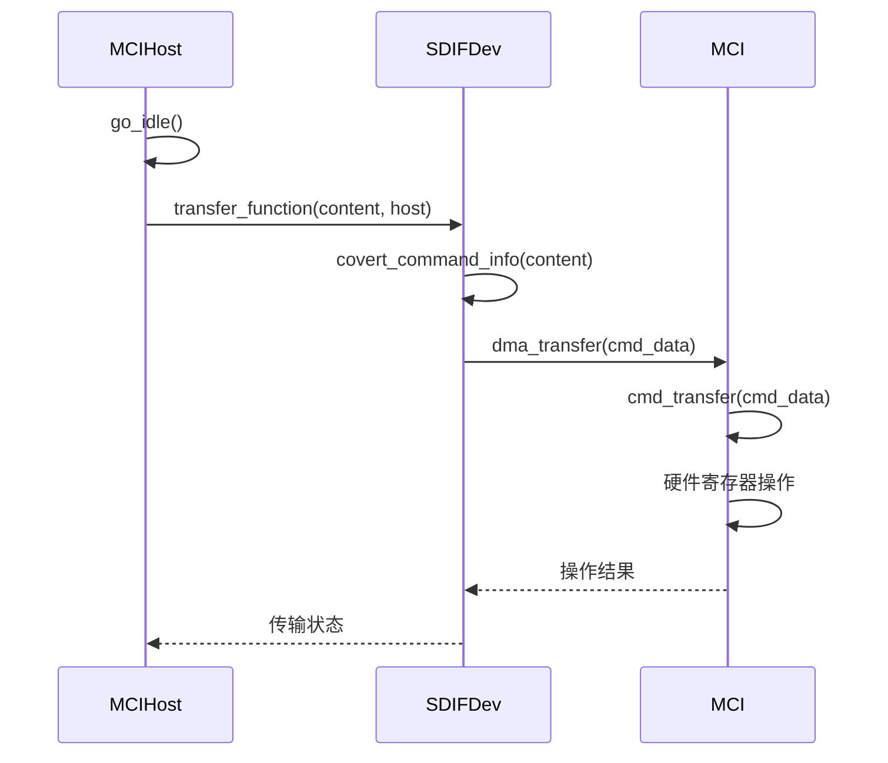
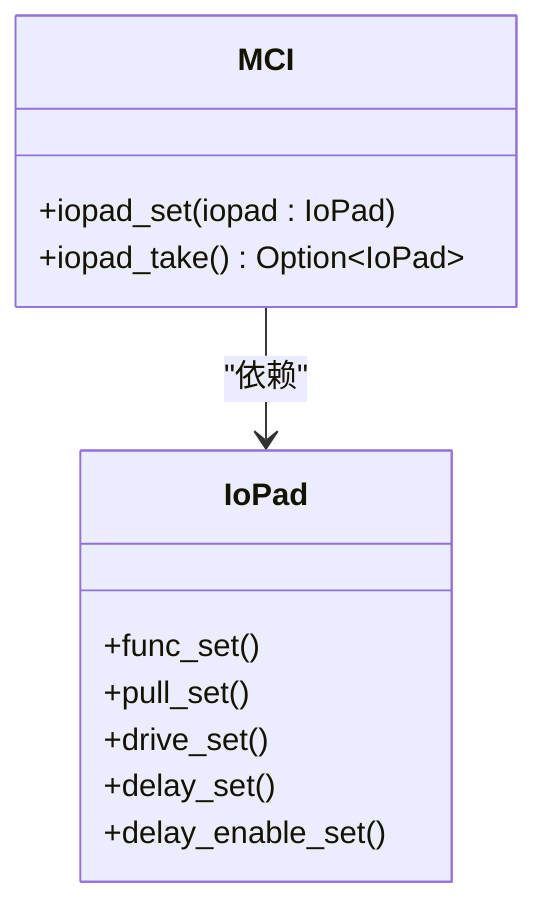
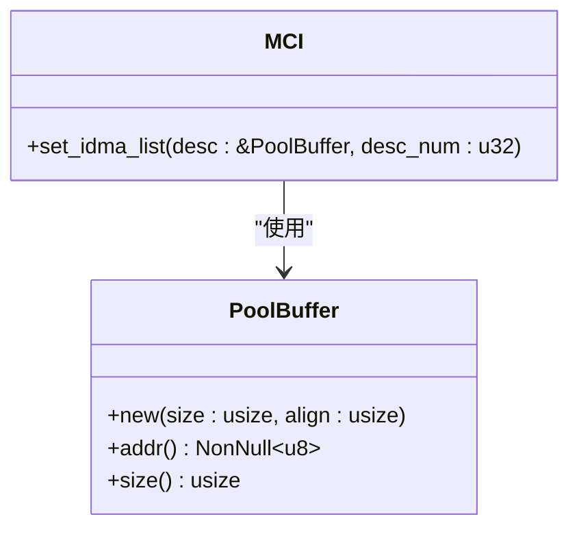
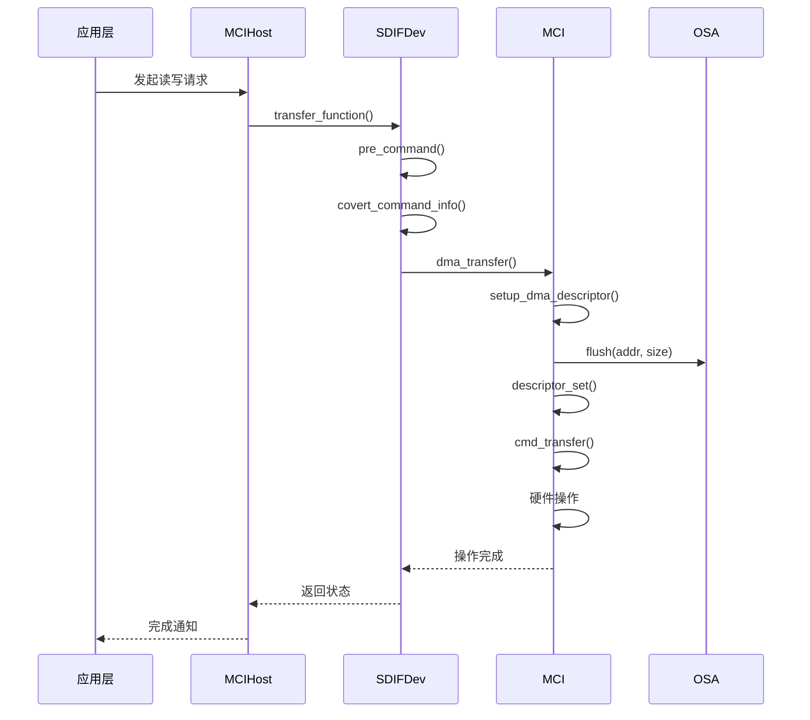

# 组件关系

<cite>
**Referenced Files in This Document**   
- [src/mci_host/mod.rs](file://src/mci_host/mod.rs)
- [src/mci/mod.rs](file://src/mci/mod.rs)
- [src/iopad/mod.rs](file://src/iopad/mod.rs)
- [src/osa/mod.rs](file://src/osa/mod.rs)
- [src/mci_host/mci_sdif/sdif_device.rs](file://src/mci_host/mci_sdif/sdif_device.rs)
- [src/osa/pool_buffer.rs](file://src/osa/pool_buffer.rs)
- [src/mci/mci_dma.rs](file://src/mci/mci_dma.rs)
- [src/mci/mci_cmd.rs](file://src/mci/mci_cmd.rs)
- [src/lib.rs](file://src/lib.rs)
</cite>

## 目录
1. [引言](#引言)
2. [核心组件交互关系](#核心组件交互关系)
3. [MCIHost中枢协调机制](#mcihost中枢协调机制)
4. [MCI模块与IOPad/OSA的依赖关系](#mci模块与iopadosa的依赖关系)
5. [典型操作序列图](#典型操作序列图)
6. [Kernel扩展点与set_impl机制](#kernel扩展点与set_impl机制)
7. [结论](#结论)

## 引言

本文档详细描述了飞腾MCI驱动中各核心组件的交互关系。重点分析MCIHost模块作为中枢如何协调MCI核心模块与SD协议模块的协作，说明MCI模块对IOPad和OSA模块的依赖关系，并解释Kernel trait如何作为扩展点实现与不同操作系统内核的集成。

**Section sources**
- [src/mci_host/mod.rs](file://src/mci_host/mod.rs)
- [src/mci/mod.rs](file://src/mci/mod.rs)

## 核心组件交互关系

飞腾MCI驱动的核心组件包括MCIHost、MCI、SDIFDev、IOPad和OSA模块。MCIHost作为高层协调者，负责管理SD卡的协议层操作；SDIFDev作为适配器，将MCIHost的请求转换为MCI层的硬件操作；MCI模块直接控制硬件寄存器；IOPad模块管理IO引脚配置；OSA模块提供操作系统抽象服务。

这些组件通过清晰的职责划分和接口定义实现了高效协作，形成了从高层协议到底层硬件的完整调用链路。

**Section sources**
- [src/mci_host/mod.rs](file://src/mci_host/mod.rs#L1-L198)
- [src/mci/mod.rs](file://src/mci/mod.rs#L1-L708)
- [src/mci_host/mci_sdif/sdif_device.rs](file://src/mci_host/mci_sdif/sdif_device.rs#L1-L538)

## MCIHost中枢协调机制

MCIHost模块作为驱动的中枢组件，负责协调MCI核心模块与SD协议模块之间的协作。在SD卡初始化过程中，MCIHost通过调用`go_idle`命令启动初始化流程。



**Diagram sources**
- [src/mci_host/mod.rs](file://src/mci_host/mod.rs#L100-L115)
- [src/mci_host/mci_sdif/sdif_device.rs](file://src/mci_host/mci_sdif/sdif_device.rs#L300-L350)
- [src/mci/mci_dma.rs](file://src/mci/mci_dma.rs#L100-L150)

**Section sources**
- [src/mci_host/mod.rs](file://src/mci_host/mod.rs#L100-L115)
- [src/mci_host/mci_sdif/sdif_device.rs](file://src/mci_host/mci_sdif/sdif_device.rs#L300-L350)

## MCI模块与IOPad/OSA的依赖关系

MCI模块对IOPad和OSA模块存在明确的依赖关系，这些依赖通过接口调用实现功能集成。

### IOPad依赖关系

MCI模块通过`iopad_set`方法配置IO引脚电压，实现对物理层的控制。当需要切换工作电压时，MCI模块会调用IOPad实例的相关方法。



**Diagram sources**
- [src/mci/mod.rs](file://src/mci/mod.rs#L80-L90)
- [src/iopad/mod.rs](file://src/iopad/mod.rs#L1-L161)

### OSA依赖关系

OSA模块的PoolBuffer为MCI模块的DMA描述符管理提供支持。在DMA传输初始化时，MCI模块会使用PoolBuffer分配对齐的内存缓冲区。



**Diagram sources**
- [src/mci/mod.rs](file://src/mci/mod.rs#L120-L140)
- [src/osa/pool_buffer.rs](file://src/osa/pool_buffer.rs#L1-L130)

**Section sources**
- [src/mci/mod.rs](file://src/mci/mod.rs#L120-L140)
- [src/iopad/mod.rs](file://src/iopad/mod.rs#L1-L161)
- [src/osa/pool_buffer.rs](file://src/osa/pool_buffer.rs#L1-L130)

## 典型操作序列图

以下序列图展示了数据读写操作中各组件间的调用时序。



**Diagram sources**
- [src/mci_host/mci_sdif/sdif_device.rs](file://src/mci_host/mci_sdif/sdif_device.rs#L300-L350)
- [src/mci/mci_dma.rs](file://src/mci/mci_dma.rs#L100-L150)
- [src/mci/mci_cmd.rs](file://src/mci/mci_cmd.rs#L1-L176)

**Section sources**
- [src/mci/mci_dma.rs](file://src/mci/mci_dma.rs#L100-L150)
- [src/mci/mci_cmd.rs](file://src/mci/mci_cmd.rs#L1-L176)

## Kernel扩展点与set_impl机制

Kernel trait作为驱动与操作系统内核之间的扩展点，定义了必要的系统服务接口。通过`set_impl`宏机制，可以将具体的操作系统实现注入到驱动中。

```mermaid
classDiagram
class Kernel {
<<trait>>
+sleep(duration : Duration)
+mmap(virt_addr : NonNull~u8~) u64
+flush(addr : NonNull~u8~, size : usize)
+invalidate(addr : NonNull~u8~, size : usize)
}
class OSImpl {
+sleep_impl()
+mmap_impl()
+flush_impl()
+invalidate_impl()
}
OSImpl ..|> Kernel : "实现"
note right of Kernel
通过set_impl宏将OSImpl
注入到驱动中，实现服务绑定
end note
```

**Diagram sources**
- [src/lib.rs](file://src/lib.rs#L1-L84)

**Section sources**
- [src/lib.rs](file://src/lib.rs#L1-L84)

## 结论

飞腾MCI驱动通过清晰的组件划分和接口定义，实现了高效的模块化设计。MCIHost作为中枢协调MCI核心模块与SD协议模块的协作，MCI模块依赖IOPad和OSA模块完成底层硬件控制和内存管理，Kernel trait通过set_impl宏机制实现与不同操作系统内核的灵活集成。这种架构设计既保证了功能的完整性，又提供了良好的可扩展性和可维护性。