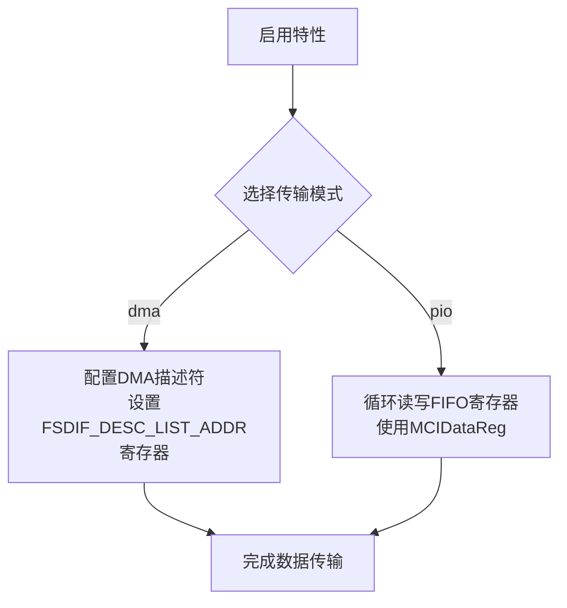
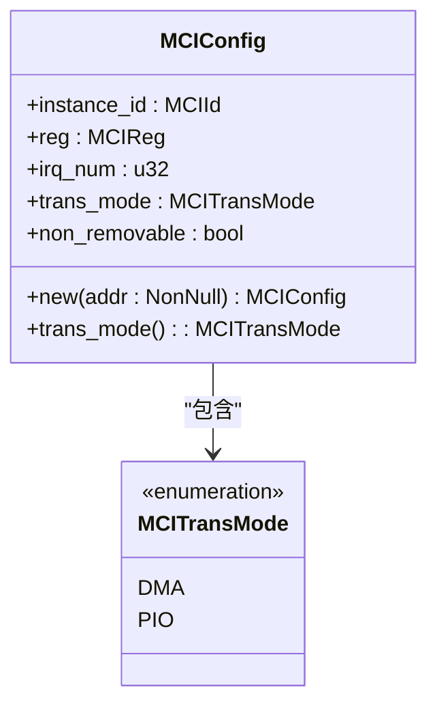

# 配置与构建

<cite>
**Referenced Files in This Document**   
- [Cargo.toml](file://Cargo.toml)
- [build.rs](file://build.rs)
- [rust-toolchain.toml](file://rust-toolchain.toml)
- [mci_config.rs](file://src/mci/mci_config.rs)
- [mci_dma.rs](file://src/mci/mci_dma.rs)
- [mci_pio.rs](file://src/mci/mci_pio.rs)
- [consts.rs](file://src/mci/consts.rs)
</cite>

## 目录
1. [特性功能说明](#特性功能说明)
2. [构建脚本分析](#构建脚本分析)
3. [工具链配置](#工具链配置)
4. [构建命令示例](#构建命令示例)

## 特性功能说明

本驱动通过 `Cargo.toml` 文件中的 `[features]` 部分提供可选功能配置，允许开发者根据目标平台和性能需求定制驱动行为。默认启用 `dma` 和 `irq` 特性，开发者可通过 `--no-default-features` 参数禁用默认特性并选择其他模式。

### DMA 特性
`dma` 特性启用直接内存访问（Direct Memory Access）模式，允许外设直接与系统内存交换数据而无需 CPU 干预。该特性在 `mci_dma.rs` 文件中实现，通过 `FSdifIDmaDesc` 结构体管理 DMA 描述符链表，实现高效的大块数据传输。当启用此特性时，驱动会配置 DMA 控制器寄存器（如 `FSDIF_DESC_LIST_ADDRL_OFFSET`），设置描述符列表地址并启动 DMA 传输。

**Section sources**
- [Cargo.toml](file://Cargo.toml#L25-L26)
- [mci_dma.rs](file://src/mci/mci_dma.rs#L1-L217)

### PIO 特性
`pio` 特性启用程序化输入输出（Programmed I/O）模式，通过 CPU 直接读写设备 FIFO 寄存器进行数据传输。该特性在 `mci_pio.rs` 文件中实现，包含 `pio_write_data` 和 `pio_read_data` 方法，通过循环读写 `MCIDataReg` 寄存器完成数据传输。此模式适用于小数据量传输或 DMA 不可用的场景。

值得注意的是，`mci_config.rs` 文件中通过编译时检查确保 `dma` 和 `pio` 特性不能同时启用，避免配置冲突。



**Diagram sources**
- [mci_config.rs](file://src/mci/mci_config.rs#L1-L92)
- [mci_pio.rs](file://src/mci/mci_pio.rs#L1-L50)

**Section sources**
- [Cargo.toml](file://Cargo.toml#L27-L28)
- [mci_config.rs](file://src/mci/mci_config.rs#L1-L92)
- [mci_pio.rs](file://src/mci/mci_pio.rs#L1-L50)

### IRQ 特性
`irq` 特性启用中断驱动模式，允许设备在完成操作或发生事件时通知 CPU。该特性通过 `mci_intr.rs` 文件中的中断处理机制实现，监听 `MCIRawInts` 寄存器中的各种中断事件（如命令完成、数据传输结束、错误发生等）。当启用此特性时，驱动会注册中断处理函数 `fsdif_interrupt_handler` 来响应设备中断。

**Section sources**
- [Cargo.toml](file://Cargo.toml#L30-L31)
- [mci/regs.rs](file://src/mci/regs.rs#L261-L292)

### Poll 特性
`poll` 特性启用轮询模式，CPU 通过定期检查设备状态寄存器来确定操作完成状态。此模式不依赖中断，适用于中断不可用或需要确定性响应时间的场景。虽然代码中定义了此特性，但实际实现主要依赖中断机制，轮询通常作为中断超时后的备用方案。

**Section sources**
- [Cargo.toml](file://Cargo.toml#L29-L30)

### PIO 模式选择
要选择 PIO 模式而非默认的 DMA 模式，开发者需在构建时使用 `--no-default-features` 参数禁用默认特性，并显式启用 `pio` 特性。这将触发编译时配置逻辑，在 `MCIConfig::new` 方法中将传输模式设置为 `MCITransMode::PIO`。



**Diagram sources**
- [mci_config.rs](file://src/mci/mci_config.rs#L1-L92)
- [consts.rs](file://src/mci/consts.rs#L53-L65)

**Section sources**
- [Cargo.toml](file://Cargo.toml#L24-L28)
- [mci_config.rs](file://src/mci/mci_config.rs#L1-L92)

## 构建脚本分析

`build.rs` 构建脚本非常简洁，仅包含一行代码调用 `bare_test_macros::build_test_setup!()` 宏。该宏主要用于测试环境的设置，为 `bare-test` 框架配置必要的构建参数。此构建脚本不生成任何源代码，也不修改编译选项，其主要作用是确保测试环境的正确初始化。

**Section sources**
- [build.rs](file://build.rs#L1-L4)

## 工具链配置

`rust-toolchain.toml` 文件指定了精确的 Rust 工具链版本要求，确保所有开发者使用一致的编译环境。该文件配置如下：

- **通道（channel）**: `nightly-2025-03-25` - 指定使用 2025 年 3 月 25 日发布的夜间构建版本。选择夜间版本通常是因为需要使用最新的不稳定特性或针对特定硬件的优化。
- **目标（targets）**: `aarch64-unknown-none` - 指定目标平台为 AArch64 架构的裸机环境（无操作系统），这与飞腾派等嵌入式平台完全匹配。
- **组件（components）**: 包含 `rust-src`（Rust 标准库源码）、`rustfmt`（代码格式化工具）和 `clippy`（代码 lint 工具），确保开发环境具备完整的开发和检查能力。

此配置确保了跨平台开发的一致性和可重现性。

**Section sources**
- [rust-toolchain.toml](file://rust-toolchain.toml#L1-L5)

## 构建命令示例

以下是为飞腾派等 AArch64 平台构建此驱动的完整命令示例：

```bash
# 构建默认配置（启用 DMA 和 IRQ）
cargo build --target aarch64-unknown-none

# 构建 PIO 模式（禁用默认特性，启用 PIO）
cargo build --target aarch64-unknown-none --no-default-features --features pio

# 构建用于测试的版本
cargo test --target aarch64-unknown-none --no-default-features
```

**解释**:
- `--target aarch64-unknown-none`: 指定目标三元组，匹配 `rust-toolchain.toml` 中的配置。
- `--no-default-features`: 禁用 `Cargo.toml` 中定义的默认特性（`dma` 和 `irq`）。
- `--features pio`: 显式启用 `pio` 特性，从而选择 PIO 传输模式。
- 在测试构建中，根据代码注释，`irq` 特性可能尚未完成，因此建议在测试时禁用默认特性。