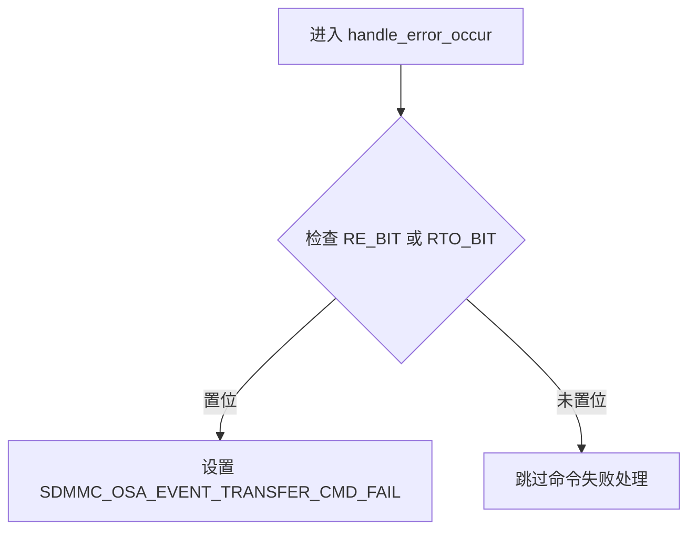
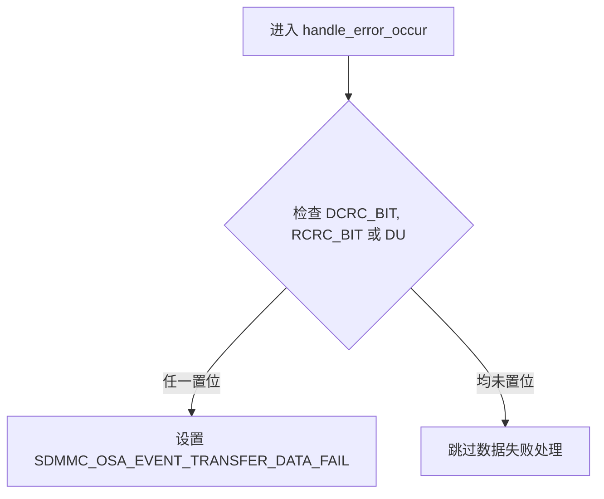

# 中断错误处理

<cite>
**Referenced Files in This Document**   
- [mci_intr.rs](file://src/mci/mci_intr.rs)
- [regs.rs](file://src/mci/regs.rs)
- [consts.rs](file://src/osa/consts.rs)
</cite>

## Table of Contents
1. [中断错误处理](#中断错误处理)
2. [核心处理流程](#核心处理流程)
3. [错误分类与事件上报](#错误分类与事件上报)
4. [中断清除与状态恢复](#中断清除与状态恢复)

## 核心处理流程

`fsdif_interrupt_handler`函数是SDIF控制器的中断处理入口，负责处理所有硬件中断事件。当检测到命令错误或DMA错误时，驱动会调用`handle_error_occur`函数进行错误分类与上报。

在中断处理过程中，首先读取原始中断寄存器（`MCIRawInts`）和DMA状态寄存器（`MCIDMACStatus`）的值，然后根据预定义的掩码常量`CMD_ERR_INTS_MASK`和`DMAC_ERR_INTS_MASK`判断是否发生了错误中断。如果检测到错误，立即调用`handle_error_occur`函数进行处理。

**Section sources**
- [mci_intr.rs](file://src/mci/mci_intr.rs#L124-L175)
- [regs.rs](file://src/mci/regs.rs#L261-L292)
- [regs.rs](file://src/mci/regs.rs#L531-L571)

## 错误分类与事件上报

### 命令失败判断与上报

`handle_error_occur`函数通过检查状态寄存器中的特定标志位来判断命令是否失败。当`RE_BIT`（响应错误）或`RTO_BIT`（响应超时）被置位时，表示命令执行失败。此时，函数会调用`osa_event_set`触发`SDMMC_OSA_EVENT_TRANSFER_CMD_FAIL`事件，通知上层应用层命令传输失败。

**Diagram sources**
- [mci_intr.rs](file://src/mci/mci_intr.rs#L162-L165)
- [regs.rs](file://src/mci/regs.rs#L261-L292)

### 数据传输失败判断与上报

对于数据传输失败的判断，`handle_error_occur`函数会检查多个条件。当`DCRC_BIT`（数据CRC错误）、`RCRC_BIT`（响应CRC错误）或`DU`（描述符不可用）等位域被置位时，表示数据传输过程中发生了错误。满足任一条件时，函数将调用`osa_event_set`上报`SDMMC_OSA_EVENT_TRANSFER_DATA_FAIL`事件。

**Diagram sources**
- [mci_intr.rs](file://src/mci/mci_intr.rs#L166-L173)
- [regs.rs](file://src/mci/regs.rs#L261-L292)
- [regs.rs](file://src/mci/regs.rs#L531-L571)

## 中断清除与状态恢复

### 中断清除顺序

为了确保硬件状态机能正确恢复，中断处理程序必须按照特定顺序清除中断标志。首先读取原始中断寄存器和DMA状态寄存器的值以获取当前中断状态，然后立即将这些值写回各自的寄存器，完成中断标志的清除。这种"读-写"操作是清除中断的标准方法。

中断清除必须在进行任何条件判断之前完成，以防止在处理过程中丢失新的中断事件。同时，清除操作需要原子性执行，避免在读取和写入之间发生新的中断。

### 状态寄存器读取的必要性

读取状态寄存器不仅是获取中断原因的必要步骤，也是确保硬件状态机正确运行的关键。通过读取`MCIRawInts`和`MCIDMACStatus`寄存器，驱动程序能够准确识别中断源，并根据不同的错误类型采取相应的处理措施。

状态寄存器的读取还具有副作用：某些硬件设计中，读取特定寄存器会自动清除相关状态位或触发状态机转换。因此，及时读取状态寄存器对于维护硬件的正确状态至关重要。

**Section sources**
- [mci_intr.rs](file://src/mci/mci_intr.rs#L124-L135)
- [regs.rs](file://src/mci/regs.rs#L261-L292)
- [regs.rs](file://src/mci/regs.rs#L531-L571)