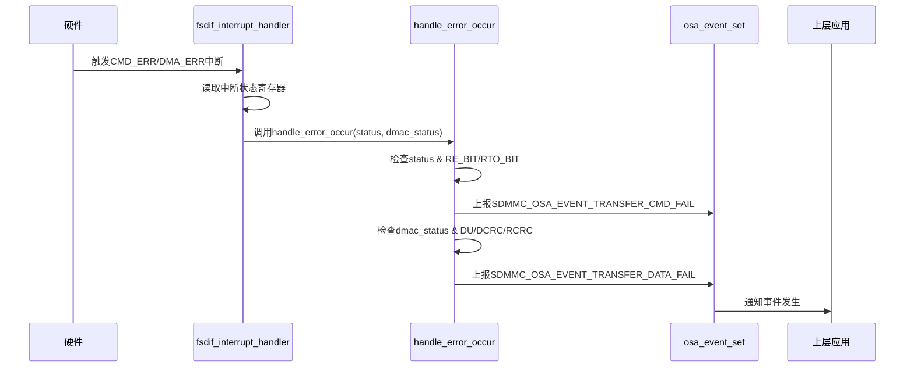

<cite>
**本文档中引用的文件**
- [mci_intr.rs](file://src/mci/mci_intr.rs)
- [mci_host/err.rs](file://src/mci_host/err.rs)
- [mci_host/constants.rs](file://src/mci_host/constants.rs)
- [osa/mod.rs](file://src/osa/mod.rs)
</cite>

## 目录
1. [异常恢复机制](#异常恢复机制)
2. [中断错误处理流程](#中断错误处理流程)
3. [错误事件上报机制](#错误事件上报机制)
4. [重试逻辑与常量定义](#重试逻辑与常量定义)
5. [初始化与电压切换失败恢复策略](#初始化与电压切换失败恢复策略)
6. [超时兜底恢复机制](#超时兜底恢复机制)

## 异常恢复机制

本节深入分析驱动程序中的异常恢复机制，重点围绕中断处理、错误上报、重试策略及超时恢复等核心环节，揭示系统在面对硬件错误和初始化失败时的健壮性设计。

## 中断错误处理流程

当硬件触发命令错误（`CMD_ERR_INTS_MASK`）或DMA错误（`DMAC_ERR_INTS_MASK`）时，系统通过中断处理函数 `fsdif_interrupt_handler` 进行响应。该函数首先读取中断状态寄存器，判断是否发生了命令或DMA相关的错误。一旦检测到 `dmac_events` 包含 `DMAC_ERR_INTS_MASK` 或 `events` 包含 `CMD_ERR_INTS_MASK`，便会立即调用 `handle_error_occur` 函数来处理这些错误，从而中断正常的命令或数据传输流程，进入错误处理分支。

**Section sources**
- [mci_intr.rs](file://src/mci/mci_intr.rs#L100-L115)

## 错误事件上报机制

`handle_error_occur` 函数是错误处理的核心。它根据具体的错误状态位，通过 `osa_event_set` 函数向操作系统抽象层（OSA）上报不同类型的事件。当命令相关的错误状态位（如 `RE_BIT` 响应错误或 `RTO_BIT` 响应超时）被置位时，会调用 `osa_event_set(SDMMC_OSA_EVENT_TRANSFER_CMD_FAIL)` 上报命令传输失败事件。当数据相关的错误状态位（如 `DU` DMA未完成、`DCRC_BIT` 数据CRC错误或 `RCRC_BIT` 响应CRC错误）被置位时，则会调用 `osa_event_set(SDMMC_OSA_EVENT_TRANSFER_DATA_FAIL)` 上报数据传输失败事件。`osa_event_set` 函数通过操作全局的 `OSAEvent` 实例，设置相应的事件标志位并通知等待线程，实现了驱动层与上层应用或操作系统之间的异步事件通信。

**Diagram sources**
- [mci_intr.rs](file://src/mci/mci_intr.rs#L150-L170)
- [osa/mod.rs](file://src/osa/mod.rs#L130-L140)

## 重试逻辑与常量定义

虽然代码中未直接定义名为 `MCIHostError` 的结构体来封装重试逻辑，但重试机制是通过上层状态机和错误码驱动的。在 `mci_host/constants.rs` 文件中定义了常量 `MCI_HOST_MAX_CMD_RETRIES`，其值为10。这个常量为上层逻辑（如卡初始化、命令发送等）提供了最大重试次数的上限。当驱动在执行命令时遇到可恢复的错误（例如通过 `MCIHostError::TransferFailed` 或 `MCIHostError::Timeout` 表示），上层调用者可以根据此错误码和 `MCI_HOST_MAX_CMD_RETRIES` 的限制，实现一个循环重试逻辑，尝试重新发送命令，直到成功或达到最大重试次数。

**Section sources**
- [mci_host/constants.rs](file://src/mci_host/constants.rs#L290)
- [mci_host/err.rs](file://src/mci_host/err.rs#L10)

## 初始化与电压切换失败恢复策略

在卡初始化（`CardInitFailed`）或电压切换（`SwitchVoltageFail`）失败时，驱动程序采用基于错误码的恢复策略。`CardInitFailed` 和 `SwitchVoltageFail` 是在 `mci_host/err.rs` 中定义的 `MCIHostError` 枚举成员。当这些错误发生时，它们会作为 `MCIHostStatus` 结果类型返回给调用者。上层初始化逻辑在接收到这些错误后，可以采取多种恢复措施，例如：对于 `SwitchVoltageFail`，可能会尝试降级到3.3V供电；对于 `CardInitFailed`，可能会重新执行完整的初始化流程，或者尝试不同的初始化参数。这种设计将具体的恢复动作与错误检测分离，提供了灵活的错误处理框架。

**Section sources**
- [mci_host/err.rs](file://src/mci_host/err.rs#L60-L62)

## 超时兜底恢复机制

在 `handle_cmd_done` 未被正确触发的场景下，系统依赖于上层的超时机制进行兜底恢复。`handle_cmd_done` 是一个中断处理函数，它在命令完成中断（`CMD_BIT`）到来时被调用，并通过 `osa_event_set` 上报 `SDMMC_OSA_EVENT_TRANSFER_CMD_SUCCESS` 事件。如果由于硬件故障或中断丢失，`handle_cmd_done` 未能执行，上层应用或驱动的命令发送逻辑通常会启动一个软件定时器。当等待 `SDMMC_OSA_EVENT_TRANSFER_CMD_SUCCESS` 事件的时间超过了预设的超时阈值，`osa_event_wait` 函数会返回超时错误。此时，上层逻辑便能感知到命令执行失败，从而触发错误处理流程，如重试命令或上报故障，确保了系统不会因单个中断丢失而陷入永久等待。

**Section sources**
- [mci_intr.rs](file://src/mci/mci_intr.rs#L130)
- [osa/mod.rs](file://src/osa/mod.rs#L145-L160)