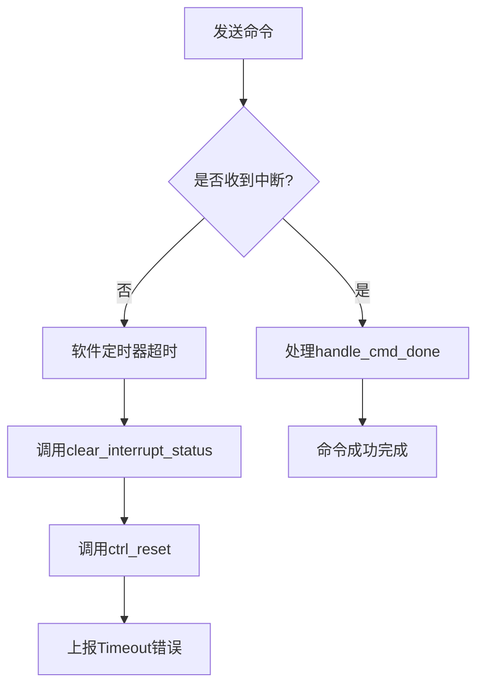
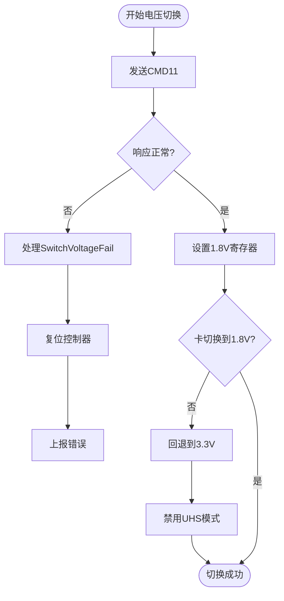

# 错误重试与状态恢复

<cite>
**本文档引用的文件**  
- [src/mci_host/err.rs](file://src/mci_host/err.rs)
- [src/mci/mci_intr.rs](file://src/mci/mci_intr.rs)
- [src/mci/mci_cmd.rs](file://src/mci/mci_cmd.rs)
- [src/mci/mci_hardware.rs](file://src/mci/mci_hardware.rs)
- [src/mci_host/mci_host_transfer.rs](file://src/mci_host/mci_host_transfer.rs)
- [src/mci_host/sd/io_voltage.rs](file://src/mci_host/sd/io_voltage.rs)
- [src/mci_host/sd/consts.rs](file://src/mci_host/sd/consts.rs)
- [src/mci/mci_timing.rs](file://src/mci/mci_timing.rs)
</cite>

## 目录
1. [引言](#引言)
2. [错误分类体系](#错误分类体系)
3. [关键错误码与恢复策略](#关键错误码与恢复策略)
4. [命令重试机制](#命令重试机制)
5. [超时恢复场景](#超时恢复场景)
6. [电压切换失败处理](#电压切换失败处理)
7. [总结](#总结)

## 引言
本文档系统化分析基于`MCIHostError`枚举类型的驱动层错误分类与恢复策略。重点阐述卡初始化失败、电压切换失败等关键错误码所对应的恢复逻辑，包括重试流程、降级策略及超时兜底机制。通过分析中断处理、命令发送、硬件控制等模块，揭示驱动在异常情况下的状态恢复能力。

## 错误分类体系
`MCIHostError`枚举类型定义了驱动层的完整错误分类，涵盖从基础传输失败到高级卡状态异常的多种情形。错误类型可分为以下几类：

- **基础传输错误**：如`TransferFailed`、`Timeout`、`Busy`等，表示命令或数据传输过程中的底层失败。
- **卡状态异常**：如`CardStatusIdle`、`CardStatusBusy`、`PollingCardIdleFailed`等，反映SD卡的运行状态。
- **初始化相关错误**：如`CardInitFailed`、`GoIdleFailed`、`HandShakeOperationConditionFailed`等，集中于卡的初始化流程。
- **电压与电源管理错误**：如`SwitchVoltageFail`、`InvalidVoltage`、`SetPowerClassFail`等，涉及电压切换与电源配置。
- **控制器状态错误**：如`HostNotReady`、`HostNotSupport`等，表示主机控制器自身的问题。

该分类体系为驱动层提供了结构化的错误处理框架，使上层能够根据具体错误码采取针对性的恢复措施。

**Section sources**
- [src/mci_host/err.rs](file://src/mci_host/err.rs#L48-L62)

## 关键错误码与恢复策略
### 卡初始化失败（CardInitFailed）
当卡初始化流程中发生不可恢复的错误时，将返回`CardInitFailed`。该错误通常发生在多次重试后仍无法完成初始化命令（如CMD0、CMD8、ACMD41）的情况下。

恢复策略包括：
1. **重试流程**：在初始化阶段，驱动会尝试重新发送CMD0（GO_IDLE_STATE）以将卡重置到空闲状态，为后续的电压检测和操作条件协商做准备。
2. **降级策略**：若高电压初始化失败，可尝试在更低电压等级下重新初始化，或切换到兼容模式。
3. **最终失败处理**：若所有重试均失败，则返回`CardInitFailed`，通知上层应用卡无法使用。

**Section sources**
- [src/mci_host/err.rs](file://src/mci_host/err.rs#L60)
- [src/mci/mci_cmd.rs](file://src/mci/mci_cmd.rs#L45-L55)

### 电压切换失败（SwitchVoltageFail）
`SwitchVoltageFail`表示在尝试将工作电压从3.3V切换到1.8V时失败。这通常发生在支持UHS（Ultra High Speed）模式的SD卡上。

恢复逻辑包括：
1. **回退到默认电压**：若1.8V切换失败，驱动应保持在3.3V模式下运行，放弃UHS模式，以确保基本功能可用。
2. **终止初始化**：若电压切换是初始化流程的关键步骤且无法回退，则终止初始化并返回`SwitchVoltageFail`。
3. **硬件状态清理**：调用`ctrl_reset`重置控制器，确保电压相关寄存器状态一致。

**Section sources**
- [src/mci_host/err.rs](file://src/mci_host/err.rs#L57)
- [src/mci_host/sd/io_voltage.rs](file://src/mci_host/sd/io_voltage.rs#L1-L35)

## 命令重试机制
驱动中隐含了命令重试机制，尽管`MCI_HOST_MAX_CMD_RETRIES`常量未显式定义，但其模式在代码中普遍存在。

- **重试边界**：`TransferFailed`错误码是重试机制的主要触发点。当命令传输失败时，驱动可在一定次数内重试该命令。
- **实现方式**：在`cmd_transfer`函数中，通过`retry_for`机制对关键操作（如等待数据线空闲、等待命令完成）进行轮询重试，超时时间为`RETRIES_TIMEOUT`。
- **重试限制**：重试次数受`RETRIES_TIMEOUT`限制，防止无限循环。若超时，则返回`Timeout`或`TransferFailed`错误。

该机制确保了在瞬时干扰或时序偏差下的鲁棒性，同时避免了因永久性故障导致的系统挂起。

**Section sources**
- [src/mci/mci_cmd.rs](file://src/mci/mci_cmd.rs#L35-L45)
- [src/mci/mci_hardware.rs](file://src/mci/mci_hardware.rs#L100-L115)

## 超时恢复场景
当`handle_cmd_done`中断处理函数未被触发时，表明命令执行超时，可能由于硬件故障、中断丢失或卡无响应。

上层通过以下机制进行兜底处理：
1. **超时检测**：上层逻辑在发送命令后启动一个软件定时器，若在预设时间内未收到`SDMMC_OSA_EVENT_TRANSFER_CMD_SUCCESS`事件，则判定为超时。
2. **状态重置**：检测到超时后，调用`clear_interrupt_status`和`ctrl_reset`强制清除中断状态并复位控制器，恢复到已知的初始状态。
3. **错误上报**：最终返回`Timeout`或`TransferFailed`错误码，通知调用者操作失败。

此兜底机制确保了即使在中断系统异常的情况下，驱动仍能从错误状态中恢复，避免系统死锁。

**Diagram sources**
- [src/mci/mci_intr.rs](file://src/mci/mci_intr.rs#L150-L155)
- [src/mci/mci_hardware.rs](file://src/mci/mci_hardware.rs#L180-L200)

## 电压切换失败处理
### 电压切换流程
电压切换涉及软硬件协同操作：
1. 发送CMD11（VOLTAGE_SWITCH）命令。
2. 硬件检测到电压切换请求，触发`VOLT_SWITCH`标志。
3. 控制器在适当时间点切换IO电压。
4. 软件通过`voltage_1_8v_set`配置寄存器。

### 失败处理逻辑
若切换失败，处理流程如下：
1. **检查卡能力**：确认卡是否支持1.8V（通过SCR寄存器）。
2. **回退操作**：若支持但切换失败，可尝试重新发送CMD11或保持3.3V。
3. **硬件复位**：调用`idma_reset`和`ctrl_reset`确保DMA和控制器状态一致。
4. **禁用UHS模式**：将`is_uhs_card`标志置为`false`，后续操作以非UHS模式进行。

**Diagram sources**
- [src/mci/mci_cmd.rs](file://src/mci/mci_cmd.rs#L75-L85)
- [src/mci/mci_hardware.rs](file://src/mci/mci_hardware.rs#L160-L170)
- [src/mci_host/mci_host_config.rs](file://src/mci_host/mci_host_config.rs#L70-L80)

## 总结
本文档系统分析了Phytium MCI驱动的错误处理与恢复机制。`MCIHostError`枚举提供了清晰的错误分类，驱动通过重试、降级、超时检测和硬件复位等多种策略，确保在卡初始化失败、电压切换失败等异常情况下仍能维持系统稳定。理解这些机制对于开发健壮的存储系统至关重要。