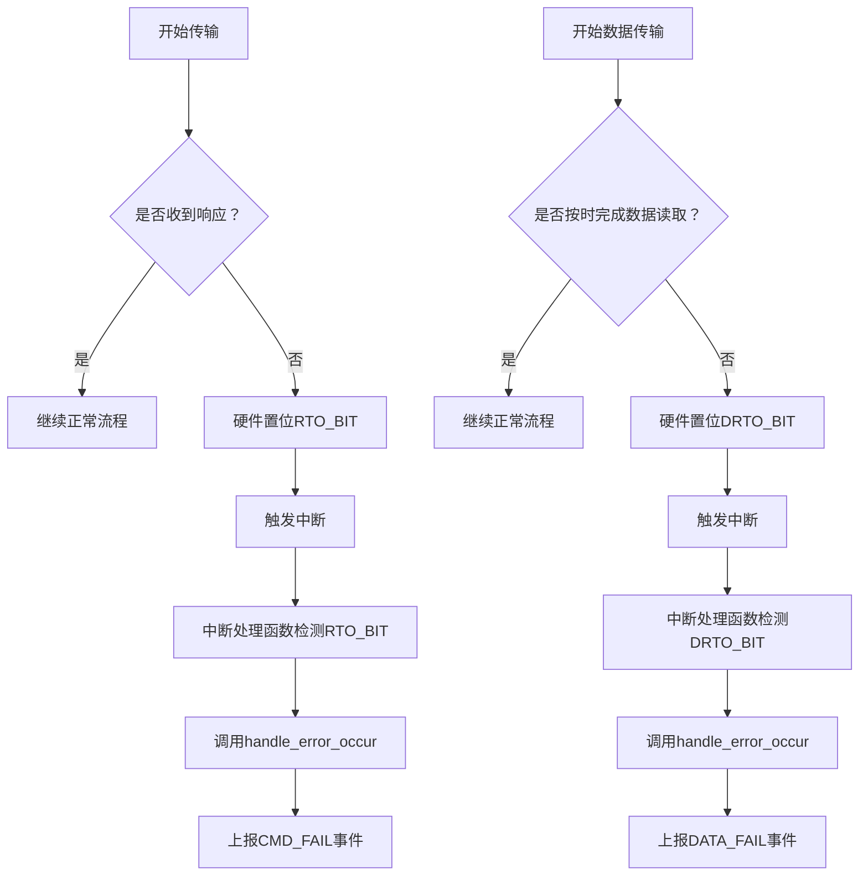

# 超时处理策略

<cite>
**本文档引用的文件**   
- [mci_intr.rs](file://src/mci/mci_intr.rs)
- [err.rs](file://src/mci/err.rs)
- [regs.rs](file://src/mci/regs.rs)
- [mci_timing.rs](file://src/mci/mci_timing.rs)
- [mci_config.rs](file://src/mci/mci_config.rs)
</cite>

## 目录
1. [超时错误类型说明](#超时错误类型说明)
2. [中断处理中的超时检测机制](#中断处理中的超时检测机制)
3. [超时阈值设定原则](#超时阈值设定原则)
4. [优化建议](#优化建议)

## 超时错误类型说明

在驱动程序中，`MCIError`枚举定义了多种超时相关的错误类型，用于区分不同阶段的通信超时情况：

- **Timeout**：通用超时错误，表示操作未能在预期时间内完成，通常作为默认的超时异常处理。
- **CmdTimeout**：命令发送超时，特指主机向SD卡发送命令后，在规定时间内未收到响应。该错误通常由`MCIRawInts::RTO_BIT`（响应超时）中断触发。
- **TransTimeout**：数据传输超时，指在数据读取或写入过程中，数据流未能及时完成。该错误主要由`MCIRawInts::DRTO_BIT`（数据读超时）中断触发。

这些错误类型帮助系统精确识别通信故障的具体阶段，从而进行针对性的恢复或重试策略。

**Section sources**
- [err.rs](file://src/mci/err.rs#L0-L23)
- [regs.rs](file://src/mci/regs.rs#L207-L208)

## 中断处理中的超时检测机制

当SD卡控制器发生超时时，硬件会通过设置相应的中断标志位来通知主机。驱动程序在中断处理函数`fsdif_interrupt_handler`中检测这些标志位，并生成对应的错误。

具体流程如下：

1. 当控制器未在规定时间内接收到命令响应时，硬件自动置位`MCIRawInts::RTO_BIT`（响应超时）。
2. 当数据读取过程中超时，硬件置位`MCIRawInts::DRTO_BIT`（数据读超时）。
3. 中断处理函数读取`MCIRawInts`寄存器，检查上述标志位。
4. 若检测到`RTO_BIT`或`DRTO_BIT`被置位，调用`handle_error_occur`函数进行错误处理。
5. 在`handle_error_occur`中，根据状态位设置相应的OSA事件：
   - 若为命令超时（`RTO_BIT`），触发`SDMMC_OSA_EVENT_TRANSFER_CMD_FAIL`事件。
   - 若为数据传输超时（`DRTO_BIT`），触发`SDMMC_OSA_EVENT_TRANSFER_DATA_FAIL`事件。

该机制确保了超时事件能够被及时捕获并上报，避免系统无限等待。

**Diagram sources**
- [mci_intr.rs](file://src/mci/mci_intr.rs#L135-L165)
- [regs.rs](file://src/mci/regs.rs#L207-L208)

## 超时阈值设定原则

超时阈值通过`MCITimeout`寄存器进行配置，包括响应超时和数据超时两个部分。其设定需遵循以下原则：

- **低速模式下应设置更长的超时时间**：在初始化阶段或低频工作模式（如400KHz）下，SD卡响应速度较慢，因此需要配置更宽松的超时阈值，避免误报超时错误。
- **根据时钟频率动态调整**：驱动通过`MCIConfig::get_tuning`函数根据目标时钟频率选择合适的`MCITiming`配置，其中包括时钟分频、相位调整等参数，间接影响超时判断的时间基准。
- **初始化阶段特别处理**：在卡初始化过程中，由于电压切换、总线配置等原因，通信稳定性较低，建议采用保守的超时策略。

例如，在`MMC_SD_400K_HZ`配置中，时钟分频值较大，对应较长的时钟周期，因此默认的超时计数器能覆盖更长时间。

**Section sources**
- [mci_timing.rs](file://src/mci/mci_timing.rs#L0-L66)
- [mci_config.rs](file://src/mci/mci_config.rs#L42-L90)
- [regs.rs](file://src/mci/regs.rs#L119-L139)

## 优化建议

为避免误报超时错误，特别是在初始化阶段或电压切换后，建议采取以下优化措施：

1. **合理调整时钟频率**：
   - 初始化时使用低频（如400KHz），待通信稳定后再逐步提升至工作频率。
   - 在电压切换后（如从3.3V切换到1.8V），重新配置时钟参数，确保信号完整性。

2. **动态配置超时参数**：
   - 根据当前工作模式（默认模式、高速模式、UHS模式）动态设置`MCITimeout`寄存器的值。
   - 在低速模式下增加超时计数器的上限值。

3. **结合IO延迟调整**：
   - 利用`MCIPadDelay`机制，在高频模式下启用pad delay（如`SD_50MHZ`和`SD_100MHZ`配置中设置`pad_delay: MCIPadDelay::Set`），以补偿信号传播延迟，提高通信可靠性。

4. **错误恢复机制**：
   - 在发生超时后，执行时钟重启（`clk_restart`）操作，重新同步时钟域。
   - 对于关键命令（如电压切换），增加重试逻辑，并在重试前适当延长超时等待时间。

通过上述策略，可显著降低因时序不匹配导致的超时误报，提升驱动的稳定性和兼容性。

**Section sources**
- [mci_timing.rs](file://src/mci/mci_timing.rs#L0-L66)
- [mci_config.rs](file://src/mci/mci_config.rs#L42-L90)
- [mci_hardware.rs](file://src/mci/mci_hardware.rs#L0-L48)
- [mci/mod.rs](file://src/mci/mod.rs#L680-L707)