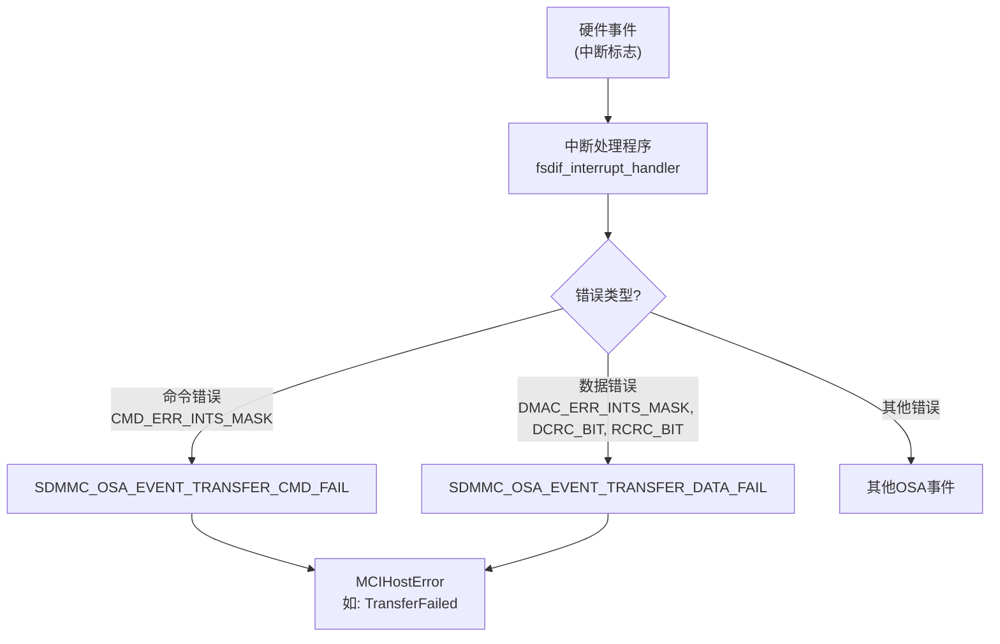
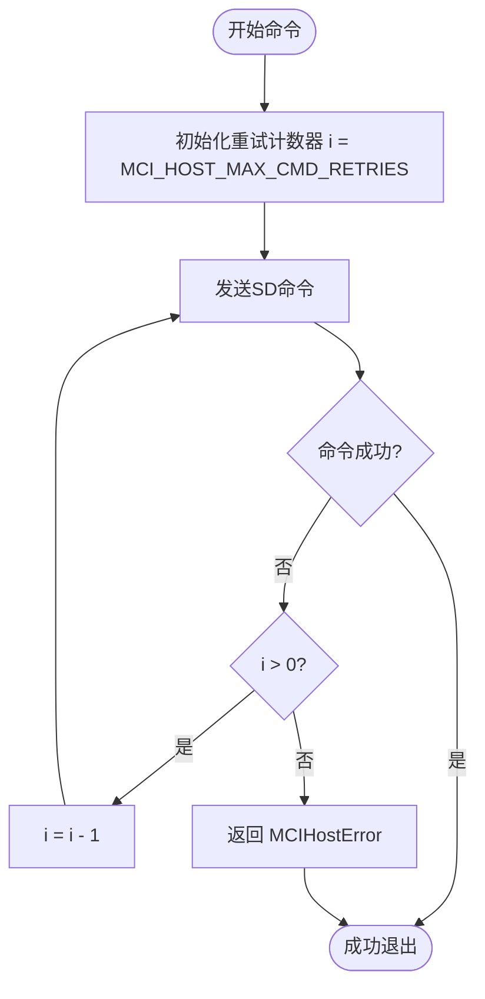

# 错误处理机制

<cite>
**Referenced Files in This Document**   
- [mci/err.rs](file://src/mci/err.rs)
- [mci_host/err.rs](file://src/mci_host/err.rs)
- [mci/mci_intr.rs](file://src/mci/mci_intr.rs)
- [mci_host/constants.rs](file://src/mci_host/constants.rs)
- [mci_host/sd/mod.rs](file://src/mci_host/sd/mod.rs)
</cite>

## 目录
1. [核心错误类型](#核心错误类型)
2. [硬件错误检测与转换](#硬件错误检测与转换)
3. [重试机制与超时处理](#重试机制与超时处理)
4. [故障排除指南](#故障排除指南)

## 核心错误类型

本驱动程序定义了两套分层的错误枚举，分别位于 `mci` 和 `mci_host` 模块中，用于精确地表示不同层级的错误状态。

### MCI底层错误 (MciError)

`MciError` 枚举定义在 `src/mci/err.rs` 文件中，代表了与MCI硬件控制器直接交互时可能发生的底层错误。这些错误是驱动与硬件通信的基础。

**Section sources**
- [mci/err.rs](file://src/mci/err.rs#L1-L25)

### MCI主机层错误 (MCIHostError)

`MCIHostError` 枚举定义在 `src/mci_host/err.rs` 文件中，它提供了更高层次、更具体的错误信息，涵盖了SD/MMC卡协议栈的完整生命周期。该枚举不仅包含了底层错误的映射，还定义了大量与卡操作相关的业务逻辑错误。

**Diagram sources**
- [mci/mci_intr.rs](file://src/mci/mci_intr.rs#L100-L150)
- [mci_host/err.rs](file://src/mci_host/err.rs#L1-L64)

**Section sources**
- [mci_host/err.rs](file://src/mci_host/err.rs#L1-L64)

## 硬件错误检测与转换

驱动程序通过中断处理程序 `fsdif_interrupt_handler` 来实时检测硬件错误，并将其转换为高级的 `MCIHostError` 类型。

### 中断处理流程

1.  **中断触发**：当MCI控制器发生错误时，会在 `MCIRawInts` (原始中断寄存器) 和 `MCIDMACStatus` (DMA控制器状态寄存器) 中设置相应的错误标志位。
2.  **错误检测**：中断处理程序 `fsdif_interrupt_handler` 会读取这些寄存器的状态。
3.  **错误分类**：
    *   **命令错误**：如果 `MCIRawInts` 寄存器中包含 `CMD_ERR_INTS_MASK` (命令错误中断掩码)，则调用 `handle_error_occur` 并设置 `SDMMC_OSA_EVENT_TRANSFER_CMD_FAIL` 事件。
    *   **数据错误**：如果 `MCIDMACStatus` 寄存器中包含 `DMAC_ERR_INTS_MASK` (DMA错误中断掩码)，或 `MCIRawInts` 中包含 `DCRC_BIT` (数据CRC错误) 或 `RCRC_BIT` (响应CRC错误)，则设置 `SDMMC_OSA_EVENT_TRANSFER_DATA_FAIL` 事件。
4.  **错误转换**：上层的主机逻辑（如 `mci_host/sd/mod.rs`）会监听这些OSA事件。当事件被触发时，上层逻辑会根据上下文将这些通用的失败事件转换为具体的 `MCIHostError`，例如 `TransferFailed`、`SendCsdFailed` 等。

**Section sources**
- [mci/mci_intr.rs](file://src/mci/mci_intr.rs#L100-L150)

## 重试机制与超时处理

为了提高系统的鲁棒性，驱动程序在关键的卡初始化和命令交互流程中实现了重试机制。

### 最大命令重试次数

驱动程序定义了一个常量 `MCI_HOST_MAX_CMD_RETRIES`，其值为 `10`，位于 `src/mci_host/constants.rs` 文件中。这个常量规定了在执行关键命令（如 `CMD8`、`ACMD41`）时，如果失败，最多允许重试的次数。

### 重试机制实现

在 `src/mci_host/sd/mod.rs` 文件中，多个关键函数（如 `interface_condition_send` 和 `application_opration_condition_send`）都实现了基于 `MCI_HOST_MAX_CMD_RETRIES` 的重试循环。

1.  **初始化计数器**：函数开始时，会将一个计数器 `i` 初始化为 `MCI_HOST_MAX_CMD_RETRIES`。
2.  **执行命令**：在循环中尝试执行SD命令。
3.  **错误处理**：
    *   如果命令执行失败（返回 `Err`），并且重试次数未耗尽（`i > 0`），则递减计数器并继续下一次循环。
    *   如果命令执行成功，则跳出循环。
4.  **最终判定**：如果在 `MCI_HOST_MAX_CMD_RETRIES` 次尝试后命令仍然失败，则函数返回一个具体的 `MCIHostError`（如 `CardNotSupport` 或 `TransferFailed`），表示操作彻底失败。

这种机制可以有效应对因信号干扰、卡状态不稳定等临时性问题导致的命令失败。

**Diagram sources**
- [mci_host/constants.rs](file://src/mci_host/constants.rs#L175)
- [mci_host/sd/mod.rs](file://src/mci_host/sd/mod.rs#L1190)
- [mci_host/sd/mod.rs](file://src/mci_host/sd/mod.rs#L1761)

**Section sources**
- [mci_host/constants.rs](file://src/mci_host/constants.rs#L175)
- [mci_host/sd/mod.rs](file://src/mci_host/sd/mod.rs#L1180-L1200)
- [mci_host/sd/mod.rs](file://src/mci_host/sd/mod.rs#L1750-L1770)

## 故障排除指南

以下是一些常见错误的可能原因和解决方案。

### 卡未识别 (Card Not Recognized)

*   **可能原因**:
    1.  物理连接问题（卡未插好、卡槽损坏）。
    2.  卡本身损坏或不兼容。
    3.  `CMD8` 或 `ACMD41` 命令连续失败 `MCI_HOST_MAX_CMD_RETRIES` 次。
*   **解决方案**:
    1.  检查并重新插入SD卡。
    2.  尝试使用另一张已知正常的SD卡。
    3.  检查日志，确认错误码是否为 `CardNotSupport` 或 `TransferFailed`，并排查硬件或电源问题。

### 数据传输失败 (Data Transfer Failed)

*   **可能原因**:
    1.  数据CRC校验错误 (`DCRC_BIT`)，通常由信号完整性差或时钟不稳定引起。
    2.  DMA传输错误 (`DMAC_ERR_INTS_MASK`)。
    3.  数据读取超时 (`DRTO_BIT`)。
*   **解决方案**:
    1.  检查硬件连接，确保信号线短且无干扰。
    2.  尝试降低SD卡的时钟频率（例如，从高速模式切换到默认的400kHz）。
    3.  确认DMA配置是否正确。
    4.  检查电源是否稳定。

**Section sources**
- [mci/err.rs](file://src/mci/err.rs#L1-L25)
- [mci_host/err.rs](file://src/mci_host/err.rs#L1-L64)
- [mci/mci_intr.rs](file://src/mci/mci_intr.rs#L100-L150)