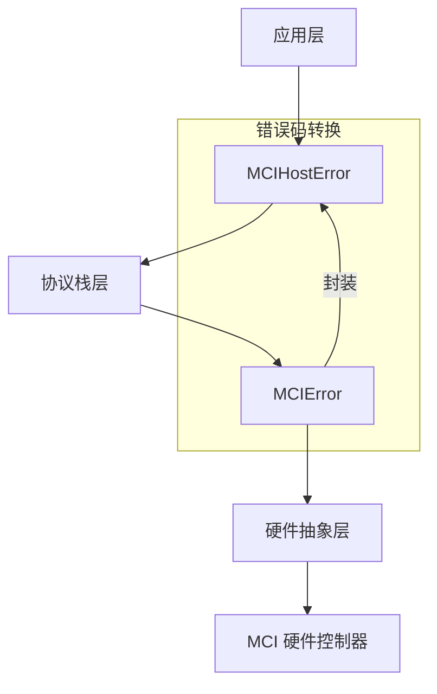

# 错误码定义

<cite>
**本文档引用的文件**  
- [mci/err.rs](file://src/mci/err.rs)
- [mci_host/err.rs](file://src/mci_host/err.rs)
</cite>

## 目录
1. [引言](#引言)
2. [MCIError 枚举详解](#mcierror-枚举详解)
3. [MCIHostError 枚举详解](#mcihosterror-枚举详解)
4. [错误码分层设计与转换关系](#错误码分层设计与转换关系)
5. [使用示例与错误处理](#使用示例与错误处理)
6. [总结](#总结)

## 引言

本文档旨在详细说明 `phytium-mci` 驱动库中的错误码体系，重点分析位于 `src/mci/err.rs` 的 `MCIError` 枚举和位于 `src/mci_host/err.rs` 的 `MCIHostError` 枚举。该驱动库为 Phytium 平台的 MCI（多媒体卡接口）控制器提供硬件抽象和协议支持。错误码系统采用分层设计，清晰地区分了底层硬件操作错误和高层 SD/MMC 协议错误，为开发者提供了精确的故障诊断信息。

## MCIError 枚举详解

`MCIError` 枚举定义在 `src/mci/err.rs` 文件中，代表了与 MCI 硬件控制器直接交互时可能发生的底层错误。这些错误通常与硬件状态、时序和数据传输机制相关。

**Section sources**
- [mci/err.rs](file://src/mci/err.rs#L1-L25)

### 核心错误类型

- **`Timeout`**: 通用超时错误，表示某个操作未能在预期时间内完成。
- **`TransTimeout`**: 传输超时，特指数据传输过程中的超时，通常与 DMA 或 PIO 传输相关。
- **`CmdTimeout`**: 命令超时，特指发送命令到卡设备后，未能在规定时间内收到响应。
- **`NoCard`**: 未检测到卡，表示硬件层检测到插槽中没有插入存储卡。
- **`DmaBufUnalign`**: DMA 缓冲区未对齐，表示提供给 DMA 引擎的缓冲区地址或大小不符合硬件对齐要求（如非 4 字节对齐）。
- **`NotInit`**: 控制器未初始化，表示在调用需要控制器处于工作状态的操作前，未正确执行初始化流程。
- **`InvalidState`**: 无效状态，表示控制器当前处于一个不允许执行请求操作的状态。
- **`Busy`**: 控制器忙，表示控制器正在处理其他任务，无法接受新的请求。
- **`ShortBuf`**: 缓冲区过短，表示提供的接收缓冲区不足以容纳预期的数据。
- **`NotSupport`**: 不支持，表示请求的功能在当前硬件配置下不可用。

`MCIError` 实现了 `RegError` trait，其中 `timeout()` 关联函数返回 `MCIError::Timeout`，这为上层代码提供了一种标准化的方式来生成超时错误。

## MCIHostError 枚举详解

`MCIHostError` 枚举定义在 `src/mci_host/err.rs` 文件中，代表了在实现 SD/MMC 卡协议栈时可能发生的高层协议错误。这些错误封装了 `MCIError`，并提供了更具体的、与 SD 卡初始化、配置和数据传输流程相关的语义。

**Section sources**
- [mci_host/err.rs](file://src/mci_host/err.rs#L1-L64)

### 协议初始化阶段错误

这些错误发生在 SD 卡的上电初始化流程中，是建立通信连接的关键步骤。

- **`GoIdleFailed`**: 发送 `GO_IDLE_STATE` (CMD0) 命令失败，无法将卡重置到空闲状态。
- **`HandShakeOperationConditionFailed`**: 发送 `SEND_OP_COND` (ACMD41) 命令失败，无法完成操作条件的协商，这是识别卡类型（SDSC, SDHC, SDXC）和电压兼容性的关键步骤。
- **`AllSendCidFailed`**: 发送 `ALL_SEND_CID` (CMD2) 命令失败，无法获取卡的 CID（卡识别号）。
- **`SendRelativeAddressFailed`**: 发送 `SET_RELATIVE_ADDR` (CMD3) 命令失败，无法为卡分配一个相对地址（RCA）。
- **`SendCsdFailed`**: 发送 `SEND_CSD` (CMD9) 命令失败，无法获取卡的 CSD（卡特定数据）寄存器，该寄存器包含卡的容量和性能信息。
- **`SelectCardFailed`**: 发送 `SELECT/DESELECT_CARD` (CMD7) 命令失败，无法选择或激活特定的卡进行通信。

### 协议配置阶段错误

这些错误发生在初始化成功后，对卡和主机进行功能配置的过程中。

- **`SetDataBusWidthFailed`**: 发送 `SET_BUS_WIDTH` (ACMD6) 命令失败，无法将数据总线宽度设置为 4 位模式，这会限制数据传输速率。
- **`SwitchBusTimingFailed`**: 切换总线时序失败，通常指无法成功切换到高速（High-Speed）模式。
- **`SetCardBlockSizeFailed`**: 设置卡的块大小失败。
- **`SwitchFailed`**: 发送 `SWITCH` (CMD6) 命令失败，该命令用于查询和配置卡的功能（如总线速度模式、驱动强度等）。
- **`SendScrFailed`**: 获取卡的 SCR（SD卡配置寄存器）失败。

### 数据传输与运行时错误

这些错误发生在数据读写操作或卡的日常运行中。

- **`TransferFailed`**: 通用的数据传输失败。
- **`NoTransferInProgress`**: 在没有传输正在进行时尝试执行与传输相关的操作。
- **`WaitWriteCompleteFailed`**: 等待写操作完成失败。
- **`StopTransmissionFailed`**: 发送 `STOP_TRANSMISSION` (CMD12) 命令失败，无法终止当前的数据传输。
- **`ReTuningRequest`**: 调谐请求，表示由于信号完整性下降，需要重新执行调谐过程（Tuning）。
- **`TuningFail`**: 调谐过程失败。
- **`CardStatusIdle` / `CardStatusBusy`**: 反映了从卡状态寄存器读取到的状态，可用于诊断卡的忙闲状态。

## 错误码分层设计与转换关系

该驱动库的错误码系统采用了清晰的分层架构，体现了硬件抽象层（HAL）与协议栈层的分离。



**Diagram sources**
- [mci/err.rs](file://src/mci/err.rs#L1-L25)
- [mci_host/err.rs](file://src/mci_host/err.rs#L1-L64)

**Section sources**
- [mci/err.rs](file://src/mci/err.rs#L1-L25)
- [mci_host/err.rs](file://src/mci_host/err.rs#L1-L64)

- **底层 (`MCIError`)**: 直接映射硬件控制器的错误状态。例如，当硬件寄存器报告超时时，驱动会返回 `MCIError::CmdTimeout` 或 `MCIError::TransTimeout`。
- **高层 (`MCIHostError`)**: 在协议栈层捕获 `MCIResult<T>` 的错误，并将其转换为更具语义的 `MCIHostError`。例如，当在初始化流程中调用底层命令发送函数并收到 `MCIError::CmdTimeout` 时，协议栈会将其转换为更具体的 `MCIHostError::GoIdleFailed` 或 `MCIHostError::SendRelativeAddressFailed`。

这种设计使得上层应用无需关心底层硬件的具体错误码，只需处理与 SD 卡协议直接相关的错误，极大地提高了代码的可读性和可维护性。

## 使用示例与错误处理

开发者在使用该驱动库时，主要与 `MCIHostStatus<T>` 类型打交道，该类型是 `Result<T, MCIHostError>` 的别名。

### 初始化 SD 卡

```rust
// 伪代码示例
match SdCard::new(host_config) {
    Ok(card) => {
        // SD卡初始化成功，可以进行后续操作
        println!("SD Card initialized successfully");
    }
    Err(e) => {
        match e {
            MCIHostError::GoIdleFailed => {
                // 处理CMD0失败，可能是卡接触不良
                println!("Failed to reset card to idle state");
            }
            MCIHostError::HandShakeOperationConditionFailed => {
                // 处理ACMD41失败，可能是电压不匹配或卡不支持
                println!("Card voltage negotiation failed");
            }
            MCIHostError::NoCard => {
                // 处理未检测到卡
                println!("No SD card detected in the slot");
            }
            _ => {
                // 处理其他初始化错误
                println!("SD Card initialization failed: {:?}", e);
            }
        }
    }
}
```

### 执行数据传输

```rust
// 伪代码示例
match card.read_blocks(block_addr, buffer) {
    Ok(()) => {
        // 读取成功
        println!("Data read successfully");
    }
    Err(e) => {
        match e {
            MCIHostError::TransferFailed => {
                // 传输失败，可能需要重试
                println!("Data transfer failed");
            }
            MCIHostError::Timeout => {
                // 读取超时
                println!("Read operation timed out");
            }
            MCIHostError::Busy => {
                // 卡或主机忙
                println!("Device is busy, please try again later");
            }
            _ => {
                // 处理其他错误
                println!("Read operation failed: {:?}", e);
            }
        }
    }
}
```

**Section sources**
- [mci_host/err.rs](file://src/mci_host/err.rs#L1-L64)

## 总结

`MCIError` 和 `MCIHostError` 共同构成了 `phytium-mci` 驱动库健壮的错误处理机制。`MCIError` 作为底层基石，精确地反映了硬件状态；`MCIHostError` 作为高层接口，为开发者提供了符合 SD/MMC 协议语义的、易于理解的错误信息。通过这种分层设计，驱动库在保证底层操作精确性的同时，也极大地简化了上层应用的错误处理逻辑。开发者应根据具体的错误码来诊断问题，例如，`NoCard` 指向物理连接问题，`GoIdleFailed` 指向初始化协议问题，而 `DmaBufUnalign` 则是典型的内存管理问题。