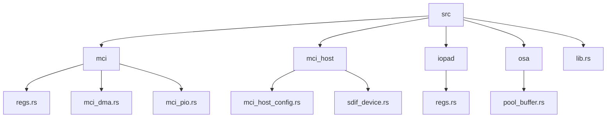
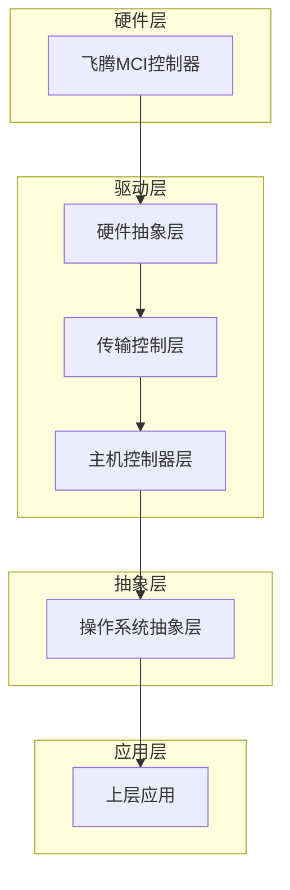
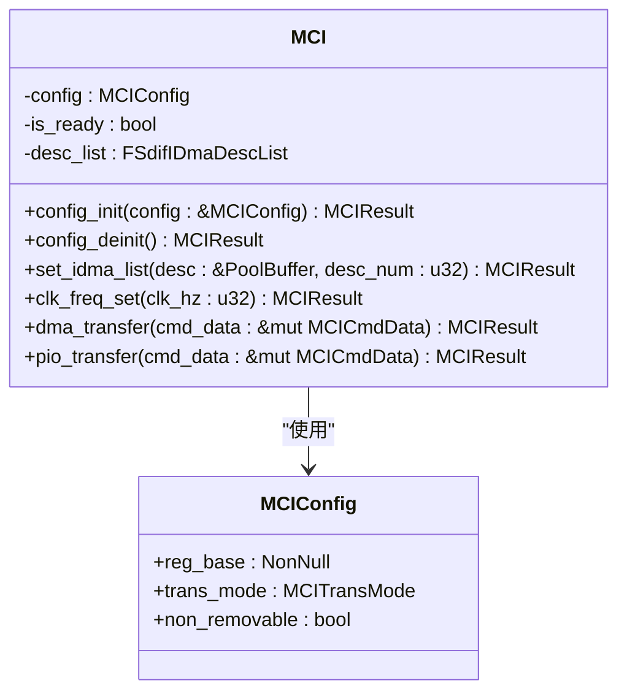
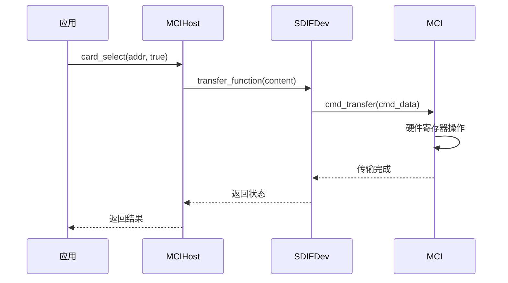
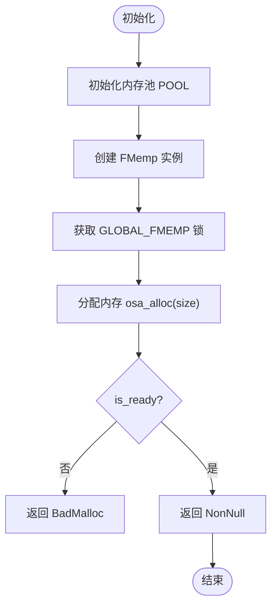
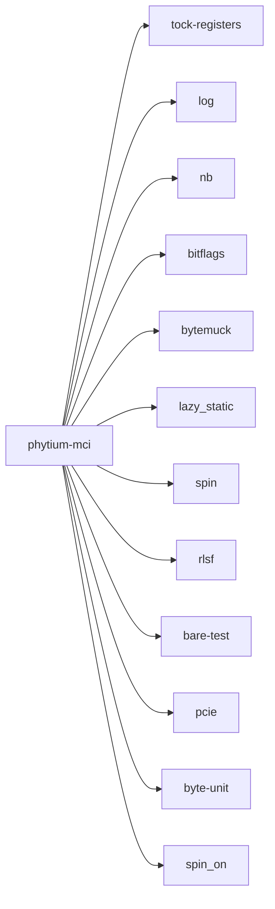

# 项目概述

<cite>
**本文档引用的文件**  
- [README.md](file://README.md)
- [Cargo.toml](file://Cargo.toml)
- [src/lib.rs](file://src/lib.rs)
- [src/mci/mod.rs](file://src/mci/mod.rs)
- [src/mci_host/mod.rs](file://src/mci_host/mod.rs)
- [src/osa/mod.rs](file://src/osa/mod.rs)
- [src/iopad/mod.rs](file://src/iopad/mod.rs)
- [src/mci/mci_hardware.rs](file://src/mci/mci_hardware.rs)
- [src/mci/mci_dma.rs](file://src/mci/mci_dma.rs)
- [src/mci/mci_pio.rs](file://src/mci/mci_pio.rs)
- [src/mci_host/mci_host_config.rs](file://src/mci_host/mci_host_config.rs)
</cite>

## 目录
1. [简介](#简介)
2. [项目结构](#项目结构)
3. [核心组件](#核心组件)
4. [架构概述](#架构概述)
5. [详细组件分析](#详细组件分析)
6. [依赖分析](#依赖分析)
7. [性能考虑](#性能考虑)
8. [故障排除指南](#故障排除指南)
9. [结论](#结论)

## 简介

飞腾MCI驱动库是一个用Rust语言实现的SD/MMC存储设备驱动程序，专为嵌入式系统和操作系统内核环境设计。该项目支持SD卡和eMMC设备，采用`no_std`设计目标，确保其可在资源受限的环境中运行。驱动程序针对飞腾平台进行了硬件适配，具备良好的可移植性和模块化特性。通过分层架构设计，该驱动实现了对DMA和PIO两种传输模式的支持，满足不同性能和资源需求的应用场景。测试说明表明，驱动支持初始化、数据传输和卡检测等主要用例。

**Section sources**  
- [README.md](file://README.md#L1-L17)
- [Cargo.toml](file://Cargo.toml#L1-L34)

## 项目结构

该项目采用模块化设计，源码组织清晰，主要分为以下几个核心模块：`mci`、`mci_host`、`iopad`、`osa`等。`mci`模块负责底层硬件寄存器操作和DMA/PIO传输控制；`mci_host`模块实现主机控制器逻辑，包括卡检测、命令发送和传输管理；`iopad`模块用于I/O引脚配置；`osa`模块提供操作系统抽象层，支持内存管理和事件同步。测试文件位于`tests/`目录下，通过`bare-test`框架进行验证。

**Diagram sources**  
- [src/lib.rs](file://src/lib.rs#L1-L84)
- [src/mci/mod.rs](file://src/mci/mod.rs#L1-L708)

**Section sources**  
- [src/lib.rs](file://src/lib.rs#L1-L84)
- [src/mci/mod.rs](file://src/mci/mod.rs#L1-L708)
- [src/mci_host/mod.rs](file://src/mci_host/mod.rs#L1-L198)

## 核心组件

飞腾MCI驱动的核心组件包括`MCI`结构体和`MCIHost`结构体。`MCI`负责硬件寄存器的直接操作，包括时钟配置、电源控制、中断处理和DMA描述符管理。`MCIHost`则封装了更高层次的主机控制器功能，如卡选择、应用命令发送、块大小设置等。驱动通过`Kernel` trait与上层操作系统进行交互，实现睡眠、内存映射和缓存刷新等底层操作。`osa`模块提供了内存池和事件同步机制，支持在`no_std`环境下进行动态内存分配和线程同步。

**Section sources**  
- [src/lib.rs](file://src/lib.rs#L1-L84)
- [src/mci/mod.rs](file://src/mci/mod.rs#L1-L708)
- [src/mci_host/mod.rs](file://src/mci_host/mod.rs#L1-L198)
- [src/osa/mod.rs](file://src/osa/mod.rs#L1-L172)

## 架构概述

该驱动采用分层架构设计，从下到上依次为硬件抽象层（HAL）、传输控制层、主机控制器层和操作系统抽象层（OSA）。硬件抽象层直接操作寄存器，实现对飞腾MCI控制器的控制；传输控制层根据配置选择DMA或PIO模式进行数据传输；主机控制器层实现SD/MMC协议栈的核心命令和状态机；OSA层屏蔽底层操作系统差异，提供统一的内存和事件接口。这种设计使得驱动具有良好的可移植性和可维护性。

**Diagram sources**  
- [src/mci/mod.rs](file://src/mci/mod.rs#L1-L708)
- [src/mci_host/mod.rs](file://src/mci_host/mod.rs#L1-L198)
- [src/osa/mod.rs](file://src/osa/mod.rs#L1-L172)

## 详细组件分析

### MCI模块分析

`MCI`模块是驱动的核心，负责与硬件寄存器交互。它提供了初始化、去初始化、时钟配置、DMA设置和数据传输等关键功能。模块通过`config_init`方法完成控制器的初始化，包括复位、电源开启、时钟配置和中断使能。`dma_transfer`和`pio_transfer`方法分别实现DMA和PIO模式下的数据传输，支持命令和数据的同步发送。

**Diagram sources**  
- [src/mci/mod.rs](file://src/mci/mod.rs#L1-L708)
- [src/mci/mci_hardware.rs](file://src/mci/mci_hardware.rs#L1-L220)

**Section sources**  
- [src/mci/mod.rs](file://src/mci/mod.rs#L1-L708)
- [src/mci/mci_hardware.rs](file://src/mci/mci_hardware.rs#L1-L220)

### MCIHost模块分析

`MCIHost`模块实现了SD/MMC主机控制器的高层逻辑，包括卡选择、应用命令发送、块大小和块数量设置等。该模块通过`SDIFDev`设备对象与底层`MCI`实例通信，执行具体的传输操作。`card_select`方法用于选择或取消选择指定地址的卡，`application_command_send`方法用于发送应用特定命令，`block_size_set`和`block_count_set`方法用于配置数据传输参数。

**Diagram sources**  
- [src/mci_host/mod.rs](file://src/mci_host/mod.rs#L1-L198)
- [src/mci/mod.rs](file://src/mci/mod.rs#L1-L708)

**Section sources**  
- [src/mci_host/mod.rs](file://src/mci_host/mod.rs#L1-L198)

### OSA模块分析

`osa`模块提供操作系统抽象功能，包括内存池管理和事件同步。`FMemp`结构体基于`Tlsf`内存分配器实现动态内存管理，`osa_alloc`和`osa_dealloc`函数提供内存分配和释放接口。`OSAEvent`结构体实现事件标志组，支持线程间通信和同步。该模块使得驱动可以在不同的操作系统环境中运行，而无需修改核心逻辑。

**Diagram sources**  
- [src/osa/mod.rs](file://src/osa/mod.rs#L1-L172)

**Section sources**  
- [src/osa/mod.rs](file://src/osa/mod.rs#L1-L172)

## 依赖分析

该项目依赖多个Rust crate，包括`tock-registers`用于寄存器操作，`log`用于日志输出，`nb`用于非阻塞操作，`bitflags`用于位标志管理，`bytemuck`用于内存转换，`lazy_static`和`spin`用于静态变量和同步原语，`rlsf`用于内存分配。开发依赖包括`bare-test`测试框架和`pcie`等工具。通过Cargo的feature机制，项目支持DMA和PIO两种传输模式的编译时选择，避免运行时开销。

**Diagram sources**  
- [Cargo.toml](file://Cargo.toml#L1-L34)

**Section sources**  
- [Cargo.toml](file://Cargo.toml#L1-L34)

## 性能考虑

驱动通过DMA模式实现高效数据传输，减少CPU占用。DMA描述符列表在传输前一次性设置，后续仅需更新缓冲区地址。PIO模式适用于小数据量传输或DMA不可用的场景。时钟配置根据目标频率自动选择合适的时钟源和分频系数，确保信号完整性。内存管理采用静态内存池，避免运行时碎片化。事件同步使用自旋等待，适用于中断驱动的嵌入式环境。

## 故障排除指南

常见问题包括卡未检测到、传输超时和DMA缓冲区未对齐。卡检测失败可能由于`non_removable`配置错误或硬件连接问题。传输超时通常由时钟配置不当或卡忙状态引起，可通过`register_dump`方法检查寄存器状态。DMA缓冲区未对齐会导致传输失败，需确保缓冲区地址和大小符合硬件要求。调试时可启用`log`输出，查看详细的执行流程和错误信息。

**Section sources**  
- [src/mci/mod.rs](file://src/mci/mod.rs#L1-L708)
- [src/mci/mci_dma.rs](file://src/mci/mci_dma.rs#L1-L217)
- [src/mci/mci_pio.rs](file://src/mci/mci_pio.rs#L1-L50)

## 结论

飞腾MCI驱动库是一个功能完整、结构清晰的Rust实现SD/MMC驱动。其`no_std`设计和分层架构使其适用于多种嵌入式场景。通过支持DMA和PIO两种传输模式，驱动在性能和兼容性之间取得了良好平衡。硬件适配和操作系统抽象层的设计提高了代码的可移植性和可维护性。未来可进一步优化中断处理机制，支持更多UHS模式，提升eMMC设备的性能表现。