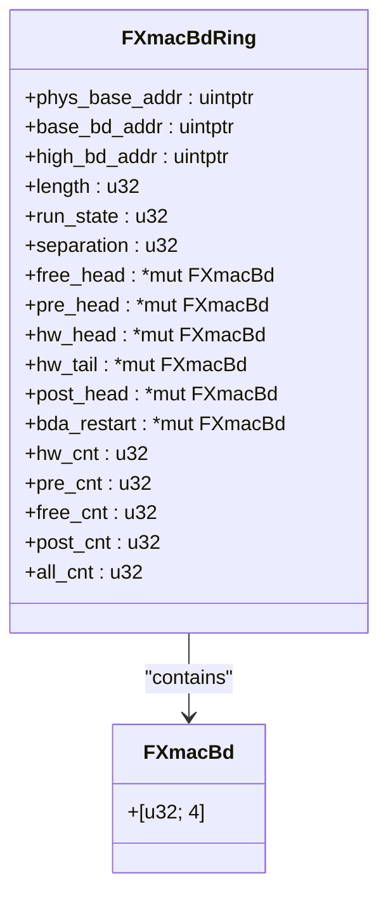
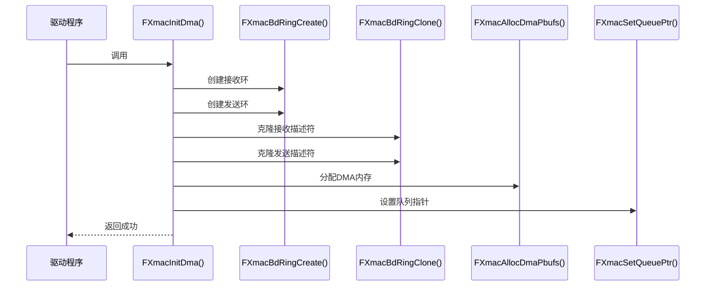
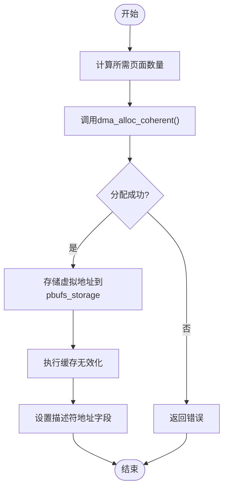

# DMA管理

<cite>
**本文档引用的文件**
- [fxmac_dma.rs](file://src/fxmac_dma.rs)
- [fxmac.rs](file://src/fxmac.rs)
- [fxmac_const.rs](file://src/fxmac_const.rs)
</cite>

## 目录
1. [描述符环（Descriptor Ring）概念](#描述符环descriptor-ring概念)
2. [FXmacBdRing结构体详解](#fxmacbdring结构体详解)
3. [DMA引擎初始化](#dma引擎初始化)
4. [DMA一致内存分配](#dma一致内存分配)
5. [硬件描述符格式](#硬件描述符格式)
6. [内存屏障与缓存刷新](#内存屏障与缓存刷新)

## 描述符环（Descriptor Ring）概念

描述符环（Descriptor Ring）是DMA子系统中的核心数据结构，采用环形缓冲区（Circular Buffer）设计，实现了生产者-消费者模式。该结构用于管理网络数据包的发送和接收操作，通过将描述符组织成环形队列，实现了高效的内存利用和数据传输。

在驱动程序中，描述符环由`FXmacBdRing`结构体表示，包含两个主要部分：描述符本身和指向实际数据缓冲区的指针。对于接收方向，描述符环预先分配好数据缓冲区，当网络数据包到达时，DMA控制器直接将数据写入这些预分配的缓冲区；对于发送方向，上层协议栈准备好的数据包被放置在缓冲区中，然后通过描述符通知DMA控制器进行发送。

这种环形结构的关键优势在于其无锁并发特性。生产者（如网络协议栈）和消费者（如DMA硬件）可以独立操作环的不同部分，通过`free_head`、`hw_head`、`hw_tail`等指针来跟踪各自的位置，避免了复杂的同步机制。当指针移动到环的末尾时，会自动绕回到起始位置，形成一个无缝循环。

**Section sources**
- [fxmac_dma.rs](file://src/fxmac_dma.rs#L100-L150)
- [fxmac_const.rs](file://src/fxmac_const.rs#L10-L50)

## FXmacBdRing结构体详解

`FXmacBdRing`结构体定义了描述符环的完整状态和配置信息，其字段含义如下：

- `phys_base_addr`: 描述符环的物理基地址，用于DMA控制器访问。
- `base_bd_addr`: 描述符环的虚拟基地址，用于CPU访问。
- `high_bd_addr`: 描述符环的最高虚拟地址，用于边界检查。
- `length`: 环的总字节长度。
- `run_state`: 运行状态，标识DMA是否启动。
- `separation`: 相邻描述符之间的字节间隔，通常等于描述符大小。
- `free_head`: 指向第一个空闲描述符的指针，由软件维护。
- `pre_head`: 预处理头指针，指向即将提交给硬件的描述符。
- `hw_head`: 硬件头指针，指向DMA控制器正在处理的描述符。
- `hw_tail`: 硬件尾指针，指向DMA控制器最后一个待处理的描述符。
- `post_head`: 后处理头指针，指向已完成处理的描述符。
- `bda_restart`: 重启时使用的描述符地址。
- `hw_cnt`: 硬件当前处理的描述符数量。
- `pre_cnt`: 预处理队列中的描述符数量。
- `free_cnt`: 可用空闲描述符的数量。
- `post_cnt`: 已完成处理但尚未释放的描述符数量。
- `all_cnt`: 环中总的描述符数量。

该结构体在内存中的布局是连续的，所有字段按声明顺序排列。描述符本身（`FXmacBd`类型）是一个包含4个32位字的数组，总大小为16字节，并要求128字节对齐以满足硬件要求。

**Diagram sources**
- [fxmac_dma.rs](file://src/fxmac_dma.rs#L150-L200)

**Section sources**
- [fxmac_dma.rs](file://src/fxmac_dma.rs#L150-L200)

## DMA引擎初始化

`FXmacInitDma`函数负责初始化DMA引擎及其相关控制寄存器。该过程主要包括以下步骤：

1. **创建描述符环**：调用`FXmacBdRingCreate`函数为接收和发送方向分别创建描述符环。此函数会分配内存空间，初始化环的各个指针，并设置环的大小和对齐要求。

2. **克隆描述符模板**：使用`FXmacBdRingClone`函数将一个预定义的描述符模板复制到环中的每个描述符位置。对于接收环，模板的"Used"位被清除；对于发送环，"Used"位被设置，这符合生产者-消费者模式的要求。

3. **分配DMA内存**：调用`FXmacAllocDmaPbufs`函数为实际的数据包分配页对齐的DMA一致内存。这些内存区域将作为数据缓冲区与描述符关联。

4. **设置队列指针**：通过`FXmacSetQueuePtr`函数将接收和发送描述符环的物理基地址写入MAC控制器的相应寄存器（`RXQBASE_OFFSET`和`TXQBASE_OFFSET`），使硬件能够找到描述符环的位置。

5. **启用尾指针模式**：如果硬件支持尾指针功能（由`FXMAC_CAPS_TAILPTR`标志指示），则配置相关寄存器以启用此优化模式，提高性能。

整个初始化过程确保了DMA引擎处于已知的初始状态，为后续的数据传输做好准备。

**Diagram sources**
- [fxmac_dma.rs](file://src/fxmac_dma.rs#L400-L450)

**Section sources**
- [fxmac_dma.rs](file://src/fxmac_dma.rs#L400-L450)

## DMA一致内存分配

`FXmacAllocDmaPbufs`函数负责分配页对齐的DMA一致内存，并将其映射到虚拟地址空间。这一过程对于确保CPU和DMA设备之间数据一致性至关重要。

该函数首先根据最大帧大小计算所需的页面数量，并调用`dma_alloc_coherent`内核接口来分配物理上连续的内存块。物理地址连续性是DMA操作的基本要求，因为DMA控制器通过物理地址直接访问内存，无法处理虚拟内存的分页和碎片。

分配完成后，函数会：
1. 将分配的虚拟地址存储在`rx_pbufs_storage`或`tx_pbufs_storage`数组中，供后续快速查找。
2. 对于接收缓冲区，在初始化时执行缓存无效化（`FCacheDCacheInvalidateRange`），确保DMA写入的数据不会被过时的缓存行掩盖。
3. 使用`fxmac_bd_set_address_rx`或`fxmac_bd_set_address_tx`函数将物理DMA地址写入描述符的地址字段，建立描述符与数据缓冲区的关联。

这种分配策略确保了内存的物理连续性和缓存一致性，是实现高效DMA传输的基础。

**Diagram sources**
- [fxmac_dma.rs](file://src/fxmac_dma.rs#L300-L350)

