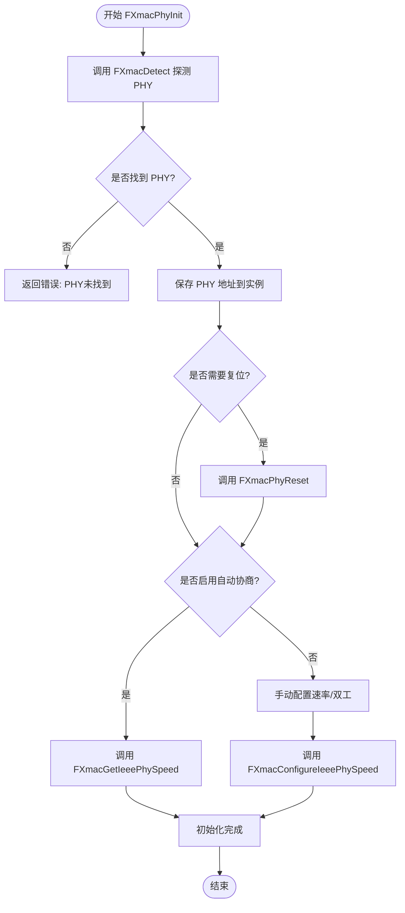
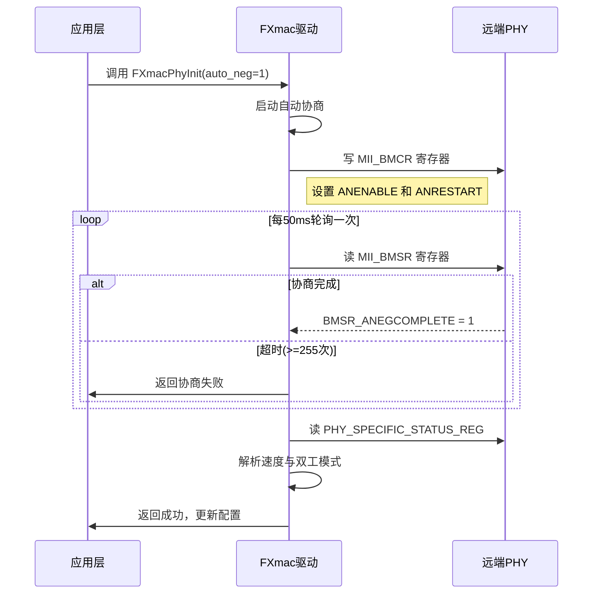
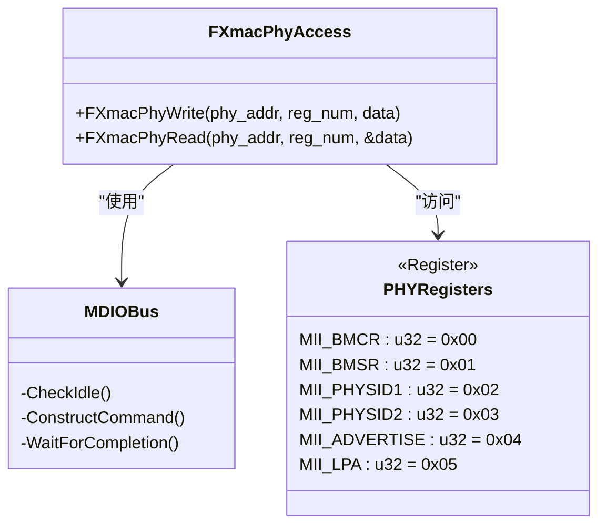

# PHY配置

<cite>
**本文档引用的文件**
- [fxmac_phy.rs](file://src/fxmac_phy.rs)
- [mii_const.rs](file://src/mii_const.rs)
- [fxmac.rs](file://src/fxmac.rs)
</cite>

## 目录
1. [介绍](#介绍)
2. [PHY与MAC分工及接口标准](#phy与mac分工及接口标准)
3. [PHY设备探测与初始化](#phy设备探测与初始化)
4. [自动协商过程](#自动协商过程)
5. [支持的PHY模式](#支持的phy模式)
6. [PHY寄存器访问机制](#phy寄存器访问机制)
7. [链接状态监控与重连策略](#链接状态监控与重连策略)

## 介绍
本文档详细说明了在`arceos_drivers/fxmac_rs`驱动中关于PHY（物理层设备）的配置流程。重点阐述了PHY与MAC之间的职责划分、MII/GMII/RGMII等接口的作用，以及如何通过MDIO总线完成PHY设备的探测、初始化和链路建立。同时描述了自动协商机制、速度检测方法、寄存器访问方式和链接状态管理策略。

## PHY与MAC分工及接口标准
在以太网通信架构中，MAC（媒体访问控制器）负责数据帧的封装与解封、介质访问控制逻辑（如CSMA/CD）、地址过滤等功能；而PHY（物理层设备）则专注于模拟信号处理、线路编码（如8B/10B）、电气特性适配和物理链路状态维护。

两者之间通过标准化的接口进行通信：
- **MII (Media Independent Interface)**：用于10/100Mbps以太网，使用4位宽数据路径。
- **GMII (Gigabit Media Independent Interface)**：支持千兆以太网，采用8位宽数据路径。
- **RGMII (Reduced GMII)**：对GMII进行引脚优化，在保持性能的同时减少信号线数量，广泛应用于嵌入式系统。

这些接口定义了MAC与PHY之间的控制、状态和数据交换协议，确保不同厂商设备间的互操作性。

**Section sources**
- [fxmac.rs](file://src/fxmac.rs#L1-L799)
- [fxmac_phy.rs](file://src/fxmac_phy.rs#L1-L473)

## PHY设备探测与初始化
`FXmacPhyInit`函数是PHY初始化的核心入口，其主要任务包括探测连接的PHY设备、读取设备ID并验证兼容性、执行软复位（可选），以及根据配置启动自动协商或手动设置速率。

该过程首先调用`FXmacDetect`遍历所有可能的PHY地址（0-31），通过读取每个地址处的PHY状态寄存器（`PHY_STATUS_REG_OFFSET`）来判断是否存在有效设备。若状态寄存器值不为0xFFFF，则进一步读取设备标识寄存器（`PHY_IDENTIFIER_1_REG` 和 `PHY_IDENTIFIER_2_REG`）。只有当两个ID寄存器均非零且非全F时，才认为发现有效的PHY设备，并记录其地址。

一旦确定PHY地址，将保存至`instance_p.phy_address`字段。如果启用了复位标志，则调用`FXmacPhyReset`对PHY执行软件复位操作。随后根据`auto_neg`配置决定是否启用自动协商模式。

**Diagram sources**
- [fxmac_phy.rs](file://src/fxmac_phy.rs#L150-L200)

**Section sources**
- [fxmac_phy.rs](file://src/fxmac_phy.rs#L150-L200)

## 自动协商过程
自动协商（Auto-negotiation）允许两端设备动态协商最佳的传输参数，包括速率（10/100/1000 Mbps）和双工模式（半双工/全双工）。

### 本地能力广告设置
在自动协商过程中，本地设备需通过广告控制寄存器（`MII_ADVERTISE`）声明自身支持的能力。例如，可通过设置`ADVERTISE_10FULL`、`ADVERTISE_100FULL`等位来通告对10M全双工、100M全双工的支持。此外，对于千兆以太网，还需使用`MII_CTRL1000`寄存器设置`ADVERTISE_1000FULL`或`ADVERTISE_1000HALF`。

### 对端能力读取与链路确定
协商完成后，通过读取链路伙伴能力寄存器（`MII_LPA`）获取对端设备的能力信息。结合本地广告寄存器内容，可以解析出双方共同支持的最佳模式。

最终，`FXmacGetIeeePhySpeed`函数通过读取PHY特定状态寄存器（`PHY_SPECIFIC_STATUS_REG`）中的速度和双工位，确定实际建立的链路参数，并更新`instance_p.config.speed`和`instance_p.config.duplex`字段。

**Diagram sources**
- [fxmac_phy.rs](file://src/fxmac_phy.rs#L250-L350)
- [mii_const.rs](file://src/mii_const.rs#L1-L274)

**Section sources**
- [fxmac_phy.rs](file://src/fxmac_phy.rs#L250-L350)

## 支持的PHY模式
当前驱动支持多种PHY接口模式，由`FXmacPhyInterface`枚举定义：

- **SGMII (Serial Gigabit Media Independent Interface)**：串行千兆接口，常用于芯片间高速连接。
- **RMII (Reduced MII)**：简化版MII，适用于10/100Mbps应用，减少引脚数。
- **RGMII (Reduced GMII)**：简化版GMII，支持千兆速率，兼顾性能与引脚成本。

不同模式下的配置差异主要体现在时钟选择、数据宽度和电气特性上。例如，在`FXmacSelectClk`函数中会依据所选接口模式调整内部时钟分频器设置，确保满足各接口的时序要求。

**Section sources**
- [fxmac.rs](file://src/fxmac.rs#L100-L110)

## PHY寄存器访问机制
PHY寄存器通过MDIO（Management Data Input/Output）总线进行访问，遵循IEEE 802.3标准定义的SMI（Serial Management Interface）协议。

底层提供两个核心函数：
- `FXmacPhyWrite`：向指定PHY地址的某个寄存器写入16位数据。
- `FXmacPhyRead`：从指定PHY地址的某个寄存器读取16位数据。

这两个函数通过操作MAC控制器中的`FXMAC_PHYMNTNC_OFFSET`寄存器来发起MDIO事务。在访问前必须确认MDIO总线空闲（检查`FXMAC_NWSR_MDIOIDLE_MASK`位）。所有寄存器偏移量和常量定义均来自`mii_const.rs`文件，例如`MII_BMCR`（0x00）表示基本模式控制寄存器。

**Diagram sources**
- [fxmac_phy.rs](file://src/fxmac_phy.rs#L50-L140)
- [mii_const.rs](file://src/mii_const.rs#L1-L274)

**Section sources**
- [fxmac_phy.rs](file://src/fxmac_phy.rs#L50-L140)

## 链接状态监控与断线重连的处理策略
驱动通过定期轮询或中断方式监控PHY链接状态。当发生链路变化时（如插拔网线），硬件会产生