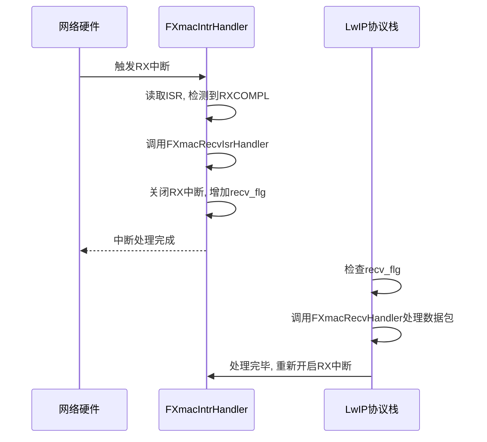

# 中断处理

<cite>
**本文档引用的文件**
- [fxmac_intr.rs](file://src/fxmac_intr.rs)
- [fxmac.rs](file://src/fxmac.rs)
- [fxmac_const.rs](file://src/fxmac_const.rs)
- [fxmac_dma.rs](file://src/fxmac_dma.rs)
</cite>

## 目录
1. [引言](#引言)
2. [中断服务程序入口点](#中断服务程序入口点)
3. [中断状态寄存器解析与事件区分](#中断状态寄存器解析与事件区分)
4. [异常处理机制](#异常处理机制)
5. [中断掩码配置](#中断掩码配置)
6. [中断上下文与执行上下文分离](#中断上下文与执行上下文分离)
7. [性能考量与最佳实践](#性能考量与最佳实践)

## 引言
本文档深入分析了FXmac驱动中的中断处理机制。该机制是网络接口卡（NIC）高效运行的核心，负责响应硬件产生的各种事件，如数据包接收完成、发送完成以及各类错误条件。通过详细解读`FXmacIntrHandler`作为中断服务程序（ISR）的入口点，如何读取并解析中断状态寄存器以区分不同类型的中断事件，并探讨`FXmacErrorHandler`对DMA故障、PHY链接丢失等异常情况的处理方式，旨在为开发者提供一个全面且深入的理解。此外，文档还将说明中断掩码的配置方法，解释为何某些耗时操作需要从高优先级的中断上下文中推送到更高级别的函数中执行，从而确保系统的实时性和稳定性。

**Section sources**
- [fxmac_intr.rs](file://src/fxmac_intr.rs#L0-L429)
- [fxmac.rs](file://src/fxmac.rs#L0-L799)

## 中断服务程序入口点
`FXmacIntrHandler`是整个中断处理流程的入口点，它被设计为一个通用的中断处理函数，能够处理来自不同队列和类型的中断请求。当硬件产生中断时，首先会调用顶层的`xmac_intr_handler`函数，该函数通过全局静态变量`XMAC`获取到`FXmac`实例的指针，并将控制权转交给`FXmacIntrHandler`。此函数接收两个关键参数：`vector`（中断号）和`instance_p`（指向`FXmac`实例的可变引用）。其主要职责是根据中断号判断中断来源，读取中断状态寄存器（ISR），然后依据状态位分别调用相应的处理函数，例如发送完成处理、接收完成处理或错误处理。这种设计实现了中断处理的模块化和解耦，使得代码结构清晰且易于维护。

```mermaid
flowchart TD
A[硬件中断触发] --> B[xmac_intr_handler]
B --> C{XMAC指针是否有效?}
C --> |是| D[调用FXmacIntrHandler]
C --> |否| E[记录错误: 静态FXmac未初始化]
D --> F[读取中断状态寄存器(ISR)]
F --> G[解析中断类型]
G --> H[调用相应处理函数]
```

**Diagram sources**
- [fxmac_intr.rs](file://src/fxmac_intr.rs#L80-L100)

**Section sources**
- [fxmac_intr.rs](file://src/fxmac_intr.rs#L80-L100)

## 中断状态寄存器解析与事件区分
`FXmacIntrHandler`通过读取位于`FXMAC_ISR_OFFSET`偏移处的中断状态寄存器（ISR）来确定当前发生的中断类型。该寄存器是一个32位的值，每一位对应一种特定的中断事件。函数首先检查中断号`vector`是否匹配发送队列或接收队列的中断号，以此初步定位中断源。随后，它会检查ISR中的多个标志位：
- **接收完成中断 (`FXMAC_IXR_RXCOMPL_MASK`)**：当接收到一个完整的数据包时，此位被置起。处理程序会调用`FXmacRecvIsrHandler`进行后续处理。
- **发送完成中断 (`FXMAC_IXR_TXCOMPL_MASK`)**：当一个数据包成功发送后，此位被置起。处理程序会调用`FXmacSendHandler`。
- **连接状态改变中断 (`FXMAC_IXR_LINKCHANGE_MASK`)**：当PHY物理层的链路状态发生变化（如连接建立或断开）时，此位被置起。处理程序会调用`FXmacLinkChange`。
- **错误中断**：包括传输错误（`FXMAC_IXR_TX_ERR_MASK`）和接收错误（`FXMAC_IXR_RX_ERR_MASK`），这些错误又细分为DMA错误、缓冲区耗尽、超限重试等多种情况。一旦检测到错误，会立即调用`FXmacErrorHandler`进行处理。

通过这种方式，中断处理程序能够精确地识别出每一个中断事件的具体原因，并将其路由到正确的处理路径上。

**Section sources**
- [fxmac_intr.rs](file://src/fxmac_intr.rs#L105-L250)

## 异常处理机制
`FXmacErrorHandler`是专门用于处理各种异常情况的函数。它接收三个参数：设备实例指针`instance_p`、方向标识`direction`（指示是发送还是接收方向）和包含错误详情的`error_word`。该函数的核心逻辑是一个`match`表达式，根据`direction`的值进入不同的分支进行处理。

对于**接收方向 (FXMAC_RECV)** 的错误：
- `FXMAC_RXSR_HRESPNOK_MASK`：表示DMA在读取接收缓冲区时遇到了总线响应错误，这通常意味着严重的系统问题，处理函数会记录“接收DMA错误”并调用`FXmacHandleDmaTxError`。
- `FXMAC_RXSR_RXOVR_MASK`：表示接收溢出，即新数据到来时旧数据尚未被处理，导致数据丢失。
- `FXMAC_RXSR_BUFFNA_MASK`：表示接收缓冲区不可用，即没有可用的描述符来存放新接收到的数据包。

对于**发送方向 (FXMAC_SEND)** 的错误：
- `FXMAC_TXSR_HRESPNOK_MASK`：同样表示DMA写入时的总线响应错误。
- `FXMAC_TXSR_URUN_MASK`：表示发送下溢，通常是由于发送速率过快而DMA未能及时提供数据所致。
- `FXMAC_TXSR_BUFEXH_MASK`：表示发送缓冲区耗尽。
- `FXMAC_TXSR_FRAMERX_MASK`：表示发生了碰撞，此时会调用`FXmacProcessSentBds`来处理已发送的描述符。

`FXmacErrorHandler`的设计原则是快速诊断并采取适当的恢复措施，同时避免在中断上下文中执行过于复杂的操作。

**Section sources**
- [fxmac_intr.rs](file://src/fxmac_intr.rs#L350-L400)

## 中断掩码配置
中断掩码（Interrupt Mask）用于控制哪些中断源可以触发CPU的中断。在FXmac驱动中，通过`FXmacQueueIrqEnable`和`FXmacQueueIrqDisable`两个函数来实现对特定队列中断的使能和禁用。这两个函数都接受一个`mask`参数，该参数是一个位掩码，每一位对应一种中断类型。

例如，在初始化过程中，驱动会设置一个默认的中断掩码`instance_p.mask`，通常包含接收完成、接收错误、发送错误和链路状态改变等关键中断。这个掩码随后会被传递给`FXmacStart`函数，在启动设备时通过向中断使能寄存器（IER）写入掩码值来激活这些中断。如果需要动态地关闭某个中断源（比如暂时屏蔽接收中断以进行某些配置），可以调用`FXmacQueueIrqDisable`并传入相应的掩码。反之，则使用`FXmacQueueIrqEnable`重新启用。这种灵活的配置能力允许驱动程序根据运行时的状态精确地控制系统中断，优化性能和资源利用。

**Section sources**
- [fxmac_intr.rs](file://src/fxmac_intr.rs#L300-L350)
- [fxmac.rs](file://src/fxmac.rs#L150-L180)

## 中断上下文与执行上下文分离
为了保证系统的实时性和响应速度，中断服务程序（ISR）必须尽可能短小精悍。因此，FXmac驱动采用了上下文分离的设计模式。在`FXmacIntrHandler`中，对于接收完成中断，它并不会直接处理接收到的数据包，而是调用`FXmacRecvIsrHandler`。这个函数的主要作用是：
1.  **快速关中断**：立即禁用接收完成中断，防止在处理期间被同类型的中断反复打断，造成中断风暴。
2.  **标记事件**：增加一个计数器`recv_flg`，用于通知上层应用有新的数据包到达。
3.  **调度处理**：最终，由上层应用（如LwIP协议栈）在非中断上下文（normal execution context）中调用`FXmacRecvHandler`来实际处理这些数据包。

这种设计将耗时的数据包处理任务（如内存拷贝、协议解析）从高优先级的中断上下文中剥离出来，留给了主循环或工作队列去执行。这样做的好处是极大地缩短了中断处理时间，减少了对其他中断的延迟影响，从而提高了整个系统的稳定性和吞吐量。



**Diagram sources**
- [fxmac_intr.rs](file://src/fxmac_intr.rs#L405-L415)

**Section sources**
- [fxmac_intr.rs](file://src/fxmac_intr.rs#L405-L415)

## 性能考量与最佳实践
中断处理的性能直接关系到网络I/O的效率。FXmac驱动在设计上充分考虑了这一点：
- **避免在ISR中执行耗时操作**：如前所述，所有涉及大量计算或可能阻塞的操作都被推迟到正常执行上下文中进行。
- **批量处理**：`FXmacIntrHandler`尝试在一个调用中处理尽可能多的中断，而不是每次只处理一个就退出，这减少了函数调用的开销。
- **原子性操作**：对共享资源（如`recv_flg`）的访问是原子的，确保了在多核环境下的安全性。
- **硬件特性利用**：驱动通过`caps`字段探测并利用硬件特性，例如`FXMAC_CAPS_ISR_CLEAR_ON_WRITE`，允许通过写入特定值来清除中断状态，这比先读再写的传统方式更高效。

综上所述，FXmac驱动的中断处理机制通过精心的设计和严格的上下文分离，实现了高性能、高可靠性的网络数据传输。

**Section sources**
- [fxmac_intr.rs](file://src/fxmac_intr.rs#L100-L150)
- [fxmac_dma.rs](file://src/fxmac_dma.rs#L500-L550)