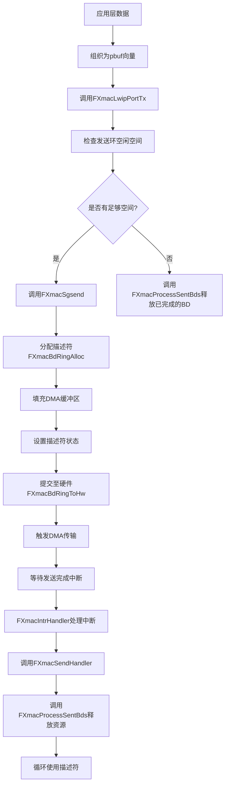
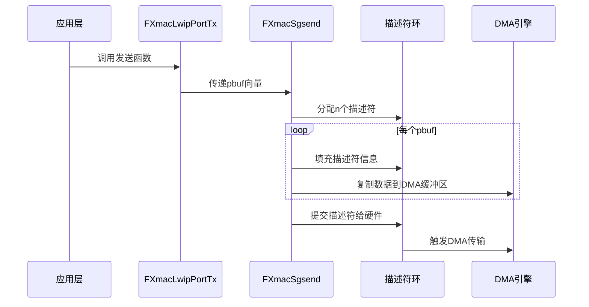
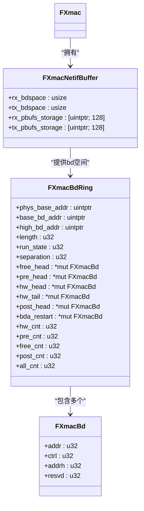
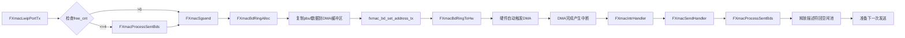

# 数据发送

<cite>
**本文档引用的文件**   
- [fxmac.rs](file://src/fxmac.rs)
- [fxmac_dma.rs](file://src/fxmac_dma.rs)
- [fxmac_intr.rs](file://src/fxmac_intr.rs)
- [fxmac_const.rs](file://src/fxmac_const.rs)
</cite>

## 目录
1. [引言](#引言)
2. [数据包发送机制概述](#数据包发送机制概述)
3. [核心组件分析](#核心组件分析)
4. [发送路径上的数据流动](#发送路径上的数据流动)
5. [发送环初始化与缓冲区分配](#发送环初始化与缓冲区分配)
6. [发送完成中断处理流程](#发送完成中断处理流程)
7. [错误处理策略](#错误处理策略)
8. [完整调用链分析](#完整调用链分析)

## 引言

本文档详细说明了FXMAC驱动中数据包发送机制的实现细节。重点从`FXmacSgsend`和`FXmacSendHandler`函数入手，解释多段（scatter-gather）发送的工作原理。描述了发送路径上的数据流动：应用层数据如何被组织成缓冲区，填充到TX描述符环（FXmacBdRing）中，以及DMA引擎如何将这些数据传输到MAC硬件。同时讲解了`FXmacBdRingCreate`和`FXmacAllocDmaPbufs`在发送流程中的前置作用，确保发送环已正确建立并有可用缓冲区。此外，还解释了发送完成中断的处理流程，以及如何释放已使用的描述符和缓冲区，并讨论了发送过程中可能遇到的错误（如描述符环满）及其处理策略。

**Section sources**
- [fxmac.rs](file://src/fxmac.rs#L0-L1785)
- [fxmac_dma.rs](file://src/fxmac_dma.rs#L0-L1313)
- [fxmac_intr.rs](file://src/fxmac_intr.rs#L0-L430)
- [fxmac_const.rs](file://src/fxmac_const.rs#L0-L682)

## 数据包发送机制概述

FXMAC驱动的数据包发送机制基于DMA（直接内存访问）技术，通过描述符环（Descriptor Ring）管理发送缓冲区。该机制支持多段发送（Scatter-Gather），允许将一个数据包分割为多个不连续的内存块进行传输，提高了内存利用效率和传输灵活性。整个发送过程由一系列函数协同完成，包括高层接口调用、描述符分配、DMA传输触发及中断处理等环节。

**Diagram sources**
- [fxmac_dma.rs](file://src/fxmac_dma.rs#L1270-L1312)
- [fxmac.rs](file://src/fxmac.rs#L274)

## 核心组件分析

### FXmacSgsend 函数

`FXmacSgsend`是实现多段发送的核心函数。它接收一个包含多个数据段的向量作为输入参数，每个数据段对应一个pbuf。函数首先通过`FXmacBdRingAlloc`从发送环中分配所需数量的描述符，然后依次将各数据段复制到预分配的DMA缓冲区中，并更新相应的描述符状态字段。最后，通过`FXmacBdRingToHw`将这批描述符提交给硬件，启动DMA传输。

#### 多段发送工作原理

多段发送的关键在于能够将一个逻辑上的大数据包拆分为多个物理上不连续的小块进行传输。这要求驱动程序能够正确地管理这些分散的数据块，并通过描述符链将它们串联起来。在FXMAC驱动中，每个描述符指向一个独立的缓冲区，通过设置“LAST”标志位来标识数据包的结束位置，从而让硬件知道何时完成整个数据包的传输。

**Diagram sources**
- [fxmac_dma.rs](file://src/fxmac_dma.rs#L1120-L1312)

### FXmacSendHandler 函数

`FXmacSendHandler`是发送完成中断的服务例程。当中断发生时，该函数被调用以处理已完成的发送操作。其主要任务是调用`FXmacProcessSentBds`函数来回收已被硬件处理完毕的描述符和相关资源，使得这些资源可以被重新用于后续的发送操作。

**Section sources**
- [fxmac_dma.rs](file://src/fxmac_dma.rs#L1120-L1312)

## 发送路径上的数据流动

### 应用层数据组织

当上层协议栈需要发送数据时，会将数据封装在一个或多个pbuf结构中。这些pbuf按照顺序组成一个向量，传递给`FXmacLwipPortTx`函数。每个pbuf代表数据包的一个片段，可能位于不同的内存区域。

### 缓冲区填充与描述符配置

在`FXmacSgsend`函数内部，驱动程序遍历pbuf向量，将每个pbuf中的数据复制到预先分配的DMA可访问内存中。这个过程涉及到虚拟地址到物理地址的转换，以及缓存一致性维护（如执行DCacheFlush操作）。随后，对应的描述符会被更新，包括设置数据缓冲区的物理地址、数据长度以及控制标志位（如“USED”、“LAST”等）。

### TX描述符环管理

TX描述符环是一个循环队列，由`FXmacBdRing`结构体表示。它包含了所有待发送数据包的描述符。环中的每个描述符都指向一个DMA缓冲区。通过维护`free_head`、`hw_head`、`hw_tail`等指针，驱动程序能够高效地管理和追踪描述符的状态变化。

**Section sources**
- [fxmac_dma.rs](file://src/fxmac_dma.rs#L0-L1313)
- [fxmac_const.rs](file://src/fxmac_const.rs#L0-L682)

## 发送环初始化与缓冲区分配

### FXmacBdRingCreate 函数

`FXmacBdRingCreate`负责创建和初始化发送描述符环。它接受环的物理基地址、虚拟基地址、对齐要求和描述符数量作为参数。函数首先验证地址对齐条件，然后计算相邻描述符之间的偏移量（separation）。接着，它会对整个描述符空间进行清零操作，并初始化环的各种指针和计数器，如`base_bd_addr`、`high_bd_addr`、`length`、`free_head`等。最后，它还会设置环的运行状态为停止，并记录物理基地址以便后续DMA操作使用。

### FXmacAllocDmaPbufs 函数

`FXmacAllocDmaPbufs`用于为DMA操作分配实际的数据缓冲区。对于接收方向，它会为每个接收描述符分配一个足够大的缓冲区（根据是否启用Jumbo帧决定大小），并通过`dma_alloc_coherent`接口申请DMA一致性的内存页。分配完成后，缓冲区的虚拟和物理地址会被保存在`rx_pbufs_storage`数组中，并通过`fxmac_bd_set_address_rx`函数将其关联到对应的描述符上。对于发送方向，虽然缓冲区也是预先分配的，但数据是在发送时才从pbuf复制过来的。

**Diagram sources**
- [fxmac_dma.rs](file://src/fxmac_dma.rs#L0-L1313)

**Section sources**
- [fxmac_dma.rs](file://src/fxmac_dma.rs#L0-L1313)

## 发送完成中断处理流程

当DMA引擎完成一批数据包的传输后，会产生一个发送完成中断。中断处理程序`FXmacIntrHandler`接收到中断信号后，会检查中断状态寄存器，确认是发送完成事件。随后，它会调用注册的发送处理函数`FXmacSendHandler`。

`FXmacSendHandler`的主要职责是清理已完成的发送操作。它首先读取并清除发送状态寄存器中的完成标志位，然后调用`FXmacProcessSentBds`函数。后者通过`FXmacBdRingFromHwTx`查询哪些描述符已经被硬件处理过（即其“USED”位已被置起），并将这些描述符从工作队列中移出。接着，它会重置这些描述符的状态（例如清除“USED”位），并将它们归还给空闲池，供下次发送使用。

此过程确保了描述符环的循环利用，避免了资源耗尽的问题。

**Section sources**
- [fxmac_intr.rs](file://src/fxmac_intr.rs#L0-L430)
- [fxmac_dma.rs](file://src/fxmac_dma.rs#L1120-L1312)

## 错误处理策略

在数据发送过程中可能会遇到多种错误情况，主要包括：

- **描述符环满（No Enough free BDs）**：当没有足够的空闲描述符可供分配时，`FXmacBdRingAlloc`会返回错误码。此时，`FXmacLwipPortTx`会在尝试发送前先调用`FXmacProcessSentBds`来回收已完成的描述符，以腾出空间。
- **DMA传输错误（HRESPNOK, URUN, BUFEXH等）**：这些错误通常由`FXmacErrorHandler`处理。例如，DMA响应失败（HRESPNOK）可能是总线问题；发送下溢（URUN）表示MAC在等待数据时DMA未能及时提供；缓冲区耗尽（BUFEXH）则意味着描述符链不足以承载整个数据包。
- **重试次数超限（RETRY）**：表明数据包因冲突等原因重传次数超过限制。

对于大多数严重错误，驱动程序会选择重启设备或进入故障恢复模式，而对于暂时性资源不足的情况，则通过积极回收资源来应对。

**Section sources**
- [fxmac_dma.rs](file://src/fxmac_dma.rs#L1120-L1312)
- [fxmac_intr.rs](file://src/fxmac_intr.rs#L0-L430)

## 完整调用链分析

从高层调用`FXmacLwipPortTx`到底层DMA操作的完整调用链如下所示：

该调用链示意了数据从应用层到硬件的完整旅程。每当有新的数据需要发送时，都会经历这一系列步骤。其中，`FXmacProcessSentBds`既是发送流程的一部分（在发送前清理空间），也是中断处理的结果（在发送后回收资源），体现了驱动程序对资源的精细化管理。

**Diagram sources**
- [fxmac_dma.rs](file://src/fxmac_dma.rs#L1270-L1312)
- [fxmac.rs](file://src/fxmac.rs#L274)

**Section sources**
- [fxmac_dma.rs](file://src/fxmac_dma.rs#L1270-L1312)
- [fxmac.rs](file://src/fxmac.rs#L274)