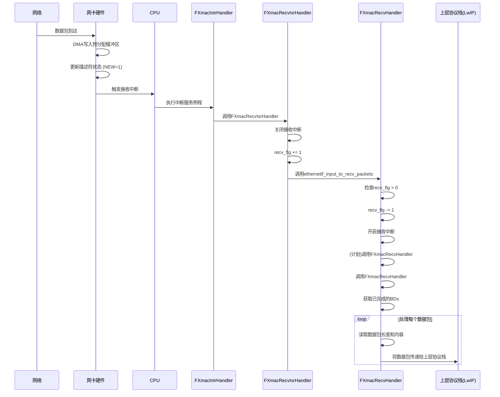

# 数据接收

<cite>
**本文档引用的文件**   
- [fxmac.rs](file://src/fxmac.rs)
- [fxmac_dma.rs](file://src/fxmac_dma.rs)
- [fxmac_intr.rs](file://src/fxmac_intr.rs)
- [fxmac_const.rs](file://src/fxmac_const.rs)
</cite>

## 目录
1. [引言](#引言)
2. [RX描述符环初始化与缓冲区预分配](#rx描述符环初始化与缓冲区预分配)
3. [数据包到达与DMA写入流程](#数据包到达与dma写入流程)
4. [中断处理机制](#中断处理机制)
5. [接收环回收与缓冲区重用](#接收环回收与缓冲区重用)
6. [零拷贝接收与内存屏障](#零拷贝接收与内存屏障)
7. [接收错误检测与丢弃逻辑](#接收错误检测与丢弃逻辑)

## 引言
本文档全面解析FXMAC驱动程序中的数据包接收流程。重点阐述了RX描述符环（Receive Descriptor Ring）的初始化过程、预分配缓冲区的重要性，以及硬件如何利用这些资源接收网络数据包。文档详细说明了中断触发机制、上层协议栈的数据提取方式、接收环的回收策略，并讨论了零拷贝技术和内存一致性保障措施。同时，对常见的接收错误类型及其处理逻辑进行了分析。

## RX描述符环初始化与缓冲区预分配
在网卡开始工作前，必须完成RX描述符环的初始化和缓冲区的预分配。该过程由`FXmacInitDma`函数启动，其核心是调用`FXmacBdRingCreate`来创建一个环形的描述符队列。此队列本质上是一个固定大小的数组，每个元素称为一个描述符（BD, Buffer Descriptor），用于管理一个数据缓冲区。

关键步骤包括：
1.  **创建描述符环**：`FXmacBdRingCreate`函数负责在预分配的内存区域（`rx_bdspace`）中建立描述符链表，并设置其物理基地址。
2.  **克隆模板**：使用`FXmacBdRingClone`将一个包含默认状态的模板描述符复制到环中的每一个位置，确保所有描述符初始状态一致。
3.  **标记尾部**：通过`FXmacBdSetRxWrap`函数将环中最后一个描述符的“WRAP”位（`FXMAC_RXBUF_WRAP_MASK`）置位，以标识环的边界。
4.  **分配DMA缓冲区**：`FXmacAllocDmaPbufs`函数为每个描述符分配一块DMA可访问的连续内存（`rx_mbufs_dma`），并通过`fxmac_bd_set_address_rx`将这块内存的物理地址写入对应的描述符中。这一步至关重要，它为硬件提供了写入接收到的数据包的明确位置。

此初始化过程确保了当网卡硬件准备就绪时，一个完整的、已配置好地址的接收环已经存在，从而避免了因缺乏可用缓冲区而导致的数据包丢失。

**Section sources**
- [fxmac.rs](file://src/fxmac.rs#L800-L900)
- [fxmac_dma.rs](file://src/fxmac_dma.rs#L200-L350)

## 数据包到达与DMA写入流程
当网络数据包到达网卡时，硬件会自动执行以下DMA写入流程：

1.  **定位空闲描述符**：DMA引擎从当前的`hw_tail`指针开始，在RX描述符环中寻找下一个可用的描述符。一个描述符是否“可用”由其状态字中的“NEW/USED”位（`FXMAC_RXBUF_NEW_MASK`）决定。如果该位为1，表示此描述符已被硬件使用；若为0，则表示它是空闲的，可以被用来存放新数据。
2.  **写入数据**：一旦找到空闲描述符，DMA引擎会将接收到的数据包直接写入该描述符所指向的DMA缓冲区（即`rx_mbufs_dma`）。
3.  **更新描述符状态**：数据写入完成后，DMA引擎会更新该描述符的状态字。它会清除“NEW”位（将其置为1，表示已使用），并根据数据包的特性（如长度、校验和结果等）设置其他状态标志位。对于最后一个描述符，还会检查并可能设置“EOF”（End of Frame）位。
4.  **更新硬件指针**：完成上述操作后，硬件会自动将`hw_tail`指针移动到下一个描述符，为下一次接收做准备。

这个过程完全由硬件自主完成，无需CPU干预，从而实现了高效的数据接收。

**Section sources**
- [fxmac_dma.rs](file://src/fxmac_dma.rs#L600-L700)
- [fxmac_const.rs](file://src/fxmac_const.rs#L400-L450)

## 中断处理机制
当一个或多个数据包被成功接收并写入缓冲区后，网卡硬件会产生一个接收完成中断（`FXMAC_IXR_RXCOMPL_MASK`）。该中断的处理流程如下：

1.  **中断触发**：CPU响应中断，执行注册的中断服务例程（ISR），即`FXmacIntrHandler`。
2.  **调用接收ISR处理器**：`FXmacIntrHandler`在检测到接收完成中断后，会立即调用用户注册的接收中断处理器`FXmacRecvIsrHandler`。
3.  **关闭中断并标记**：`FXmacRecvIsrHandler`首先通过向中断禁用寄存器（`IDR`）写入掩码来暂时关闭接收中断，防止短时间内产生大量中断。然后，它会增加一个内部计数器`recv_flg`，用于记录中断发生的次数。
4.  **调度上层处理**：紧接着，`FXmacRecvIsrHandler`调用`ethernetif_input_to_recv_packets`。该函数会检查`recv_flg`，如果大于0，则递减计数器，并重新开启中断（通过向`IER`寄存器写入掩码）。
5.  **调用主接收处理器**：在`ethernetif_input_to_recv_packets`中，虽然代码注释表明可以直接调用`FXmacRecvHandler`，但实际实现中并未解注释。这暗示着真正的数据包处理可能由另一个独立的线程或任务在稍后时间点触发，而中断上下文仅负责快速地通知系统有数据到达。

最终，`FXmacRecvHandler`函数会被调用，它通过`FXmacBdRingFromHwRx`从硬件工作队列中获取所有已完成处理的描述符集，然后遍历这些描述符，读取每个数据包的实际长度和数据，并将数据包传递给上层协议栈（如LwIP）进行处理。

**Diagram sources **
- [fxmac_intr.rs](file://src/fxmac_intr.rs#L350-L400)
- [fxmac_dma.rs](file://src/fxmac_dma.rs#L900-L1000)

**Section sources**
- [fxmac_intr.rs](file://src/fxmac_intr.rs#L350-L400)
- [fxmac_dma.rs](file://src/fxmac_dma.rs#L900-L1000)

## 接收环回收与缓冲区重用
为了维持接收环的持续运行，消费完一个数据包后必须及时回收描述符和缓冲区。这一过程在`FXmacRecvHandler`中完成：

1.  **释放描述符**：当`FXmacRecvHandler`处理完一批从`FXmacBdRingFromHwRx`获取的描述符后，会调用`FXmacBdRingFree`函数。该函数会将这批描述符从“post”队列（已处理）移回“free”队列（空闲），使其可以被再次分配。
2.  **重新填充环**：`FXmacRecvHandler`在每次循环结束时都会调用`SetupRxBds`函数。`SetupRxBds`会检查当前环中空闲描述符的数量（`free_cnt`），并为每一个空闲描述符重新关联之前预分配好的DMA缓冲区（`rx_pbufs_storage`），并将描述符放回硬件工作队列（通过`FXmacBdRingToHw`）。这确保了接收环始终有足够的描述符可供硬件使用。

值得注意的是，该实现采用了**缓冲区重用**而非**重新分配**的策略。`FXmacAllocDmaPbufs`在初始化时一次性分配了所有DMA缓冲区，并将它们的虚拟地址存储在`rx_pbufs_storage`数组中。在回收阶段，`SetupRxBds`只是简单地将这些已存在的缓冲区地址重新写回到新的描述符中，避免了频繁的内存分配和释放开销，提高了效率。

**Section sources**
- [fxmac_dma.rs](file://src/fxmac_dma.rs#L900-L1000)

## 零拷贝接收与内存屏障
### 零拷贝接收的可能性
该驱动程序的设计天然支持**零拷贝接收**。因为数据包是由DMA引擎直接写入预先分配的、位于DMA内存区域的缓冲区中。当`FXmacRecvHandler`需要将数据包传递给上层协议栈时，它可以直接将指向该DMA缓冲区内存的指针（或包装后的对象）移交出去，而无需再进行一次从DMA缓冲区到内核/应用缓冲区的内存拷贝操作。这极大地减少了CPU的负载和内存带宽消耗。

### 内存屏障的必要性
内存屏障在此过程中至关重要，主要体现在两个方面：

1.  **缓存一致性**：由于DMA操作发生在物理内存层面，而CPU通常通过缓存（Cache）来访问内存，因此可能存在缓存不一致的问题。当DMA将数据写入内存后，这部分数据可能尚未被写入CPU缓存，或者CPU缓存中仍保留着旧数据。为了避免CPU读取到陈旧数据，必须在CPU访问DMA缓冲区之前执行**缓存无效化**（Cache Invalidate）操作。代码中通过调用`FCacheDCacheInvalidateRange`函数来实现这一点，它会强制使指定内存范围的CPU缓存行失效，确保后续的CPU读取操作会直接从物理内存中获取最新的数据。
2.  **内存顺序**：在多核或多线程环境中，编译器和CPU可能会对内存访问指令进行重排序优化。为了保证描述符状态更新（如设置“NEW”位）的操作在DMA数据写入操作之后才对CPU可见，需要使用内存屏障（Memory Barrier）来阻止这种重排序。代码中的`DSB()`（Data Synchronization Barrier）指令起到了这样的作用，它确保了在该屏障之前的内存访问操作全部完成，从而维护了正确的执行顺序。

**Section sources**
- [fxmac_dma.rs](file://src/fxmac_dma.rs#L950-L970)
- [utils.rs](file://src/utils.rs) (隐含的`DSB`和`FCacheDCacheInvalidateRange`实现)

## 接收错误检测与丢弃逻辑
驱动程序具备完善的接收错误检测和处理机制。硬件会在接收状态寄存器（`RXSR`）中报告各种错误，主要包括：

*   **CRC/FCS错误**：通过`FXMAC_RXSR_FRAMERX_MASK`和描述符状态字中的`FCS_STATUS_MASK`位检测。如果帧校验序列错误，该数据包通常会被硬件直接丢弃。
*   **帧过长/过短**：硬件会检测超出最大帧长（Jumbo Frame）或小于最小帧长的数据包。这类错误通常也会导致数据包被丢弃。
*   **接收溢出（Overrun）**：当`FXMAC_IXR_RXOVR_MASK`被置位时，表示接收FIFO发生了溢出，意味着数据包因来不及处理而丢失。
*   **缓冲区不可用（Buffer Not Available）**：当`FXMAC_IXR_RXUSED_MASK`被置位时，表示没有空闲的描述符可供硬件使用，新的数据包无法被接收。

在`FXmacIntrHandler`中，当检测到`FXMAC_IXR_RX_ERR_MASK`时，会调用`FXmacErrorHandler`进行处理。对于严重的错误（如`HRESPNOK`），可能会触发更复杂的恢复流程。而对于缓冲区耗尽的情况，代码中通过`FXMAC_DMACR_ORCE_DISCARD_ON_ERR_MASK`配置项启用了“自动丢弃”功能，即当缺少接收资源时，硬件会自动丢弃收到的数据包，从而避免了因中断风暴而导致系统崩溃。

**Section sources**
- [fxmac_intr.rs](file://src/fxmac_intr.rs#L300-L350)
- [fxmac_const.rs](file://src/fxmac_const.rs#L500-L550)