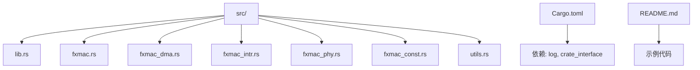
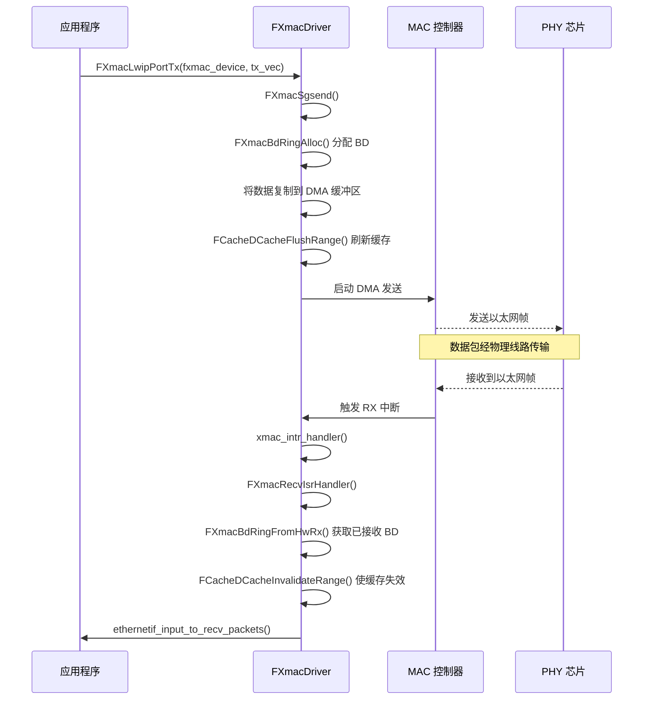

# 项目概述

<cite>
**本文档引用的文件**
- [README.md](file://README.md)
- [Cargo.toml](file://Cargo.toml)
- [src/lib.rs](file://src/lib.rs)
- [src/fxmac.rs](file://src/fxmac.rs)
- [src/fxmac_dma.rs](file://src/fxmac_dma.rs)
- [src/fxmac_intr.rs](file://src/fxmac_intr.rs)
- [src/fxmac_phy.rs](file://src/fxmac_phy.rs)
- [src/fxmac_const.rs](file://src/fxmac_const.rs)
- [src/utils.rs](file://src/utils.rs)
</cite>

## 目录
1. [简介](#简介)
2. [项目结构](#项目结构)
3. [核心组件](#核心组件)
4. [架构概览](#架构概览)
5. [详细组件分析](#详细组件分析)
6. [依赖关系分析](#依赖关系分析)
7. [性能考量](#性能考量)
8. [故障排除指南](#故障排除指南)
9. [结论](#结论)

## 简介
fxmac_rs 是一个为 PhytiumPi 开发板编写的以太网控制器驱动程序，使用 Rust 语言实现。该项目在嵌入式 Rust 生态系统中扮演着关键角色，特别是在与 ArceOS 操作系统的集成上下文中。该驱动程序专为无标准库（no_std）环境设计，支持 aarch64 平台，并通过 `crate_interface` 机制与操作系统内核解耦，确保了高度的可移植性和模块化。

其主要功能是作为硬件（MAC/PHY）和上层网络协议栈（如 LwIP）之间的桥梁，负责处理数据链路层的控制、DMA 内存管理、中断处理以及 PHY 物理层配置。目标用户群体主要是嵌入式系统开发者和内核工程师，他们需要在资源受限的环境中构建稳定、高效的网络通信能力。

本项目遵循现代 Rust 驱动开发的最佳实践，强调内存安全和类型安全，同时通过清晰的抽象接口（如 `KernelFunc` trait）将底层硬件操作与上层业务逻辑分离，极大地简化了在不同操作系统或运行时环境中的集成过程。

## 项目结构
fxmac_rs 项目的目录结构清晰地反映了其模块化的设计理念。所有核心功能均位于 `src` 目录下，按职责被划分为独立的模块。



**图源**
- [src/lib.rs](file://src/lib.rs#L1-L74)
- [Cargo.toml](file://Cargo.toml#L1-L24)
- [README.md](file://README.md#L1-L69)

**本节来源**
- [src/lib.rs](file://src/lib.rs#L1-L74)
- [Cargo.toml](file://Cargo.toml#L1-L24)
- [README.md](file://README.md#L1-L69)

## 核心组件
fxmac_rs 的核心由几个紧密协作的模块构成：`fxmac.rs` 提供 MAC 层的主要初始化和控制逻辑；`fxmac_dma.rs` 负责 DMA 描述符环（BD Ring）的创建、管理和数据包的收发流程；`fxmac_intr.rs` 处理网卡中断，包括接收完成、发送完成和错误事件；`fxmac_phy.rs` 实现了对 PHY 芯片（如 Motorcomm YT8521）的探测、配置和自动协商；`fxmac_const.rs` 定义了所有与硬件寄存器相关的常量和位域；`utils.rs` 则提供了平台特定的辅助函数，如缓存操作和时间延迟。

这些组件共同实现了从硬件初始化到数据包传输的完整生命周期管理。例如，`xmac_init` 函数会依次调用 PHY 初始化、时钟选择、接口配置、DMA 设置和中断注册等步骤，最终启动 MAC 控制器。整个过程体现了分层设计的思想，每个模块各司其职，降低了系统的复杂性。

**本节来源**
- [src/fxmac.rs](file://src/fxmac.rs#L0-L799)
- [src/fxmac_dma.rs](file://src/fxmac_dma.rs#L0-L1313)
- [src/fxmac_intr.rs](file://src/fxmac_intr.rs#L0-L429)
- [src/fxmac_phy.rs](file://src/fxmac_phy.rs#L0-L473)
- [src/fxmac_const.rs](file://src/fxmac_const.rs#L0-L681)
- [src/utils.rs](file://src/utils.rs#L0-L256)

## 架构概览
fxmac_rs 的整体技术架构是一个典型的分层驱动模型，它清晰地划分了硬件抽象、数据传输和系统集成三个层面。

```mermaid
graph LR
subgraph "上层软件"
A[LwIP 协议栈]
end
subgraph "FXMAC 驱动"
B[FXmacDriver]
C[KernelFunc 接口]
end
subgraph "硬件层"
D[MAC 控制器]
E[PHY 芯片]
end
A --> |发送/接收数据包| B
B --> |调用内核服务| C
C --> |virt_to_phys/dma_alloc_coherent| OS[ArceOS 内核]
B --> |读写寄存器| D
D < --> |MII/RGMII/SMDIO| E
```

**图源**
- [src/lib.rs](file://src/lib.rs#L50-L70)
- [src/fxmac.rs](file://src/fxmac.rs#L100-L200)
- [README.md](file://README.md#L10-L30)

**本节来源**
- [src/lib.rs](file://src/lib.rs#L50-L70)
- [src/fxmac.rs](file://src/fxmac.rs#L100-L200)
- [README.md](file://README.md#L10-L30)

## 详细组件分析

### MAC 层控制与初始化
`fxmac.rs` 模块是驱动的核心，其中 `xmac_init` 函数是整个驱动的入口点。它接收一个硬件地址并返回一个静态的 `FXmac` 结构体实例。该函数执行一系列关键的初始化步骤：
1.  **重置硬件**：通过 `FXmacReset` 停止设备并清除所有状态。
2.  **配置选项**：根据 `FXmacConfig` 中的设置启用 Jumbo 帧、多播过滤等功能。
3.  **PHY 初始化**：如果接口模式不是 USXGMII，则调用 `FXmacPhyInit` 来探测和配置 PHY 芯片。
4.  **DMA 初始化**：调用 `FXmacInitDma` 来设置 DMA 描述符环和缓冲区。
5.  **中断设置**：通过 `FXmacSetupIsr` 注册中断处理函数。
6.  **启动 MAC**：最后调用 `FXmacStart` 启用发送和接收通道。

这一系列操作确保了 MAC 控制器处于一个已知的、可工作的状态。

**本节来源**
- [src/fxmac.rs](file://src/fxmac.rs#L100-L300)

#### 数据流序列图


**图源**
- [src/fxmac.rs](file://src/fxmac.rs#L500-L700)
- [src/fxmac_dma.rs](file://src/fxmac_dma.rs#L1000-L1200)
- [src/fxmac_intr.rs](file://src/fxmac_intr.rs#L300-L400)

### DMA 管理
`fxmac_dma.rs` 模块是驱动性能的关键。它实现了基于描述符的 DMA 传输机制。`FXmacBdRing` 结构体代表了一个环形队列，其中包含多个 `FXmacBd`（Buffer Descriptor）。每个 BD 包含数据缓冲区的物理地址和状态信息。

在初始化时，`FXmacInitDma` 会创建发送和接收两个 BD Ring，并通过 `FXmacAllocDmaPbufs` 为每个 BD 分配实际的 DMA 内存页。发送数据时，`FXmacSgsend` 函数会从发送环中分配一个或多个空闲 BD，将应用数据复制到对应的 DMA 缓冲区，刷新数据缓存（`FCacheDCacheFlushRange`），然后通知硬件开始传输。接收数据时，中断处理程序会检查接收环，找出已被硬件填充的 BD，使 CPU 缓存失效（`FCacheDCacheInvalidateRange`），并将数据包传递给上层协议栈。

这种设计最大限度地减少了 CPU 的参与，提高了数据吞吐量。

**本节来源**
- [src/fxmac_dma.rs](file://src/fxmac_dma.rs#L0-L1313)
- [src/utils.rs](file://src/utils.rs#L200-L250)

### 中断处理
`fxmac_intr.rs` 模块定义了中断处理的核心逻辑。`xmac_intr_handler` 是注册到操作系统的顶层中断服务例程（ISR），它会加载全局的 `FXmac` 实例并调用 `FXmacIntrHandler`。

`FXmacIntrHandler` 是一个多功能的中断处理器，它根据中断状态寄存器（ISR）的值来判断中断类型：
*   **接收完成中断 (RXCOMPL)**：调用 `FXmacRecvIsrHandler`，进而触发 `ethernetif_input_to_recv_packets` 将数据包交给 LwIP。
*   **发送完成中断 (TXCOMPL)**：调用 `FXmacSendHandler`，释放已使用的 BD，以便后续复用。
*   **错误中断 (ERROR)**：调用 `FXmacErrorHandler`，根据具体的错误码（如 DMA 错误、溢出等）进行日志记录和可能的恢复操作。
*   **链路状态变化中断 (LINKCHANGE)**：调用 `FXmacLinkChange` 更新内部的链路状态。

这种集中式的中断处理方式简洁高效。

**本节来源**
- [src/fxmac_intr.rs](file://src/fxmac_intr.rs#L0-L429)

### PHY 配置
`fxmac_phy