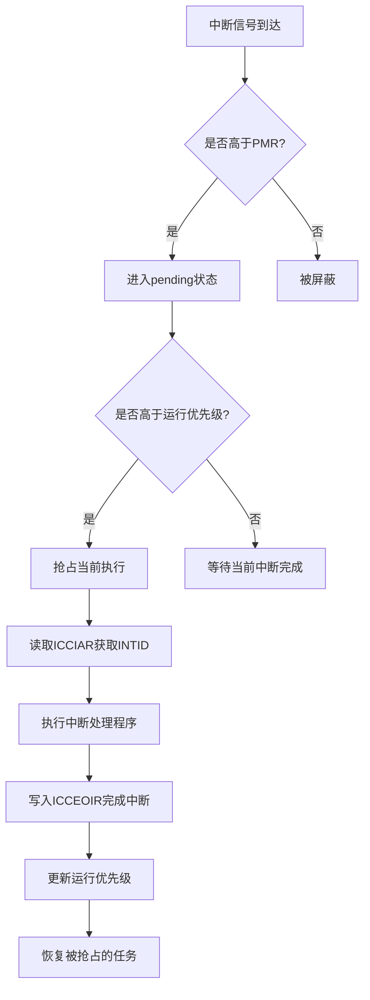

# CpuInterface API

<cite>
**本文档中引用的文件**   
- [lib.rs](file://gic-driver/src/lib.rs)
- [v2/gicc.rs](file://gic-driver/src/version/v2/gicc.rs)
- [v2/mod.rs](file://gic-driver/src/version/v2/mod.rs)
- [v3/mod.rs](file://gic-driver/src/version/v3/mod.rs)
- [sys_reg/icc.rs](file://gic-driver/src/sys_reg/icc.rs)
- [define.rs](file://gic-driver/src/define.rs)
</cite>

## 目录
1. [简介](#简介)
2. [CpuInterface 特征及其作用](#cpuinterface-特征及其作用)
3. [核心方法语义与调用时机](#核心方法语义与调用时机)
4. [ICC 寄存器访问机制](#icc-寄存器访问机制)
5. [中断处理流程示例](#中断处理流程示例)
6. [线程安全与异常级别切换](#线程安全与异常级别切换)
7. [总结](#总结)

## 简介

CpuInterface 是 ARM GIC（通用中断控制器）架构中 CPU 与中断控制器交互的核心接口。它为每个 CPU 核心提供了一条专用通道，用于处理私有中断（SGI 和 PPI）以及共享外设中断（SPI）的确认与完成操作。该接口通过内存映射寄存器（GICv2）或系统寄存器（GICv3）实现，是中断处理程序中不可或缺的部分。

**Section sources**
- [lib.rs](file://gic-driver/src/lib.rs#L0-L112)
- [v2/mod.rs](file://gic-driver/src/version/v2/mod.rs#L0-L799)

## CpuInterface 特征及其作用

CpuInterface 特征定义了 CPU 与 GIC 之间交互的基本操作集，其主要作用是作为 CPU 核心与中断控制器之间的桥梁，确保中断能够被正确地接收、处理和完成。在 GICv2 架构中，CpuInterface 通过内存映射的 GICC 寄存器进行访问；而在 GICv3 架构中，则通过系统寄存器（如 ICC_IAR0_EL1、ICC_EOIR0_EL1 等）进行访问。

该接口不仅负责中断的确认（ack）和结束（eoi），还管理中断优先级掩码、二进制点寄存器等关键配置，从而实现中断抢占和优先级管理。此外，CpuInterface 还支持多核环境下的线程安全设计，确保在并发访问时不会出现数据竞争。

**Section sources**
- [v2/gicc.rs](file://gic-driver/src/version/v2/gicc.rs#L0-L149)
- [v3/mod.rs](file://gic-driver/src/version/v3/mod.rs#L800-L1150)

## 核心方法语义与调用时机

### ack 方法

`ack` 方法用于从 GIC 中获取当前最高优先级的待处理中断 ID。在 GICv2 中，该方法读取 ICCIAR 寄存器；在 GICv3 中，读取 ICC_IAR0_EL1 或 ICC_IAR1_EL1 寄存器。调用此方法后，GIC 会将该中断标记为“活跃”状态，并将其从待处理队列中移除。

**调用时机**：在中断异常向量表跳转到中断处理程序后立即调用，以获取当前需要处理的中断源。

### eoi 方法

`eoi` 方法用于通知 GIC 当前中断处理已完成。在 GICv2 中，该方法写入 ICCEOIR 寄存器；在 GICv3 中，写入 ICC_EOIR0_EL1 或 ICC_EOIR1_EL1 寄存器。执行此操作后，GIC 会降低当前运行优先级，并可能触发更高优先级中断的抢占。

**调用时机**：在中断处理程序的末尾调用，确保中断处理逻辑完成后才通知 GIC。

### set_bpr 方法

`set_bpr` 方法用于设置二进制点寄存器（Binary Point Register），该寄存器决定了抢占优先级和子优先级的划分方式。通过调整 BPR，可以控制中断抢占的行为。

**调用时机**：通常在系统初始化阶段配置，也可在运行时根据需要动态调整。

### set_priority_mask 方法

`set_priority_mask` 方法用于设置优先级掩码寄存器（Priority Mask Register），只有优先级高于掩码值的中断才能被传递到 CPU。这允许 CPU 在执行关键代码段时屏蔽低优先级中断。

**调用时机**：在进入临界区前调用以屏蔽中断，在退出临界区后恢复掩码。

**Section sources**
- [v2/gicc.rs](file://gic-driver/src/version/v2/gicc.rs#L0-L149)
- [sys_reg/icc.rs](file://gic-driver/src/sys_reg/icc.rs#L0-L252)

## ICC 寄存器访问机制

ICC（Interrupt Controller CPU interface）寄存器是 GICv3 架构中 CPU 接口的核心组成部分，通过系统寄存器实现。以下是几个关键寄存器的访问机制：

- **ICCIAR（ICC_IAR0_EL1/ICC_IAR1_EL1）**：读取该寄存器可获取当前最高优先级的待处理中断 ID，同时将该中断状态从“pending”变为“active”。
- **ICCEOIR（ICC_EOIR0_EL1/ICC_EOIR1_EL1）**：写入该寄存器表示当前中断处理完成，GIC 将其状态从“active”清除，并更新运行优先级。
- **ICCPMR（ICC_PMR_EL1）**：设置优先级掩码，控制哪些优先级的中断可以被接收。
- **ICCBPR（ICC_BPR0_EL1/ICC_BPR1_EL1）**：设置二进制点，决定抢占优先级的粒度。

这些寄存器的访问遵循 ARM 架构的内存屏障规则，确保在多核环境下的可见性和顺序性。



**Diagram sources **
- [sys_reg/icc.rs](file://gic-driver/src/sys_reg/icc.rs#L0-L252)
- [v2/gicc.rs](file://gic-driver/src/version/v2/gicc.rs#L0-L149)

## 中断处理流程示例

以下是一个完整的中断处理流程示例，展示了如何正确使用 `ack` 和 `eoi` 方法以避免中断丢失或死锁：

```rust
fn interrupt_handler() {
    // 1. 获取当前中断ID
    let intid = cpu_interface.ack0();

    // 2. 执行中断处理逻辑
    handle_interrupt(intid);

    // 3. 通知GIC中断处理完成
    cpu_interface.eoi0(intid);
}
```

**关键注意事项**：
- 必须成对使用 `ack` 和 `eoi`，否则会导致中断无法被再次触发或系统死锁。
- 在调用 `eoi` 前必须确保所有中断处理逻辑已完成。
- 避免在 `ack` 和 `eoi` 之间发生异常或中断嵌套，除非已正确处理嵌套情况。

**Section sources**
- [v3/mod.rs](file://gic-driver/src/version/v3/mod.rs#L800-L1150)
- [v2/mod.rs](file://gic-driver/src/version/v2/mod.rs#L0-L799)

## 线程安全与异常级别切换

### 线程安全设计（Send/Sync）

CpuInterface 实现了 `Send` 和 `Sync` trait，表明其实例可以在多线程环境中安全地跨线程发送和共享。这是因为在底层，每个 CPU 核心都有独立的 GICC 或 ICC 系统寄存器，不存在共享状态的竞争问题。

### 异常级别切换陷阱

在 EL2 或 EL3 等高异常级别下操作 CpuInterface 时需特别注意：
- 必须确保 SRE（System Register Enable）位已启用，否则对 ICC 系统寄存器的访问将被陷捕。
- 不同异常级别下的优先级掩码（PMR）和组使能（IGRPEN）寄存器是独立的，切换时需重新配置。
- 使用 `ICC_SRE_EL2` 或 `ICC_SRE_EL3` 启用系统寄存器访问，并正确设置 `ENABLE` 位。

**Section sources**
- [sys_reg/icc.rs](file://gic-driver/src/sys_reg/icc.rs#L0-L252)
- [v3/mod.rs](file://gic-driver/src/version/v3/mod.rs#L800-L1150)

## 总结

CpuInterface 是 GIC 架构中 CPU 与中断控制器交互的核心通道，提供了 `ack`、`eoi`、`set_bpr`、`set_priority_mask` 等关键方法，用于管理中断的确认、完成、优先级和抢占行为。通过 ICC 系统寄存器（GICv3）或内存映射寄存器（GICv2），CPU 可以高效地处理中断事件。在使用时，必须严格遵守中断处理流程，确保 `ack` 和 `eoi` 成对调用，避免中断丢失或死锁。同时，在多核和高异常级别环境下，需注意线程安全和寄存器配置的正确性。