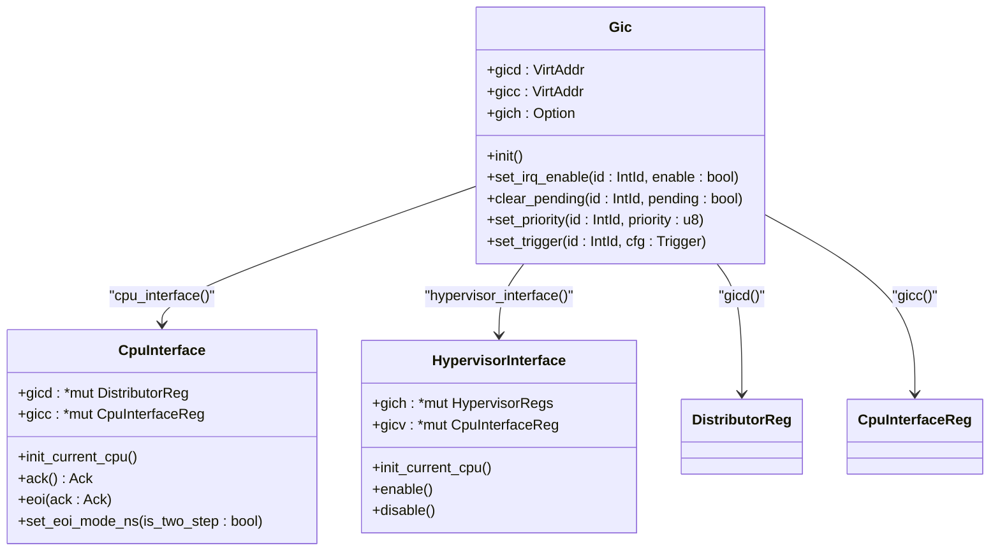
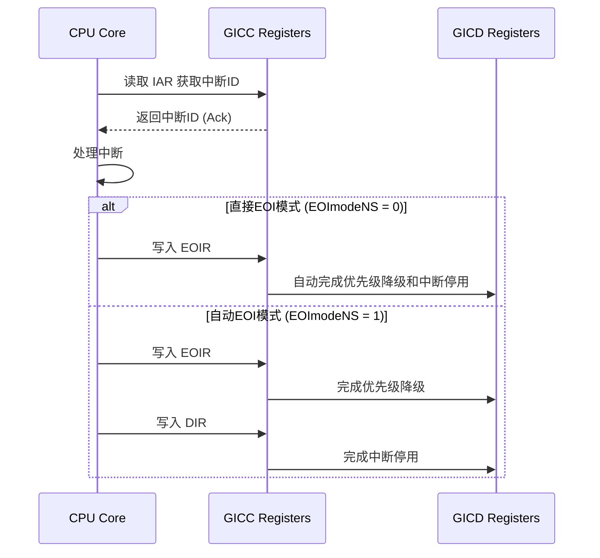

<cite>
**本文档中引用的文件**  
- [gicd.rs](file://gic-driver/src/version/v2/gicd.rs)
- [gicc.rs](file://gic-driver/src/version/v2/gicc.rs)
- [gich.rs](file://gic-driver/src/version/v2/gich.rs)
- [mod.rs](file://gic-driver/src/version/v2/mod.rs)
- [define.rs](file://gic-driver/src/define.rs)
</cite>

## 目录
1. [Gic (GICv2) API](#gic-gicv2-api)
2. [Gic 结构体及其核心方法](#gic-结构体及其核心方法)
3. [Distributor 和 CPU Interface 模块初始化](#distributor-和-cpu-interface-模块初始化)
4. [中断使能与禁用](#中断使能与禁用)
5. [EOI（中断结束）机制](#eoi中断结束机制)
6. [错误处理与硬件异常](#错误处理与硬件异常)

## Gic (GICv2) API

本文档为 GICv2 架构的 `Gic` 结构体及其相关接口提供权威的 API 参考。详细记录了中断控制器的核心功能，包括初始化、中断管理、优先级配置和中断结束处理等关键操作。

**Section sources**
- [mod.rs](file://gic-driver/src/version/v2/mod.rs#L1-L799)

## Gic 结构体及其核心方法

`Gic` 结构体是 GICv2 驱动的核心，封装了对 Distributor 和 CPU Interface 寄存器的访问。



**Diagram sources**
- [mod.rs](file://gic-driver/src/version/v2/mod.rs#L1-L799)
- [gicd.rs](file://gic-driver/src/version/v2/gicd.rs#L1-L290)
- [gicc.rs](file://gic-driver/src/version/v2/gicc.rs#L1-L150)

### 核心方法签名与参数约束

- **`init(&mut self)`**
  - **功能**: 初始化 GICv2 控制器。
  - **调用顺序**: 必须在任何中断操作之前调用。
  - **副作用**: 禁用所有中断、清除所有挂起和活动状态、配置默认优先级和目标。

- **`set_irq_enable(&self, intid: IntId, enable: bool)`**
  - **参数约束**: `intid` 必须是有效的中断 ID（0-1019）。
  - **功能**: 使能或禁用指定的中断。
  - **副作用**: 修改 `ISENABLER` 或 `ICENABLER` 寄存器。

- **`clear_pending(&self, id: IntId, pending: bool)`**
  - **功能**: 清除或设置指定中断的挂起状态。
  - **副作用**: 修改 `ISPENDR` 或 `ICPENDR` 寄存器。

- **`set_priority(&self, id: IntId, priority: u8)`**
  - **参数约束**: `priority` 范围为 0（最高优先级）到 255（最低优先级）。
  - **功能**: 设置中断的优先级。
  - **副作用**: 修改 `IPRIORITYR` 寄存器。

- **`set_trigger(&self, id: IntId, cfg: Trigger)`**
  - **功能**: 配置中断的触发方式（电平或边沿）。
  - **副作用**: 修改 `ICFGR` 寄存器。

**Section sources**
- [mod.rs](file://gic-driver/src/version/v2/mod.rs#L1-L799)
- [gicd.rs](file://gic-driver/src/version/v2/gicd.rs#L1-L290)

## Distributor 和 CPU Interface 模块初始化

### 初始化流程

1.  **Distributor 初始化**:
    - 通过 `CTLR` 寄存器禁用 Distributor。
    - 查询 `TYPER` 寄存器获取支持的最大中断数。
    - 调用 `irq_disable_all`、`pending_clear_all`、`active_clear_all` 禁用并清除所有中断状态。
    - 使用 `groups_all_to_0` 将所有中断配置为 Group 1（非安全组）。
    - 使用 `set_default_priorities` 设置默认优先级。
    - 使用 `configure_interrupt_targets` 配置 SPI 中断的目标 CPU。
    - 使用 `configure_interrupt_config` 配置中断触发方式（默认为电平触发）。
    - 最后通过 `CTLR` 寄存器重新使能 Distributor。

2.  **CPU Interface 初始化**:
    - 通过 `CTLR` 寄存器禁用 CPU Interface。
    - 通过 `PMR` 寄存器设置优先级掩码，允许所有中断通过。
    - 通过 `CTLR` 寄存器使能 CPU Interface 的 Group 0 和 Group 1 中断。

**Section sources**
- [mod.rs](file://gic-driver/src/version/v2/mod.rs#L1-L799)
- [gicd.rs](file://gic-driver/src/version/v2/gicd.rs#L1-L290)
- [gicc.rs](file://gic-driver/src/version/v2/gicc.rs#L1-L150)

## 中断使能与禁用

以下代码片段展示了如何使能一个 SPI 中断。**内存屏障**对于确保寄存器写入的顺序性至关重要，尤其是在多核环境中。

```rust
// 伪代码示例，强调内存屏障的必要性
gic.set_irq_enable(IntId::spi(42), true);
// 在此处插入内存屏障，确保使能操作完成后再执行后续代码
// compiler_fence(SeqCst); 或其他适当的屏障
```

**Section sources**
- [mod.rs](file://gic-driver/src/version/v2/mod.rs#L1-L799)

## EOI（中断结束）机制

### 实现与模式对比

EOI 机制通过向 `EOIR` 寄存器写入中断 ID 来通知 GIC 中断处理已完成。

- **直接写 EOI 寄存器 (EOImodeNS = 0)**:
  - 写入 `EOIR` 同时完成**优先级降级**和**中断停用**两个功能。
  - 访问 `DIR` 寄存器的行为是不可预测的。

- **自动 EoI 模式 (EOImodeNS = 1)**:
  - 写入 `EOIR` 仅完成**优先级降级**。
  - 必须显式写入 `DIR` 寄存器来完成**中断停用**。
  - 这种模式提供了更精细的控制，适用于需要手动管理中断状态的场景。

通过 `CpuInterface::set_eoi_mode_ns()` 方法可以配置此模式。



**Diagram sources**
- [gicc.rs](file://gic-driver/src/version/v2/gicc.rs#L1-L150)
- [mod.rs](file://gic-driver/src/version/v2/mod.rs#L1-L799)

**Section sources**
- [gicc.rs](file://gic-driver/src/version/v2/gicc.rs#L1-L150)
- [mod.rs](file://gic-driver/src/version/v2/mod.rs#L1-L799)

## 错误处理与硬件异常

### 错误处理策略

- **参数验证**: 所有公共方法在访问寄存器前都会使用 `assert!` 宏验证 `IntId` 的有效性，防止访问越界。
- **硬件异常来源**:
  - **无效的中断 ID**: 访问超出 `IPRIORITYR` 或 `ITARGETSR` 数组范围的中断 ID 会导致断言失败。
  - **私有中断操作**: 尝试对非私有中断（如 SPI）调用 `set_target_cpu` 会触发断言。
  - **SGI ID 越界**: `send_sgi` 方法会检查 SGI ID 是否在 0-15 范围内。
  - **CPU ID 越界**: `TargetList` 构造函数会检查 CPU ID 是否小于 8。

**Section sources**
- [mod.rs](file://gic-driver/src/version/v2/mod.rs#L1-L799)
- [define.rs](file://gic-driver/src/define.rs#L1-L317)