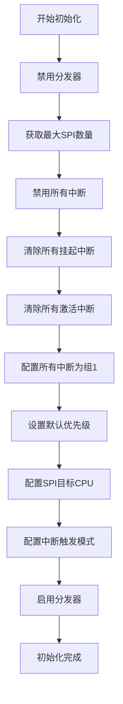
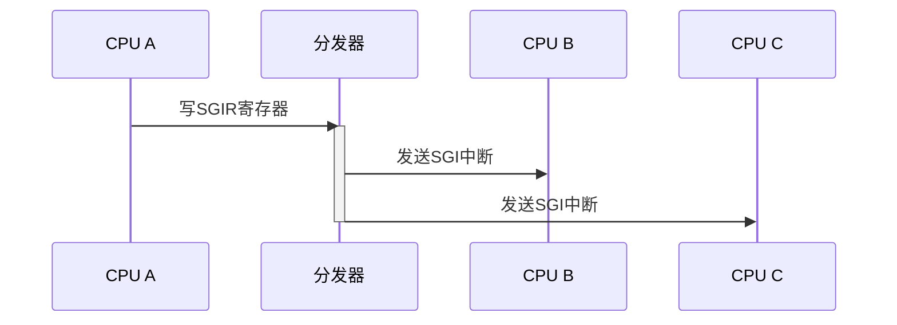

<cite>
**本文档中引用的文件**
- [gicd.rs](file://gic-driver/src/version/v2/gicd.rs)
- [gicc.rs](file://gic-driver/src/version/v2/gicc.rs)
- [mod.rs](file://gic-driver/src/version/v2/mod.rs)
- [define.rs](file://gic-driver/src/define.rs)
</cite>

# 分发器 (Distributor)

## 目录
1. [分发器](#分发器-distributor)
2. [内存布局与寄存器映射](#内存布局与寄存器映射)
3. [关键寄存器功能](#关键寄存器功能)
4. [中断控制机制](#中断控制机制)
5. [初始化流程](#初始化流程)
6. [SPI中断目标CPU配置](#spi中断目标cpu配置)
7. [SGI软件中断发送](#sgi软件中断发送)
8. [中断数量解析](#中断数量解析)
9. [触发模式控制](#触发模式控制)

## 内存布局与寄存器映射

`DistributorReg` 结构体定义了GICv2分发器组件的完整内存布局，采用内存映射寄存器方式实现对中断控制器的访问。该结构体通过 `register_structs!` 宏定义，将物理内存地址映射为可编程的寄存器字段。

分发器寄存器从基地址偏移0x0000开始，按特定偏移量组织各个功能寄存器。主要寄存器包括控制寄存器（CTLR）、类型寄存器（TYPER）、实现者识别寄存器（IIDR）等，以及用于中断管理的数组型寄存器，如中断使能寄存器（ISENABLER/ICENABLER）、优先级寄存器（IPRIORITYR）、目标CPU寄存器（ITARGETSR）和配置寄存器（ICFGR）。

**Section sources**
- [gicd.rs](file://gic-driver/src/version/v2/gicd.rs#L4-L100)

## 关键寄存器功能

### CTLR (Control Register)
分发器控制寄存器（CTLR）位于偏移0x0000处，用于全局启用或禁用中断组。该寄存器包含两个关键位域：
- `EnableGrp0`：控制组0（安全）中断的使能状态
- `EnableGrp1`：控制组1（非安全）中断的使能状态

### TYPER (Type Register)
中断控制器类型寄存器（TYPER）位于偏移0x0004处，提供分发器的实现特性信息：
- `ITLinesNumber`：表示支持的中断线数量，用于计算最大SPI数量
- `CPUNumber`：表示实现的CPU接口数量减一
- `SecurityExtn`：指示GIC是否实现了安全扩展

### IIDR (Implementer Identification Register)
分发器实现者识别寄存器（IIDR）位于偏移0x0008处，包含实现者的标识信息，如实现者ID、修订号、变体号和产品ID。

**Section sources**
- [gicd.rs](file://gic-driver/src/version/v2/gicd.rs#L102-L130)

## 中断控制机制

分发器提供了完整的中断生命周期管理机制，通过一系列寄存器实现对中断状态的精确控制。

### 中断使能/禁用
通过 `ISENABLER` 和 `ICENABLER` 寄存器数组实现中断的使能和禁用。每个32位寄存器管理32个中断，通过设置对应位来控制单个中断的状态。`ISENABLER` 用于使能中断，而 `ICENABLER` 用于禁用中断。

### 优先级设置
`IPRIORITYR` 寄存器数组（偏移0x0400）用于设置每个中断的优先级。每个中断分配8位优先级值（0为最高优先级，255为最低优先级），每4个中断共享一个32位寄存器。

### 目标CPU配置
`ITARGETSR` 寄存器数组（偏移0x0800）用于配置共享外设中断（SPI）的目标CPU。每个中断分配8位，其中每个CPU对应一个位，通过设置位来指定中断应路由到的CPU核心。

### 触发模式控制
`ICFGR` 寄存器数组（偏移0x0c00）用于配置中断的触发模式。每16个中断共享一个32位寄存器，每个中断占用2位，其中位1用于区分边沿触发和电平触发。

**Section sources**
- [gicd.rs](file://gic-driver/src/version/v2/gicd.rs#L108-L136)

## 初始化流程

分发器的初始化流程在 `Gic::init()` 方法中实现，遵循GICv2规范的推荐顺序，确保系统处于已知的稳定状态。

**Diagram sources**
- [mod.rs](file://gic-driver/src/version/v2/mod.rs#L56-L102)

**Section sources**
- [mod.rs](file://gic-driver/src/version/v2/mod.rs#L56-L102)
- [gicd.rs](file://gic-driver/src/version/v2/gicd.rs#L140-L178)

### 安全约束
初始化流程遵循严格的安全约束：
1. 首先禁用分发器，防止在配置过程中产生意外中断
2. 按顺序禁用所有中断、清除挂起和激活状态，确保中断状态机处于干净状态
3. 在完成所有配置后才启用分发器，避免部分配置导致的不稳定状态

## SPI中断目标CPU配置

共享外设中断（SPI）的目标CPU配置通过 `configure_interrupt_targets()` 方法实现。该方法专门处理ID大于31的中断，因为SGI（0-15）和PPI（16-31）不使用ITARGETSR寄存器。

配置逻辑如下：
1. 计算需要配置的SPI数量
2. 确定目标寄存器的起始和结束位置（每个ITARGETSR寄存器管理4个中断）
3. 将所有SPI默认配置为仅目标CPU 0（值0x01）

此配置可通过 `set_target_cpu()` 方法在运行时动态修改，允许将特定SPI路由到不同的CPU核心组合。

**Section sources**
- [gicd.rs](file://gic-driver/src/version/v2/gicd.rs#L160-L178)
- [mod.rs](file://gic-driver/src/version/v2/mod.rs#L180-L200)

## SGI软件中断发送

软件生成中断（SGI）通过 `send_sgi()` 方法发送，利用 `SGIR` 寄存器（偏移0x0f00）实现处理器间通信。

**Diagram sources**
- [gicd.rs](file://gic-driver/src/version/v2/gicd.rs#L138-L140)
- [mod.rs](file://gic-driver/src/version/v2/mod.rs#L240-L260)

**Section sources**
- [mod.rs](file://gic-driver/src/version/v2/mod.rs#L240-L260)
- [gicd.rs](file://gic-driver/src/version/v2/gicd.rs#L138-L140)

`SGIR` 寄存器包含以下字段：
- `SGIINTID`：SGI中断ID（0-15）
- `CPUTargetList`：CPU目标列表（位掩码）
- `TargetListFilter`：目标列表过滤器，支持三种模式：
  - `TargetList`：转发到CPUTargetList中列出的CPU
  - `AllOther`：转发到除请求CPU外的所有CPU
  - `Current`：仅转发到请求CPU

## 中断数量解析

最大SPI数量通过 `max_spi_num()` 方法从TYPER寄存器解析。该方法读取 `ITLinesNumber` 字段，该字段表示中断线数量的编码值。

计算公式为：`(ITLinesNumber + 1) * 32`。例如，如果 `ITLinesNumber` 为7，则支持 `(7+1)*32=256` 条中断线，最大SPI ID为255（ID 0-31保留给SGI和PPI）。

此方法为动态查询，确保驱动程序能适应不同GIC实现的中断线数量差异。

**Section sources**
- [gicd.rs](file://gic-driver/src/version/v2/gicd.rs#L180-L188)

## 触发模式控制

中断的边沿/电平触发模式通过 `configure_interrupt_config()` 和 `set_cfg()` 方法控制，操作 `ICFGR` 寄存器数组。

### 批量配置
`configure_interrupt_config()` 方法将所有中断默认配置为电平触发（值0x0）。该方法遍历所有ICFGR寄存器，将每个寄存器设置为0，确保所有中断为电平敏感。

### 单个配置
`set_cfg()` 方法实现单个中断的触发模式配置：
1. 计算中断对应的寄存器索引和位偏移
2. 读取当前寄存器值
3. 根据目标模式修改特定位：
   - 电平触发：清除位1
   - 边沿触发：设置位1

位操作逻辑基于每个中断占用2位的设计，其中位1专门用于区分边沿（1）和电平（0）触发模式。

**Section sources**
- [gicd.rs](file://gic-driver/src/version/v2/gicd.rs#L178-L200)