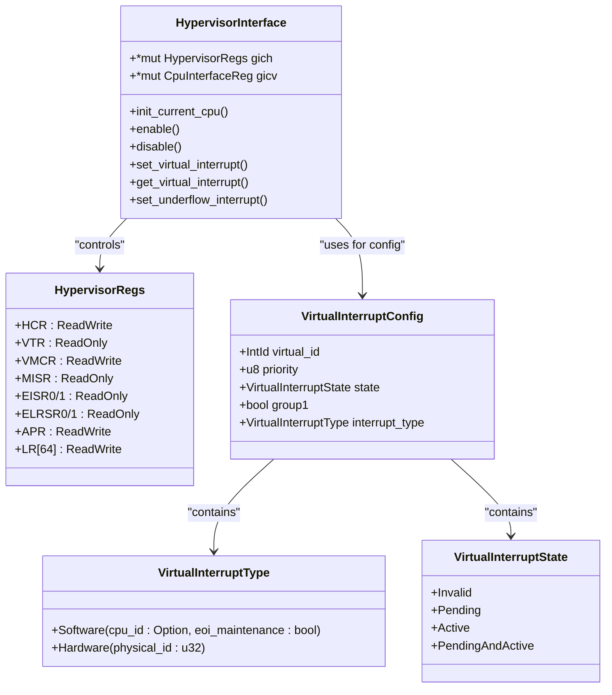
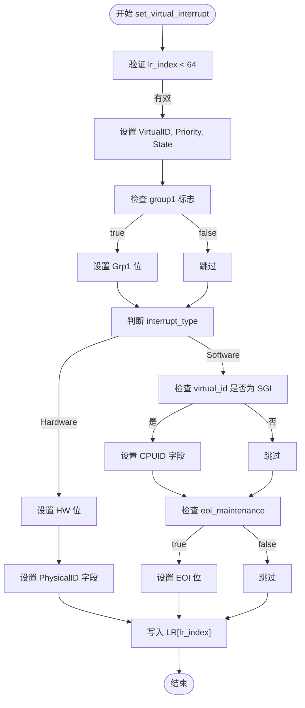

<cite>
**本文档中引用的文件**  
- [gich.rs](file://gic-driver/src/version/v2/gich.rs)
- [gicc.rs](file://gic-driver/src/version/v2/gicc.rs)
- [mod.rs](file://gic-driver/src/version/v2/mod.rs)
</cite>

# 虚拟化接口 (Hypervisor Interface)

## 目录
1. [简介](#简介)
2. [核心组件](#核心组件)
3. [虚拟中断管理架构](#虚拟中断管理架构)
4. [初始化流程](#初始化流程)
5. [虚拟中断配置与注入](#虚拟中断配置与注入)
6. [虚拟中断状态解析](#虚拟中断状态解析)
7. [虚拟CPU接口控制](#虚拟cpu接口控制)
8. [维护中断机制](#维护中断机制)
9. [与物理中断处理的协同](#与物理中断处理的协同)

## 简介

本技术文档深入解析了ARM GICv2架构下的虚拟化支持接口实现。文档详细阐述了`HypervisorInterface`结构体如何通过GICH（GIC Hypervisor Interface）和GICV（Virtual CPU Interface）寄存器来实现对虚拟中断的全面管理。内容涵盖虚拟中断的配置、注入、状态查询、接口控制以及维护中断的使能机制，为理解和开发基于GICv2的虚拟化系统提供了详尽的技术参考。

**Section sources**
- [mod.rs](file://gic-driver/src/version/v2/mod.rs#L692-L956)

## 核心组件

本节分析实现GICv2虚拟化支持的核心数据结构和寄存器定义。

### HypervisorInterface 结构体

`HypervisorInterface`是虚拟化功能的核心，它封装了对GICH和GICV寄存器的访问。该结构体包含两个指针：
- `gich`: 指向GICH寄存器块的指针，用于管理虚拟中断的配置和状态。
- `gicv`: 指向GICV寄存器块的指针，作为虚拟CPU的中断接口。

通过这两个指针，Hypervisor可以配置虚拟中断、控制虚拟CPU接口，并处理来自虚拟机的中断请求。

### GICH 寄存器定义

GICH（GIC Hypervisor Interface Control Registers）寄存器组定义了虚拟化控制的核心功能。关键寄存器包括：
- **HCR (Hypervisor Control Register)**: 全局控制寄存器，用于使能/禁用虚拟CPU接口，并配置各类维护中断。
- **VTR (VGIC Type Register)**: 提供虚拟GIC的类型信息，如实现的List Register数量。
- **LR (List Registers)**: 64个List Register，每个用于描述一个待注入虚拟CPU的虚拟中断的详细配置。
- **MISR (Maintenance Interrupt Status Register)**: 维护中断状态寄存器，指示需要Hypervisor介入处理的异常情况。



**Diagram sources**
- [gich.rs](file://gic-driver/src/version/v2/gich.rs#L0-L134)
- [mod.rs](file://gic-driver/src/version/v2/mod.rs#L692-L956)

**Section sources**
- [gich.rs](file://gic-driver/src/version/v2/gich.rs#L0-L134)
- [mod.rs](file://gic-driver/src/version/v2/mod.rs#L692-L956)

## 虚拟中断管理架构

GICv2虚拟化通过GICH和GICV的协同工作来实现。Hypervisor使用GICH寄存器来配置虚拟中断，而虚拟CPU则通过GICV寄存器来感知和响应这些中断。

```mermaid
graph TB
subgraph "Hypervisor (EL2)"
HCR[Hypervisor Control Register]
LR[List Registers]
MISR[Maintenance Interrupt Status]
APR[Active Priorities]
end
subgraph "Virtual CPU (EL1)"
GICV[GICV CPU Interface]
AIAR[Aliased IAR]
AEOIR[Aliased EOIR]
end
HCR --> |En bit| GICV : "Enables virtual interface"
LR --> |Virtual IRQ Config| GICV : "Injects virtual interrupts"
GICV --> |Maintenance IRQ| MISR : "Signals underflow, LRENP, etc."
APR --> |Priority Management| GICV : "Manages active priorities"
style HCR fill:#f9f,stroke:#333
style GICV fill:#bbf,stroke:#333
```

**Diagram sources**
- [gich.rs](file://gic-driver/src/version/v2/gich.rs#L0-L134)
- [gicc.rs](file://gic-driver/src/version/v2/gicc.rs#L0-L149)

**Section sources**
- [gich.rs](file://gic-driver/src/version/v2/gich.rs#L0-L134)
- [gicc.rs](file://gic-driver/src/version/v2/gicc.rs#L0-L149)

## 初始化流程

`init_current_cpu()`方法负责为当前CPU初始化虚拟化环境。

### HCR寄存器配置流程

初始化过程首先禁用虚拟CPU接口，然后进行一系列配置：
1.  **禁用接口**: 通过将HCR寄存器清零，确保在配置过程中虚拟接口处于关闭状态。
2.  **清零List Register**: 遍历所有64个List Register，将其值设置为0。这会将所有条目的状态（State）字段置为`Invalid`，确保没有残留的虚拟中断配置。
3.  **清零Active Priorities**: 将APR（Active Priorities Register）清零，重置虚拟CPU的活动优先级栈。

此流程确保了虚拟化环境的干净启动，避免了任何潜在的配置冲突。

**Section sources**
- [mod.rs](file://gic-driver/src/version/v2/mod.rs#L718-L720)

## 虚拟中断配置与注入

`set_virtual_interrupt()`方法是将虚拟中断注入虚拟CPU的核心。

### 虚拟中断配置逻辑

该方法接收一个`VirtualInterruptConfig`结构体和一个List Register索引，用于构造并写入LR寄存器的值。其逻辑如下：

1.  **基础字段设置**:
    - **Virtual ID**: 设置虚拟中断的ID，这是虚拟CPU看到的中断号。
    - **Priority**: 设置中断的优先级。
    - **State**: 设置中断的初始状态（Pending, Active等）。
    - **Group 1**: 指定中断属于Group 0还是Group 1。

2.  **中断类型选择**:
    - **硬件类型中断 (Hardware)**: 当`interrupt_type`为`Hardware`时，设置`HW`位，并将`PhysicalID`字段设置为物理中断的ID。这通常用于将物理中断直接映射为虚拟中断。
    - **软件类型中断 (Software)**: 当`interrupt_type`为`Software`时，`HW`位保持为0。此时，`CPUID`字段可用于指定SGI（Software Generated Interrupt）的源CPU ID，而`EOI`字段可用于指示是否需要EOI维护中断。



**Diagram sources**
- [mod.rs](file://gic-driver/src/version/v2/mod.rs#L692-L720)

**Section sources**
- [mod.rs](file://gic-driver/src/version/v2/mod.rs#L692-L720)

## 虚拟中断状态解析

`get_virtual_interrupt()`方法用于从指定的List Register中读取并解析虚拟中断的配置。

### 解析流程

该方法从`LR[lr_index]`寄存器中提取所有字段，并将其转换为一个`VirtualInterruptConfig`结构体：
1.  **提取Virtual ID**: 从`VirtualID`字段读取虚拟中断ID。
2.  **提取优先级**: 从`Priority`字段读取5位优先级值，并左移3位以扩展为8位标准优先级。
3.  **解析状态**: 根据`State`字段的值（0-3）映射到`VirtualInterruptState`枚举。
4.  **判断组别**: 检查`Grp1`位以确定中断组。
5.  **区分中断类型**:
    - 如果`HW`位被置位，则为**硬件中断**，从`PhysicalID`字段提取物理ID。
    - 如果`HW`位未置位，则为**软件中断**，从`CPUID`字段提取CPU ID（如果非零），并检查`EOI`位以确定是否需要EOI维护。

此方法为Hypervisor提供了检查和管理已配置虚拟中断的能力。

**Section sources**
- [mod.rs](file://gic-driver/src/version/v2/mod.rs#L757-L796)

## 虚拟CPU接口控制

`enable()`和`disable()`方法用于直接控制虚拟CPU接口的全局开关。

### 控制机制

- **`enable()`**: 通过修改HCR寄存器的`En`位（位0）为1来使能虚拟CPU接口。一旦使能，虚拟CPU就可以通过GICV寄存器（如AIAR）感知到由List Register配置的虚拟中断。
- **`disable()`**: 通过将HCR寄存器的`En`位清零来禁用虚拟CPU接口。禁用后，虚拟CPU将无法接收任何虚拟中断。

这两个方法为Hypervisor提供了动态控制虚拟机中断能力的手段。

**Section sources**
- [mod.rs](file://gic-driver/src/version/v2/mod.rs#L718-L720)

## 维护中断机制

GICv2虚拟化通过维护中断（Maintenance Interrupt）来通知Hypervisor处理异常情况。这些中断的使能由HCR寄存器中的相应位控制。

### 维护中断类型与使能

- **Underflow (UIE)**: 当虚拟CPU尝试ACK一个不存在的虚拟中断时触发。通过`set_underflow_interrupt()`方法使能。
- **List Register Entry Not Present (LRENPIE)**: 当虚拟CPU尝试ACK一个`State`为`Invalid`的List Register条目时触发。通过`set_list_reg_entry_not_present_interrupt()`方法使能。
- **No Pending (NPIE)**: 当虚拟CPU的运行优先级高于所有待处理的虚拟中断时触发。通过`set_no_pending_interrupt()`方法使能。
- **VM Group Enable/Disable (VGrp0EIE/VGrp0DIE/VGrp1EIE/VGrp1DIE)**: 当虚拟CPU尝试通过写GICV_CTLR寄存器来使能或禁用其Group 0或Group 1中断时触发。通过`set_vgrp0_enable_interrupt()`等系列方法使能。

这些维护中断是Hypervisor实现虚拟中断控制器行为的关键，允许Hypervisor模拟完整的GIC编程模型。

**Section sources**
- [mod.rs](file://gic-driver/src/version/v2/mod.rs#L718-L720)

## 与物理中断处理的协同

虚拟中断处理与物理中断处理是并行且独立的。物理中断由物理GIC（GICD和GICC）直接路由到Hypervisor（EL2），而虚拟中断则通过GICH和GICV路由到虚拟CPU（EL1）。

Hypervisor作为中介，可以：
1.  **透传物理中断**: 将某些物理中断直接作为虚拟中断注入虚拟机。
2.  **拦截与模拟**: 拦截对物理GIC寄存器的访问，并在虚拟机中模拟相应的行为。
3.  **资源管理**: 管理物理中断资源，确保虚拟机之间的隔离。

这种协同机制使得虚拟机能够像在物理硬件上一样运行，同时由Hypervisor保持对底层硬件的完全控制。

**Section sources**
- [gich.rs](file://gic-driver/src/version/v2/gich.rs#L0-L134)
- [gicc.rs](file://gic-driver/src/version/v2/gicc.rs#L0-L149)