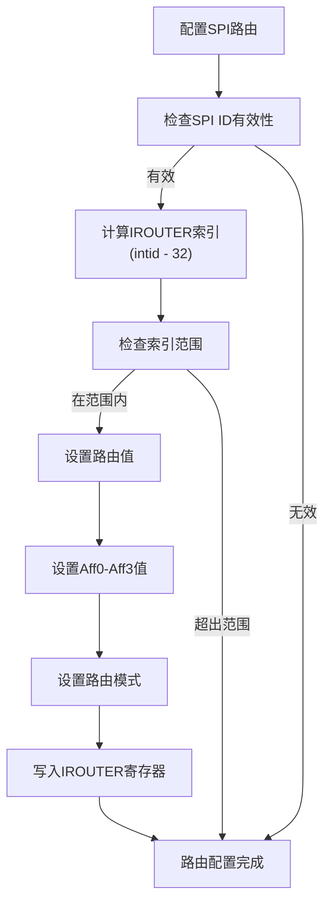
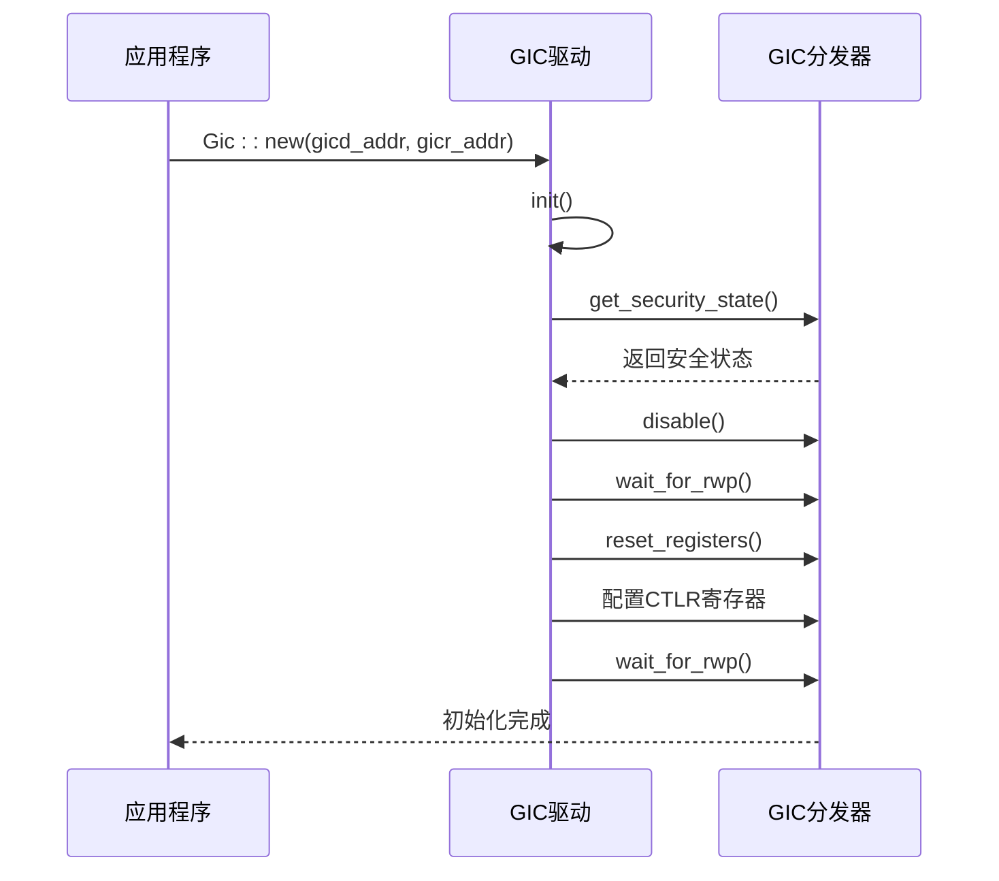

# GICv3 分发器 (GICD)

<cite>
**本文档中引用的文件**  
- [gicd.rs](file://gic-driver/src/version/v3/gicd.rs)
- [mod.rs](file://gic-driver/src/version/v3/mod.rs)
- [define.rs](file://gic-driver/src/define.rs)
- [gicr.rs](file://gic-driver/src/version/v3/gicr.rs)
- [lib.rs](file://gic-driver/src/lib.rs)
</cite>

## 目录
1. [简介](#简介)
2. [寄存器布局](#寄存器布局)
3. [中断控制功能](#中断控制功能)
4. [安全状态管理机制](#安全状态管理机制)
5. [SPI路由配置](#spi路由配置)
6. [消息传递SPI生成](#消息传递spi生成)
7. [寄存器写入等待(RWP)](#寄存器写入等待rwp)
8. [多核系统中断分发示例](#多核系统中断分发示例)
9. [非屏蔽中断(NMI)与扩展SPI支持](#非屏蔽中断nmi与扩展spi支持)

## 简介
GICv3分发器（GICD）模块是ARMv8架构中断控制器的核心组件，负责管理共享外设中断（SPI）的分发和全局配置。该模块通过内存映射寄存器提供对中断控制的访问，支持单安全状态和双安全状态配置。分发器协调多个CPU核心之间的中断分发，确保中断能够正确路由到目标处理器。本API文档详细描述了GICv3分发器的寄存器布局、中断控制功能、安全状态管理以及SPI中断的配置方法。

**Section sources**
- [gicd.rs](file://gic-driver/src/version/v3/gicd.rs#L0-L732)
- [mod.rs](file://gic-driver/src/version/v3/mod.rs#L0-L799)

## 寄存器布局
GICv3分发器提供了一系列寄存器用于控制和监控中断系统。主要寄存器包括：

### CTLR寄存器
分发器控制寄存器（CTLR）用于全局启用和配置中断分发。该寄存器根据安全状态有不同的位域定义：
- **DS位（Disable Security）**：当设置为1时，系统处于单安全状态；为0时，支持双安全状态
- **RWP位（Register Write Pending）**：只读位，指示寄存器写入操作是否仍在进行中

### TYPER寄存器
中断控制器类型寄存器（TYPER）提供GIC实现的配置信息：
- **ITLinesNumber**：支持的中断线数量
- **CPUNumber**：实现的CPU接口数量减一
- **SecurityExtn**：指示是否实现了安全扩展
- **MBIS**：指示是否支持基于消息的SPI
- **LPIS**：指示是否支持低功耗中断（LPI）

### IIDR寄存器
分发器实现者标识寄存器（IIDR）包含实现特定的标识信息：
- **Implementer**：实现者标识号
- **Revision**：修订版本号
- **Variant**：变体号
- **ProductId**：产品标识号

**Section sources**
- [gicd.rs](file://gic-driver/src/version/v3/gicd.rs#L0-L732)
- [define.rs](file://gic-driver/src/define.rs#L0-L316)

## 中断控制功能
GICv3分发器提供全面的中断控制功能，包括中断的启用/禁用、优先级设置和触发模式配置。

### 中断启用/禁用
通过中断设置使能寄存器（ISENABLER）和中断清除使能寄存器（ICENABLER）控制SPI中断的使能状态。每个32位寄存器控制32个中断，通过设置相应位来启用或禁用特定中断。

### 优先级设置
中断优先级寄存器（IPRIORITYR）为每个中断提供8位优先级设置。优先级值越小表示优先级越高。系统支持1-256级优先级，具体实现的优先级位数由硬件决定。

### 触发模式配置
中断配置寄存器（ICFGR）控制中断的触发模式：
- **电平触发**：中断在信号保持有效电平时持续挂起
- **边沿触发**：中断在信号边沿变化时触发并保持挂起状态

**Section sources**
- [gicd.rs](file://gic-driver/src/version/v3/gicd.rs#L0-L732)
- [define.rs](file://gic-driver/src/define.rs#L0-L316)

## 安全状态管理机制
GICv3分发器支持灵活的安全状态管理，适应不同的系统安全需求。

### 安全状态检测
通过`get_security_state`方法检测当前访问的安全状态：
- **单安全状态**：当CTLR.DS位为1或系统不支持安全扩展时
- **双安全状态**：通过访问GICD_NSACR寄存器的行为来确定当前是安全访问还是非安全访问

### 安全状态配置
根据不同的安全状态，CTLR寄存器有不同的配置方式：
- **单安全状态**：使用EnableGrp0和EnableGrp1位控制中断组
- **双安全状态（安全访问）**：使用EnableGrp0、EnableGrp1NS和EnableGrp1S位分别控制不同安全级别的中断组
- **双安全状态（非安全访问）**：使用EnableGrp1和EnableGrp1A位控制非安全中断组

**Section sources**
- [gicd.rs](file://gic-driver/src/version/v3/gicd.rs#L0-L732)
- [mod.rs](file://gic-driver/src/version/v3/mod.rs#L0-L799)

## SPI路由配置
共享外设中断（SPI）的路由通过中断路由寄存器（IROUTER）进行配置。

### IROUTER寄存器结构
每个SPI对应一个64位的IROUTER寄存器，包含：
- **Aff0-Aff3**：亲和性级别0-3，用于标识目标CPU核心
- **Interrupt_Routing_Mode**：路由模式，0表示特定PE路由，1表示任意参与的PE

### 路由配置方法
通过`set_interrupt_route`方法配置SPI的路由：
- **特定CPU路由**：指定Aff0-Aff3的值，将中断路由到特定CPU核心
- **任意参与PE路由**：设置Interrupt_Routing_Mode为1，将中断路由到任意可用的CPU核心

**Diagram sources**
- [gicd.rs](file://gic-driver/src/version/v3/gicd.rs#L356-L398)
- [gicr.rs](file://gic-driver/src/version/v3/gicr.rs#L500-L552)

## 消息传递SPI生成
支持通过消息传递机制生成SPI，允许软件主动触发中断。

### 非安全SPI生成
通过`generate_spi_ns`方法生成非安全SPI：
- 写入GICD_SETSPI_NSR寄存器
- 指定要触发的中断ID
- 中断将根据其路由配置分发到目标CPU

### 安全SPI生成
通过`generate_spi_s`方法生成安全SPI：
- 写入GICD_SETSPI_SR寄存器
- 仅在安全状态下可访问
- 用于安全监控和管理功能

**Section sources**
- [gicd.rs](file://gic-driver/src/version/v3/gicd.rs#L424-L439)
- [mod.rs](file://gic-driver/src/version/v3/mod.rs#L0-L799)

## 寄存器写入等待(RWP)
在修改分发器控制寄存器后，需要等待寄存器写入操作完成。

### RWP机制
- **RWP位**：CTLR寄存器的第31位，指示寄存器写入是否仍在进行
- **等待循环**：通过轮询RWP位直到其清零
- **超时处理**：设置最大等待次数，避免无限等待

### 实现方法
`wait_for_rwp`方法实现寄存器写入等待：
- 最大等待10000次循环
- 每次循环调用spin_loop提示CPU
- 超时返回错误信息
- 完成后执行ISB屏障确保指令同步

**Section sources**
- [gicd.rs](file://gic-driver/src/version/v3/gicd.rs#L543-L555)
- [mod.rs](file://gic-driver/src/version/v3/mod.rs#L298-L337)

## 多核系统中断分发示例
在多核系统中，GICv3分发器初始化流程如下：

**Diagram sources**
- [mod.rs](file://gic-driver/src/version/v3/mod.rs#L298-L357)
- [gicd.rs](file://gic-driver/src/version/v3/gicd.rs#L523-L555)

## 非屏蔽中断(NMI)与扩展SPI支持
GICv3分发器支持非屏蔽中断和扩展SPI功能。

### 非屏蔽中断(NMI)
- **INMIR寄存器**：非屏蔽中断寄存器，每个32位寄存器控制32个中断
- **NMI配置**：通过`set_nmi`方法将SPI配置为NMI
- **NMI检测**：通过`is_nmi`方法检查中断是否配置为NMI

### 扩展SPI支持
- **TYPER2寄存器**：类型修饰寄存器，包含扩展功能信息
- **ESPI支持检测**：通过`has_extended_spi`方法检查是否支持扩展SPI
- **MBIS支持**：通过TYPER.MBIS位检查是否支持基于消息的SPI

**Section sources**
- [gicd.rs](file://gic-driver/src/version/v3/gicd.rs#L440-L464)
- [define.rs](file://gic-driver/src/define.rs#L0-L316)